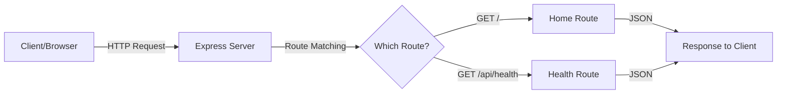
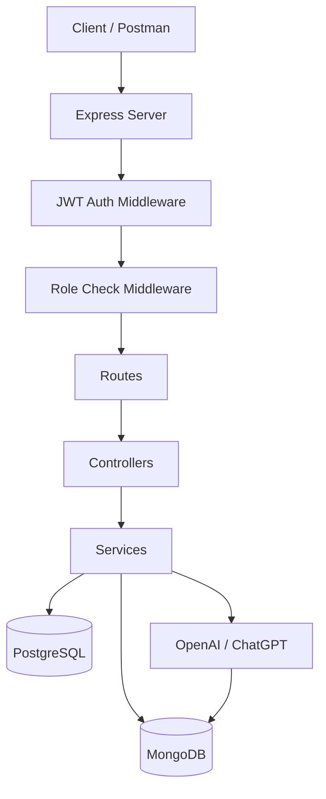
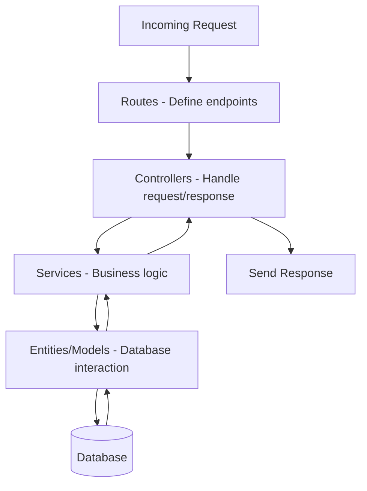

# Day 1: Project Setup - SmartTask AI

Hello developers! Welcome to Day 1 of our SmartTask AI project series!

Today we begin building a **real-world backend project** from scratch. By the end of these 10 days, you'll have a complete backend system with authentication, role-based access, AI integration, and dual database support.

---

## What We Will Build Today

Today is all about **setting up our foundation**. Think of it like building a house - before we put up walls, we need a solid foundation.

We will:
- Initialize a Node.js project with TypeScript
- Setup Express.js server
- Create our folder structure
- Install all necessary dependencies
- Run our first "Hello World" API

---

## Why Is This Important?

> Imagine you're building a restaurant. Before you cook food, you need a kitchen, utensils, a stove, and a plan. That's what project setup is - preparing your kitchen before cooking.

A proper project setup:
- Prevents bugs later
- Makes team collaboration easy
- Keeps code organized
- Makes deployment smooth

---

## Concept Explanation

### What is TypeScript?
TypeScript is JavaScript with **types**. It catches errors BEFORE your code runs.

```typescript
// JavaScript - no error until runtime
let name = "John";
name = 123; // No warning, breaks later

// TypeScript - catches error immediately
let name: string = "John";
name = 123; // ERROR! Type 'number' is not assignable to type 'string'
```

### What is Express.js?
Express is a **web framework** for Node.js. It helps us create APIs easily.

Think of Express like a **receptionist** at a hotel:
- Guest (Client) makes a request
- Receptionist (Express) understands the request
- Sends it to the right department (Route/Controller)
- Returns the response

### What is an API?
API = Application Programming Interface

It's like a **waiter in a restaurant**:
- You (client) tell the waiter what you want
- Waiter (API) goes to the kitchen (server)
- Kitchen prepares food (processes request)
- Waiter brings food back (response)

---

## Folder Structure

```
SmartTaskAI/
├── src/
│   ├── config/          # Database & app configuration
│   ├── controllers/     # Handle incoming requests
│   ├── middlewares/      # Auth, error handling, etc.
│   ├── models/           # Database models (Mongoose)
│   ├── entities/         # Database entities (TypeORM)
│   ├── routes/           # API route definitions
│   ├── services/         # Business logic
│   ├── utils/            # Helper functions
│   └── index.ts          # Entry point
├── .env                  # Environment variables
├── .gitignore
├── package.json
├── tsconfig.json
└── README.md
```

**Quick Question:** Why do we separate code into folders like controllers, services, and routes? Think about it before reading ahead!

**Answer:** Just like a company has departments (HR, Finance, Engineering), we separate code by responsibility. Each folder has ONE job. This makes code easy to find, fix, and scale.

---

## Step-by-Step Coding

### Step 1: Create Project Folder

Open your terminal and run:

```bash
mkdir SmartTaskAI
cd SmartTaskAI
```

### Step 2: Initialize Node.js Project

```bash
npm init -y
```

This creates a `package.json` file - the **ID card** of your project. It stores:
- Project name
- Version
- Dependencies (libraries we install)
- Scripts (commands to run)

### Step 3: Install Dependencies

```bash
# Main dependencies
npm install express dotenv cors

# TypeScript dependencies
npm install -D typescript ts-node-dev @types/node @types/express @types/cors

# Database dependencies (we'll use them later)
npm install typeorm reflect-metadata pg mongoose

# Auth dependencies (we'll use them later)
npm install bcryptjs jsonwebtoken
npm install -D @types/bcryptjs @types/jsonwebtoken

# AI dependency (we'll use it later)
npm install openai
```

Let's understand what each package does:

| Package | Purpose |
|---------|---------|
| `express` | Web framework for creating APIs |
| `dotenv` | Load environment variables from .env file |
| `cors` | Allow cross-origin requests |
| `typescript` | TypeScript compiler |
| `ts-node-dev` | Run TypeScript files directly (with auto-restart) |
| `typeorm` | ORM for PostgreSQL |
| `reflect-metadata` | Required by TypeORM for decorators |
| `pg` | PostgreSQL driver |
| `mongoose` | MongoDB ODM |
| `bcryptjs` | Password hashing |
| `jsonwebtoken` | JWT token creation & verification |
| `openai` | ChatGPT API client |

### Step 4: Setup TypeScript Configuration

Create `tsconfig.json` in the root:

```json
{
  "compilerOptions": {
    "target": "ES2020",
    "module": "commonjs",
    "lib": ["ES2020"],
    "outDir": "./dist",
    "rootDir": "./src",
    "strict": true,
    "esModuleInterop": true,
    "skipLibCheck": true,
    "forceConsistentCasingInFileNames": true,
    "resolveJsonModule": true,
    "declaration": true,
    "declarationMap": true,
    "sourceMap": true,
    "experimentalDecorators": true,
    "emitDecoratorMetadata": true
  },
  "include": ["src/**/*"],
  "exclude": ["node_modules", "dist"]
}
```

**Important settings explained:**
- `experimentalDecorators`: Needed for TypeORM (we'll use decorators like `@Entity`, `@Column`)
- `emitDecoratorMetadata`: Also needed for TypeORM
- `strict`: Catches more errors at compile time
- `outDir`: Where compiled JavaScript goes
- `rootDir`: Where our TypeScript source lives

### Step 5: Create Environment File

Create `.env` in the root:

```env
# Server Configuration
PORT=3000
NODE_ENV=development

# PostgreSQL Configuration
PG_HOST=localhost
PG_PORT=5432
PG_USERNAME=postgres
PG_PASSWORD=your_password_here
PG_DATABASE=smarttask_db

# MongoDB Configuration
MONGO_URI=mongodb://localhost:27017/smarttask_logs

# JWT Configuration
JWT_SECRET=your_super_secret_key_here
JWT_EXPIRES_IN=7d

# OpenAI Configuration
OPENAI_API_KEY=your_openai_api_key_here
```

### Step 6: Create .gitignore

```
node_modules/
dist/
.env
*.js.map
```

### Step 7: Create the Entry Point

Create `src/index.ts`:

```typescript
// Import required packages
import express, { Request, Response } from "express";
import cors from "cors";
import dotenv from "dotenv";

// Load environment variables from .env file
dotenv.config();

// Create Express application
const app = express();

// Middleware
// express.json() - Parses incoming JSON requests (like when frontend sends data)
app.use(express.json());

// cors() - Allows requests from different origins (like frontend on port 3001)
app.use(cors());

// Get port from environment or use 3000 as default
const PORT = process.env.PORT || 3000;

// Our first route - Health Check
// This is like asking "Hey server, are you alive?"
app.get("/", (req: Request, res: Response) => {
  res.json({
    success: true,
    message: "SmartTask AI API is running!",
    timestamp: new Date().toISOString(),
  });
});

// API Health Check Route
app.get("/api/health", (req: Request, res: Response) => {
  res.json({
    success: true,
    message: "Server is healthy!",
    environment: process.env.NODE_ENV,
    uptime: process.uptime(),
  });
});

// Start the server
app.listen(PORT, () => {
  console.log(`==========================================`);
  console.log(`  SmartTask AI Server`);
  console.log(`  Environment: ${process.env.NODE_ENV}`);
  console.log(`  Running on: http://localhost:${PORT}`);
  console.log(`==========================================`);
});

// Export app for testing later
export default app;
```

### Step 8: Add Scripts to package.json

Update your `package.json` scripts section:

```json
{
  "scripts": {
    "dev": "ts-node-dev --respawn --transpile-only src/index.ts",
    "build": "tsc",
    "start": "node dist/index.js"
  }
}
```

**Scripts explained:**
- `dev`: Runs the server in development mode with auto-restart on file changes
- `build`: Compiles TypeScript to JavaScript
- `start`: Runs the compiled JavaScript (for production)

### Step 9: Create the Folder Structure

```bash
# Create all folders at once
mkdir -p src/config src/controllers src/middlewares src/models src/entities src/routes src/services src/utils
```

### Step 10: Run the Server!

```bash
npm run dev
```

You should see:

```
==========================================
  SmartTask AI Server
  Environment: development
  Running on: http://localhost:3000
==========================================
```

---

## Flow Diagram

### How Express Handles a Request



### Project Architecture Overview (What We'll Build in 10 Days)



### How Our Folder Structure Works



---

## Test API (Postman Examples)

### Test 1: Home Route

```
Method: GET
URL: http://localhost:3000/
```

**Expected Response:**
```json
{
  "success": true,
  "message": "SmartTask AI API is running!",
  "timestamp": "2026-04-14T10:30:00.000Z"
}
```

### Test 2: Health Check

```
Method: GET
URL: http://localhost:3000/api/health
```

**Expected Response:**
```json
{
  "success": true,
  "message": "Server is healthy!",
  "environment": "development",
  "uptime": 15.234
}
```

### How to Test with cURL (Terminal)

```bash
# Test home route
curl http://localhost:3000/

# Test health check
curl http://localhost:3000/api/health
```

---

## Common Mistakes

### 1. Forgetting to install @types packages
```bash
# WRONG - TypeScript won't know Express types
npm install express

# RIGHT - Install both the package AND its types
npm install express
npm install -D @types/express
```

### 2. Not loading dotenv at the top
```typescript
// WRONG - process.env.PORT will be undefined
const PORT = process.env.PORT;
dotenv.config(); // Too late!

// RIGHT - Load dotenv FIRST
dotenv.config();
const PORT = process.env.PORT;
```

### 3. Forgetting express.json() middleware
```typescript
// WRONG - req.body will be undefined for POST requests
app.post("/api/users", (req, res) => {
  console.log(req.body); // undefined!
});

// RIGHT - Add this BEFORE your routes
app.use(express.json());
```

### 4. Wrong tsconfig.json settings for TypeORM
```json
// WRONG - TypeORM decorators won't work
{
  "experimentalDecorators": false
}

// RIGHT
{
  "experimentalDecorators": true,
  "emitDecoratorMetadata": true
}
```

### 5. Committing .env file
```bash
# ALWAYS add .env to .gitignore
# .env contains passwords, API keys, secrets
# NEVER push it to GitHub!
```

---

## Recap

Today we accomplished:

- [x] Initialized a Node.js project with TypeScript
- [x] Installed all necessary dependencies
- [x] Configured TypeScript (tsconfig.json)
- [x] Created environment variables (.env)
- [x] Built our Express server with 2 routes
- [x] Created the project folder structure
- [x] Tested our API

### What's Coming Tomorrow?

**Day 2: PostgreSQL + TypeORM Setup** - We'll connect our server to PostgreSQL database and create our first database table (User entity). This is where data persistence begins!

---

### Quick Quiz (Test Yourself!)

1. What does `express.json()` middleware do?
2. Why do we use `dotenv`?
3. What is the difference between `dependencies` and `devDependencies`?
4. Why should we NEVER commit the `.env` file?
5. What does `ts-node-dev --respawn` do?

**Answers:**
1. Parses incoming JSON request bodies so we can access `req.body`
2. To load environment variables from a `.env` file into `process.env`
3. `dependencies` are needed in production, `devDependencies` are only for development (like TypeScript compiler)
4. It contains sensitive data like passwords and API keys
5. It runs TypeScript directly and auto-restarts the server when files change

---

> **Great job completing Day 1!** You now have a running Express + TypeScript server. Tomorrow we'll make it talk to a database!
