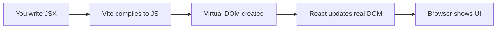
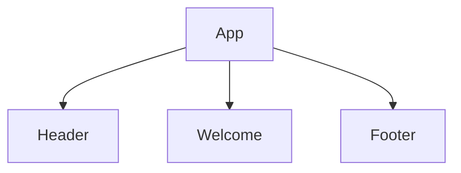
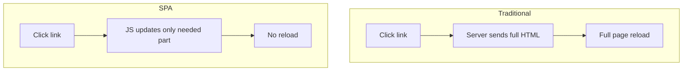

# 📅 Day 1: React Introduction + Setup with Vite

Hello students 👋 Welcome to **Day 1** of our React.js + TypeScript journey! Today we will take our very first step into the world of React. Don't worry — even if you've never written a single line of React before, by the end of this class you'll have your own React app running on your laptop.

---

## 1. 🎯 Introduction — What We Learn Today?

- What is React?
- What is a Single Page Application (SPA)?
- Why React? (and why it became so popular)
- What is Vite and why we use it?
- Create our first React + TypeScript project
- Understand the folder structure
- JSX / TSX basics
- Build our first component

### Why this matters in real projects?
Almost every modern web application you use — Instagram, Facebook, Netflix, WhatsApp Web, Flipkart — is built with React or React-like frameworks. Learning React opens doors to jobs, freelancing, and building your own products.

---

## 2. 📖 Concept Explanation

### What is React?
React is a **JavaScript library** created by Facebook (now Meta) in 2013. It helps us build **user interfaces** (UI) in a fast, reusable, and organized way.

> Think of React like **LEGO blocks**. Each block is a small piece (a component). You connect blocks to build the full toy (the web app).

### What is SPA (Single Page Application)?
Traditional websites reload the whole page every time you click a link.
SPAs load **one HTML page** and then change only the content dynamically — no full page reload.

**Real-world analogy:**
- Old websites = Going to a shop and leaving every time you want a new item.
- SPA = Sitting in a food court — the waiter brings different food to your same table.

### Why React?
1. **Component-based** → Reusable UI
2. **Virtual DOM** → Super fast rendering
3. **Huge ecosystem** → Thousands of libraries
4. **Job market** → Most demanded frontend skill
5. **Backed by Meta** → Stable and long-term supported

### What is Vite?
Vite (pronounced "veet" — French for "fast") is a **modern build tool**. It replaces older tools like Create React App (CRA).

| Feature | CRA | Vite |
|---------|-----|------|
| Startup speed | Slow | ⚡ Super fast |
| Hot reload | Slow | Instant |
| TypeScript | Manual setup | Built-in |
| Bundle size | Larger | Smaller |

### Why TypeScript with React?
TypeScript = JavaScript + **type safety**. It catches bugs *before* you run the code.

```js
// JavaScript — error happens at runtime
function add(a, b) { return a + b; }
add("5", 10);  // "510" 😱

// TypeScript — error caught immediately
function add(a: number, b: number) { return a + b; }
add("5", 10); // ❌ Error: Argument type 'string' is not assignable
```

---

## 3. 💡 Visual Learning

### How React renders UI



### Component tree of our first app



### SPA vs Traditional site



---

## 4. 💻 Code Examples

### Step 1: Install Node.js
Download from [https://nodejs.org](https://nodejs.org) (LTS version, 20+).
Check version in terminal:
```bash
node -v
npm -v
```

### Step 2: Create a Vite + React + TS project
```bash
npm create vite@latest my-first-app -- --template react-ts
cd my-first-app
npm install
npm run dev
```
Open `http://localhost:5173` — your React app is live 🎉

### Step 3: Folder structure explained
```
my-first-app/
├── node_modules/        # installed packages
├── public/              # static files (images, favicon)
├── src/                 # your main code lives here
│   ├── assets/          # images, logos
│   ├── App.tsx          # main component
│   ├── App.css          # styles
│   ├── main.tsx         # entry point
│   └── index.css
├── index.html           # root HTML
├── package.json         # project info + scripts
├── tsconfig.json        # TypeScript config
└── vite.config.ts       # Vite config
```

### Step 4: Your first component

```tsx
// src/Welcome.tsx
function Welcome() {
  return (
    <div>
      <h1>Hello Students 👋</h1>
      <p>This is my first React + TS component!</p>
    </div>
  );
}

export default Welcome;
```

### Step 5: Use it inside App

```tsx
// src/App.tsx
import Welcome from "./Welcome";

function App() {
  return (
    <div>
      <Welcome />
    </div>
  );
}

export default App;
```

### JSX/TSX basics
- Must return **one parent element** (or use `<>...</>` fragment).
- Use `className` instead of `class`.
- Use `{}` for JavaScript expressions.

```tsx
function Profile() {
  const name = "Asif";
  const age = 25;
  return (
    <>
      <h2>Name: {name}</h2>
      <p>Age: {age}</p>
      <p>Adult: {age >= 18 ? "Yes" : "No"}</p>
    </>
  );
}
```

**Mini question 🤔:** Why do we write `className` instead of `class` in JSX?
*(Because `class` is a reserved keyword in JavaScript!)*

---

## 5. 🛠 Hands-on Practice

1. Install Node.js and verify version.
2. Create a Vite React + TS project called `hello-react`.
3. Run it and open in browser.
4. Create a new `Header.tsx` that shows your name.
5. Create a `Footer.tsx` that shows current year using `new Date().getFullYear()`.
6. Show both inside `App.tsx`.
7. Change the browser tab title in `index.html`.
8. Add one image from `assets/` folder inside `Welcome`.

---

## 6. ⚠️ Common Mistakes

- ❌ Forgetting to `cd` into the project folder before `npm install`.
- ❌ Returning two elements without a wrapper or fragment.
- ❌ Using `class` instead of `className`.
- ❌ Forgetting to `export default` a component.
- ❌ Importing with the wrong path or missing `./`.
- ❌ Editing `node_modules/` directly.

---

## 7. 📝 Mini Assignment — "Hello Portfolio App"

Create a small portfolio page with:
- `Header` component → your name + role
- `About` component → short bio (2–3 lines)
- `Skills` component → list of your current skills
- `Footer` component → © 2026 Your Name

All components imported inside `App.tsx`. Use TypeScript. Style it with simple CSS.

---

## 8. 🔁 Recap

- React = library for building UI using components
- SPA = one page, dynamic content, no reloads
- Vite = fast modern build tool
- TypeScript = JavaScript with type safety
- Components are **functions** that return JSX
- JSX uses `{}` for JS expressions & `className` for CSS class
- Our first project is alive on `localhost:5173` 🚀

### 🎤 Interview Questions (Day 1)
1. What is the difference between a library and a framework? Is React a library or framework?
2. What is the Virtual DOM?
3. Why Vite over Create React App?
4. What is JSX and why do we need it?
5. What is an SPA?

See you on **Day 2** — where we dive deeper into **Components & Props** 🎉
