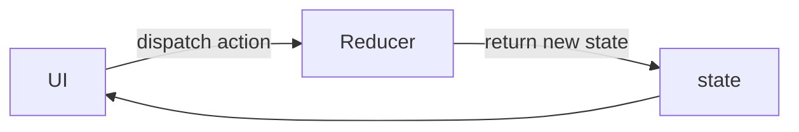
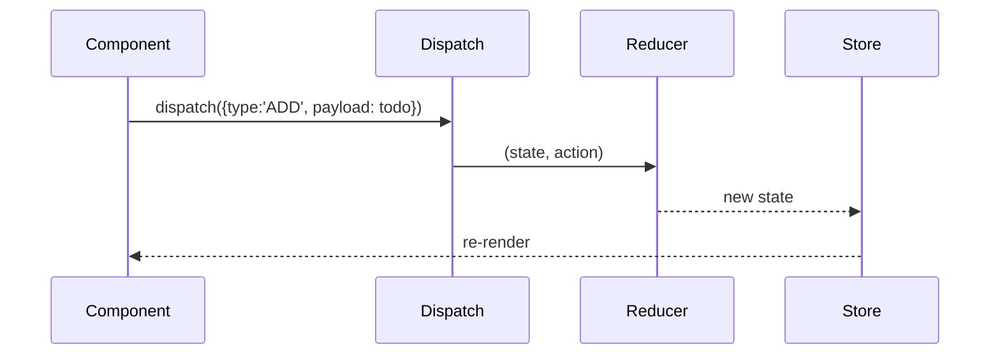

# 📅 Day 10: useReducer — Advanced State Pattern

Hello students 👋 Welcome to **Day 10**! We've mastered `useState`. But what about when state logic becomes **complex** — multiple fields, actions, conditions? Today we learn **`useReducer`** — a cleaner, scalable pattern.

---

## 1. 🎯 Introduction — What We Learn Today?

- What is `useReducer`?
- When is it better than `useState`?
- Action + reducer flow
- Typed reducers in TypeScript
- Combine `useReducer` with `useContext`

### Why this matters in real projects?
When state has many related fields and actions (add, edit, remove, toggle, reset), `useState` becomes messy. `useReducer` gives you a **single place** where all updates happen — predictable, testable, scalable. It's also the base concept for Redux.

---

## 2. 📖 Concept Explanation

### What is `useReducer`?
```tsx
const [state, dispatch] = useReducer(reducer, initialState);
```
- `state` → current state
- `dispatch(action)` → sends an action
- `reducer(state, action)` → pure function that returns new state

### `useState` vs `useReducer`

| Situation | Use |
|-----------|-----|
| Simple boolean / string | useState |
| Single object with 2-3 fields | useState |
| Complex object + many actions | useReducer |
| Multiple related state updates | useReducer |
| State transitions with rules | useReducer |

### Action + Reducer flow



### Reducer must be PURE
- Same input → same output
- No side effects (no `fetch`, no mutation, no console logs)
- Return a new state object (don't mutate)

---

## 3. 💡 Visual Learning

### Redux-like flow (simplified)



---

## 4. 💻 Code Examples

### Example 1 — Counter with useReducer

```tsx
import { useReducer } from "react";

type State = { count: number };
type Action =
  | { type: "INC" }
  | { type: "DEC" }
  | { type: "RESET" }
  | { type: "SET"; payload: number };

const initial: State = { count: 0 };

function reducer(state: State, action: Action): State {
  switch (action.type) {
    case "INC":   return { count: state.count + 1 };
    case "DEC":   return { count: state.count - 1 };
    case "RESET": return { count: 0 };
    case "SET":   return { count: action.payload };
    default:      return state;
  }
}

function Counter() {
  const [state, dispatch] = useReducer(reducer, initial);
  return (
    <>
      <h2>{state.count}</h2>
      <button onClick={() => dispatch({ type: "INC" })}>+</button>
      <button onClick={() => dispatch({ type: "DEC" })}>-</button>
      <button onClick={() => dispatch({ type: "RESET" })}>Reset</button>
      <button onClick={() => dispatch({ type: "SET", payload: 100 })}>Set 100</button>
    </>
  );
}
```

### Example 2 — Todo Manager

```tsx
type Todo = { id: number; text: string; done: boolean };
type TodoState = { todos: Todo[] };

type TodoAction =
  | { type: "ADD"; payload: string }
  | { type: "TOGGLE"; payload: number }
  | { type: "DELETE"; payload: number }
  | { type: "CLEAR_COMPLETED" };

const initial: TodoState = { todos: [] };

function todoReducer(state: TodoState, action: TodoAction): TodoState {
  switch (action.type) {
    case "ADD":
      return {
        todos: [...state.todos, { id: Date.now(), text: action.payload, done: false }],
      };
    case "TOGGLE":
      return {
        todos: state.todos.map((t) =>
          t.id === action.payload ? { ...t, done: !t.done } : t
        ),
      };
    case "DELETE":
      return { todos: state.todos.filter((t) => t.id !== action.payload) };
    case "CLEAR_COMPLETED":
      return { todos: state.todos.filter((t) => !t.done) };
    default:
      return state;
  }
}
```

Usage:

```tsx
function TodoApp() {
  const [state, dispatch] = useReducer(todoReducer, initial);
  const [text, setText] = useState("");

  const add = () => {
    if (!text.trim()) return;
    dispatch({ type: "ADD", payload: text });
    setText("");
  };

  return (
    <div>
      <input value={text} onChange={(e) => setText(e.target.value)} />
      <button onClick={add}>Add</button>
      <button onClick={() => dispatch({ type: "CLEAR_COMPLETED" })}>
        Clear done
      </button>
      <ul>
        {state.todos.map((t) => (
          <li key={t.id}>
            <input
              type="checkbox"
              checked={t.done}
              onChange={() => dispatch({ type: "TOGGLE", payload: t.id })}
            />
            <span style={{ textDecoration: t.done ? "line-through" : "none" }}>
              {t.text}
            </span>
            <button onClick={() => dispatch({ type: "DELETE", payload: t.id })}>
              ❌
            </button>
          </li>
        ))}
      </ul>
    </div>
  );
}
```

### Example 3 — Combining useReducer + useContext

```tsx
type CartItem = { id: number; title: string; qty: number };
type CartState = { items: CartItem[] };
type CartAction =
  | { type: "ADD"; payload: { id: number; title: string } }
  | { type: "REMOVE"; payload: number };

const CartContext = createContext<
  { state: CartState; dispatch: React.Dispatch<CartAction> } | undefined
>(undefined);

function cartReducer(state: CartState, action: CartAction): CartState {
  switch (action.type) {
    case "ADD": {
      const exists = state.items.find((i) => i.id === action.payload.id);
      if (exists)
        return {
          items: state.items.map((i) =>
            i.id === action.payload.id ? { ...i, qty: i.qty + 1 } : i
          ),
        };
      return { items: [...state.items, { ...action.payload, qty: 1 }] };
    }
    case "REMOVE":
      return { items: state.items.filter((i) => i.id !== action.payload) };
    default:
      return state;
  }
}

export function CartProvider({ children }: { children: ReactNode }) {
  const [state, dispatch] = useReducer(cartReducer, { items: [] });
  return (
    <CartContext.Provider value={{ state, dispatch }}>
      {children}
    </CartContext.Provider>
  );
}
```

**Mini question 🤔:** Can a reducer call `fetch()` inside?
*(No — reducers must be pure. Put side effects inside `useEffect` or middleware.)*

---

## 5. 🛠 Hands-on Practice

1. Build a counter with `INC`, `DEC`, `RESET`, `SET`.
2. Build a todo reducer with `ADD`, `TOGGLE`, `DELETE`.
3. Build a form reducer to handle a multi-field form.
4. Combine reducer + context for a global cart.
5. Log every action type in a mini "devtools" console.
6. Add an "UNDO" feature that stores last 5 states.

---

## 6. ⚠️ Common Mistakes

- ❌ Mutating state inside the reducer (must return new state).
- ❌ Side effects inside reducers.
- ❌ Forgetting `default` in switch.
- ❌ Not typing the action union properly.
- ❌ Using useReducer for trivial state that useState handles fine.

---

## 7. 📝 Mini Assignment — "Advanced Todo Manager"

Build a todo manager with:
- Actions: `ADD`, `TOGGLE`, `DELETE`, `EDIT`, `CLEAR_DONE`, `FILTER`
- Filters: all / active / completed
- Persist todos to `localStorage` (use `useEffect`)
- Show counts: total, active, completed
- Use TypeScript + proper action union types

---

## 8. 🔁 Recap

- `useReducer` = state + actions + reducer
- Predictable, scalable state logic
- Pure reducers only (no side effects)
- Combine with Context for global state
- Foundation for Redux

### 🎤 Interview Questions (Day 10)
1. `useState` vs `useReducer`?
2. What makes a reducer pure?
3. How do you type actions with TypeScript?
4. Can you share reducer state globally?
5. Why can't a reducer do API calls?

Tomorrow → **Day 11: Redux Toolkit** — industrial-strength state management 🔥
