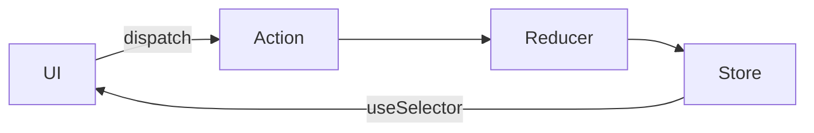
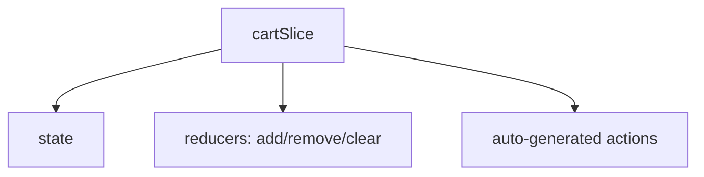

# 📅 Day 11: Redux Toolkit — Industrial State Management

Hello students 👋 Welcome to **Day 11**! Today we enter the world every senior React developer knows: **Redux**. Don't worry — we use **Redux Toolkit (RTK)** which is the **modern**, easy, boilerplate-free Redux. It's the way big companies build real apps.

---

## 1. 🎯 Introduction — What We Learn Today?

- Why Redux?
- Redux Toolkit setup with Vite + TS
- Store, Slice, Actions, Reducers
- `useSelector`, `useDispatch`
- Build a cart system
- Async logic with `createAsyncThunk` (bonus)

### Why this matters in real projects?
Almost every big React app (Instagram Web, LinkedIn, banking apps, admin dashboards) uses Redux for shared state: cart, user, filters, notifications. Mastering RTK = job-ready.

---

## 2. 📖 Concept Explanation

### Why Redux?
- Central "store" for app-wide state
- Works across ANY component
- Great **DevTools** — time travel, replay actions
- Predictable (pure reducers)
- Plugins for async, persistence, logging

### Core Concepts
- **Store** → the single source of truth
- **Slice** → a piece of state + its reducers
- **Action** → describes "what happened"
- **Reducer** → updates state in response
- **useSelector** → read from store
- **useDispatch** → send actions

### Modern RTK advantages
- `createSlice` writes reducers + actions for you
- Uses **Immer** internally → you can write `state.x = y` (mutation-looking, but safe)
- Built-in async via `createAsyncThunk`
- Type-safe with TypeScript

---

## 3. 💡 Visual Learning

### Redux data flow



### Slice structure



---

## 4. 💻 Code Examples

### Step 1 — Install

```bash
npm install @reduxjs/toolkit react-redux
```

### Step 2 — Create store

```ts
// src/store/store.ts
import { configureStore } from "@reduxjs/toolkit";
import cartReducer from "./cartSlice";

export const store = configureStore({
  reducer: {
    cart: cartReducer,
  },
});

// TS types for the whole store
export type RootState = ReturnType<typeof store.getState>;
export type AppDispatch = typeof store.dispatch;
```

### Step 3 — Create slice

```ts
// src/store/cartSlice.ts
import { createSlice, PayloadAction } from "@reduxjs/toolkit";

export type CartItem = {
  id: number;
  title: string;
  price: number;
  qty: number;
};

type CartState = { items: CartItem[] };

const initialState: CartState = { items: [] };

const cartSlice = createSlice({
  name: "cart",
  initialState,
  reducers: {
    add: (state, action: PayloadAction<Omit<CartItem, "qty">>) => {
      const existing = state.items.find((i) => i.id === action.payload.id);
      if (existing) {
        existing.qty += 1;          // safe with Immer ✅
      } else {
        state.items.push({ ...action.payload, qty: 1 });
      }
    },
    remove: (state, action: PayloadAction<number>) => {
      state.items = state.items.filter((i) => i.id !== action.payload);
    },
    clear: (state) => {
      state.items = [];
    },
    increment: (state, action: PayloadAction<number>) => {
      const item = state.items.find((i) => i.id === action.payload);
      if (item) item.qty += 1;
    },
    decrement: (state, action: PayloadAction<number>) => {
      const item = state.items.find((i) => i.id === action.payload);
      if (item && item.qty > 1) item.qty -= 1;
    },
  },
});

export const { add, remove, clear, increment, decrement } = cartSlice.actions;
export default cartSlice.reducer;
```

### Step 4 — Typed hooks

```ts
// src/store/hooks.ts
import { useDispatch, useSelector, TypedUseSelectorHook } from "react-redux";
import type { RootState, AppDispatch } from "./store";

export const useAppDispatch: () => AppDispatch = useDispatch;
export const useAppSelector: TypedUseSelectorHook<RootState> = useSelector;
```

### Step 5 — Provide store at app root

```tsx
// src/main.tsx
import { Provider } from "react-redux";
import { store } from "./store/store";

<Provider store={store}>
  <App />
</Provider>
```

### Step 6 — Use in components

```tsx
// src/components/Cart.tsx
import { useAppDispatch, useAppSelector } from "../store/hooks";
import { remove, clear, increment, decrement } from "../store/cartSlice";

export default function Cart() {
  const items = useAppSelector((s) => s.cart.items);
  const dispatch = useAppDispatch();

  const total = items.reduce((sum, i) => sum + i.price * i.qty, 0);

  if (items.length === 0) return <p>Cart empty</p>;

  return (
    <div>
      {items.map((i) => (
        <div key={i.id}>
          {i.title} — ₹ {i.price} x {i.qty}
          <button onClick={() => dispatch(increment(i.id))}>+</button>
          <button onClick={() => dispatch(decrement(i.id))}>-</button>
          <button onClick={() => dispatch(remove(i.id))}>❌</button>
        </div>
      ))}
      <h3>Total: ₹ {total}</h3>
      <button onClick={() => dispatch(clear())}>Clear Cart</button>
    </div>
  );
}
```

```tsx
// product card dispatches `add`
<button onClick={() => dispatch(add({ id: p.id, title: p.name, price: p.price }))}>
  Add to Cart
</button>
```

### Bonus — `createAsyncThunk`

```ts
import { createAsyncThunk, createSlice } from "@reduxjs/toolkit";

type Product = { id: number; title: string; price: number };

export const fetchProducts = createAsyncThunk<Product[]>(
  "products/fetch",
  async () => {
    const r = await fetch("https://fakestoreapi.com/products");
    return r.json();
  }
);

const productSlice = createSlice({
  name: "products",
  initialState: { list: [] as Product[], loading: false, error: "" },
  reducers: {},
  extraReducers: (b) => {
    b.addCase(fetchProducts.pending,   (s) => { s.loading = true; s.error = ""; });
    b.addCase(fetchProducts.fulfilled, (s, a) => { s.loading = false; s.list = a.payload; });
    b.addCase(fetchProducts.rejected,  (s, a) => { s.loading = false; s.error = a.error.message ?? ""; });
  },
});
```

**Mini question 🤔:** In RTK, why can I write `state.x = y` when Redux usually forbids mutation?
*(Because RTK uses Immer, which turns your mutations into safe immutable updates.)*

---

## 5. 🛠 Hands-on Practice

1. Install Redux Toolkit + React-Redux.
2. Create a `counterSlice` with `increment`, `decrement`, `incrementBy`.
3. Add `<Provider>` in `main.tsx`.
4. Use `useSelector` + `useDispatch` in a Counter component.
5. Build a `cartSlice` and connect Product cards.
6. Build an `authSlice` with `login` / `logout`.

---

## 6. ⚠️ Common Mistakes

- ❌ Forgetting `<Provider store={store}>` → "could not find react-redux context"
- ❌ Mutating state outside RTK (outside `createSlice`)
- ❌ Not using typed hooks — losing autocompletion
- ❌ Selecting too much in `useSelector` (causes unnecessary re-renders)
- ❌ Keeping derived values in state (compute them in selectors)

---

## 7. 📝 Mini Assignment — "Cart System"

Build a mini e-commerce:
- Product list (fake data or `fakestoreapi.com/products`)
- "Add to cart" button per product
- Cart component: list items, increment/decrement, remove, clear
- Show total price and total items count in the Navbar (from Redux)
- Use **Redux Toolkit + TypeScript** throughout

---

## 8. 🔁 Recap

- Redux Toolkit = modern, less boilerplate
- Store, Slice, Actions, Reducers
- `useSelector` reads, `useDispatch` sends
- Immer lets you "mutate" safely
- `createAsyncThunk` handles async
- Use typed hooks (`useAppSelector`, `useAppDispatch`)

### 🎤 Interview Questions (Day 11)
1. Why Redux when we have Context?
2. What is Immer?
3. Difference: `createSlice` vs `createReducer`?
4. What does `createAsyncThunk` do?
5. Should you keep derived data in the store?

Tomorrow → **Day 12: React Router** — multi-page apps 🧭
