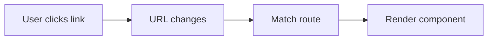
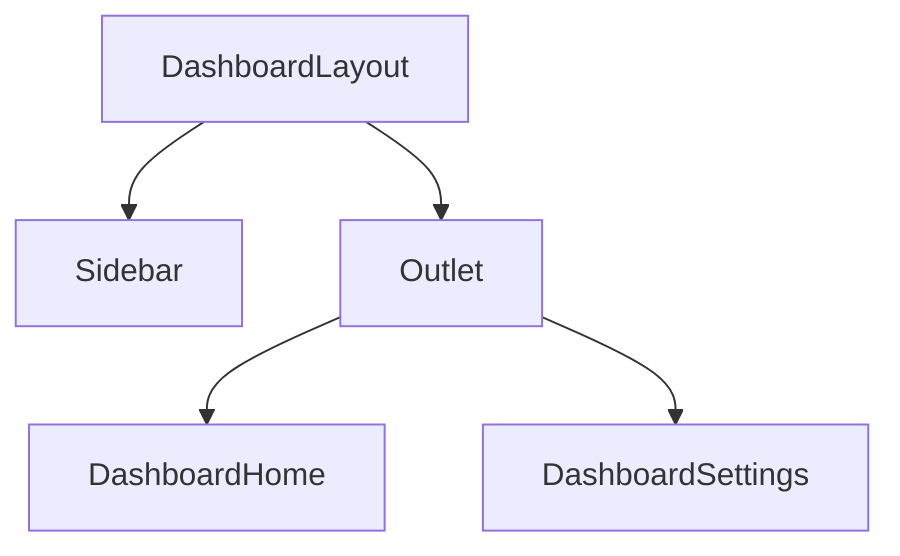

# 📅 Day 12: Routing with React Router

Hello students 👋 Welcome to **Day 12**! So far we've built single-page apps with one view. But real apps have **many pages** — Home, About, Products, Profile, etc. Today we learn **React Router**.

---

## 1. 🎯 Introduction — What We Learn Today?

- React Router setup (`react-router-dom` v6+)
- `BrowserRouter`, `Routes`, `Route`
- `Link`, `NavLink`
- URL params (`useParams`)
- Query params (`useSearchParams`)
- Nested routes + `Outlet`
- Protected routes
- Programmatic navigation (`useNavigate`)

### Why this matters in real projects?
Every real app has multiple pages: `/`, `/login`, `/products/:id`, `/dashboard`. Without routing, you'd have to fake URLs or reload. React Router gives us real URLs for SPAs.

---

## 2. 📖 Concept Explanation

### Client-side routing
Instead of the server serving different HTML pages, React Router updates the URL and renders different components — **without** reloading the page.

### Key building blocks
- `BrowserRouter` → enables routing across the app
- `Routes` + `Route` → maps URL → component
- `Link` / `NavLink` → navigation without reload
- `useParams` → read `:id` from URL
- `useSearchParams` → read `?page=2`
- `useNavigate` → navigate in code
- `Outlet` → render child routes inside a layout

### Nested routes
Pages can have shared layouts (Navbar, Sidebar). Child routes render inside a parent via `<Outlet/>`.

### Protected routes
Before rendering a page, check if the user is authenticated. If not, redirect to `/login`.

---

## 3. 💡 Visual Learning

### Router flow



### Nested layout



---

## 4. 💻 Code Examples

### Step 1 — Install

```bash
npm install react-router-dom
```

### Step 2 — Basic routing

```tsx
// src/main.tsx
import { BrowserRouter } from "react-router-dom";

<BrowserRouter>
  <App />
</BrowserRouter>
```

```tsx
// src/App.tsx
import { Routes, Route, Link } from "react-router-dom";

function Home()     { return <h1>Home</h1>; }
function About()    { return <h1>About</h1>; }
function NotFound() { return <h1>404 Not Found</h1>; }

export default function App() {
  return (
    <>
      <nav>
        <Link to="/">Home</Link> | <Link to="/about">About</Link>
      </nav>
      <Routes>
        <Route path="/" element={<Home />} />
        <Route path="/about" element={<About />} />
        <Route path="*" element={<NotFound />} />
      </Routes>
    </>
  );
}
```

### Step 3 — Dynamic route params

```tsx
// route: /products/:id
import { useParams } from "react-router-dom";

function ProductDetail() {
  const { id } = useParams<{ id: string }>();
  return <h2>Product ID: {id}</h2>;
}

<Route path="/products/:id" element={<ProductDetail />} />
```

```tsx
<Link to="/products/42">Go to product 42</Link>
```

### Step 4 — Query params

```tsx
import { useSearchParams } from "react-router-dom";

function Search() {
  const [params, setParams] = useSearchParams();
  const q = params.get("q") ?? "";

  return (
    <>
      <input
        value={q}
        onChange={(e) => setParams({ q: e.target.value })}
      />
      <p>Searching: {q}</p>
    </>
  );
}
```

### Step 5 — NavLink with active styling

```tsx
import { NavLink } from "react-router-dom";

<NavLink
  to="/about"
  className={({ isActive }) => (isActive ? "active-link" : "")}
>
  About
</NavLink>
```

### Step 6 — Programmatic navigation

```tsx
import { useNavigate } from "react-router-dom";

function LoginBtn() {
  const nav = useNavigate();
  return <button onClick={() => nav("/dashboard")}>Login</button>;
}
```

### Step 7 — Nested routes with layout

```tsx
import { Outlet } from "react-router-dom";

function DashboardLayout() {
  return (
    <div className="grid">
      <aside>
        <NavLink to="">Home</NavLink>
        <NavLink to="settings">Settings</NavLink>
      </aside>
      <main>
        <Outlet />
      </main>
    </div>
  );
}

<Route path="/dashboard" element={<DashboardLayout />}>
  <Route index element={<DashboardHome />} />
  <Route path="settings" element={<DashboardSettings />} />
</Route>
```

### Step 8 — Protected route

```tsx
import { Navigate } from "react-router-dom";

function ProtectedRoute({ children }: { children: JSX.Element }) {
  const { user } = useAuth(); // from Day 9
  if (!user) return <Navigate to="/login" replace />;
  return children;
}

<Route path="/dashboard" element={
  <ProtectedRoute><DashboardLayout /></ProtectedRoute>
}>
  <Route index element={<DashboardHome />} />
</Route>
```

**Mini question 🤔:** Difference between `Link` and `<a href>`?
*(`<a>` reloads the page; `Link` updates URL without reload — SPA behavior.)*

---

## 5. 🛠 Hands-on Practice

1. Build Home, About, Contact pages with NavLinks.
2. Add a 404 page for unmatched routes.
3. Build `/users/:id` with `useParams`.
4. Build a search page that reads `?q=` via `useSearchParams`.
5. Build a dashboard layout with `<Outlet />`.
6. Add a protected route for `/profile` that redirects to `/login`.

---

## 6. ⚠️ Common Mistakes

- ❌ Forgetting `<BrowserRouter>` wrapper → hooks crash.
- ❌ Using `<a>` instead of `<Link>` → page reload.
- ❌ Wrong path format (missing `/`).
- ❌ Missing `index` route in nested layouts.
- ❌ Not passing `replace` in auth redirects (browser back may loop).
- ❌ Forgetting to read `id` as string and compare with number data.

---

## 7. 📝 Mini Assignment — "Multi-Page Dashboard"

Build a dashboard app:
- **Public**: `/`, `/login`, `/register`
- **Protected**: `/dashboard` (with nested `/dashboard/overview`, `/dashboard/settings`, `/dashboard/users/:id`)
- Navbar with active links (NavLink)
- On login success → redirect to `/dashboard`
- On logout → redirect to `/`
- 404 page for unknown routes
- Use **Auth Context** from Day 9

---

## 8. 🔁 Recap

- React Router gives SPAs real URLs
- `BrowserRouter > Routes > Route`
- Use `Link`/`NavLink` instead of `<a>`
- `useParams`, `useSearchParams`, `useNavigate`
- `Outlet` enables nested layouts
- Protect private routes with conditional redirect

### 🎤 Interview Questions (Day 12)
1. Difference between `Link` and anchor tag?
2. What are nested routes?
3. How do you protect a route?
4. Difference between `useParams` and `useSearchParams`?
5. What is `replace: true` used for in navigation?

Tomorrow → **Day 13: Advanced Forms** ✍️ — React Hook Form, validation, dynamic fields
