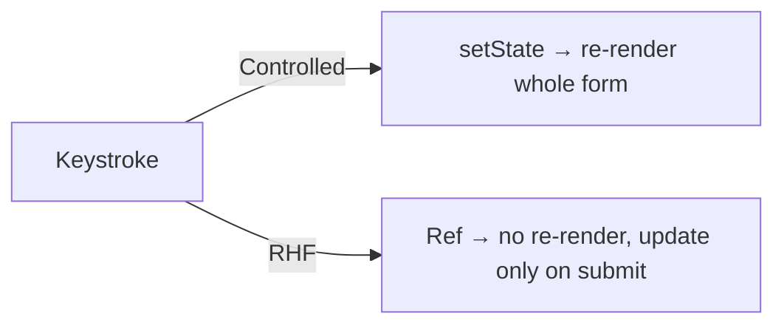
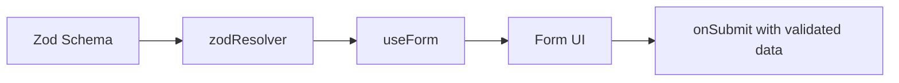

# 📅 Day 13: Advanced Forms — React Hook Form + Validation

Hello students 👋 Welcome to **Day 13**! On Day 4, we built basic forms with `useState`. Today we go **professional**. Real-world forms have 10+ fields, validation, error messages, dynamic rows, file uploads, and async checks. We'll learn **React Hook Form (RHF)** + **Zod**, the stack used in production apps.

---

## 1. 🎯 Introduction — What We Learn Today?

- Why controlled forms get slow with many fields
- React Hook Form intro
- Validation with Zod + `@hookform/resolvers`
- Error messages
- Dynamic fields (`useFieldArray`)
- Async validation (e.g., email uniqueness)

### Why this matters in real projects?
Nearly every admin dashboard, job portal, CRM has complex forms. React Hook Form makes them fast, clean, and well-validated.

---

## 2. 📖 Concept Explanation

### Why not just `useState`?
For 10+ fields, `useState` causes:
- Lots of re-renders on every keystroke
- Manual validation per field
- Boilerplate for every input

### React Hook Form benefits
- **Uncontrolled** by default → fewer re-renders
- Built-in validation
- Easy integration with Zod/Yup
- `useFieldArray` for dynamic rows
- Great TypeScript support

### Zod
A **runtime schema validator** + TypeScript type generator. One schema → both validation + types.

---

## 3. 💡 Visual Learning

### Controlled vs RHF



### RHF + Zod flow



---

## 4. 💻 Code Examples

### Step 1 — Install

```bash
npm install react-hook-form zod @hookform/resolvers
```

### Step 2 — Simple login form

```tsx
import { useForm } from "react-hook-form";

type LoginForm = { email: string; password: string };

function Login() {
  const {
    register,
    handleSubmit,
    formState: { errors, isSubmitting },
  } = useForm<LoginForm>();

  const onSubmit = async (data: LoginForm) => {
    console.log(data);
  };

  return (
    <form onSubmit={handleSubmit(onSubmit)}>
      <input
        placeholder="Email"
        {...register("email", { required: "Email required" })}
      />
      {errors.email && <span>{errors.email.message}</span>}

      <input
        type="password"
        placeholder="Password"
        {...register("password", { required: "Password required", minLength: { value: 6, message: "Min 6 chars" } })}
      />
      {errors.password && <span>{errors.password.message}</span>}

      <button disabled={isSubmitting}>Login</button>
    </form>
  );
}
```

### Step 3 — Zod schema + typed form

```tsx
import { z } from "zod";
import { zodResolver } from "@hookform/resolvers/zod";
import { useForm } from "react-hook-form";

const schema = z.object({
  name:     z.string().min(2, "Name too short"),
  email:    z.string().email("Invalid email"),
  age:      z.coerce.number().min(18, "Must be 18+"),
  password: z.string().min(6, "Min 6 chars"),
  confirm:  z.string(),
}).refine((d) => d.password === d.confirm, {
  message: "Passwords must match",
  path: ["confirm"],
});

type FormData = z.infer<typeof schema>;

function Register() {
  const {
    register,
    handleSubmit,
    formState: { errors },
  } = useForm<FormData>({ resolver: zodResolver(schema) });

  const onSubmit = (data: FormData) => console.log(data);

  return (
    <form onSubmit={handleSubmit(onSubmit)}>
      <input placeholder="Name"    {...register("name")} />
      {errors.name && <p>{errors.name.message}</p>}

      <input placeholder="Email"   {...register("email")} />
      {errors.email && <p>{errors.email.message}</p>}

      <input type="number" placeholder="Age" {...register("age")} />
      {errors.age && <p>{errors.age.message}</p>}

      <input type="password" placeholder="Password" {...register("password")} />
      {errors.password && <p>{errors.password.message}</p>}

      <input type="password" placeholder="Confirm"  {...register("confirm")} />
      {errors.confirm && <p>{errors.confirm.message}</p>}

      <button>Register</button>
    </form>
  );
}
```

### Step 4 — Dynamic fields with `useFieldArray`

```tsx
import { useForm, useFieldArray } from "react-hook-form";

type Skill = { name: string; level: number };
type ResumeForm = { fullName: string; skills: Skill[] };

function ResumeForm() {
  const {
    register,
    control,
    handleSubmit,
  } = useForm<ResumeForm>({
    defaultValues: { fullName: "", skills: [{ name: "", level: 1 }] },
  });

  const { fields, append, remove } = useFieldArray({ control, name: "skills" });

  return (
    <form onSubmit={handleSubmit((d) => console.log(d))}>
      <input placeholder="Full name" {...register("fullName")} />

      {fields.map((f, i) => (
        <div key={f.id}>
          <input placeholder="Skill"  {...register(`skills.${i}.name`)} />
          <input type="number" min={1} max={10} {...register(`skills.${i}.level`, { valueAsNumber: true })} />
          <button type="button" onClick={() => remove(i)}>❌</button>
        </div>
      ))}

      <button type="button" onClick={() => append({ name: "", level: 1 })}>
        ➕ Add Skill
      </button>

      <button type="submit">Save</button>
    </form>
  );
}
```

### Step 5 — Async validation (check username)

```tsx
const { register, formState: { errors } } = useForm<{ username: string }>();

<input
  {...register("username", {
    required: "Required",
    validate: async (v) => {
      const r = await fetch(`/api/check-username?u=${v}`);
      const { taken } = await r.json();
      return taken ? "Username already taken" : true;
    },
  })}
/>
```

**Mini question 🤔:** Why does RHF re-render less than controlled forms?
*(Because it stores values in refs — not in React state — so typing doesn't trigger re-renders.)*

---

## 5. 🛠 Hands-on Practice

1. Build a login form with RHF + basic validation.
2. Convert it to use Zod schema.
3. Add a "confirm password" rule with `refine`.
4. Build a multi-experience form with `useFieldArray`.
5. Add async validation for "email already in use".
6. Show loading state during async submit.

---

## 6. ⚠️ Common Mistakes

- ❌ Forgetting `{...register("name")}` — input stays uncontrolled.
- ❌ Not using `valueAsNumber`/`valueAsDate` for non-string inputs.
- ❌ Writing Zod schemas + TS types separately (duplicate source of truth).
- ❌ Not handling `isSubmitting` → users double-click submit.
- ❌ Using `defaultValues` as a live source of truth (use `reset()` for that).

---

## 7. 📝 Mini Assignment — "Job Application Form"

Build a job application form:
- Fields: Full name, email, phone, experience level, resume (file), desired salary, cover letter
- Zod schema for all validations
- `useFieldArray` for a list of "previous jobs" (company, role, years)
- Submit button disabled while submitting
- Show success message after submit
- Use TypeScript fully

---

## 8. 🔁 Recap

- RHF = fast, fewer re-renders, easier validation
- Pair with **Zod** for schema + types
- `useFieldArray` for dynamic rows
- `isSubmitting` helps UX
- Always display per-field error messages

### 🎤 Interview Questions (Day 13)
1. Why React Hook Form over controlled forms?
2. What is Zod?
3. How does `zodResolver` work?
4. How do you handle dynamic fields in RHF?
5. Performance difference: controlled vs uncontrolled?

Tomorrow → **Day 14: Performance + Clean Architecture** 🏗️
