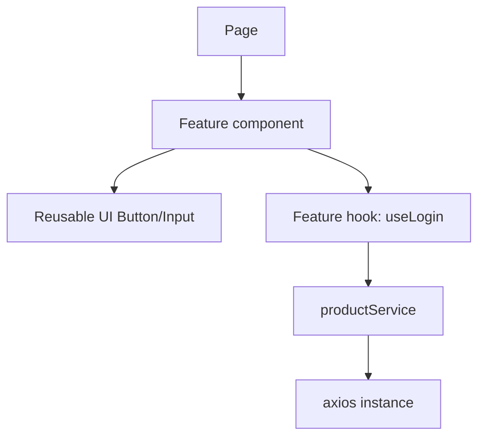
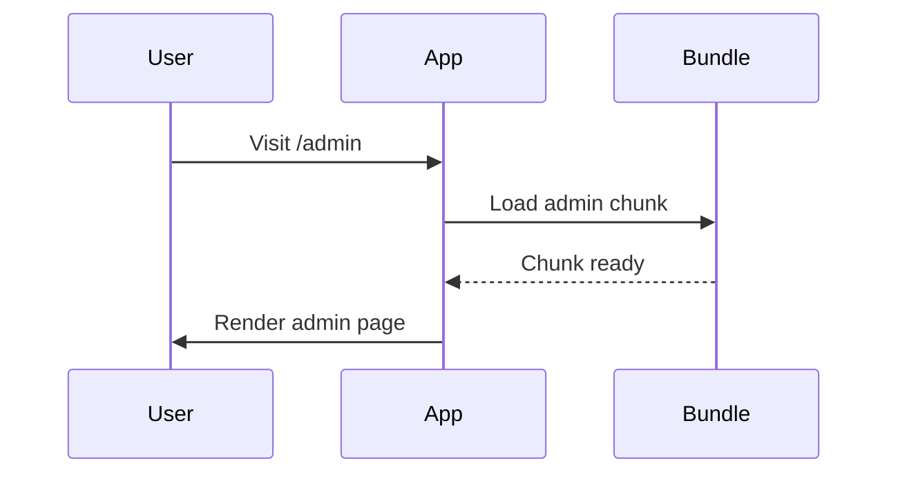

# 📅 Day 14: Performance + Clean Architecture

Hello students 👋 Welcome to **Day 14**! Today we stop thinking like beginners and start thinking like **senior engineers**. We'll learn how to make apps **fast**, **scalable**, and **maintainable**.

---

## 1. 🎯 Introduction — What We Learn Today?

- Memoization (`React.memo`, `useMemo`, `useCallback`)
- Splitting components the right way
- Folder structure for large apps
- Reusable UI components
- API service layer
- Environment variables with Vite
- Code splitting / Lazy loading

### Why this matters in real projects?
When your app has 100+ components and 30+ pages, performance and structure become critical. Clean architecture = fewer bugs, faster dev, happier teams.

---

## 2. 📖 Concept Explanation

### 🏎️ Performance techniques
1. **React.memo** → skip re-render if props didn't change
2. **useMemo** → cache expensive computations
3. **useCallback** → cache function references for memoized children
4. **Key correctly** → stable IDs prevent unnecessary unmounts
5. **Lazy load routes/components** with `React.lazy + Suspense`
6. **Avoid inline objects/functions** in hot paths

### 🏗 Clean Architecture layers

```
src/
├── api/            # API service layer (axios instance, endpoints)
├── components/     # Reusable UI (Button, Input, Card, Modal)
├── features/       # Feature-based code (auth, products, cart)
│   ├── auth/
│   │   ├── AuthForm.tsx
│   │   ├── useLogin.ts
│   │   └── authSlice.ts
├── hooks/          # Shared custom hooks
├── layouts/        # AppLayout, DashboardLayout
├── pages/          # Route-level components
├── routes/         # Route config + guards
├── store/          # Redux store config
├── types/          # Shared TS types
├── utils/          # Formatters, helpers
└── main.tsx
```

### API service layer
Don't call `fetch` inside every component. Create ONE axios instance + one function per endpoint.

```ts
// src/api/axios.ts
import axios from "axios";
export const api = axios.create({
  baseURL: import.meta.env.VITE_API_URL,
  timeout: 10000,
});

api.interceptors.request.use((cfg) => {
  const token = localStorage.getItem("token");
  if (token) cfg.headers.Authorization = `Bearer ${token}`;
  return cfg;
});
```

```ts
// src/api/productService.ts
import { api } from "./axios";

export type Product = { id: number; title: string; price: number };

export const productService = {
  list:  () => api.get<Product[]>("/products").then(r => r.data),
  get:   (id: number) => api.get<Product>(`/products/${id}`).then(r => r.data),
  create: (p: Omit<Product, "id">) => api.post<Product>("/products", p).then(r => r.data),
};
```

### Environment variables in Vite
In Vite, env vars must start with `VITE_`.

```
# .env
VITE_API_URL=https://api.myapp.com
VITE_APP_NAME=MyApp
```

```ts
console.log(import.meta.env.VITE_API_URL);
```
Add `.env` to `.gitignore`.

---

## 3. 💡 Visual Learning

### Component structure



### Lazy loading flow



---

## 4. 💻 Code Examples

### Example 1 — Memoizing a row

```tsx
import { memo } from "react";

type Row = { id: number; name: string };

const RowItem = memo(({ row }: { row: Row }) => {
  console.log("render", row.id);
  return <li>{row.name}</li>;
});
```

### Example 2 — `useCallback` with `React.memo`

```tsx
type TodoItemProps = { todo: Todo; onToggle: (id: number) => void };
const TodoItem = memo(({ todo, onToggle }: TodoItemProps) => (
  <li onClick={() => onToggle(todo.id)}>{todo.text}</li>
));

function TodoList({ todos }: { todos: Todo[] }) {
  const [, setTick] = useState(0);

  // stable identity → TodoItem won't re-render on tick updates
  const onToggle = useCallback((id: number) => {
    /* dispatch toggle */
  }, []);

  return (
    <>
      <button onClick={() => setTick((t) => t + 1)}>Tick</button>
      {todos.map((t) => (
        <TodoItem key={t.id} todo={t} onToggle={onToggle} />
      ))}
    </>
  );
}
```

### Example 3 — Lazy loading pages

```tsx
import { lazy, Suspense } from "react";

const Dashboard = lazy(() => import("./pages/Dashboard"));
const Admin     = lazy(() => import("./pages/Admin"));

<Suspense fallback={<div>Loading page...</div>}>
  <Routes>
    <Route path="/dashboard" element={<Dashboard />} />
    <Route path="/admin"     element={<Admin />} />
  </Routes>
</Suspense>
```

### Example 4 — Reusable Button

```tsx
// src/components/Button.tsx
import { ButtonHTMLAttributes } from "react";

type Props = ButtonHTMLAttributes<HTMLButtonElement> & {
  variant?: "primary" | "secondary" | "danger";
};

export function Button({ variant = "primary", className, ...rest }: Props) {
  return (
    <button
      className={`btn btn-${variant} ${className ?? ""}`}
      {...rest}
    />
  );
}
```

### Example 5 — Feature folder (`features/auth`)

```
features/auth/
├── AuthForm.tsx
├── useLogin.ts
├── authApi.ts
├── authSlice.ts
└── types.ts
```

```ts
// features/auth/useLogin.ts
import { useAppDispatch } from "@/store/hooks";
import { authApi } from "./authApi";
import { loginSuccess } from "./authSlice";

export function useLogin() {
  const dispatch = useAppDispatch();
  return async (email: string, pw: string) => {
    const user = await authApi.login(email, pw);
    dispatch(loginSuccess(user));
  };
}
```

### Example 6 — Vite path alias

```ts
// vite.config.ts
import path from "path";
import { defineConfig } from "vite";
import react from "@vitejs/plugin-react";

export default defineConfig({
  plugins: [react()],
  resolve: {
    alias: { "@": path.resolve(__dirname, "src") },
  },
});
```

```json
// tsconfig.json → "compilerOptions"
"baseUrl": ".",
"paths": { "@/*": ["src/*"] }
```

Now: `import { Button } from "@/components/Button"`.

**Mini question 🤔:** Is it always good to wrap components in `React.memo`?
*(No! Memoizing has cost. Use only when the component re-renders often with the same props.)*

---

## 5. 🛠 Hands-on Practice

1. Split a large component into smaller sub-components.
2. Wrap a row component in `React.memo` and check re-renders.
3. Lazy-load a heavy admin page.
4. Create a `components/` folder with `Button`, `Input`, `Card`.
5. Build an `api/` folder with axios instance + `productService`.
6. Move API URL to `.env` and read via `import.meta.env.VITE_API_URL`.
7. Add `@/` path alias.

---

## 6. ⚠️ Common Mistakes

- ❌ Premature memoization everywhere → code complexity.
- ❌ Inline objects/functions as props to memoized children (`onClick={() => x()}`) — breaks memo.
- ❌ Mixing API logic inside components — hard to test.
- ❌ Hard-coding API URLs (use env vars).
- ❌ Deeply nested folder chaos — use feature-based structure.
- ❌ Forgetting `Suspense` around lazy components.

---

## 7. 📝 Mini Assignment — "Scalable Dashboard Structure"

Build a dashboard skeleton:
- Folder structure: `api`, `components`, `features`, `pages`, `hooks`, `layouts`, `routes`, `store`, `types`, `utils`
- `@/` path alias working
- `.env` file with `VITE_API_URL`
- Axios instance with interceptor
- `features/auth` with `authSlice`, `authApi`, `useLogin`
- Lazy load `/admin` and `/profile`
- Reusable `Button`, `Input`, `Card`

---

## 8. 🔁 Recap

- Memoize only when needed (measure first)
- Split components by responsibility
- Use feature-based folder structure
- Keep API logic in a service layer
- Use env vars via `import.meta.env.VITE_*`
- Lazy-load heavy routes for speed

### 🎤 Interview Questions (Day 14)
1. What does `React.memo` do?
2. Why `useCallback` matters with memoized children?
3. How do you structure a large React project?
4. What is code splitting?
5. Why feature-based folders over type-based?

Tomorrow → **Day 15: Final Project** 🎓 — you put it all together!
