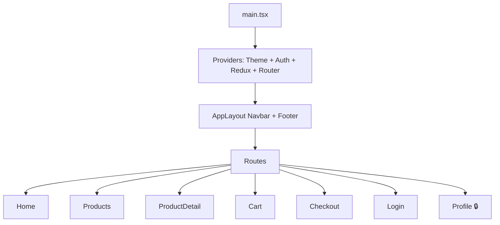
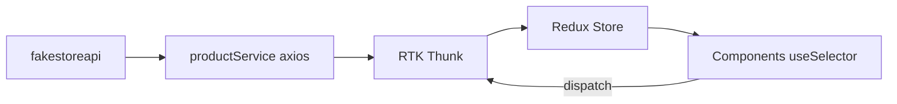

# 📅 Day 15: Final Project — Build a Real-World App

Hello students 👋 Welcome to **Day 15** — the grand finale! 🎉 You've learned 14 days of React + TypeScript + Vite. Today, we bring it ALL together and build a production-style app. This is the project you'll proudly show in interviews.

---

## 1. 🎯 Introduction — What We Build Today?

Pick **ONE** of these real-world apps (we'll build the E-commerce one in this guide; you can adapt the same pattern):

1. 🛒 **E-commerce frontend**
2. ✅ **Task Manager**
3. 📊 **Admin Dashboard**
4. 💼 **Job Portal frontend**

### Why this matters?
A portfolio project > any certificate. Recruiters judge you on what you **build**. This project will show: TS + Hooks + Context + Redux + Routing + API + Clean architecture — a **job-ready** skillset.

---

## 2. 🧰 Required Tech Stack

- ✅ React 18+ (Vite + TypeScript)
- ✅ Hooks (useState, useEffect, useRef, useMemo, useCallback)
- ✅ Context API (theme/auth)
- ✅ Redux Toolkit (cart / products / filters)
- ✅ React Router v6
- ✅ React Hook Form + Zod
- ✅ Axios API layer
- ✅ Environment variables
- ✅ Lazy loading
- ✅ Clean folder structure

---

## 3. 🛒 Example Chosen: E-Commerce Frontend

### Features
- 🏠 Home page with hero + featured products
- 🧾 Product listing page with search, filter (category, price), sort
- 🔍 Product detail page
- 🛍 Cart with add/remove/qty
- ✅ Checkout form (RHF + Zod)
- 🌙 Dark/Light theme (Context)
- 👤 Login/Register (Auth Context)
- 🔒 Protected routes (Profile, Orders)
- 📱 Responsive layout
- ⏳ Loading + error states

### API
Use the free API → `https://fakestoreapi.com/products` (no auth required).

---

## 4. 💡 Architecture Diagram



### Data flow



---

## 5. 📁 Folder Structure

```
src/
├── api/
│   ├── axios.ts
│   └── productService.ts
├── app/
│   └── store.ts
├── components/
│   ├── Button.tsx
│   ├── Input.tsx
│   ├── Navbar.tsx
│   ├── Footer.tsx
│   ├── ProductCard.tsx
│   └── ProtectedRoute.tsx
├── context/
│   ├── ThemeContext.tsx
│   └── AuthContext.tsx
├── features/
│   ├── products/
│   │   ├── productsSlice.ts
│   │   └── ProductsPage.tsx
│   ├── cart/
│   │   ├── cartSlice.ts
│   │   └── CartPage.tsx
│   └── checkout/
│       └── CheckoutForm.tsx
├── hooks/
│   ├── useDebounce.ts
│   └── useLocalStorage.ts
├── layouts/
│   └── AppLayout.tsx
├── pages/
│   ├── Home.tsx
│   ├── ProductDetail.tsx
│   ├── Login.tsx
│   ├── Register.tsx
│   ├── Profile.tsx
│   └── NotFound.tsx
├── routes/
│   └── AppRoutes.tsx
├── types/
│   └── index.ts
├── utils/
│   └── format.ts
├── App.tsx
├── main.tsx
└── index.css
```

---

## 6. 💻 Setup & Key Code

### Step 1 — Create project

```bash
npm create vite@latest ecom-app -- --template react-ts
cd ecom-app
npm install
npm install @reduxjs/toolkit react-redux react-router-dom axios react-hook-form zod @hookform/resolvers
npm run dev
```

### Step 2 — `.env`

```
VITE_API_URL=https://fakestoreapi.com
```

### Step 3 — axios

```ts
// src/api/axios.ts
import axios from "axios";
export const api = axios.create({ baseURL: import.meta.env.VITE_API_URL });
```

### Step 4 — Types

```ts
// src/types/index.ts
export type Product = {
  id: number;
  title: string;
  price: number;
  description: string;
  category: string;
  image: string;
  rating: { rate: number; count: number };
};
```

### Step 5 — Products slice

```ts
// src/features/products/productsSlice.ts
import { createAsyncThunk, createSlice } from "@reduxjs/toolkit";
import { api } from "@/api/axios";
import type { Product } from "@/types";

export const fetchProducts = createAsyncThunk<Product[]>(
  "products/fetch",
  async () => (await api.get<Product[]>("/products")).data
);

type State = { list: Product[]; loading: boolean; error: string | null };
const initial: State = { list: [], loading: false, error: null };

const slice = createSlice({
  name: "products",
  initialState: initial,
  reducers: {},
  extraReducers: (b) => {
    b.addCase(fetchProducts.pending,   (s) => { s.loading = true; s.error = null; });
    b.addCase(fetchProducts.fulfilled, (s, a) => { s.loading = false; s.list = a.payload; });
    b.addCase(fetchProducts.rejected,  (s, a) => { s.loading = false; s.error = a.error.message ?? "Error"; });
  },
});
export default slice.reducer;
```

### Step 6 — Cart slice

```ts
// src/features/cart/cartSlice.ts
import { createSlice, PayloadAction } from "@reduxjs/toolkit";
import type { Product } from "@/types";

export type CartItem = Product & { qty: number };
type State = { items: CartItem[] };
const initial: State = { items: [] };

const slice = createSlice({
  name: "cart",
  initialState: initial,
  reducers: {
    add: (s, a: PayloadAction<Product>) => {
      const found = s.items.find((i) => i.id === a.payload.id);
      if (found) found.qty += 1;
      else s.items.push({ ...a.payload, qty: 1 });
    },
    remove: (s, a: PayloadAction<number>) => {
      s.items = s.items.filter((i) => i.id !== a.payload);
    },
    increment: (s, a: PayloadAction<number>) => {
      const x = s.items.find((i) => i.id === a.payload);
      if (x) x.qty += 1;
    },
    decrement: (s, a: PayloadAction<number>) => {
      const x = s.items.find((i) => i.id === a.payload);
      if (x && x.qty > 1) x.qty -= 1;
    },
    clear: (s) => { s.items = []; },
  },
});
export const { add, remove, increment, decrement, clear } = slice.actions;
export default slice.reducer;
```

### Step 7 — Store

```ts
// src/app/store.ts
import { configureStore } from "@reduxjs/toolkit";
import products from "@/features/products/productsSlice";
import cart from "@/features/cart/cartSlice";

export const store = configureStore({ reducer: { products, cart } });
export type RootState = ReturnType<typeof store.getState>;
export type AppDispatch = typeof store.dispatch;
```

### Step 8 — App routes

```tsx
// src/routes/AppRoutes.tsx
import { lazy, Suspense } from "react";
import { Routes, Route } from "react-router-dom";
import AppLayout from "@/layouts/AppLayout";
import ProtectedRoute from "@/components/ProtectedRoute";

const Home           = lazy(() => import("@/pages/Home"));
const ProductsPage   = lazy(() => import("@/features/products/ProductsPage"));
const ProductDetail  = lazy(() => import("@/pages/ProductDetail"));
const CartPage       = lazy(() => import("@/features/cart/CartPage"));
const Login          = lazy(() => import("@/pages/Login"));
const Profile        = lazy(() => import("@/pages/Profile"));
const NotFound       = lazy(() => import("@/pages/NotFound"));

export default function AppRoutes() {
  return (
    <Suspense fallback={<p>Loading...</p>}>
      <Routes>
        <Route element={<AppLayout />}>
          <Route index element={<Home />} />
          <Route path="products" element={<ProductsPage />} />
          <Route path="products/:id" element={<ProductDetail />} />
          <Route path="cart" element={<CartPage />} />
          <Route path="login" element={<Login />} />
          <Route path="profile" element={
            <ProtectedRoute><Profile /></ProtectedRoute>
          }/>
          <Route path="*" element={<NotFound />} />
        </Route>
      </Routes>
    </Suspense>
  );
}
```

### Step 9 — Checkout form (RHF + Zod)

```tsx
import { useForm } from "react-hook-form";
import { z } from "zod";
import { zodResolver } from "@hookform/resolvers/zod";

const schema = z.object({
  fullName: z.string().min(2),
  email:    z.string().email(),
  address:  z.string().min(5),
  city:     z.string().min(2),
  zip:      z.string().regex(/^\d{5,6}$/, "Invalid ZIP"),
});
type FormData = z.infer<typeof schema>;

export default function CheckoutForm() {
  const { register, handleSubmit, formState: { errors } } =
    useForm<FormData>({ resolver: zodResolver(schema) });

  const onSubmit = (d: FormData) => {
    console.log("Order placed", d);
  };

  return (
    <form onSubmit={handleSubmit(onSubmit)} className="checkout">
      <input placeholder="Full name" {...register("fullName")} />
      <p>{errors.fullName?.message}</p>

      <input placeholder="Email" {...register("email")} />
      <p>{errors.email?.message}</p>

      <input placeholder="Address" {...register("address")} />
      <p>{errors.address?.message}</p>

      <input placeholder="City" {...register("city")} />
      <p>{errors.city?.message}</p>

      <input placeholder="ZIP"  {...register("zip")} />
      <p>{errors.zip?.message}</p>

      <button>Place Order</button>
    </form>
  );
}
```

### Step 10 — main.tsx wiring

```tsx
import ReactDOM from "react-dom/client";
import { Provider } from "react-redux";
import { BrowserRouter } from "react-router-dom";
import { store } from "@/app/store";
import { ThemeProvider } from "@/context/ThemeContext";
import { AuthProvider } from "@/context/AuthContext";
import AppRoutes from "@/routes/AppRoutes";
import "./index.css";

ReactDOM.createRoot(document.getElementById("root")!).render(
  <Provider store={store}>
    <ThemeProvider>
      <AuthProvider>
        <BrowserRouter>
          <AppRoutes />
        </BrowserRouter>
      </AuthProvider>
    </ThemeProvider>
  </Provider>
);
```

---

## 7. 🛠 Hands-on Practice (Build Steps)

1. Scaffold the project + folder structure.
2. Configure Redux store, axios instance, env vars.
3. Build Navbar + Footer + AppLayout with `<Outlet/>`.
4. Build Home page with banner + featured products.
5. Build ProductsPage: fetch → search → filter → sort.
6. Build ProductDetail with `useParams`.
7. Build Cart with qty controls and total.
8. Build CheckoutForm with Zod.
9. Build AuthContext + ProtectedRoute + Profile page.
10. Add ThemeContext with dark/light toggle.
11. Lazy-load routes.
12. Add 404 page.
13. Persist cart via `useLocalStorage`.
14. Style responsively (CSS grid / flex).
15. Deploy (Vercel/Netlify).

---

## 8. ⚠️ Common Mistakes (Final Project)

- ❌ Skipping TypeScript types "to save time" → bugs pile up.
- ❌ Dumping everything in `src/components` → no structure.
- ❌ Fetching inside components instead of slices/service.
- ❌ Forgetting responsive design.
- ❌ Not handling loading/error/empty.
- ❌ Committing `.env` to git.
- ❌ Not adding ProtectedRoute → anyone can access `/profile`.

---

## 9. 📝 Final Assignment — Ship Your App 🚢

- Push to GitHub with a clear README.
- Include screenshots or a short Loom.
- Deploy on Vercel / Netlify.
- Add these in README:
  - Tech stack
  - Features list
  - Folder structure
  - How to run locally
  - Live demo link

---

## 10. 🔁 Recap — 15 Days Journey

- **Day 1-2**: Setup + components + props
- **Day 3-5**: State, events, forms, lists & conditionals
- **Day 6-8**: useEffect, hooks deep dive, custom hooks
- **Day 9-11**: Context, useReducer, Redux Toolkit
- **Day 12-13**: Routing + advanced forms
- **Day 14**: Performance + architecture
- **Day 15**: Real-world production app

### 🎤 Final Interview Questions
1. Walk me through your folder structure.
2. Why Redux *and* Context in the same app?
3. How do you handle protected routes?
4. How do you validate forms?
5. How do you split code for performance?
6. How do you manage API errors globally?
7. How do you keep TS types in sync with API responses?

---

## 🎉 Congratulations!

You've completed the **15-day React + TypeScript + Vite Journey**. You're now able to:
- Build modern SPAs from scratch
- Use TypeScript professionally
- Manage state with Hooks, Context, and Redux
- Build scalable architecture
- Integrate APIs cleanly
- Ship real-world apps

Now go build something amazing and share it with the world 🚀
**Happy Coding! 💙**
