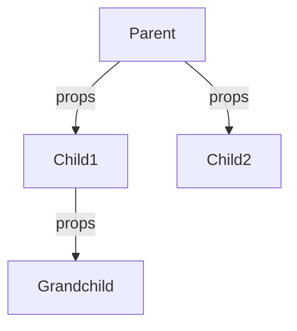
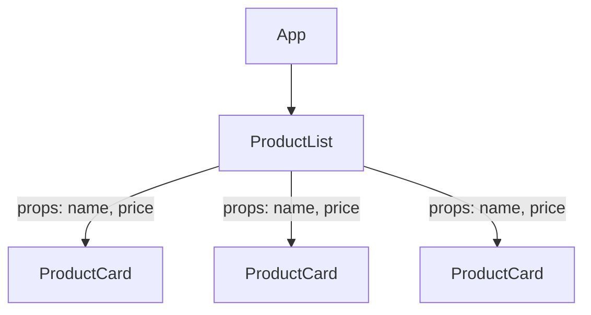
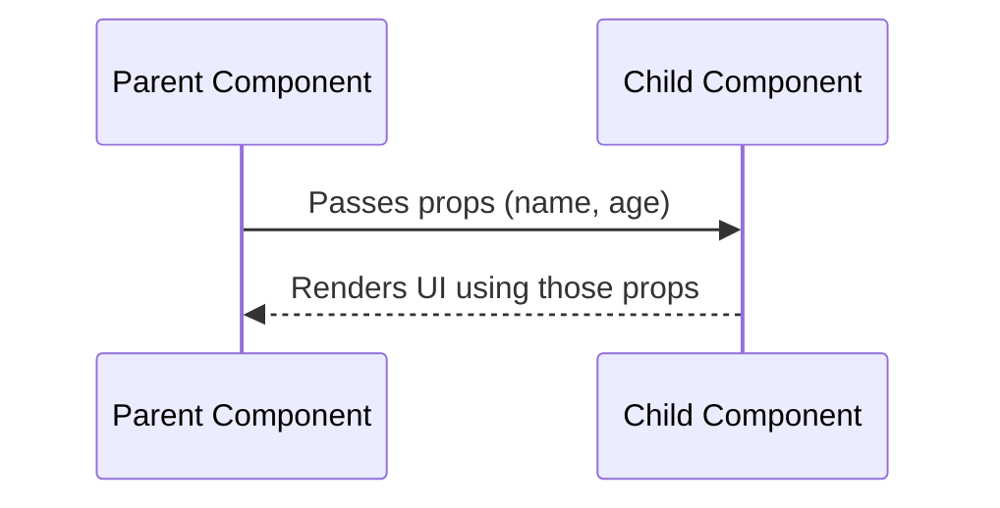

# 📅 Day 2: Components + Props + Reusable UI

Hello students 👋 Welcome back! Yesterday we set up our first React app and built one small component. Today we go deeper — we'll learn how to build **many small reusable pieces** and connect them together. This is the **core skill** of every React developer.

---

## 1. 🎯 Introduction — What We Learn Today?

- Functional components (the modern way)
- Props & how to type them with TypeScript
- Reusable UI components (like Cards, Buttons)
- Parent → child data flow
- Component composition (`children` prop)

### Why this matters in real projects?
In real apps like Amazon or Netflix, you don't write a separate code for every product card. You write **one** reusable card and render it 100 times with different data. That's what we learn today.

---

## 2. 📖 Concept Explanation

### What is a Component?
A component is a **function that returns JSX**. It represents a piece of UI.
Think of a component as a **custom HTML tag that you design**.

### Types of components
- **Functional components** (modern, hooks-based) ✅ we use these
- Class components (old style) ❌ not used now

### What are Props?
**Props = Properties**. They are **inputs** passed from parent to child. Props are **read-only**.

> Real-world analogy: Props are like **ingredients** you give to a chef (component). The chef prepares the dish (UI) based on those ingredients. But the chef cannot change the ingredients you gave.

### Parent → Child data flow
React uses **one-way data flow** (top → down). Parents pass data to children via props. Children cannot directly change parent data.



### Component composition
Just like you put a `<span>` inside a `<div>`, in React you can put components inside other components. The `children` prop lets any component accept nested JSX.

---

## 3. 💡 Visual Learning

### Reusable product card flow



### Props flow visualization



---

## 4. 💻 Code Examples

### Example 1 — Basic component with typed props

```tsx
// src/components/Greeting.tsx
type GreetingProps = {
  name: string;
  age: number;
};

function Greeting({ name, age }: GreetingProps) {
  return (
    <div>
      <h2>Hello, {name}</h2>
      <p>You are {age} years old.</p>
    </div>
  );
}

export default Greeting;
```

```tsx
// src/App.tsx
import Greeting from "./components/Greeting";

function App() {
  return (
    <>
      <Greeting name="Asif" age={25} />
      <Greeting name="Sara" age={22} />
    </>
  );
}
export default App;
```

### Example 2 — Optional props & default values

```tsx
type ButtonProps = {
  label: string;
  color?: string;      // optional
};

function Button({ label, color = "blue" }: ButtonProps) {
  return <button style={{ background: color, color: "white" }}>{label}</button>;
}
```

### Example 3 — Reusable `ProductCard`

```tsx
type Product = {
  id: number;
  title: string;
  price: number;
  image: string;
};

type ProductCardProps = {
  product: Product;
};

function ProductCard({ product }: ProductCardProps) {
  return (
    <div className="card">
      
      <h3>{product.title}</h3>
      <p>₹ {product.price}</p>
      <button>Add to Cart</button>
    </div>
  );
}

export default ProductCard;
```

### Example 4 — Component composition with `children`

```tsx
import { ReactNode } from "react";

type CardProps = { children: ReactNode };

function Card({ children }: CardProps) {
  return <div className="card-wrapper">{children}</div>;
}

// Usage
<Card>
  <h3>Any content here</h3>
  <p>Even more cards, buttons or text.</p>
</Card>
```

### Example 5 — Passing functions as props

```tsx
type BtnProps = { label: string; onClick: () => void };

function MyBtn({ label, onClick }: BtnProps) {
  return <button onClick={onClick}>{label}</button>;
}

// App
<MyBtn label="Click me" onClick={() => alert("Hi!")} />
```

**Mini question 🤔:** Can a child change the prop value directly? *(No! Props are read-only.)*

---

## 5. 🛠 Hands-on Practice

1. Create a `UserCard` component with props `name`, `email`, `role`.
2. Render three `UserCard`s with different data.
3. Create a `Button` component with optional `color` prop.
4. Build a `Layout` component using `children`.
5. Build a `ProductCard` and render 6 different products using an array + map.
6. Add an `onClick` handler passed as prop to a button.

---

## 6. ⚠️ Common Mistakes

- ❌ Forgetting to type props → TypeScript errors later.
- ❌ Mutating props inside child (e.g., `props.name = "abc"`).
- ❌ Using `any` for props — defeats the purpose of TypeScript.
- ❌ Not exporting the component.
- ❌ Using `onClick={myFunc()}` instead of `onClick={myFunc}` (calls it immediately).
- ❌ Forgetting to pass required props.

---

## 7. 📝 Mini Assignment — "Product Card Grid"

Build a product grid page:
- Create a `ProductCard` component (image, title, price, button).
- Create a `products` array with 6 items.
- Render them using `.map()` inside a `ProductList` component.
- Style with simple CSS grid (3 cards per row).
- Bonus: Add a `discount?` optional prop that shows a red badge.

---

## 8. 🔁 Recap

- Components are reusable UI pieces
- Props are inputs (read-only)
- Types help prevent bugs
- `children` enables composition
- Functions can be passed as props
- Data flows one-way: Parent → Child

### 🎤 Interview Questions (Day 2)
1. What are props in React?
2. Why are props read-only?
3. What is component composition?
4. What is the difference between props and state?
5. How do you type props in TypeScript?

Next class → **Day 3: State Basics (useState)** — the most important day of your React life ⚡
