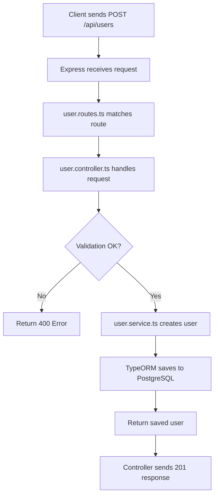
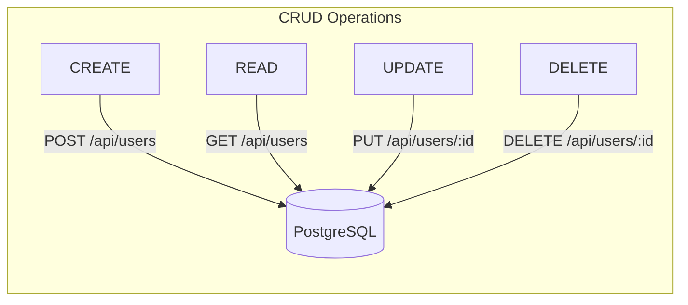
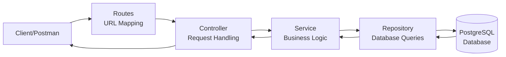

# Day 2: PostgreSQL + TypeORM Setup

Hello developers! Welcome to Day 2 of our SmartTask AI project!

Yesterday we set up our Express + TypeScript server. Today we're going to connect it to a **real database** - PostgreSQL using TypeORM.

---

## What We Will Build Today

- Connect to PostgreSQL database
- Create our first **User entity** (database table)
- Build basic **CRUD APIs** for users (Create, Read, Update, Delete)
- Understand how TypeORM works

---

## Why Is This Important?

> Think of a database like a **filing cabinet**. Right now our server can receive requests, but it has no memory - when it restarts, everything is gone. A database gives our server **permanent memory**.

We use **PostgreSQL** because:
- It's the most popular relational database
- It handles complex queries well
- It's perfect for structured data (users, tasks, roles)
- Used by companies like Instagram, Uber, and Netflix

We use **TypeORM** because:
- Write database queries using TypeScript (no raw SQL needed!)
- Auto-creates tables from our code
- Works perfectly with TypeScript decorators

---

## Concept Explanation

### What is an ORM?

ORM = Object-Relational Mapping

It's a **translator** between your code and the database.

```
WITHOUT ORM (Raw SQL):
"INSERT INTO users (name, email) VALUES ('John', 'john@email.com')"

WITH ORM (TypeORM):
const user = new User();
user.name = "John";
user.email = "john@email.com";
await userRepository.save(user);
```

### What is an Entity?

An Entity is a **TypeScript class** that represents a **database table**.

```
Entity (Code)          →    Table (Database)
─────────────                ─────────────
class User {                 users table
  id: number           →     id column
  name: string         →     name column
  email: string        →     email column
}
```

### What are Decorators?

Decorators are special keywords starting with `@` that add extra behavior to classes and properties.

```typescript
@Entity()              // This class = a database table
class User {
  @PrimaryGeneratedColumn()  // This column = auto-incrementing ID
  id: number;

  @Column()            // This property = a database column
  name: string;
}
```

**Quick Question:** If we have a `User` class with 5 properties, how many columns will the database table have?

**Answer:** 5 columns! Each `@Column()` decorated property becomes a column.

---

## Folder Structure (Updated)

```
SmartTaskAI/
├── src/
│   ├── config/
│   │   └── database.ts        ← NEW: Database connection config
│   ├── controllers/
│   │   └── user.controller.ts ← NEW: Handle user requests
│   ├── entities/
│   │   └── User.ts            ← NEW: User database entity
│   ├── routes/
│   │   └── user.routes.ts     ← NEW: User API routes
│   ├── services/
│   │   └── user.service.ts    ← NEW: User business logic
│   ├── middlewares/
│   ├── models/
│   ├── utils/
│   └── index.ts               ← UPDATED: Add database connection
├── .env
├── tsconfig.json
└── package.json
```

---

## Step-by-Step Coding

### Step 1: Setup PostgreSQL Database

First, make sure PostgreSQL is installed and running. Then create our database:

```bash
# Open PostgreSQL terminal (psql)
psql -U postgres

# Create database
CREATE DATABASE smarttask_db;

# Verify it was created
\l

# Exit
\q
```

### Step 2: Create Database Configuration

Create `src/config/database.ts`:

```typescript
import { DataSource } from "typeorm";
import dotenv from "dotenv";

// Load environment variables
dotenv.config();

// Create and configure the database connection
// Think of DataSource as the "bridge" between our app and PostgreSQL
const AppDataSource = new DataSource({
  type: "postgres",                              // Database type
  host: process.env.PG_HOST || "localhost",      // Where database is running
  port: parseInt(process.env.PG_PORT || "5432"), // PostgreSQL default port
  username: process.env.PG_USERNAME || "postgres",
  password: process.env.PG_PASSWORD || "password",
  database: process.env.PG_DATABASE || "smarttask_db",
  synchronize: true,  // Auto-create/update tables (ONLY for development!)
  logging: true,       // Show SQL queries in console (helpful for learning)
  entities: ["src/entities/**/*.ts"], // Where to find our entities
});

export default AppDataSource;
```

**Warning:** `synchronize: true` automatically creates/updates database tables when your entities change. This is great for development but **NEVER use it in production** - it can accidentally delete data!

### Step 3: Create the User Entity

Create `src/entities/User.ts`:

```typescript
import {
  Entity,
  PrimaryGeneratedColumn,
  Column,
  CreateDateColumn,
  UpdateDateColumn,
} from "typeorm";

// Define user roles as a simple enum
// enum is like a fixed menu - you can only pick from these options
export enum UserRole {
  ADMIN = "admin",
  USER = "user",
}

// @Entity() tells TypeORM: "Create a database table for this class"
// Table name will be "users" (lowercase + plural of class name)
@Entity("users")
export class User {
  // Auto-incrementing primary key (1, 2, 3, ...)
  @PrimaryGeneratedColumn()
  id!: number;

  // User's full name
  @Column({ type: "varchar", length: 100 })
  name!: string;

  // User's email - must be unique (no two users with same email)
  @Column({ type: "varchar", length: 150, unique: true })
  email!: string;

  // User's password (will be hashed later in Day 3)
  @Column({ type: "varchar", length: 255 })
  password!: string;

  // User role - either 'admin' or 'user'
  // Default is 'user' - most people who sign up are regular users
  @Column({
    type: "enum",
    enum: UserRole,
    default: UserRole.USER,
  })
  role!: UserRole;

  // Automatically set when user is created
  @CreateDateColumn()
  createdAt!: Date;

  // Automatically updated when user record changes
  @UpdateDateColumn()
  updatedAt!: Date;
}
```

**Let's break down each decorator:**

| Decorator | What It Does |
|-----------|-------------|
| `@Entity("users")` | Creates a table called "users" |
| `@PrimaryGeneratedColumn()` | Auto-incrementing ID column |
| `@Column()` | Regular database column |
| `@CreateDateColumn()` | Auto-fills with current date on creation |
| `@UpdateDateColumn()` | Auto-updates with current date on every update |

### Step 4: Create User Service

Create `src/services/user.service.ts`:

```typescript
import AppDataSource from "../config/database";
import { User } from "../entities/User";

// Get the User repository from TypeORM
// Repository = a helper that provides methods to interact with a specific table
const userRepository = AppDataSource.getRepository(User);

// Service = where business logic lives
// Think of it as the "brain" that knows HOW to do things

export class UserService {
  // CREATE: Add a new user
  async createUser(data: {
    name: string;
    email: string;
    password: string;
  }): Promise<User> {
    // Create a new user instance
    const user = userRepository.create(data);

    // Save to database and return the saved user
    return await userRepository.save(user);
  }

  // READ: Get all users
  async getAllUsers(): Promise<User[]> {
    return await userRepository.find();
  }

  // READ: Get one user by ID
  async getUserById(id: number): Promise<User | null> {
    return await userRepository.findOneBy({ id });
  }

  // READ: Get one user by email
  async getUserByEmail(email: string): Promise<User | null> {
    return await userRepository.findOneBy({ email });
  }

  // UPDATE: Update user information
  async updateUser(
    id: number,
    data: Partial<User>
  ): Promise<User | null> {
    // First, find the user
    const user = await userRepository.findOneBy({ id });

    // If user doesn't exist, return null
    if (!user) {
      return null;
    }

    // Merge new data with existing user
    // Object.assign copies properties from 'data' into 'user'
    Object.assign(user, data);

    // Save updated user
    return await userRepository.save(user);
  }

  // DELETE: Remove a user
  async deleteUser(id: number): Promise<boolean> {
    const result = await userRepository.delete(id);

    // result.affected tells us how many rows were deleted
    // If 0, the user didn't exist
    return result.affected !== 0;
  }
}
```

### Step 5: Create User Controller

Create `src/controllers/user.controller.ts`:

```typescript
import { Request, Response } from "express";
import { UserService } from "../services/user.service";

// Controller = handles HTTP requests and sends responses
// Think of it as a "receptionist" - receives requests, delegates work, sends back answers

const userService = new UserService();

export class UserController {
  // POST /api/users - Create a new user
  async create(req: Request, res: Response): Promise<void> {
    try {
      const { name, email, password } = req.body;

      // Basic validation
      if (!name || !email || !password) {
        res.status(400).json({
          success: false,
          message: "Name, email, and password are required",
        });
        return;
      }

      // Check if email already exists
      const existingUser = await userService.getUserByEmail(email);
      if (existingUser) {
        res.status(409).json({
          success: false,
          message: "Email already exists",
        });
        return;
      }

      // Create user
      const user = await userService.createUser({ name, email, password });

      // Don't send password back in response!
      const { password: _, ...userWithoutPassword } = user;

      res.status(201).json({
        success: true,
        message: "User created successfully",
        data: userWithoutPassword,
      });
    } catch (error) {
      res.status(500).json({
        success: false,
        message: "Internal server error",
      });
    }
  }

  // GET /api/users - Get all users
  async getAll(req: Request, res: Response): Promise<void> {
    try {
      const users = await userService.getAllUsers();

      // Remove passwords from all users
      const usersWithoutPasswords = users.map((user) => {
        const { password, ...userWithoutPassword } = user;
        return userWithoutPassword;
      });

      res.json({
        success: true,
        data: usersWithoutPasswords,
        count: users.length,
      });
    } catch (error) {
      res.status(500).json({
        success: false,
        message: "Internal server error",
      });
    }
  }

  // GET /api/users/:id - Get user by ID
  async getById(req: Request, res: Response): Promise<void> {
    try {
      const id = parseInt(req.params.id);

      // Validate ID is a number
      if (isNaN(id)) {
        res.status(400).json({
          success: false,
          message: "Invalid user ID",
        });
        return;
      }

      const user = await userService.getUserById(id);

      if (!user) {
        res.status(404).json({
          success: false,
          message: "User not found",
        });
        return;
      }

      // Remove password from response
      const { password, ...userWithoutPassword } = user;

      res.json({
        success: true,
        data: userWithoutPassword,
      });
    } catch (error) {
      res.status(500).json({
        success: false,
        message: "Internal server error",
      });
    }
  }

  // PUT /api/users/:id - Update user
  async update(req: Request, res: Response): Promise<void> {
    try {
      const id = parseInt(req.params.id);

      if (isNaN(id)) {
        res.status(400).json({
          success: false,
          message: "Invalid user ID",
        });
        return;
      }

      // Don't allow role changes through this endpoint (security!)
      const { role, password, ...updateData } = req.body;

      const updatedUser = await userService.updateUser(id, updateData);

      if (!updatedUser) {
        res.status(404).json({
          success: false,
          message: "User not found",
        });
        return;
      }

      // Remove password from response
      const { password: _, ...userWithoutPassword } = updatedUser;

      res.json({
        success: true,
        message: "User updated successfully",
        data: userWithoutPassword,
      });
    } catch (error) {
      res.status(500).json({
        success: false,
        message: "Internal server error",
      });
    }
  }

  // DELETE /api/users/:id - Delete user
  async delete(req: Request, res: Response): Promise<void> {
    try {
      const id = parseInt(req.params.id);

      if (isNaN(id)) {
        res.status(400).json({
          success: false,
          message: "Invalid user ID",
        });
        return;
      }

      const deleted = await userService.deleteUser(id);

      if (!deleted) {
        res.status(404).json({
          success: false,
          message: "User not found",
        });
        return;
      }

      res.json({
        success: true,
        message: "User deleted successfully",
      });
    } catch (error) {
      res.status(500).json({
        success: false,
        message: "Internal server error",
      });
    }
  }
}
```

### Step 6: Create User Routes

Create `src/routes/user.routes.ts`:

```typescript
import { Router } from "express";
import { UserController } from "../controllers/user.controller";

// Router groups related routes together
// Think of it like a department in a company - all user-related routes go here
const router = Router();
const userController = new UserController();

// Define routes
// Each route maps an HTTP method + URL path to a controller method

router.post("/", (req, res) => userController.create(req, res));        // Create user
router.get("/", (req, res) => userController.getAll(req, res));         // Get all users
router.get("/:id", (req, res) => userController.getById(req, res));    // Get user by ID
router.put("/:id", (req, res) => userController.update(req, res));     // Update user
router.delete("/:id", (req, res) => userController.delete(req, res));  // Delete user

export default router;
```

### Step 7: Update index.ts

Update `src/index.ts` to connect to the database and use routes:

```typescript
import "reflect-metadata"; // Required by TypeORM - MUST be first import!
import express, { Request, Response } from "express";
import cors from "cors";
import dotenv from "dotenv";
import AppDataSource from "./config/database";
import userRoutes from "./routes/user.routes";

// Load environment variables
dotenv.config();

// Create Express application
const app = express();

// Middleware
app.use(express.json());
app.use(cors());

// Get port from environment
const PORT = process.env.PORT || 3000;

// Health check route
app.get("/", (req: Request, res: Response) => {
  res.json({
    success: true,
    message: "SmartTask AI API is running!",
    timestamp: new Date().toISOString(),
  });
});

app.get("/api/health", (req: Request, res: Response) => {
  res.json({
    success: true,
    message: "Server is healthy!",
    environment: process.env.NODE_ENV,
    uptime: process.uptime(),
  });
});

// API Routes
// All routes starting with /api/users will be handled by userRoutes
app.use("/api/users", userRoutes);

// Initialize database connection, then start server
AppDataSource.initialize()
  .then(() => {
    console.log("Database connected successfully!");

    app.listen(PORT, () => {
      console.log(`==========================================`);
      console.log(`  SmartTask AI Server`);
      console.log(`  Environment: ${process.env.NODE_ENV}`);
      console.log(`  Running on: http://localhost:${PORT}`);
      console.log(`  Database: Connected`);
      console.log(`==========================================`);
    });
  })
  .catch((error) => {
    console.error("Database connection failed:", error);
    process.exit(1); // Exit if database connection fails
  });

export default app;
```

**Important:** `import "reflect-metadata"` MUST be the very first import. TypeORM decorators won't work without it!

---

## Flow Diagram

### How a Create User Request Flows



### CRUD Operations Overview



### Request → Response Architecture



---

## Test API (Postman Examples)

### Test 1: Create a User

```
Method: POST
URL: http://localhost:3000/api/users
Headers: Content-Type: application/json

Body (JSON):
{
  "name": "John Doe",
  "email": "john@example.com",
  "password": "password123"
}
```

**Expected Response (201):**
```json
{
  "success": true,
  "message": "User created successfully",
  "data": {
    "id": 1,
    "name": "John Doe",
    "email": "john@example.com",
    "role": "user",
    "createdAt": "2026-04-14T10:00:00.000Z",
    "updatedAt": "2026-04-14T10:00:00.000Z"
  }
}
```

### Test 2: Get All Users

```
Method: GET
URL: http://localhost:3000/api/users
```

**Expected Response (200):**
```json
{
  "success": true,
  "data": [
    {
      "id": 1,
      "name": "John Doe",
      "email": "john@example.com",
      "role": "user",
      "createdAt": "2026-04-14T10:00:00.000Z",
      "updatedAt": "2026-04-14T10:00:00.000Z"
    }
  ],
  "count": 1
}
```

### Test 3: Get User by ID

```
Method: GET
URL: http://localhost:3000/api/users/1
```

### Test 4: Update User

```
Method: PUT
URL: http://localhost:3000/api/users/1
Headers: Content-Type: application/json

Body (JSON):
{
  "name": "John Updated"
}
```

### Test 5: Delete User

```
Method: DELETE
URL: http://localhost:3000/api/users/1
```

### Test 6: Try Duplicate Email

```
Method: POST
URL: http://localhost:3000/api/users
Body (JSON):
{
  "name": "Jane Doe",
  "email": "john@example.com",
  "password": "password456"
}
```

**Expected Response (409):**
```json
{
  "success": false,
  "message": "Email already exists"
}
```

### cURL Examples

```bash
# Create user
curl -X POST http://localhost:3000/api/users \
  -H "Content-Type: application/json" \
  -d '{"name":"John Doe","email":"john@example.com","password":"password123"}'

# Get all users
curl http://localhost:3000/api/users

# Get user by ID
curl http://localhost:3000/api/users/1

# Update user
curl -X PUT http://localhost:3000/api/users/1 \
  -H "Content-Type: application/json" \
  -d '{"name":"John Updated"}'

# Delete user
curl -X DELETE http://localhost:3000/api/users/1
```

---

## Common Mistakes

### 1. Forgetting reflect-metadata import
```typescript
// WRONG - TypeORM decorators won't work
import express from "express";
import AppDataSource from "./config/database";

// RIGHT - reflect-metadata MUST be the first import
import "reflect-metadata";
import express from "express";
import AppDataSource from "./config/database";
```

### 2. Using synchronize: true in production
```typescript
// WRONG - Can delete production data!
const AppDataSource = new DataSource({
  synchronize: true, // DANGEROUS in production!
});

// RIGHT - Use migrations in production
const AppDataSource = new DataSource({
  synchronize: process.env.NODE_ENV === "development",
});
```

### 3. Sending passwords in API responses
```typescript
// WRONG - Security risk!
res.json({ success: true, data: user });

// RIGHT - Remove password before sending
const { password, ...userWithoutPassword } = user;
res.json({ success: true, data: userWithoutPassword });
```

### 4. Not validating input data
```typescript
// WRONG - What if name or email is missing?
const user = await userService.createUser(req.body);

// RIGHT - Validate first
if (!name || !email || !password) {
  res.status(400).json({ message: "All fields required" });
  return;
}
```

### 5. Database not running
```
Error: connect ECONNREFUSED 127.0.0.1:5432

Solution: Make sure PostgreSQL service is running!
- Windows: Search "Services" → Find "postgresql" → Start
- Mac: brew services start postgresql
- Linux: sudo systemctl start postgresql
```

---

## Recap

Today we accomplished:

- [x] Connected to PostgreSQL using TypeORM
- [x] Created our first Entity (User table)
- [x] Built a complete CRUD API for users
- [x] Followed the Controller → Service → Repository pattern
- [x] Tested all endpoints with Postman

### Key Concepts Learned:
| Concept | Analogy |
|---------|---------|
| Entity | Blueprint for a database table |
| Repository | Helper that talks to the database |
| Service | Business logic brain |
| Controller | Receptionist handling requests |
| Routes | Address/URL mapping |

### What's Coming Tomorrow?

**Day 3: Authentication (JWT)** - We'll add password hashing (bcrypt) and JWT tokens so users can securely register and login. No more storing plain-text passwords!

---

### Quick Quiz

1. What does `@Entity()` decorator do?
2. Why do we remove passwords from API responses?
3. What is the difference between `findOneBy` and `find` in TypeORM?
4. Why is `synchronize: true` dangerous in production?
5. What HTTP status code means "Created successfully"?

**Answers:**
1. Tells TypeORM to create a database table for that class
2. Security - passwords should never be sent to the client
3. `findOneBy` returns a single record, `find` returns an array of all matching records
4. It can automatically modify/delete database tables and data
5. 201 (Created)

---

> **Great job completing Day 2!** You now have a working database with CRUD operations. Tomorrow we add security!
