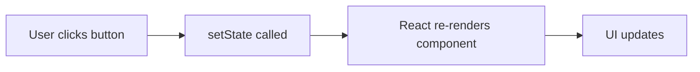
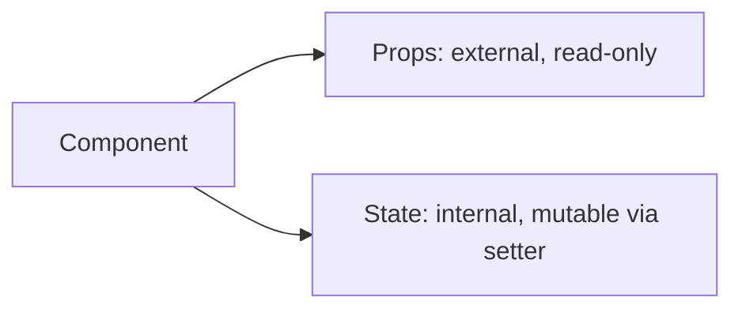

# 📅 Day 3: State Basics (useState) — The Most Important Day

Hello students 👋 Welcome to **Day 3**! Today is arguably the **most important day** of this entire course. Without state, React is just static HTML. With state, React becomes **interactive, dynamic, and alive**. Let's dive in.

---

## 1. 🎯 Introduction — What We Learn Today?

- What is state?
- `useState` hook
- State with primitives (numbers, strings, booleans)
- State with objects
- State with arrays
- Controlled inputs

### Why this matters in real projects?
Every interactive feature — typing in a textbox, clicking a button, counting likes, adding items to cart — uses state. You literally cannot build a React app without `useState`.

---

## 2. 📖 Concept Explanation

### What is state?
**State = data that changes over time inside a component.**

> Real-world analogy: State is like the **score in a cricket match**. It changes ball by ball. The scoreboard (UI) auto-updates whenever the score (state) changes.

### Why not use normal variables?
Normal variables don't re-render the UI when they change. React only re-renders when **state** or **props** change.

```tsx
let count = 0; // ❌ changing this won't update UI
const [count, setCount] = useState(0); // ✅ updates UI
```

### The `useState` Hook
```tsx
const [value, setValue] = useState(initialValue);
```
- `value` → current state
- `setValue` → function to update state
- `initialValue` → starting value

### Rules of hooks
1. Only call hooks at the **top level** of a component.
2. Only call hooks in **React function components** (not in loops, conditions, or regular functions).

---

## 3. 💡 Visual Learning

### How state triggers re-render



### State vs Props



---

## 4. 💻 Code Examples

### Example 1 — Counter (primitive state)

```tsx
import { useState } from "react";

function Counter() {
  const [count, setCount] = useState<number>(0);

  return (
    <div>
      <h2>Count: {count}</h2>
      <button onClick={() => setCount(count + 1)}>+1</button>
      <button onClick={() => setCount(count - 1)}>-1</button>
      <button onClick={() => setCount(0)}>Reset</button>
    </div>
  );
}
export default Counter;
```

### Example 2 — String state (typing name)

```tsx
function NameBox() {
  const [name, setName] = useState("");
  return (
    <>
      <input value={name} onChange={(e) => setName(e.target.value)} />
      <p>Hello {name || "stranger"}!</p>
    </>
  );
}
```

### Example 3 — Boolean state (toggle)

```tsx
function Toggle() {
  const [on, setOn] = useState(false);
  return (
    <button onClick={() => setOn(!on)}>
      {on ? "ON" : "OFF"}
    </button>
  );
}
```

### Example 4 — Object state (profile)

```tsx
type Profile = { name: string; age: number };

function ProfileEditor() {
  const [profile, setProfile] = useState<Profile>({ name: "", age: 0 });

  return (
    <div>
      <input
        placeholder="Name"
        value={profile.name}
        onChange={(e) => setProfile({ ...profile, name: e.target.value })}
      />
      <input
        type="number"
        value={profile.age}
        onChange={(e) => setProfile({ ...profile, age: Number(e.target.value) })}
      />
      <p>{profile.name} — {profile.age}</p>
    </div>
  );
}
```
> ⚠ Always use `...profile` spread to keep other fields. Never mutate directly.

### Example 5 — Array state (todo list)

```tsx
function Todo() {
  const [task, setTask] = useState("");
  const [list, setList] = useState<string[]>([]);

  const addTask = () => {
    if (!task.trim()) return;
    setList([...list, task]);
    setTask("");
  };

  return (
    <div>
      <input value={task} onChange={(e) => setTask(e.target.value)} />
      <button onClick={addTask}>Add</button>
      <ul>
        {list.map((t, i) => <li key={i}>{t}</li>)}
      </ul>
    </div>
  );
}
```

### Example 6 — Functional updates (when next state depends on previous)

```tsx
// ✅ safe — always uses latest value
setCount((prev) => prev + 1);
```

**Mini question 🤔:** Why do we use `...profile` while updating an object?
*(Because React wants a NEW object reference. We must not mutate the existing one.)*

---

## 5. 🛠 Hands-on Practice

1. Build a counter with +, -, reset buttons.
2. Build a "like" button that increments likes.
3. Build a dark/light mode toggle.
4. Build a simple todo list (add + show).
5. Build a login form with email & password object state.
6. Build a character counter for a textarea (max 200 chars).

---

## 6. ⚠️ Common Mistakes

- ❌ Directly mutating state: `profile.name = "x"` ❌
- ❌ Forgetting spread operator with objects/arrays.
- ❌ Using `setCount(count + 1)` in fast updates (use functional form).
- ❌ Calling hooks inside `if` / loops.
- ❌ Forgetting to type `useState<number>()` for complex types.
- ❌ Using index as `key` in dynamic lists that can reorder (OK for static).

---

## 7. 📝 Mini Assignment — "Counter + Todo Input"

Build a page with:
- A **Counter** component (increment, decrement, reset)
- A **TodoInput** component
  - Input box
  - Add button
  - List of todos
  - Delete button per item
  - Count of total todos

Must use TypeScript. Handle empty inputs. Style cleanly.

---

## 8. 🔁 Recap

- State = internal data that changes
- `useState` returns [value, setter]
- Never mutate state directly
- Use spread `...` for objects/arrays
- Use functional updates when next state depends on previous
- Every state update triggers a re-render

### 🎤 Interview Questions (Day 3)
1. What is the difference between state and props?
2. Why can't we mutate state directly?
3. What is a controlled input?
4. When should we use the functional form of `setState`?
5. Is `useState` synchronous or asynchronous?

Tomorrow → **Day 4: Events & Forms** 📋 — we'll make forms interactive!
