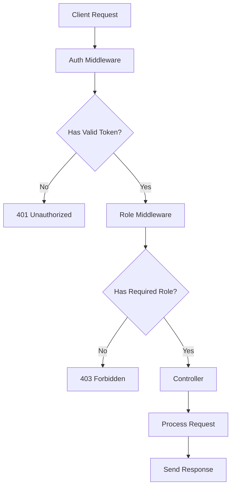
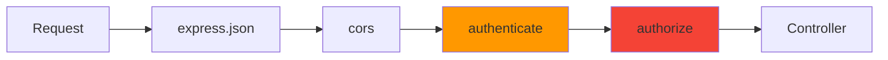
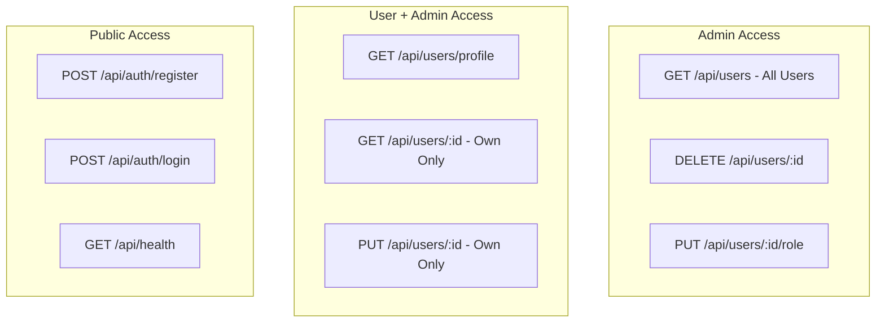
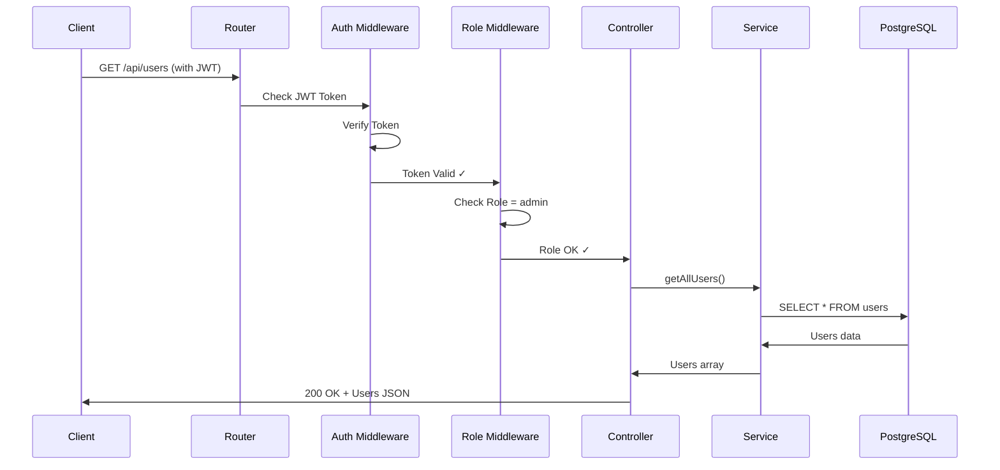

# Day 4: Role-Based Access Control

Hello developers! Welcome to Day 4 of our SmartTask AI project!

Yesterday we added authentication - users can now register and login. But there's still a problem: **every logged-in user can do everything**. A regular user can delete other users! Today we fix that with **Role-Based Access Control (RBAC)**.

---

## What We Will Build Today

- **Admin vs User** role system
- **Authorization middleware** (who can do what)
- **Protect routes** based on roles
- **Admin-only endpoints**

---

## Why Is This Important?

> Think of a company. An intern and the CEO both have access to the building (authentication). But the intern can't fire employees or access financial records (authorization). **Authentication = who are you? Authorization = what can you do?**

Real-world examples:
- **YouTube**: Regular users watch videos, Admins manage content
- **GitHub**: Contributors can push code, Owners can delete repos
- **School**: Students view grades, Teachers create grades, Principal manages everything

---

## Concept Explanation

### Authentication vs Authorization

| | Authentication | Authorization |
|---|---|---|
| Question | Who are you? | What can you do? |
| How | Login (email + password) | Role check (admin/user) |
| When | First step | After authentication |
| Example | Show your ID card | Check if you have VIP access |

### How RBAC Works

```
User registers → Gets role "user" (default)
Admin is created → Gets role "admin"

When accessing a route:
1. Auth middleware checks: "Are you logged in?" (JWT)
2. Role middleware checks: "Do you have permission?" (Role)
3. If both pass → Access granted
4. If either fails → Access denied
```

### Our Role Matrix

| Action | User | Admin |
|--------|------|-------|
| View own profile | Yes | Yes |
| Update own profile | Yes | Yes |
| View all users | No | Yes |
| Delete any user | No | Yes |
| Create tasks | Yes | Yes |
| View own tasks | Yes | Yes |
| View all tasks | No | Yes |
| Delete any task | No | Yes |

---

## Folder Structure (Updated)

```
SmartTaskAI/
├── src/
│   ├── config/
│   │   └── database.ts
│   ├── controllers/
│   │   ├── auth.controller.ts
│   │   └── user.controller.ts   ← UPDATED
│   ├── entities/
│   │   └── User.ts
│   ├── middlewares/
│   │   ├── auth.middleware.ts
│   │   └── role.middleware.ts    ← NEW
│   ├── routes/
│   │   ├── auth.routes.ts
│   │   └── user.routes.ts       ← UPDATED
│   ├── services/
│   │   ├── auth.service.ts
│   │   └── user.service.ts
│   ├── utils/
│   │   └── jwt.utils.ts
│   ├── models/
│   └── index.ts
├── .env
├── tsconfig.json
└── package.json
```

---

## Step-by-Step Coding

### Step 1: Create Role Middleware

Create `src/middlewares/role.middleware.ts`:

```typescript
import { Request, Response, NextFunction } from "express";

// This middleware checks if the logged-in user has the required role
// Think of it as a "VIP bouncer" - even if you have a ticket (JWT),
// you need the right VIP level (role) to enter

// Factory function - creates a middleware for specific roles
// Usage: authorize("admin") or authorize("admin", "user")
export const authorize = (...allowedRoles: string[]) => {
  return (req: Request, res: Response, next: NextFunction): void => {
    // Step 1: Check if user data exists (set by auth middleware)
    if (!req.user) {
      res.status(401).json({
        success: false,
        message: "Authentication required",
      });
      return;
    }

    // Step 2: Check if user's role is in the allowed list
    if (!allowedRoles.includes(req.user.role)) {
      res.status(403).json({
        success: false,
        message: "Access denied. Insufficient permissions.",
      });
      return;
    }

    // Step 3: User has the right role - continue!
    next();
  };
};
```

**Key Difference:**
- `401 Unauthorized` = "I don't know who you are" (not logged in)
- `403 Forbidden` = "I know who you are, but you can't do this" (wrong role)

### Step 2: Update User Controller

Update `src/controllers/user.controller.ts` to add role-specific behavior:

```typescript
import { Request, Response } from "express";
import { UserService } from "../services/user.service";

const userService = new UserService();

export class UserController {
  // GET /api/users - Admin only: Get all users
  async getAll(req: Request, res: Response): Promise<void> {
    try {
      const users = await userService.getAllUsers();

      const usersWithoutPasswords = users.map((user) => {
        const { password, ...userWithoutPassword } = user;
        return userWithoutPassword;
      });

      res.json({
        success: true,
        data: usersWithoutPasswords,
        count: users.length,
      });
    } catch (error) {
      res.status(500).json({
        success: false,
        message: "Internal server error",
      });
    }
  }

  // GET /api/users/profile - Any logged-in user: Get own profile
  async getProfile(req: Request, res: Response): Promise<void> {
    try {
      // req.user is set by auth middleware - contains the logged-in user's info
      const userId = req.user!.userId;
      const user = await userService.getUserById(userId);

      if (!user) {
        res.status(404).json({
          success: false,
          message: "User not found",
        });
        return;
      }

      const { password, ...userWithoutPassword } = user;

      res.json({
        success: true,
        data: userWithoutPassword,
      });
    } catch (error) {
      res.status(500).json({
        success: false,
        message: "Internal server error",
      });
    }
  }

  // GET /api/users/:id - Admin: get any user, User: only own profile
  async getById(req: Request, res: Response): Promise<void> {
    try {
      const id = parseInt(req.params.id);

      if (isNaN(id)) {
        res.status(400).json({
          success: false,
          message: "Invalid user ID",
        });
        return;
      }

      // Regular users can only view their own profile
      if (req.user!.role !== "admin" && req.user!.userId !== id) {
        res.status(403).json({
          success: false,
          message: "You can only view your own profile",
        });
        return;
      }

      const user = await userService.getUserById(id);

      if (!user) {
        res.status(404).json({
          success: false,
          message: "User not found",
        });
        return;
      }

      const { password, ...userWithoutPassword } = user;

      res.json({
        success: true,
        data: userWithoutPassword,
      });
    } catch (error) {
      res.status(500).json({
        success: false,
        message: "Internal server error",
      });
    }
  }

  // PUT /api/users/:id - Users can update own profile, Admin can update any
  async update(req: Request, res: Response): Promise<void> {
    try {
      const id = parseInt(req.params.id);

      if (isNaN(id)) {
        res.status(400).json({
          success: false,
          message: "Invalid user ID",
        });
        return;
      }

      // Regular users can only update their own profile
      if (req.user!.role !== "admin" && req.user!.userId !== id) {
        res.status(403).json({
          success: false,
          message: "You can only update your own profile",
        });
        return;
      }

      // Only admins can change roles
      const { role, password, ...updateData } = req.body;
      const dataToUpdate =
        req.user!.role === "admin" && role
          ? { ...updateData, role }
          : updateData;

      const updatedUser = await userService.updateUser(id, dataToUpdate);

      if (!updatedUser) {
        res.status(404).json({
          success: false,
          message: "User not found",
        });
        return;
      }

      const { password: _, ...userWithoutPassword } = updatedUser;

      res.json({
        success: true,
        message: "User updated successfully",
        data: userWithoutPassword,
      });
    } catch (error) {
      res.status(500).json({
        success: false,
        message: "Internal server error",
      });
    }
  }

  // DELETE /api/users/:id - Admin only
  async delete(req: Request, res: Response): Promise<void> {
    try {
      const id = parseInt(req.params.id);

      if (isNaN(id)) {
        res.status(400).json({
          success: false,
          message: "Invalid user ID",
        });
        return;
      }

      // Prevent admin from deleting themselves
      if (req.user!.userId === id) {
        res.status(400).json({
          success: false,
          message: "You cannot delete your own account",
        });
        return;
      }

      const deleted = await userService.deleteUser(id);

      if (!deleted) {
        res.status(404).json({
          success: false,
          message: "User not found",
        });
        return;
      }

      res.json({
        success: true,
        message: "User deleted successfully",
      });
    } catch (error) {
      res.status(500).json({
        success: false,
        message: "Internal server error",
      });
    }
  }

  // PUT /api/users/:id/role - Admin only: Change user role
  async changeRole(req: Request, res: Response): Promise<void> {
    try {
      const id = parseInt(req.params.id);
      const { role } = req.body;

      if (isNaN(id)) {
        res.status(400).json({
          success: false,
          message: "Invalid user ID",
        });
        return;
      }

      if (!role || !["admin", "user"].includes(role)) {
        res.status(400).json({
          success: false,
          message: "Role must be 'admin' or 'user'",
        });
        return;
      }

      // Prevent admin from changing their own role
      if (req.user!.userId === id) {
        res.status(400).json({
          success: false,
          message: "You cannot change your own role",
        });
        return;
      }

      const updatedUser = await userService.updateUser(id, { role });

      if (!updatedUser) {
        res.status(404).json({
          success: false,
          message: "User not found",
        });
        return;
      }

      const { password, ...userWithoutPassword } = updatedUser;

      res.json({
        success: true,
        message: `User role changed to ${role}`,
        data: userWithoutPassword,
      });
    } catch (error) {
      res.status(500).json({
        success: false,
        message: "Internal server error",
      });
    }
  }
}
```

### Step 3: Update User Routes with Role Protection

Update `src/routes/user.routes.ts`:

```typescript
import { Router } from "express";
import { UserController } from "../controllers/user.controller";
import { authenticate } from "../middlewares/auth.middleware";
import { authorize } from "../middlewares/role.middleware";

const router = Router();
const userController = new UserController();

// All routes require authentication first
// Then we add role-based authorization where needed

// GET /api/users/profile - Any authenticated user can view their own profile
router.get(
  "/profile",
  authenticate,
  (req, res) => userController.getProfile(req, res)
);

// GET /api/users - Admin only: Get all users
router.get(
  "/",
  authenticate,
  authorize("admin"),
  (req, res) => userController.getAll(req, res)
);

// GET /api/users/:id - Authenticated users (controller checks ownership)
router.get(
  "/:id",
  authenticate,
  (req, res) => userController.getById(req, res)
);

// PUT /api/users/:id - Authenticated users (controller checks ownership)
router.put(
  "/:id",
  authenticate,
  (req, res) => userController.update(req, res)
);

// DELETE /api/users/:id - Admin only
router.delete(
  "/:id",
  authenticate,
  authorize("admin"),
  (req, res) => userController.delete(req, res)
);

// PUT /api/users/:id/role - Admin only: Change user role
router.put(
  "/:id/role",
  authenticate,
  authorize("admin"),
  (req, res) => userController.changeRole(req, res)
);

export default router;
```

**Notice the pattern:**
- `authenticate` → checks JWT token (are you logged in?)
- `authorize("admin")` → checks role (are you an admin?)
- Both run BEFORE the controller function

### Step 4: Create an Admin Seed Script

We need at least one admin to start with. Create `src/utils/seed.ts`:

```typescript
import "reflect-metadata";
import bcrypt from "bcryptjs";
import AppDataSource from "../config/database";
import { User, UserRole } from "../entities/User";
import dotenv from "dotenv";

dotenv.config();

// This script creates the first admin user
// Run it once to set up your admin account
async function seed() {
  try {
    // Initialize database connection
    await AppDataSource.initialize();
    console.log("Database connected!");

    const userRepository = AppDataSource.getRepository(User);

    // Check if admin already exists
    const existingAdmin = await userRepository.findOneBy({
      email: "admin@smarttask.com",
    });

    if (existingAdmin) {
      console.log("Admin user already exists!");
      await AppDataSource.destroy();
      return;
    }

    // Create admin user
    const hashedPassword = await bcrypt.hash("admin123", 10);

    const admin = userRepository.create({
      name: "Admin User",
      email: "admin@smarttask.com",
      password: hashedPassword,
      role: UserRole.ADMIN,
    });

    await userRepository.save(admin);
    console.log("Admin user created successfully!");
    console.log("Email: admin@smarttask.com");
    console.log("Password: admin123");

    await AppDataSource.destroy();
  } catch (error) {
    console.error("Seed failed:", error);
    process.exit(1);
  }
}

seed();
```

Add the seed script to `package.json`:

```json
{
  "scripts": {
    "dev": "ts-node-dev --respawn --transpile-only src/index.ts",
    "build": "tsc",
    "start": "node dist/index.js",
    "seed": "ts-node src/utils/seed.ts"
  }
}
```

Run it:
```bash
npm run seed
```

---

## Flow Diagram

### Authorization Flow



### Middleware Chain



### Role-Based Access Map



### Complete Request Lifecycle



---

## Test API (Postman Examples)

### Setup: Login as Admin First

```
Method: POST
URL: http://localhost:3000/api/auth/login
Body:
{
  "email": "admin@smarttask.com",
  "password": "admin123"
}
```

Save the token from the response!

### Setup: Register a Regular User

```
Method: POST
URL: http://localhost:3000/api/auth/register
Body:
{
  "name": "Regular User",
  "email": "user@example.com",
  "password": "password123"
}
```

Save this token too!

### Test 1: Admin Gets All Users

```
Method: GET
URL: http://localhost:3000/api/users
Headers:
  Authorization: Bearer <ADMIN_TOKEN>
```

**Expected: 200 OK** - List of all users

### Test 2: Regular User Tries to Get All Users

```
Method: GET
URL: http://localhost:3000/api/users
Headers:
  Authorization: Bearer <USER_TOKEN>
```

**Expected: 403 Forbidden**
```json
{
  "success": false,
  "message": "Access denied. Insufficient permissions."
}
```

### Test 3: User Views Own Profile

```
Method: GET
URL: http://localhost:3000/api/users/profile
Headers:
  Authorization: Bearer <USER_TOKEN>
```

**Expected: 200 OK** - Own profile data

### Test 4: Admin Deletes a User

```
Method: DELETE
URL: http://localhost:3000/api/users/2
Headers:
  Authorization: Bearer <ADMIN_TOKEN>
```

**Expected: 200 OK** - User deleted

### Test 5: Regular User Tries to Delete

```
Method: DELETE
URL: http://localhost:3000/api/users/1
Headers:
  Authorization: Bearer <USER_TOKEN>
```

**Expected: 403 Forbidden**

### Test 6: Admin Changes User Role

```
Method: PUT
URL: http://localhost:3000/api/users/2/role
Headers:
  Authorization: Bearer <ADMIN_TOKEN>
  Content-Type: application/json
Body:
{
  "role": "admin"
}
```

**Expected: 200 OK** - Role changed

### Test 7: User Tries to View Another User's Profile

```
Method: GET
URL: http://localhost:3000/api/users/1
Headers:
  Authorization: Bearer <USER_TOKEN>
```

**Expected: 403 Forbidden** (user 2 can't view user 1's profile)

---

## Common Mistakes

### 1. Confusing 401 and 403
```typescript
// WRONG
res.status(401).json({ message: "Not authorized" });
// 401 means "not logged in", not "not authorized"

// RIGHT
res.status(401) // Not authenticated (no/invalid token)
res.status(403) // Not authorized (wrong role)
```

### 2. Putting role check BEFORE auth check
```typescript
// WRONG - role middleware can't work without user data
router.get("/", authorize("admin"), authenticate, handler);

// RIGHT - authenticate first, then authorize
router.get("/", authenticate, authorize("admin"), handler);
```

### 3. Hardcoding roles in controllers
```typescript
// WRONG - What if we add "moderator" role later?
if (req.user.role === "admin" || req.user.role === "moderator") { ... }

// RIGHT - Use the authorize middleware
router.get("/", authenticate, authorize("admin", "moderator"), handler);
```

### 4. Allowing users to change their own role
```typescript
// WRONG - User can promote themselves to admin!
const updatedUser = await userService.updateUser(id, req.body);

// RIGHT - Strip role from regular user updates
if (req.user.role !== "admin") {
  const { role, ...safeData } = req.body;
  // Only use safeData
}
```

### 5. Admin deleting themselves
```typescript
// WRONG - Admin deletes themselves, system has no admin!
await userService.deleteUser(req.user.userId);

// RIGHT - Prevent self-deletion
if (req.user.userId === id) {
  res.status(400).json({ message: "Cannot delete yourself" });
  return;
}
```

---

## Recap

Today we accomplished:

- [x] Created role-based authorization middleware
- [x] Defined Admin vs User permissions
- [x] Protected routes based on roles
- [x] Added admin-only endpoints (get all users, delete, change role)
- [x] Users can only access their own data
- [x] Created admin seed script

### Security Layers We've Built:

```
Layer 1: express.json()     → Parse request body
Layer 2: cors()             → Control who can access API
Layer 3: authenticate()     → Verify JWT token (who are you?)
Layer 4: authorize()        → Check role (what can you do?)
Layer 5: Controller logic   → Additional checks (own data only?)
```

### What's Coming Tomorrow?

**Day 5: Task Module** - We'll create the Task entity linked to users, build full CRUD APIs for tasks, and users will only be able to manage their own tasks!

---

### Quick Quiz

1. What's the difference between authentication and authorization?
2. What HTTP status code means "Forbidden" (wrong role)?
3. Why do we use a middleware factory function `authorize(...roles)` instead of separate middleware for each role?
4. Why should an admin not be able to delete themselves?
5. In our middleware chain, what's the correct order?

**Answers:**
1. Authentication = verifying identity (who are you?), Authorization = checking permissions (what can you do?)
2. 403 Forbidden
3. It's reusable - one function works for any combination of roles
4. It could leave the system without any admin, making it unmanageable
5. authenticate → authorize → controller (can't check role without knowing who the user is first)

---

> **Great job completing Day 4!** Your API now has proper role-based security. Tomorrow we build the Task module!
