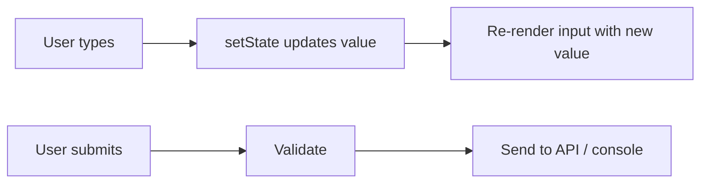
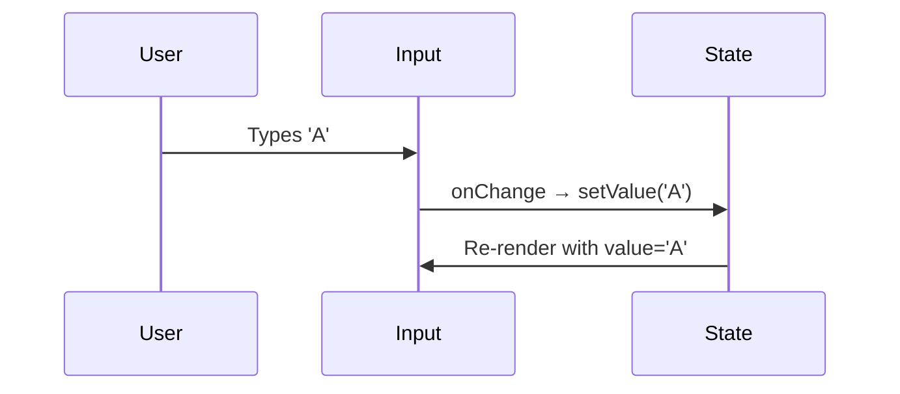
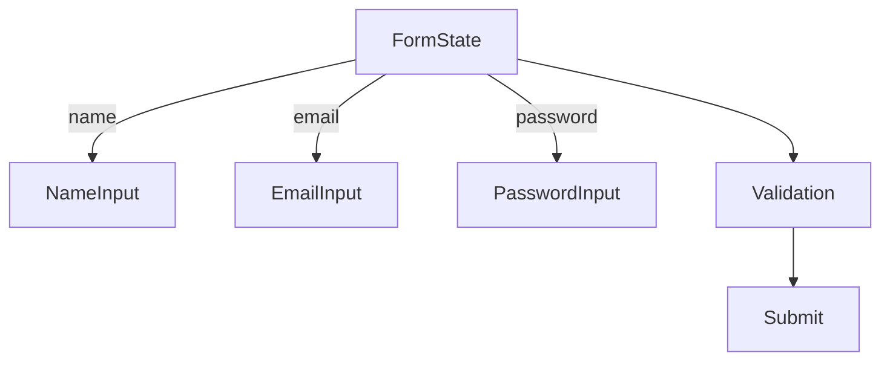

# 📅 Day 4: Events + Forms

Hello students 👋 Welcome to **Day 4**! Yesterday you became friends with `useState`. Today we level up — we'll learn how users **interact** with our app through **events and forms**. Every real app (login, signup, search, checkout) needs forms. So this class is *gold*.

---

## 1. 🎯 Introduction — What We Learn Today?

- React event handling (`onClick`, `onChange`, etc.)
- Building forms
- Handling form submit (`onSubmit`)
- Validation basics
- Handling multiple inputs using one state object

### Why this matters in real projects?
Every business-critical feature is a form: login, signup, contact-us, checkout, edit profile, file upload. If you master forms, you can build 80% of real UI.

---

## 2. 📖 Concept Explanation

### React Events
Just like HTML, React uses events, but in **camelCase** and they accept **functions** instead of strings.

| HTML | React |
|------|-------|
| `onclick="doStuff()"` | `onClick={doStuff}` |
| `onchange="x()"` | `onChange={x}` |
| `onsubmit="y()"` | `onSubmit={y}` |

### Controlled vs Uncontrolled Inputs
- **Controlled** → React state is the "source of truth" (we use this 99% of the time).
- **Uncontrolled** → DOM keeps the value, you access via `ref`.

### Basic form flow



### Form validation basics
- Check empty fields
- Check email pattern
- Check password length
- Show error messages per field

---

## 3. 💡 Visual Learning

### Controlled input cycle



### Multi-field form



---

## 4. 💻 Code Examples

### Example 1 — onClick

```tsx
function ClickMe() {
  const handleClick = () => alert("You clicked!");
  return <button onClick={handleClick}>Click me</button>;
}
```

### Example 2 — event object with proper typing

```tsx
function InputBox() {
  const [text, setText] = useState("");

  const handleChange = (e: React.ChangeEvent<HTMLInputElement>) => {
    setText(e.target.value);
  };

  return <input value={text} onChange={handleChange} />;
}
```

### Example 3 — Basic form with submit

```tsx
function LoginForm() {
  const [email, setEmail] = useState("");
  const [password, setPassword] = useState("");

  const handleSubmit = (e: React.FormEvent) => {
    e.preventDefault();             // prevent page reload
    console.log({ email, password });
  };

  return (
    <form onSubmit={handleSubmit}>
      <input
        type="email"
        value={email}
        placeholder="Email"
        onChange={(e) => setEmail(e.target.value)}
      />
      <input
        type="password"
        value={password}
        placeholder="Password"
        onChange={(e) => setPassword(e.target.value)}
      />
      <button type="submit">Login</button>
    </form>
  );
}
```

### Example 4 — Multiple inputs with one state object

```tsx
type FormData = { name: string; email: string; age: number };

function RegisterForm() {
  const [form, setForm] = useState<FormData>({ name: "", email: "", age: 0 });

  const handleChange = (e: React.ChangeEvent<HTMLInputElement>) => {
    const { name, value } = e.target;
    setForm((prev) => ({ ...prev, [name]: value }));
  };

  const handleSubmit = (e: React.FormEvent) => {
    e.preventDefault();
    console.log(form);
  };

  return (
    <form onSubmit={handleSubmit}>
      <input name="name" value={form.name} onChange={handleChange} placeholder="Name" />
      <input name="email" value={form.email} onChange={handleChange} placeholder="Email" />
      <input name="age" type="number" value={form.age} onChange={handleChange} />
      <button>Submit</button>
    </form>
  );
}
```

### Example 5 — Validation

```tsx
function SimpleValidateForm() {
  const [email, setEmail] = useState("");
  const [error, setError] = useState("");

  const validate = () => {
    if (!email.includes("@")) {
      setError("Please enter a valid email");
      return false;
    }
    setError("");
    return true;
  };

  const handleSubmit = (e: React.FormEvent) => {
    e.preventDefault();
    if (validate()) alert("Submitted!");
  };

  return (
    <form onSubmit={handleSubmit}>
      <input value={email} onChange={(e) => setEmail(e.target.value)} />
      {error && <span style={{ color: "red" }}>{error}</span>}
      <button>Submit</button>
    </form>
  );
}
```

### Example 6 — Checkbox + Select

```tsx
function Preferences() {
  const [agree, setAgree] = useState(false);
  const [role, setRole] = useState("student");

  return (
    <>
      <label>
        <input type="checkbox" checked={agree} onChange={(e) => setAgree(e.target.checked)} />
        Agree to terms
      </label>
      <select value={role} onChange={(e) => setRole(e.target.value)}>
        <option value="student">Student</option>
        <option value="dev">Developer</option>
      </select>
    </>
  );
}
```

**Mini question 🤔:** Why do we call `e.preventDefault()` in form submit?
*(Otherwise the browser reloads the page and we lose state.)*

---

## 5. 🛠 Hands-on Practice

1. Build a button that toggles a message on click.
2. Build a search input that shows typed text in real-time.
3. Build a form with name, email, password + console.log on submit.
4. Add validation: email must contain "@", password min 6 chars.
5. Build a checkbox + select + radio form.
6. Build a contact form with 4 fields using one state object.

---

## 6. ⚠️ Common Mistakes

- ❌ Forgetting `e.preventDefault()` → page reload.
- ❌ Using `onChange={handleChange()}` (called immediately).
- ❌ Not binding `value` and `onChange` together → input doesn't update.
- ❌ Using `id` instead of `name` attribute for the generic handler.
- ❌ Mutating state object directly.
- ❌ Not clearing error states on successful submit.

---

## 7. 📝 Mini Assignment — "Registration Form"

Build a registration form with:
- Fields: Full name, email, password, confirm password, country (select), terms checkbox
- Validations:
  - All required
  - Email pattern
  - Password min 6 chars
  - Confirm password must match
  - Terms must be checked
- On success: show "Registration successful! 🎉"
- Show errors per field in red.

Use TypeScript, one state object, one generic handler.

---

## 8. 🔁 Recap

- React events use camelCase (`onClick`, `onChange`)
- Controlled inputs tie `value` ↔ state
- Use `e.preventDefault()` in form submit
- Use `name` attribute for generic multi-input handler
- Validate before submitting
- Type events: `React.ChangeEvent<HTMLInputElement>`, `React.FormEvent`

### 🎤 Interview Questions (Day 4)
1. What is a controlled input?
2. Why use `e.preventDefault()`?
3. How do you manage multiple inputs with one state?
4. Difference between controlled vs uncontrolled?
5. How do you type a `ChangeEvent` in TypeScript?

Tomorrow → **Day 5: Rendering Lists + Conditional UI** 📃
