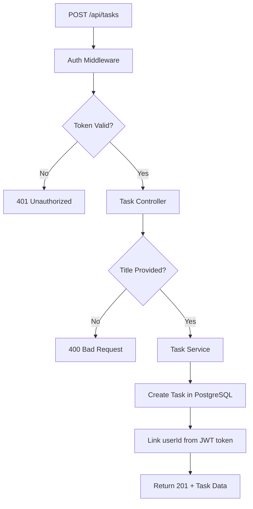
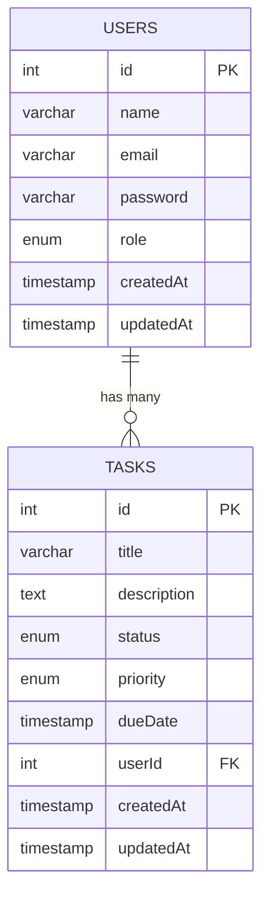
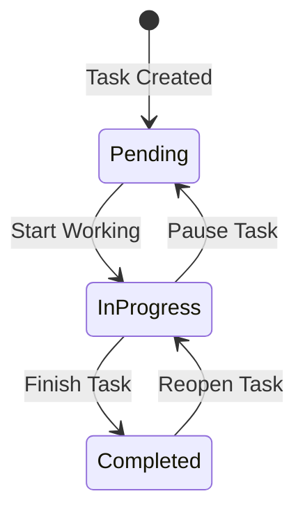
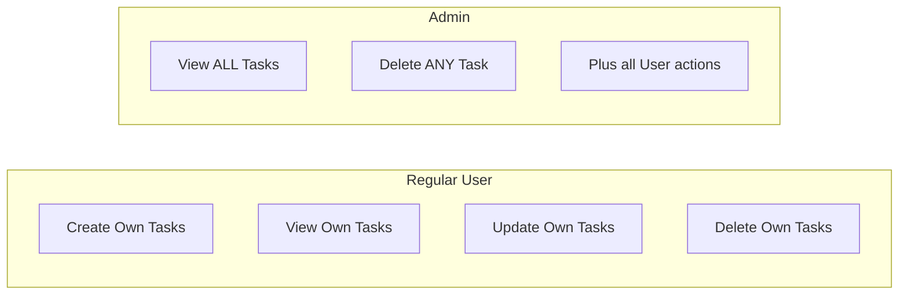

# Day 5: Task Module (PostgreSQL)

Hello developers! Welcome to Day 5 of our SmartTask AI project!

We've built authentication and authorization. Now it's time to build the **core feature** of our app - **Tasks**! Users will be able to create, view, update, and delete their tasks.

---

## What We Will Build Today

- Create **Task entity** in PostgreSQL
- Build **CRUD APIs** for tasks
- **Link tasks to users** (each task belongs to a user)
- Users manage **only their own tasks**
- Admin can see **all tasks**

---

## Why Is This Important?

> This is the **main feature** of our application. Think of apps like Todoist, Jira, or Trello - they all revolve around tasks. The Task module is where users actually get value from our product.

Tasks will also be the data we send to **ChatGPT on Day 7** for AI-powered suggestions!

---

## Concept Explanation

### Database Relationships

A **relationship** connects two tables. In our case:

```
One User → Many Tasks
(One user can have multiple tasks)
```

This is called a **One-to-Many** relationship.

**Real-world analogy:**
- One **teacher** has many **students**
- One **author** writes many **books**
- One **user** creates many **tasks**

### How TypeORM Handles Relationships

```typescript
// In User entity
@OneToMany(() => Task, (task) => task.user)
tasks: Task[];   // User has an array of tasks

// In Task entity
@ManyToOne(() => User, (user) => user.tasks)
user: User;      // Each task belongs to one user
```

### Task Status Flow

```
PENDING → IN_PROGRESS → COMPLETED
```

A task starts as PENDING, moves to IN_PROGRESS when someone works on it, and becomes COMPLETED when done.

---

## Folder Structure (Updated)

```
SmartTaskAI/
├── src/
│   ├── config/
│   │   └── database.ts
│   ├── controllers/
│   │   ├── auth.controller.ts
│   │   ├── user.controller.ts
│   │   └── task.controller.ts    ← NEW
│   ├── entities/
│   │   ├── User.ts               ← UPDATED (add relationship)
│   │   └── Task.ts               ← NEW
│   ├── middlewares/
│   │   ├── auth.middleware.ts
│   │   └── role.middleware.ts
│   ├── routes/
│   │   ├── auth.routes.ts
│   │   ├── user.routes.ts
│   │   └── task.routes.ts        ← NEW
│   ├── services/
│   │   ├── auth.service.ts
│   │   ├── user.service.ts
│   │   └── task.service.ts       ← NEW
│   ├── utils/
│   │   ├── jwt.utils.ts
│   │   └── seed.ts
│   ├── models/
│   └── index.ts                  ← UPDATED
├── .env
├── tsconfig.json
└── package.json
```

---

## Step-by-Step Coding

### Step 1: Create Task Entity

Create `src/entities/Task.ts`:

```typescript
import {
  Entity,
  PrimaryGeneratedColumn,
  Column,
  CreateDateColumn,
  UpdateDateColumn,
  ManyToOne,
  JoinColumn,
} from "typeorm";
import { User } from "./User";

// Task status options
export enum TaskStatus {
  PENDING = "pending",
  IN_PROGRESS = "in_progress",
  COMPLETED = "completed",
}

// Task priority levels
export enum TaskPriority {
  LOW = "low",
  MEDIUM = "medium",
  HIGH = "high",
}

@Entity("tasks")
export class Task {
  @PrimaryGeneratedColumn()
  id!: number;

  // Task title - short description
  @Column({ type: "varchar", length: 200 })
  title!: string;

  // Task description - detailed info
  @Column({ type: "text", nullable: true })
  description!: string;

  // Task status - pending, in_progress, or completed
  @Column({
    type: "enum",
    enum: TaskStatus,
    default: TaskStatus.PENDING,
  })
  status!: TaskStatus;

  // Task priority - low, medium, or high
  @Column({
    type: "enum",
    enum: TaskPriority,
    default: TaskPriority.MEDIUM,
  })
  priority!: TaskPriority;

  // Due date - when the task should be completed
  @Column({ type: "timestamp", nullable: true })
  dueDate!: Date;

  // Relationship: Many tasks belong to One user
  // @ManyToOne = This task has ONE user (the owner)
  // @JoinColumn = Creates a "userId" foreign key column
  @ManyToOne(() => User, (user) => user.tasks, { onDelete: "CASCADE" })
  @JoinColumn({ name: "userId" })
  user!: User;

  // Store userId directly for easy access
  @Column()
  userId!: number;

  @CreateDateColumn()
  createdAt!: Date;

  @UpdateDateColumn()
  updatedAt!: Date;
}
```

**Key points:**
- `@ManyToOne` creates the relationship to User
- `onDelete: "CASCADE"` means if a user is deleted, their tasks are also deleted
- `@JoinColumn({ name: "userId" })` creates a `userId` column that references the users table

### Step 2: Update User Entity with Relationship

Update `src/entities/User.ts` - add the tasks relationship:

```typescript
import {
  Entity,
  PrimaryGeneratedColumn,
  Column,
  CreateDateColumn,
  UpdateDateColumn,
  OneToMany,
} from "typeorm";
import { Task } from "./Task";

export enum UserRole {
  ADMIN = "admin",
  USER = "user",
}

@Entity("users")
export class User {
  @PrimaryGeneratedColumn()
  id!: number;

  @Column({ type: "varchar", length: 100 })
  name!: string;

  @Column({ type: "varchar", length: 150, unique: true })
  email!: string;

  @Column({ type: "varchar", length: 255 })
  password!: string;

  @Column({
    type: "enum",
    enum: UserRole,
    default: UserRole.USER,
  })
  role!: UserRole;

  // Relationship: One user has Many tasks
  // @OneToMany = This user has an ARRAY of tasks
  @OneToMany(() => Task, (task) => task.user)
  tasks!: Task[];

  @CreateDateColumn()
  createdAt!: Date;

  @UpdateDateColumn()
  updatedAt!: Date;
}
```

### Step 3: Create Task Service

Create `src/services/task.service.ts`:

```typescript
import AppDataSource from "../config/database";
import { Task, TaskStatus, TaskPriority } from "../entities/Task";

const taskRepository = AppDataSource.getRepository(Task);

export class TaskService {
  // CREATE: Add a new task for a user
  async createTask(data: {
    title: string;
    description?: string;
    priority?: TaskPriority;
    dueDate?: Date;
    userId: number;
  }): Promise<Task> {
    const task = taskRepository.create(data);
    return await taskRepository.save(task);
  }

  // READ: Get all tasks for a specific user
  async getTasksByUser(userId: number): Promise<Task[]> {
    return await taskRepository.find({
      where: { userId },
      order: { createdAt: "DESC" }, // Newest first
    });
  }

  // READ: Get all tasks (Admin only)
  async getAllTasks(): Promise<Task[]> {
    return await taskRepository.find({
      relations: ["user"], // Include user info
      order: { createdAt: "DESC" },
    });
  }

  // READ: Get a single task by ID
  async getTaskById(id: number): Promise<Task | null> {
    return await taskRepository.findOne({
      where: { id },
      relations: ["user"],
    });
  }

  // UPDATE: Update task details
  async updateTask(
    id: number,
    data: Partial<Task>
  ): Promise<Task | null> {
    const task = await taskRepository.findOneBy({ id });

    if (!task) {
      return null;
    }

    Object.assign(task, data);
    return await taskRepository.save(task);
  }

  // DELETE: Remove a task
  async deleteTask(id: number): Promise<boolean> {
    const result = await taskRepository.delete(id);
    return result.affected !== 0;
  }

  // GET STATS: Count tasks by status for a user
  async getTaskStats(userId: number) {
    const total = await taskRepository.count({ where: { userId } });
    const pending = await taskRepository.count({
      where: { userId, status: TaskStatus.PENDING },
    });
    const inProgress = await taskRepository.count({
      where: { userId, status: TaskStatus.IN_PROGRESS },
    });
    const completed = await taskRepository.count({
      where: { userId, status: TaskStatus.COMPLETED },
    });

    return { total, pending, inProgress, completed };
  }
}
```

### Step 4: Create Task Controller

Create `src/controllers/task.controller.ts`:

```typescript
import { Request, Response } from "express";
import { TaskService } from "../services/task.service";

const taskService = new TaskService();

export class TaskController {
  // POST /api/tasks - Create a new task
  async create(req: Request, res: Response): Promise<void> {
    try {
      const { title, description, priority, dueDate } = req.body;
      const userId = req.user!.userId;

      // Validate title
      if (!title) {
        res.status(400).json({
          success: false,
          message: "Task title is required",
        });
        return;
      }

      const task = await taskService.createTask({
        title,
        description,
        priority,
        dueDate: dueDate ? new Date(dueDate) : undefined,
        userId,
      });

      res.status(201).json({
        success: true,
        message: "Task created successfully",
        data: task,
      });
    } catch (error) {
      res.status(500).json({
        success: false,
        message: "Internal server error",
      });
    }
  }

  // GET /api/tasks - Get tasks (user: own tasks, admin: all tasks)
  async getAll(req: Request, res: Response): Promise<void> {
    try {
      let tasks;

      if (req.user!.role === "admin") {
        // Admin sees all tasks with user info
        tasks = await taskService.getAllTasks();
        // Clean user data (remove passwords)
        tasks = tasks.map((task) => {
          if (task.user) {
            const { password, ...userWithoutPassword } = task.user;
            return { ...task, user: userWithoutPassword };
          }
          return task;
        });
      } else {
        // Regular user sees only their own tasks
        tasks = await taskService.getTasksByUser(req.user!.userId);
      }

      res.json({
        success: true,
        data: tasks,
        count: tasks.length,
      });
    } catch (error) {
      res.status(500).json({
        success: false,
        message: "Internal server error",
      });
    }
  }

  // GET /api/tasks/stats - Get task statistics
  async getStats(req: Request, res: Response): Promise<void> {
    try {
      const userId = req.user!.userId;
      const stats = await taskService.getTaskStats(userId);

      res.json({
        success: true,
        data: stats,
      });
    } catch (error) {
      res.status(500).json({
        success: false,
        message: "Internal server error",
      });
    }
  }

  // GET /api/tasks/:id - Get a single task
  async getById(req: Request, res: Response): Promise<void> {
    try {
      const id = parseInt(req.params.id);

      if (isNaN(id)) {
        res.status(400).json({
          success: false,
          message: "Invalid task ID",
        });
        return;
      }

      const task = await taskService.getTaskById(id);

      if (!task) {
        res.status(404).json({
          success: false,
          message: "Task not found",
        });
        return;
      }

      // Regular users can only view their own tasks
      if (req.user!.role !== "admin" && task.userId !== req.user!.userId) {
        res.status(403).json({
          success: false,
          message: "You can only view your own tasks",
        });
        return;
      }

      res.json({
        success: true,
        data: task,
      });
    } catch (error) {
      res.status(500).json({
        success: false,
        message: "Internal server error",
      });
    }
  }

  // PUT /api/tasks/:id - Update a task
  async update(req: Request, res: Response): Promise<void> {
    try {
      const id = parseInt(req.params.id);

      if (isNaN(id)) {
        res.status(400).json({
          success: false,
          message: "Invalid task ID",
        });
        return;
      }

      // First check if the task exists and belongs to the user
      const existingTask = await taskService.getTaskById(id);

      if (!existingTask) {
        res.status(404).json({
          success: false,
          message: "Task not found",
        });
        return;
      }

      // Regular users can only update their own tasks
      if (
        req.user!.role !== "admin" &&
        existingTask.userId !== req.user!.userId
      ) {
        res.status(403).json({
          success: false,
          message: "You can only update your own tasks",
        });
        return;
      }

      // Don't allow changing userId (task ownership)
      const { userId, ...updateData } = req.body;

      // Parse dueDate if provided
      if (updateData.dueDate) {
        updateData.dueDate = new Date(updateData.dueDate);
      }

      const updatedTask = await taskService.updateTask(id, updateData);

      res.json({
        success: true,
        message: "Task updated successfully",
        data: updatedTask,
      });
    } catch (error) {
      res.status(500).json({
        success: false,
        message: "Internal server error",
      });
    }
  }

  // DELETE /api/tasks/:id - Delete a task
  async delete(req: Request, res: Response): Promise<void> {
    try {
      const id = parseInt(req.params.id);

      if (isNaN(id)) {
        res.status(400).json({
          success: false,
          message: "Invalid task ID",
        });
        return;
      }

      // Check ownership
      const existingTask = await taskService.getTaskById(id);

      if (!existingTask) {
        res.status(404).json({
          success: false,
          message: "Task not found",
        });
        return;
      }

      if (
        req.user!.role !== "admin" &&
        existingTask.userId !== req.user!.userId
      ) {
        res.status(403).json({
          success: false,
          message: "You can only delete your own tasks",
        });
        return;
      }

      await taskService.deleteTask(id);

      res.json({
        success: true,
        message: "Task deleted successfully",
      });
    } catch (error) {
      res.status(500).json({
        success: false,
        message: "Internal server error",
      });
    }
  }
}
```

### Step 5: Create Task Routes

Create `src/routes/task.routes.ts`:

```typescript
import { Router } from "express";
import { TaskController } from "../controllers/task.controller";
import { authenticate } from "../middlewares/auth.middleware";

const router = Router();
const taskController = new TaskController();

// All task routes require authentication
// Role checks happen inside the controller

router.post("/", authenticate, (req, res) => taskController.create(req, res));
router.get("/", authenticate, (req, res) => taskController.getAll(req, res));
router.get("/stats", authenticate, (req, res) => taskController.getStats(req, res));
router.get("/:id", authenticate, (req, res) => taskController.getById(req, res));
router.put("/:id", authenticate, (req, res) => taskController.update(req, res));
router.delete("/:id", authenticate, (req, res) => taskController.delete(req, res));

export default router;
```

### Step 6: Update index.ts

Update `src/index.ts` to include task routes:

```typescript
import "reflect-metadata";
import express, { Request, Response } from "express";
import cors from "cors";
import dotenv from "dotenv";
import AppDataSource from "./config/database";
import userRoutes from "./routes/user.routes";
import authRoutes from "./routes/auth.routes";
import taskRoutes from "./routes/task.routes";

dotenv.config();

const app = express();

app.use(express.json());
app.use(cors());

const PORT = process.env.PORT || 3000;

// Health check
app.get("/", (req: Request, res: Response) => {
  res.json({
    success: true,
    message: "SmartTask AI API is running!",
    timestamp: new Date().toISOString(),
  });
});

app.get("/api/health", (req: Request, res: Response) => {
  res.json({
    success: true,
    message: "Server is healthy!",
    environment: process.env.NODE_ENV,
    uptime: process.uptime(),
  });
});

// Routes
app.use("/api/auth", authRoutes);
app.use("/api/users", userRoutes);
app.use("/api/tasks", taskRoutes);    // NEW!

// Initialize database and start server
AppDataSource.initialize()
  .then(() => {
    console.log("Database connected successfully!");

    app.listen(PORT, () => {
      console.log(`==========================================`);
      console.log(`  SmartTask AI Server`);
      console.log(`  Environment: ${process.env.NODE_ENV}`);
      console.log(`  Running on: http://localhost:${PORT}`);
      console.log(`  Database: Connected`);
      console.log(`==========================================`);
    });
  })
  .catch((error) => {
    console.error("Database connection failed:", error);
    process.exit(1);
  });

export default app;
```

---

## Flow Diagram

### Task Creation Flow



### Database Relationship



### Task Status Transitions



### Access Control for Tasks



---

## Test API (Postman Examples)

### Setup: Login first to get a token

```
POST http://localhost:3000/api/auth/login
Body: { "email": "john@example.com", "password": "password123" }
```

### Test 1: Create a Task

```
Method: POST
URL: http://localhost:3000/api/tasks
Headers:
  Authorization: Bearer <YOUR_TOKEN>
  Content-Type: application/json

Body (JSON):
{
  "title": "Complete project documentation",
  "description": "Write API docs for all endpoints",
  "priority": "high",
  "dueDate": "2026-04-20T00:00:00.000Z"
}
```

**Expected Response (201):**
```json
{
  "success": true,
  "message": "Task created successfully",
  "data": {
    "id": 1,
    "title": "Complete project documentation",
    "description": "Write API docs for all endpoints",
    "status": "pending",
    "priority": "high",
    "dueDate": "2026-04-20T00:00:00.000Z",
    "userId": 1,
    "createdAt": "2026-04-14T10:00:00.000Z",
    "updatedAt": "2026-04-14T10:00:00.000Z"
  }
}
```

### Test 2: Create More Tasks

```
POST http://localhost:3000/api/tasks
Body: { "title": "Fix login bug", "priority": "high" }

POST http://localhost:3000/api/tasks
Body: { "title": "Setup CI/CD pipeline", "priority": "medium" }

POST http://localhost:3000/api/tasks
Body: { "title": "Update dependencies", "priority": "low" }
```

### Test 3: Get All My Tasks

```
Method: GET
URL: http://localhost:3000/api/tasks
Headers:
  Authorization: Bearer <YOUR_TOKEN>
```

### Test 4: Get Task Statistics

```
Method: GET
URL: http://localhost:3000/api/tasks/stats
Headers:
  Authorization: Bearer <YOUR_TOKEN>
```

**Expected Response:**
```json
{
  "success": true,
  "data": {
    "total": 4,
    "pending": 4,
    "inProgress": 0,
    "completed": 0
  }
}
```

### Test 5: Update Task Status

```
Method: PUT
URL: http://localhost:3000/api/tasks/1
Headers:
  Authorization: Bearer <YOUR_TOKEN>
  Content-Type: application/json

Body (JSON):
{
  "status": "in_progress"
}
```

### Test 6: Complete a Task

```
Method: PUT
URL: http://localhost:3000/api/tasks/1
Body: { "status": "completed" }
```

### Test 7: Delete a Task

```
Method: DELETE
URL: http://localhost:3000/api/tasks/4
Headers:
  Authorization: Bearer <YOUR_TOKEN>
```

### Test 8: Try to Access Another User's Task

Login as a different user, then try:

```
Method: GET
URL: http://localhost:3000/api/tasks/1
Headers:
  Authorization: Bearer <DIFFERENT_USER_TOKEN>
```

**Expected: 403 Forbidden**

---

## Common Mistakes

### 1. Not linking task to user
```typescript
// WRONG - No userId, task belongs to nobody
const task = taskRepository.create({
  title: "My Task",
});

// RIGHT - Always include userId
const task = taskRepository.create({
  title: "My Task",
  userId: req.user.userId, // Link to logged-in user
});
```

### 2. Forgetting to check ownership
```typescript
// WRONG - Any user can update any task
const task = await taskService.updateTask(id, data);

// RIGHT - Check if task belongs to the user first
const task = await taskService.getTaskById(id);
if (task.userId !== req.user.userId) {
  res.status(403).json({ message: "Not your task" });
  return;
}
```

### 3. Not putting /stats before /:id
```typescript
// WRONG - Express matches "stats" as an :id parameter!
router.get("/:id", handler);
router.get("/stats", handler); // This will never be reached

// RIGHT - Put specific routes before parameter routes
router.get("/stats", handler); // Specific first
router.get("/:id", handler);  // Parameter last
```

### 4. Missing CASCADE on delete
```typescript
// WRONG - Deleting a user with tasks will fail (foreign key constraint)
@ManyToOne(() => User, (user) => user.tasks)

// RIGHT - Cascade delete removes tasks when user is deleted
@ManyToOne(() => User, (user) => user.tasks, { onDelete: "CASCADE" })
```

---

## Recap

Today we accomplished:

- [x] Created Task entity with status and priority
- [x] Set up One-to-Many relationship (User → Tasks)
- [x] Built complete CRUD APIs for tasks
- [x] Users can only manage their own tasks
- [x] Admin can view/delete all tasks
- [x] Added task statistics endpoint

### API Endpoints Summary:

| Method | Endpoint | Access | Description |
|--------|----------|--------|-------------|
| POST | /api/tasks | Auth | Create a new task |
| GET | /api/tasks | Auth | Get tasks (own/all for admin) |
| GET | /api/tasks/stats | Auth | Get task counts by status |
| GET | /api/tasks/:id | Auth | Get single task |
| PUT | /api/tasks/:id | Auth | Update task |
| DELETE | /api/tasks/:id | Auth | Delete task |

### What's Coming Tomorrow?

**Day 6: MongoDB + Mongoose Setup** - We'll add MongoDB as our second database! MongoDB will store logs and AI responses (data that doesn't need strict structure).

---

### Quick Quiz

1. What type of relationship exists between Users and Tasks?
2. What does `onDelete: "CASCADE"` mean?
3. Why do we put `/stats` route before `/:id` route?
4. What are the three task statuses?
5. How does the controller know which user is creating the task?

**Answers:**
1. One-to-Many (one user has many tasks)
2. When a user is deleted, all their tasks are automatically deleted too
3. Because Express matches routes in order - `:id` would match "stats" as a string
4. pending, in_progress, completed
5. From `req.user.userId` - set by the auth middleware from the JWT token

---

> **Great job completing Day 5!** The core of our application is built. Tomorrow we add MongoDB!
