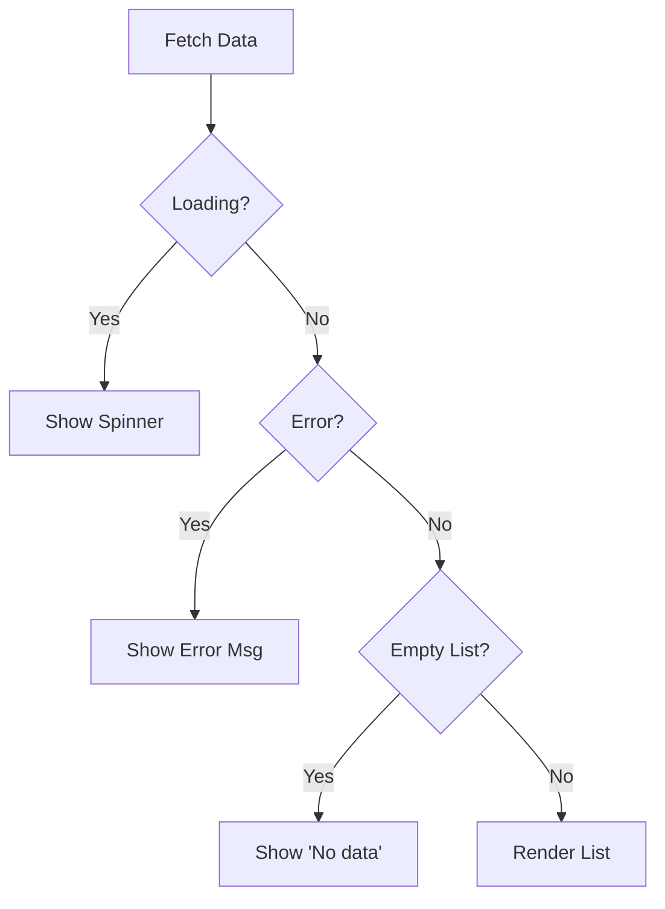
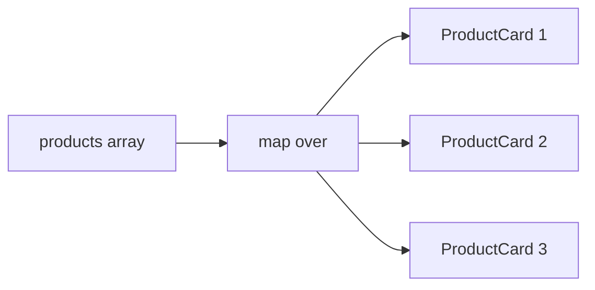

# 📅 Day 5: Rendering Lists + Conditional UI

Hello students 👋 Welcome to **Day 5**! Your React skills are getting stronger every day. Today we learn something you'll use in **literally every project** — showing lists of items and conditionally rendering UI based on state.

---

## 1. 🎯 Introduction — What We Learn Today?

- Rendering arrays with `.map()`
- The `key` prop and why it's critical
- Conditional rendering (`if`, `&&`, ternary)
- Empty states
- Loading states
- Error states

### Why this matters in real projects?
Think about Amazon, YouTube, Netflix, Zomato — what do they all display? Lists of items. And what if the data is still loading or there are no items? You show a spinner or an "empty cart" message. Today you'll learn exactly that.

---

## 2. 📖 Concept Explanation

### Rendering a list
Arrays are rendered using `.map()` which returns JSX for each item.

### What is the `key` prop?
React uses `key` to **identify** which items changed, were added, or removed. It helps React update the DOM efficiently.

**Rules for keys:**
- Must be **unique** among siblings
- Must be **stable** (don't use random())
- Prefer **IDs** over array indexes
- Only use index when list is static and won't reorder

### Conditional rendering patterns

```tsx
// 1. if-else (outside JSX)
if (loading) return <Spinner />;

// 2. ternary
{loading ? <Spinner /> : <List />}

// 3. logical AND &&
{cart.length > 0 && <CheckoutButton />}

// 4. early return
if (!user) return <Login />;
```

### UI States checklist
Every data-driven UI has **4 states**:
1. **Loading** — show spinner
2. **Error** — show error message
3. **Empty** — show "No items found"
4. **Success** — show the data

---

## 3. 💡 Visual Learning

### Conditional UI flow



### Map rendering



---

## 4. 💻 Code Examples

### Example 1 — Basic list rendering

```tsx
const fruits = ["Apple", "Banana", "Mango"];

function FruitList() {
  return (
    <ul>
      {fruits.map((f, i) => (
        <li key={i}>{f}</li>
      ))}
    </ul>
  );
}
```

### Example 2 — List of objects (with IDs)

```tsx
type Product = { id: number; name: string; price: number };

const products: Product[] = [
  { id: 1, name: "Laptop", price: 45000 },
  { id: 2, name: "Phone", price: 15000 },
  { id: 3, name: "Headphones", price: 1200 },
];

function ProductList() {
  return (
    <div className="grid">
      {products.map((p) => (
        <div key={p.id} className="card">
          <h3>{p.name}</h3>
          <p>₹ {p.price}</p>
        </div>
      ))}
    </div>
  );
}
```

### Example 3 — Conditional rendering

```tsx
function AuthMessage({ isLoggedIn }: { isLoggedIn: boolean }) {
  return (
    <div>
      {isLoggedIn ? <h2>Welcome back!</h2> : <h2>Please login</h2>}
    </div>
  );
}
```

### Example 4 — Empty, loading, success pattern

```tsx
type Item = { id: number; title: string };

type Props = {
  loading: boolean;
  error: string | null;
  items: Item[];
};

function ItemList({ loading, error, items }: Props) {
  if (loading) return <p>Loading...</p>;
  if (error)   return <p style={{ color: "red" }}>❌ {error}</p>;
  if (items.length === 0) return <p>No items found.</p>;

  return (
    <ul>
      {items.map((i) => <li key={i.id}>{i.title}</li>)}
    </ul>
  );
}
```

### Example 5 — Filter + Render

```tsx
function InStockList({ products }: { products: Product[] }) {
  const inStock = products.filter((p) => p.price < 20000);
  return (
    <>
      {inStock.length > 0 ? (
        inStock.map((p) => <p key={p.id}>{p.name}</p>)
      ) : (
        <p>No affordable items right now.</p>
      )}
    </>
  );
}
```

### Example 6 — Dynamic list with add/remove

```tsx
function TodoApp() {
  const [todos, setTodos] = useState<{ id: number; text: string }[]>([]);
  const [text, setText] = useState("");

  const add = () => {
    if (!text) return;
    setTodos([...todos, { id: Date.now(), text }]);
    setText("");
  };

  const remove = (id: number) => setTodos(todos.filter((t) => t.id !== id));

  return (
    <div>
      <input value={text} onChange={(e) => setText(e.target.value)} />
      <button onClick={add}>Add</button>
      {todos.length === 0 ? (
        <p>No todos yet.</p>
      ) : (
        <ul>
          {todos.map((t) => (
            <li key={t.id}>
              {t.text} <button onClick={() => remove(t.id)}>❌</button>
            </li>
          ))}
        </ul>
      )}
    </div>
  );
}
```

**Mini question 🤔:** Why is using `Math.random()` as a key a bad idea?
*(Because it changes on every render and confuses React's reconciliation.)*

---

## 5. 🛠 Hands-on Practice

1. Render a list of 5 movies (name, rating).
2. Show "No movies" when array is empty.
3. Add a filter input → show only movies starting with typed text.
4. Build loading / error / success UI (simulate with setTimeout).
5. Create a shopping list — add, delete, mark as bought.
6. Toggle a "show details" button on each card using `&&`.

---

## 6. ⚠️ Common Mistakes

- ❌ Missing `key` prop → React warning.
- ❌ Using index as key in reorderable lists.
- ❌ `Math.random()` as key.
- ❌ Returning nothing from map callback (forgetting `return`).
- ❌ Not handling empty/loading states → blank screens.
- ❌ Mixing conditional rendering with numeric values: `{count && <X/>}` shows `0` when count is 0! Use `count > 0 && ...`.

---

## 7. 📝 Mini Assignment — "Product Listing Page"

Build a product listing page:
- Array of 10 products (`id, name, price, image, inStock`)
- Search input → filter by name
- Toggle "In stock only"
- Show count of matching products
- Show "No products match" when empty
- Use TypeScript + proper keys

---

## 8. 🔁 Recap

- Use `.map()` to render arrays
- Always use unique, stable `key`s (prefer IDs)
- Ternary / `&&` for conditionals
- Always handle empty/loading/error states
- Beware `0 && ...` rendering "0" on screen

### 🎤 Interview Questions (Day 5)
1. Why does React need the `key` prop?
2. Can I use index as key? When?
3. What are 3 ways to conditionally render UI?
4. What is the pitfall of `{count && <X/>}`?
5. How do you handle loading/error/empty states?

Tomorrow → **Day 6: useEffect + API Calls** — we'll fetch real data from the internet! 🌐
