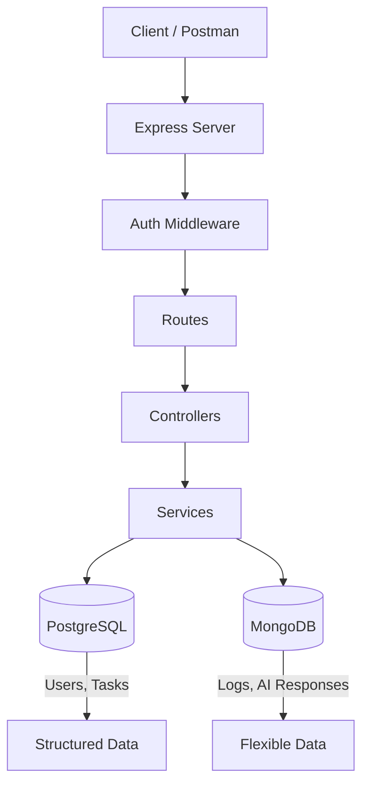
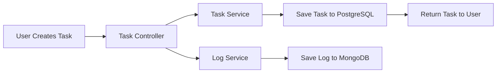
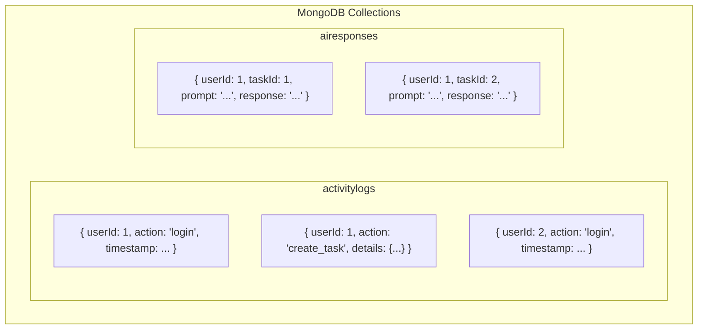
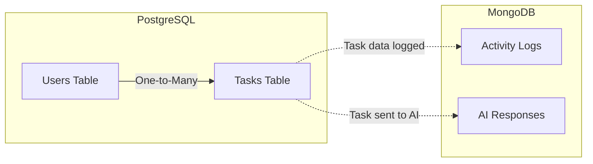

# Day 6: MongoDB + Mongoose Setup

Hello developers! Welcome to Day 6 of our SmartTask AI project!

So far we've been using PostgreSQL for structured data (users, tasks). Today we add **MongoDB** - a NoSQL database perfect for storing **logs** and **AI responses**.

---

## What We Will Build Today

- Connect to **MongoDB** using Mongoose
- Create **Log model** to store activity logs
- Create **AI Response model** (for ChatGPT responses on Day 7)
- Build a **logging service** that records user actions
- Add **automatic logging** to our existing APIs

---

## Why Is This Important?

> Think of it like this: PostgreSQL is your **filing cabinet** (organized, structured, everything has its place). MongoDB is your **notebook** (flexible, write anything, no fixed format).

**Why use BOTH databases?**

| Data | Database | Why |
|------|----------|-----|
| Users, Tasks | PostgreSQL | Structured, relationships, consistency |
| Logs, AI Responses | MongoDB | Flexible schema, fast writes, unstructured |

**Real-world examples:**
- **Uber**: PostgreSQL for rides/users, MongoDB for location logs
- **Netflix**: PostgreSQL for accounts, MongoDB for viewing history

### SQL vs NoSQL

| Feature | PostgreSQL (SQL) | MongoDB (NoSQL) |
|---------|-----------------|-----------------|
| Data format | Tables with rows | Collections with documents |
| Schema | Fixed (columns defined) | Flexible (any shape) |
| Relationships | Strong (joins) | Weak (embedded/referenced) |
| Best for | Structured data | Unstructured/changing data |
| Query language | SQL | MongoDB Query Language |

---

## Concept Explanation

### What is Mongoose?

Mongoose is an **ODM** (Object Data Modeling) library for MongoDB. It's like TypeORM but for MongoDB.

```
TypeORM → PostgreSQL (ORM)
Mongoose → MongoDB (ODM)
```

### Documents vs Tables

```
PostgreSQL (Table):
┌────┬──────────┬─────────────────┐
│ id │ action   │ timestamp       │
├────┼──────────┼─────────────────┤
│ 1  │ login    │ 2026-04-14 10:00│
│ 2  │ create   │ 2026-04-14 10:05│
└────┴──────────┴─────────────────┘

MongoDB (Collection of Documents):
{
  "_id": "507f1f77bcf86cd799439011",
  "action": "login",
  "timestamp": "2026-04-14T10:00:00Z",
  "metadata": {            ← Flexible! Can have any fields
    "ip": "192.168.1.1",
    "browser": "Chrome"
  }
}
```

**Quick Question:** Why would we store logs in MongoDB instead of PostgreSQL?

**Answer:** Logs can have different structures. A "login" log has IP address, a "task create" log has task data. MongoDB's flexible schema handles this perfectly without needing to define every possible column upfront.

---

## Folder Structure (Updated)

```
SmartTaskAI/
├── src/
│   ├── config/
│   │   ├── database.ts          # PostgreSQL config
│   │   └── mongodb.ts           ← NEW: MongoDB config
│   ├── controllers/
│   │   ├── auth.controller.ts
│   │   ├── user.controller.ts
│   │   ├── task.controller.ts
│   │   └── log.controller.ts    ← NEW
│   ├── entities/
│   │   ├── User.ts
│   │   └── Task.ts
│   ├── models/                   ← NEW: Mongoose models go here
│   │   ├── ActivityLog.ts       ← NEW
│   │   └── AIResponse.ts       ← NEW
│   ├── middlewares/
│   │   ├── auth.middleware.ts
│   │   └── role.middleware.ts
│   ├── routes/
│   │   ├── auth.routes.ts
│   │   ├── user.routes.ts
│   │   ├── task.routes.ts
│   │   └── log.routes.ts       ← NEW
│   ├── services/
│   │   ├── auth.service.ts
│   │   ├── user.service.ts
│   │   ├── task.service.ts
│   │   └── log.service.ts      ← NEW
│   ├── utils/
│   │   ├── jwt.utils.ts
│   │   └── seed.ts
│   └── index.ts                 ← UPDATED
├── .env
├── tsconfig.json
└── package.json
```

---

## Step-by-Step Coding

### Step 1: Create MongoDB Configuration

Create `src/config/mongodb.ts`:

```typescript
import mongoose from "mongoose";
import dotenv from "dotenv";

dotenv.config();

const MONGO_URI =
  process.env.MONGO_URI || "mongodb://localhost:27017/smarttask_logs";

// Connect to MongoDB
// Unlike TypeORM, Mongoose connects with a single function call
export const connectMongoDB = async (): Promise<void> => {
  try {
    await mongoose.connect(MONGO_URI);
    console.log("MongoDB connected successfully!");
  } catch (error) {
    console.error("MongoDB connection failed:", error);
    // Don't exit - MongoDB is for logs, app can work without it
    console.warn("Warning: App will run without logging features");
  }
};

export default mongoose;
```

**Note:** We don't `process.exit(1)` if MongoDB fails. PostgreSQL is essential (users, tasks), but MongoDB is for logs - the app can function without it.

### Step 2: Create Activity Log Model

Create `src/models/ActivityLog.ts`:

```typescript
import mongoose, { Schema, Document } from "mongoose";

// Interface defines the shape of our document
// This is like an Entity in TypeORM, but for MongoDB
export interface IActivityLog extends Document {
  userId: number;       // Which user performed the action
  action: string;       // What they did (login, create_task, etc.)
  resource: string;     // What resource was affected (user, task)
  resourceId?: string;  // ID of the affected resource
  details: any;         // Additional data (flexible!)
  ipAddress?: string;   // Where the request came from
  timestamp: Date;      // When it happened
}

// Schema defines the structure and validation rules
// Think of it as the "blueprint" for our MongoDB documents
const ActivityLogSchema = new Schema<IActivityLog>({
  userId: {
    type: Number,
    required: true,
    index: true,   // Index for fast lookups by userId
  },
  action: {
    type: String,
    required: true,
    enum: [
      "login",
      "register",
      "create_task",
      "update_task",
      "delete_task",
      "view_tasks",
      "ai_request",
      "update_profile",
    ],
  },
  resource: {
    type: String,
    required: true,
    enum: ["user", "task", "ai"],
  },
  resourceId: {
    type: String,
  },
  details: {
    type: Schema.Types.Mixed,  // Can be ANY shape - that's MongoDB's power!
  },
  ipAddress: {
    type: String,
  },
  timestamp: {
    type: Date,
    default: Date.now,
    index: true,   // Index for fast time-based queries
  },
});

// Create and export the model
// "ActivityLog" = collection name will be "activitylogs"
const ActivityLog = mongoose.model<IActivityLog>(
  "ActivityLog",
  ActivityLogSchema
);

export default ActivityLog;
```

### Step 3: Create AI Response Model

Create `src/models/AIResponse.ts`:

```typescript
import mongoose, { Schema, Document } from "mongoose";

// This model stores ChatGPT responses
// We'll use it on Day 7, but set it up now
export interface IAIResponse extends Document {
  userId: number;         // Who requested the AI suggestion
  taskId: number;         // Which task the suggestion is about
  prompt: string;         // What we asked ChatGPT
  response: string;       // What ChatGPT answered
  model: string;          // Which AI model was used
  tokensUsed: number;     // How many tokens were consumed
  responseTime: number;   // How long the AI took (in ms)
  timestamp: Date;
}

const AIResponseSchema = new Schema<IAIResponse>({
  userId: {
    type: Number,
    required: true,
    index: true,
  },
  taskId: {
    type: Number,
    required: true,
    index: true,
  },
  prompt: {
    type: String,
    required: true,
  },
  response: {
    type: String,
    required: true,
  },
  model: {
    type: String,
    default: "gpt-3.5-turbo",
  },
  tokensUsed: {
    type: Number,
    default: 0,
  },
  responseTime: {
    type: Number,  // milliseconds
    default: 0,
  },
  timestamp: {
    type: Date,
    default: Date.now,
  },
});

const AIResponse = mongoose.model<IAIResponse>(
  "AIResponse",
  AIResponseSchema
);

export default AIResponse;
```

### Step 4: Create Log Service

Create `src/services/log.service.ts`:

```typescript
import ActivityLog, { IActivityLog } from "../models/ActivityLog";

export class LogService {
  // CREATE: Log an activity
  async logActivity(data: {
    userId: number;
    action: string;
    resource: string;
    resourceId?: string;
    details?: any;
    ipAddress?: string;
  }): Promise<IActivityLog> {
    const log = new ActivityLog(data);
    return await log.save();
  }

  // READ: Get logs for a specific user
  async getLogsByUser(
    userId: number,
    limit: number = 50
  ): Promise<IActivityLog[]> {
    return await ActivityLog.find({ userId })
      .sort({ timestamp: -1 }) // Newest first
      .limit(limit);
  }

  // READ: Get all logs (Admin only)
  async getAllLogs(limit: number = 100): Promise<IActivityLog[]> {
    return await ActivityLog.find()
      .sort({ timestamp: -1 })
      .limit(limit);
  }

  // READ: Get logs by action type
  async getLogsByAction(
    action: string,
    limit: number = 50
  ): Promise<IActivityLog[]> {
    return await ActivityLog.find({ action })
      .sort({ timestamp: -1 })
      .limit(limit);
  }

  // READ: Get logs within a date range
  async getLogsByDateRange(
    startDate: Date,
    endDate: Date,
    userId?: number
  ): Promise<IActivityLog[]> {
    const query: any = {
      timestamp: {
        $gte: startDate, // Greater than or equal to start
        $lte: endDate,   // Less than or equal to end
      },
    };

    if (userId) {
      query.userId = userId;
    }

    return await ActivityLog.find(query)
      .sort({ timestamp: -1 });
  }

  // DELETE: Clean up old logs (older than 30 days)
  async cleanOldLogs(daysOld: number = 30): Promise<number> {
    const cutoffDate = new Date();
    cutoffDate.setDate(cutoffDate.getDate() - daysOld);

    const result = await ActivityLog.deleteMany({
      timestamp: { $lt: cutoffDate },
    });

    return result.deletedCount;
  }
}
```

### Step 5: Create Log Controller

Create `src/controllers/log.controller.ts`:

```typescript
import { Request, Response } from "express";
import { LogService } from "../services/log.service";

const logService = new LogService();

export class LogController {
  // GET /api/logs - Get logs (user: own logs, admin: all logs)
  async getLogs(req: Request, res: Response): Promise<void> {
    try {
      const limit = parseInt(req.query.limit as string) || 50;
      let logs;

      if (req.user!.role === "admin") {
        logs = await logService.getAllLogs(limit);
      } else {
        logs = await logService.getLogsByUser(req.user!.userId, limit);
      }

      res.json({
        success: true,
        data: logs,
        count: logs.length,
      });
    } catch (error) {
      res.status(500).json({
        success: false,
        message: "Internal server error",
      });
    }
  }

  // GET /api/logs/my - Get own activity logs
  async getMyLogs(req: Request, res: Response): Promise<void> {
    try {
      const limit = parseInt(req.query.limit as string) || 50;
      const logs = await logService.getLogsByUser(
        req.user!.userId,
        limit
      );

      res.json({
        success: true,
        data: logs,
        count: logs.length,
      });
    } catch (error) {
      res.status(500).json({
        success: false,
        message: "Internal server error",
      });
    }
  }
}
```

### Step 6: Create Log Routes

Create `src/routes/log.routes.ts`:

```typescript
import { Router } from "express";
import { LogController } from "../controllers/log.controller";
import { authenticate } from "../middlewares/auth.middleware";
import { authorize } from "../middlewares/role.middleware";

const router = Router();
const logController = new LogController();

// GET /api/logs/my - Any user can see their own logs
router.get("/my", authenticate, (req, res) =>
  logController.getMyLogs(req, res)
);

// GET /api/logs - Admin can see all logs
router.get("/", authenticate, authorize("admin"), (req, res) =>
  logController.getLogs(req, res)
);

export default router;
```

### Step 7: Add Logging to Existing Controllers

Now let's add logging to our auth and task controllers. Update `src/controllers/auth.controller.ts`:

```typescript
import { Request, Response } from "express";
import { AuthService } from "../services/auth.service";
import { LogService } from "../services/log.service";

const authService = new AuthService();
const logService = new LogService();

export class AuthController {
  async register(req: Request, res: Response): Promise<void> {
    try {
      const { name, email, password } = req.body;

      if (!name || !email || !password) {
        res.status(400).json({
          success: false,
          message: "Name, email, and password are required",
        });
        return;
      }

      const emailRegex = /^[^\s@]+@[^\s@]+\.[^\s@]+$/;
      if (!emailRegex.test(email)) {
        res.status(400).json({
          success: false,
          message: "Invalid email format",
        });
        return;
      }

      if (password.length < 6) {
        res.status(400).json({
          success: false,
          message: "Password must be at least 6 characters",
        });
        return;
      }

      const result = await authService.register({ name, email, password });

      // Log the registration
      await logService.logActivity({
        userId: result.user.id,
        action: "register",
        resource: "user",
        resourceId: String(result.user.id),
        details: { email: result.user.email },
        ipAddress: req.ip,
      });

      res.status(201).json({
        success: true,
        message: "User registered successfully",
        data: result,
      });
    } catch (error: any) {
      if (error.message === "Email already registered") {
        res.status(409).json({
          success: false,
          message: error.message,
        });
        return;
      }

      res.status(500).json({
        success: false,
        message: "Internal server error",
      });
    }
  }

  async login(req: Request, res: Response): Promise<void> {
    try {
      const { email, password } = req.body;

      if (!email || !password) {
        res.status(400).json({
          success: false,
          message: "Email and password are required",
        });
        return;
      }

      const result = await authService.login({ email, password });

      // Log the login
      await logService.logActivity({
        userId: result.user.id,
        action: "login",
        resource: "user",
        resourceId: String(result.user.id),
        details: { email: result.user.email },
        ipAddress: req.ip,
      });

      res.json({
        success: true,
        message: "Login successful",
        data: result,
      });
    } catch (error: any) {
      if (error.message === "Invalid email or password") {
        res.status(401).json({
          success: false,
          message: error.message,
        });
        return;
      }

      res.status(500).json({
        success: false,
        message: "Internal server error",
      });
    }
  }
}
```

Update `src/controllers/task.controller.ts` - add logging to the create method (apply the same pattern to update and delete):

```typescript
import { Request, Response } from "express";
import { TaskService } from "../services/task.service";
import { LogService } from "../services/log.service";

const taskService = new TaskService();
const logService = new LogService();

export class TaskController {
  async create(req: Request, res: Response): Promise<void> {
    try {
      const { title, description, priority, dueDate } = req.body;
      const userId = req.user!.userId;

      if (!title) {
        res.status(400).json({
          success: false,
          message: "Task title is required",
        });
        return;
      }

      const task = await taskService.createTask({
        title,
        description,
        priority,
        dueDate: dueDate ? new Date(dueDate) : undefined,
        userId,
      });

      // Log the task creation
      await logService.logActivity({
        userId,
        action: "create_task",
        resource: "task",
        resourceId: String(task.id),
        details: { title: task.title, priority: task.priority },
        ipAddress: req.ip,
      });

      res.status(201).json({
        success: true,
        message: "Task created successfully",
        data: task,
      });
    } catch (error) {
      res.status(500).json({
        success: false,
        message: "Internal server error",
      });
    }
  }

  // ... rest of the methods remain the same as Day 5
  // Add logService.logActivity() calls to update and delete methods too

  async getAll(req: Request, res: Response): Promise<void> {
    try {
      let tasks;

      if (req.user!.role === "admin") {
        tasks = await taskService.getAllTasks();
        tasks = tasks.map((task) => {
          if (task.user) {
            const { password, ...userWithoutPassword } = task.user;
            return { ...task, user: userWithoutPassword };
          }
          return task;
        });
      } else {
        tasks = await taskService.getTasksByUser(req.user!.userId);
      }

      res.json({
        success: true,
        data: tasks,
        count: tasks.length,
      });
    } catch (error) {
      res.status(500).json({
        success: false,
        message: "Internal server error",
      });
    }
  }

  async getStats(req: Request, res: Response): Promise<void> {
    try {
      const userId = req.user!.userId;
      const stats = await taskService.getTaskStats(userId);

      res.json({
        success: true,
        data: stats,
      });
    } catch (error) {
      res.status(500).json({
        success: false,
        message: "Internal server error",
      });
    }
  }

  async getById(req: Request, res: Response): Promise<void> {
    try {
      const id = parseInt(req.params.id);

      if (isNaN(id)) {
        res.status(400).json({ success: false, message: "Invalid task ID" });
        return;
      }

      const task = await taskService.getTaskById(id);

      if (!task) {
        res.status(404).json({ success: false, message: "Task not found" });
        return;
      }

      if (req.user!.role !== "admin" && task.userId !== req.user!.userId) {
        res.status(403).json({ success: false, message: "You can only view your own tasks" });
        return;
      }

      res.json({ success: true, data: task });
    } catch (error) {
      res.status(500).json({ success: false, message: "Internal server error" });
    }
  }

  async update(req: Request, res: Response): Promise<void> {
    try {
      const id = parseInt(req.params.id);

      if (isNaN(id)) {
        res.status(400).json({ success: false, message: "Invalid task ID" });
        return;
      }

      const existingTask = await taskService.getTaskById(id);

      if (!existingTask) {
        res.status(404).json({ success: false, message: "Task not found" });
        return;
      }

      if (req.user!.role !== "admin" && existingTask.userId !== req.user!.userId) {
        res.status(403).json({ success: false, message: "You can only update your own tasks" });
        return;
      }

      const { userId, ...updateData } = req.body;
      if (updateData.dueDate) {
        updateData.dueDate = new Date(updateData.dueDate);
      }

      const updatedTask = await taskService.updateTask(id, updateData);

      // Log the update
      await logService.logActivity({
        userId: req.user!.userId,
        action: "update_task",
        resource: "task",
        resourceId: String(id),
        details: { changes: updateData },
        ipAddress: req.ip,
      });

      res.json({ success: true, message: "Task updated successfully", data: updatedTask });
    } catch (error) {
      res.status(500).json({ success: false, message: "Internal server error" });
    }
  }

  async delete(req: Request, res: Response): Promise<void> {
    try {
      const id = parseInt(req.params.id);

      if (isNaN(id)) {
        res.status(400).json({ success: false, message: "Invalid task ID" });
        return;
      }

      const existingTask = await taskService.getTaskById(id);

      if (!existingTask) {
        res.status(404).json({ success: false, message: "Task not found" });
        return;
      }

      if (req.user!.role !== "admin" && existingTask.userId !== req.user!.userId) {
        res.status(403).json({ success: false, message: "You can only delete your own tasks" });
        return;
      }

      await taskService.deleteTask(id);

      // Log the deletion
      await logService.logActivity({
        userId: req.user!.userId,
        action: "delete_task",
        resource: "task",
        resourceId: String(id),
        details: { title: existingTask.title },
        ipAddress: req.ip,
      });

      res.json({ success: true, message: "Task deleted successfully" });
    } catch (error) {
      res.status(500).json({ success: false, message: "Internal server error" });
    }
  }
}
```

### Step 8: Update index.ts

Update `src/index.ts` to connect both databases:

```typescript
import "reflect-metadata";
import express, { Request, Response } from "express";
import cors from "cors";
import dotenv from "dotenv";
import AppDataSource from "./config/database";
import { connectMongoDB } from "./config/mongodb";
import userRoutes from "./routes/user.routes";
import authRoutes from "./routes/auth.routes";
import taskRoutes from "./routes/task.routes";
import logRoutes from "./routes/log.routes";

dotenv.config();

const app = express();

app.use(express.json());
app.use(cors());

const PORT = process.env.PORT || 3000;

// Health check
app.get("/", (req: Request, res: Response) => {
  res.json({
    success: true,
    message: "SmartTask AI API is running!",
    timestamp: new Date().toISOString(),
  });
});

app.get("/api/health", (req: Request, res: Response) => {
  res.json({
    success: true,
    message: "Server is healthy!",
    environment: process.env.NODE_ENV,
    uptime: process.uptime(),
  });
});

// Routes
app.use("/api/auth", authRoutes);
app.use("/api/users", userRoutes);
app.use("/api/tasks", taskRoutes);
app.use("/api/logs", logRoutes);      // NEW!

// Initialize BOTH databases, then start server
const startServer = async () => {
  try {
    // Connect PostgreSQL (required)
    await AppDataSource.initialize();
    console.log("PostgreSQL connected!");

    // Connect MongoDB (optional - for logging)
    await connectMongoDB();

    // Start Express server
    app.listen(PORT, () => {
      console.log(`==========================================`);
      console.log(`  SmartTask AI Server`);
      console.log(`  Environment: ${process.env.NODE_ENV}`);
      console.log(`  Running on: http://localhost:${PORT}`);
      console.log(`  PostgreSQL: Connected`);
      console.log(`  MongoDB: Connected`);
      console.log(`==========================================`);
    });
  } catch (error) {
    console.error("Server startup failed:", error);
    process.exit(1);
  }
};

startServer();

export default app;
```

---

## Flow Diagram

### Dual Database Architecture



### Logging Flow



### MongoDB Document Structure



### Where Each Database Is Used



---

## Test API (Postman Examples)

### Test 1: Login (Creates a Log Automatically)

```
Method: POST
URL: http://localhost:3000/api/auth/login
Body: { "email": "john@example.com", "password": "password123" }
```

### Test 2: Create a Task (Creates a Log Automatically)

```
Method: POST
URL: http://localhost:3000/api/tasks
Headers: Authorization: Bearer <TOKEN>
Body: { "title": "Test MongoDB logging", "priority": "high" }
```

### Test 3: View My Activity Logs

```
Method: GET
URL: http://localhost:3000/api/logs/my
Headers: Authorization: Bearer <TOKEN>
```

**Expected Response:**
```json
{
  "success": true,
  "data": [
    {
      "_id": "661c3f2a8b4c5d6e7f8a9b0c",
      "userId": 1,
      "action": "create_task",
      "resource": "task",
      "resourceId": "5",
      "details": {
        "title": "Test MongoDB logging",
        "priority": "high"
      },
      "timestamp": "2026-04-14T11:00:00.000Z"
    },
    {
      "_id": "661c3f1a8b4c5d6e7f8a9b0b",
      "userId": 1,
      "action": "login",
      "resource": "user",
      "resourceId": "1",
      "details": {
        "email": "john@example.com"
      },
      "timestamp": "2026-04-14T10:55:00.000Z"
    }
  ],
  "count": 2
}
```

### Test 4: Admin Views All Logs

```
Method: GET
URL: http://localhost:3000/api/logs?limit=20
Headers: Authorization: Bearer <ADMIN_TOKEN>
```

### Test 5: View Logs with Limit

```
Method: GET
URL: http://localhost:3000/api/logs/my?limit=10
Headers: Authorization: Bearer <TOKEN>
```

---

## Common Mistakes

### 1. MongoDB not running
```
Error: MongoServerError: connect ECONNREFUSED 127.0.0.1:27017

Solution: Start MongoDB!
- Windows: Search "Services" → Find "MongoDB" → Start
- Mac: brew services start mongodb-community
- Linux: sudo systemctl start mongod
```

### 2. Confusing Mongoose models with TypeORM entities
```typescript
// WRONG - Using TypeORM syntax for MongoDB
@Entity("logs")
class Log {
  @Column()
  action: string;
}

// RIGHT - Using Mongoose syntax for MongoDB
const LogSchema = new Schema({
  action: { type: String, required: true },
});
const Log = mongoose.model("Log", LogSchema);
```

### 3. Blocking the main response for logging
```typescript
// WRONG - User waits for log to be saved
await logService.logActivity(data); // This adds latency!
res.json(response);

// BETTER - Log after response (fire-and-forget)
res.json(response);
logService.logActivity(data).catch(console.error);

// Note: For simplicity in this tutorial, we await logs.
// In production, consider fire-and-forget or a message queue.
```

### 4. Not indexing frequently queried fields
```typescript
// WRONG - No index, slow queries on large collections
const LogSchema = new Schema({
  userId: { type: Number },
  timestamp: { type: Date },
});

// RIGHT - Index fields you query often
const LogSchema = new Schema({
  userId: { type: Number, index: true },      // Indexed!
  timestamp: { type: Date, index: true },      // Indexed!
});
```

---

## Recap

Today we accomplished:

- [x] Connected MongoDB alongside PostgreSQL
- [x] Created Activity Log model (Mongoose)
- [x] Created AI Response model (for Day 7)
- [x] Built logging service
- [x] Added automatic logging to auth and task controllers
- [x] Created log viewing endpoints

### Database Usage Summary:

| Database | Purpose | Library |
|----------|---------|---------|
| PostgreSQL | Users, Tasks | TypeORM |
| MongoDB | Activity Logs, AI Responses | Mongoose |

### What's Coming Tomorrow?

**Day 7: ChatGPT Integration** - We'll connect to OpenAI's API! Users will be able to send their tasks to ChatGPT and get AI-powered suggestions. Responses will be stored in MongoDB!

---

### Quick Quiz

1. Why do we use MongoDB for logs instead of PostgreSQL?
2. What is the difference between a Mongoose Schema and a TypeORM Entity?
3. What does `Schema.Types.Mixed` mean in Mongoose?
4. Why don't we exit the app if MongoDB connection fails?
5. What is the advantage of indexing a field?

**Answers:**
1. Logs have flexible, varying structures - MongoDB's schema-free design handles this better
2. Schema defines MongoDB document structure with validation, Entity defines PostgreSQL table structure with decorators
3. It allows any data type/shape - the field can hold objects, arrays, strings, etc.
4. MongoDB is used for non-critical features (logging). The core app (users, tasks) runs on PostgreSQL
5. Indexes make queries on that field much faster by creating a sorted reference

---

> **Great job completing Day 6!** You now have a dual-database system. Tomorrow we bring in AI!
