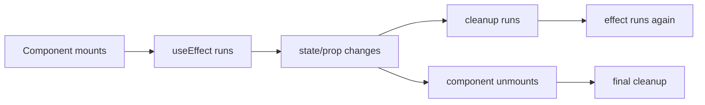
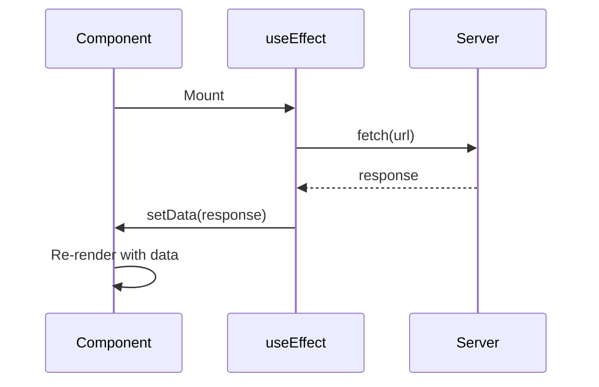

# 📅 Day 6: useEffect + API Calls

Hello students 👋 Welcome to **Day 6**! Till now our apps only worked with static data. Today we make them **alive** by connecting them to the real internet. We'll learn about **side effects**, the famous `useEffect` hook, and how to fetch data from APIs.

---

## 1. 🎯 Introduction — What We Learn Today?

- What is a side effect?
- `useEffect` hook — lifecycle + dependency array
- Fetch data from an API using `fetch` and `axios`
- Handle loading, error, and success states
- Cleanup functions (unsubscribe, cancel)

### Why this matters in real projects?
Every real app talks to a server: fetching products, posting forms, updating profiles. If you can't do API calls, you can't build real apps. Today we fix that.

---

## 2. 📖 Concept Explanation

### What is a side effect?
A **side effect** is anything that affects things **outside** the component:
- Calling an API
- Reading/writing to localStorage
- Setting up timers
- Subscribing to events
- Manually changing the DOM

React's `useEffect` is the official way to handle side effects.

### The `useEffect` hook
```tsx
useEffect(() => {
  // side effect code
  return () => {
    // optional cleanup
  };
}, [dependencies]);
```

| Dependency array | When effect runs |
|------------------|------------------|
| `[]` | Once after first render |
| `[count]` | Every time `count` changes |
| (not provided) | After every render ⚠ avoid |
| return cleanup | Before next effect or unmount |

### Lifecycle analogy



### UI states for API calls
1. `loading = true`
2. Success → set data, `loading = false`
3. Error → set error, `loading = false`

---

## 3. 💡 Visual Learning

### API call flow



### Dependency array decision tree

```mermaid
flowchart TD
    Start[Do you want effect to run...] --> Once{Only once on mount?}
    Once -->|Yes| Empty[Use `[]`]
    Once -->|No| When{When variable changes?}
    When -->|Yes| Deps[Put it in deps array]
    When -->|No| Every[No deps = every render ⚠]
```

---

## 4. 💻 Code Examples

### Example 1 — Run effect once (on mount)

```tsx
import { useEffect } from "react";

function Hello() {
  useEffect(() => {
    console.log("Component mounted!");
  }, []);
  return <h1>Hi</h1>;
}
```

### Example 2 — Run when state changes

```tsx
useEffect(() => {
  document.title = `Count: ${count}`;
}, [count]);
```

### Example 3 — Fetch users from API

```tsx
import { useEffect, useState } from "react";

type User = { id: number; name: string; email: string };

function UserList() {
  const [users, setUsers] = useState<User[]>([]);
  const [loading, setLoading] = useState(true);
  const [error, setError] = useState<string | null>(null);

  useEffect(() => {
    const load = async () => {
      try {
        const res = await fetch("https://jsonplaceholder.typicode.com/users");
        if (!res.ok) throw new Error("Failed to load users");
        const data: User[] = await res.json();
        setUsers(data);
      } catch (err) {
        setError((err as Error).message);
      } finally {
        setLoading(false);
      }
    };
    load();
  }, []);

  if (loading) return <p>Loading...</p>;
  if (error) return <p style={{ color: "red" }}>{error}</p>;

  return (
    <ul>
      {users.map((u) => (
        <li key={u.id}>{u.name} — {u.email}</li>
      ))}
    </ul>
  );
}
```

### Example 4 — Using Axios

```bash
npm install axios
```

```tsx
import axios from "axios";

useEffect(() => {
  axios
    .get<User[]>("https://jsonplaceholder.typicode.com/users")
    .then((res) => setUsers(res.data))
    .catch((err) => setError(err.message))
    .finally(() => setLoading(false));
}, []);
```

### Example 5 — Cleanup (timer)

```tsx
useEffect(() => {
  const id = setInterval(() => console.log("tick"), 1000);
  return () => clearInterval(id);   // cleanup on unmount
}, []);
```

### Example 6 — Cancel fetch with AbortController

```tsx
useEffect(() => {
  const controller = new AbortController();
  fetch(url, { signal: controller.signal })
    .then(r => r.json())
    .then(setData)
    .catch(e => { if (e.name !== "AbortError") setError(e.message); });

  return () => controller.abort();
}, [url]);
```

**Mini question 🤔:** What happens if you forget the `[]` dependency array?
*(The effect runs on every render — often leading to infinite loops when you call setState inside.)*

---

## 5. 🛠 Hands-on Practice

1. Log "Hello" to console when component mounts.
2. Fetch and display 10 users from `jsonplaceholder.typicode.com/users`.
3. Show loading spinner while fetching.
4. Show error message if network fails.
5. Add a "Refresh" button that refetches data.
6. Fetch posts by a selected user (dropdown) using `userId` in dependency.

---

## 6. ⚠️ Common Mistakes

- ❌ Missing dependency array → infinite renders.
- ❌ Using async directly: `useEffect(async () => {...})` is wrong. Define async inside.
- ❌ Not handling errors.
- ❌ Not cleaning up timers/subscriptions.
- ❌ Putting too much logic in one effect — split by concern.
- ❌ Stale closure bug: forgetting to include used variables in deps.

---

## 7. 📝 Mini Assignment — "Users API Dashboard"

Build a dashboard:
- Fetch users from `https://jsonplaceholder.typicode.com/users`
- Show user cards with avatar (use `https://i.pravatar.cc/100?u=USER_ID`)
- Search by name (client-side filter)
- Loading, error, empty states
- Click on a user → fetch and show their posts below
- Use TypeScript, proper typing for API response

---

## 8. 🔁 Recap

- Side effects belong in `useEffect`
- `[]` → run once, `[var]` → run on change
- Always handle loading + error + success
- Always cleanup subscriptions/timers
- Use `AbortController` to cancel pending requests

### 🎤 Interview Questions (Day 6)
1. What is a side effect?
2. What is the purpose of the dependency array?
3. Difference between `useEffect(() => {...}, [])` and `useEffect(() => {...})`?
4. How do you cleanup effects?
5. How do you handle race conditions during fetch?

Tomorrow → **Day 7: Common Hooks Deep Dive** — `useRef`, `useMemo`, `useCallback` ⚡
