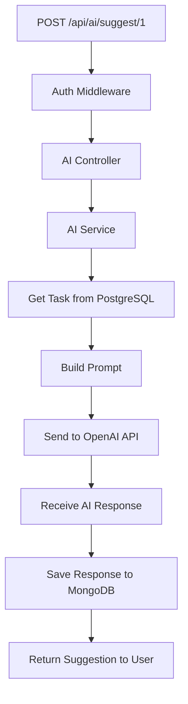
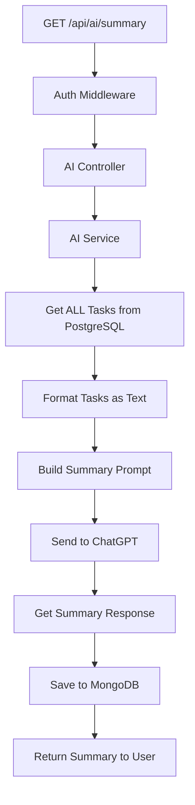
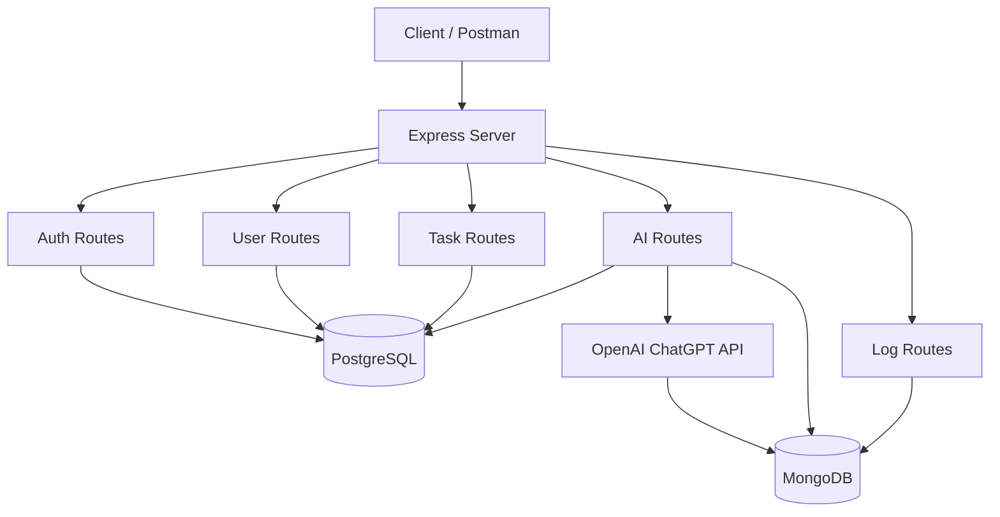
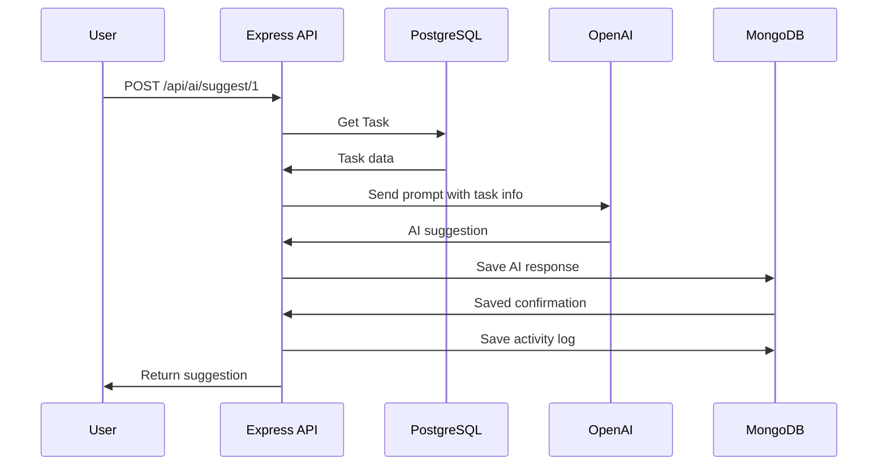

# Day 7: ChatGPT Integration

Hello developers! Welcome to Day 7 of our SmartTask AI project!

This is the day many of you have been waiting for - we're integrating **AI** into our backend! Users will be able to get AI-powered suggestions for their tasks using **OpenAI's ChatGPT API**.

---

## What We Will Build Today

- Connect to **OpenAI API**
- Send task data to **ChatGPT** and get suggestions
- **Summarize** all tasks for a user using AI
- **Store AI responses** in MongoDB
- Build AI-related API endpoints

---

## Why Is This Important?

> AI is transforming how software works. Companies like Notion, Linear, and Slack are all adding AI features. Knowing how to integrate AI APIs is a **must-have skill** for modern developers.

Use cases in our project:
- "Hey AI, what should I prioritize?" → AI analyzes your tasks
- "Summarize my tasks" → AI creates a summary
- "Give me suggestions for this task" → AI provides actionable steps

---

## Concept Explanation

### How the OpenAI API Works

```
1. You send a message (prompt) to OpenAI's API
2. ChatGPT processes it
3. You get a response back
4. You display it to the user
```

It's like **texting a really smart friend**:
- You: "I have these 5 tasks, which should I do first?"
- Friend (AI): "Based on deadlines and priorities, focus on..."

### API Key

To use OpenAI's API, you need an **API key** - like a password that identifies your app.

1. Go to [platform.openai.com](https://platform.openai.com)
2. Sign up / Login
3. Go to API Keys section
4. Create a new key
5. Copy it to your `.env` file

### Tokens

OpenAI charges by **tokens** (roughly 4 characters = 1 token).

```
"Hello world" = 2 tokens
"Summarize my 5 tasks" = 5 tokens
```

**Quick Question:** Why do we store AI responses in MongoDB instead of just returning them?

**Answer:** So users can view past suggestions without making another API call (saves money and time!).

---

## Folder Structure (Updated)

```
SmartTaskAI/
├── src/
│   ├── config/
│   │   ├── database.ts
│   │   ├── mongodb.ts
│   │   └── openai.ts           ← NEW
│   ├── controllers/
│   │   ├── auth.controller.ts
│   │   ├── user.controller.ts
│   │   ├── task.controller.ts
│   │   ├── log.controller.ts
│   │   └── ai.controller.ts    ← NEW
│   ├── entities/
│   │   ├── User.ts
│   │   └── Task.ts
│   ├── models/
│   │   ├── ActivityLog.ts
│   │   └── AIResponse.ts
│   ├── middlewares/
│   │   ├── auth.middleware.ts
│   │   └── role.middleware.ts
│   ├── routes/
│   │   ├── auth.routes.ts
│   │   ├── user.routes.ts
│   │   ├── task.routes.ts
│   │   ├── log.routes.ts
│   │   └── ai.routes.ts        ← NEW
│   ├── services/
│   │   ├── auth.service.ts
│   │   ├── user.service.ts
│   │   ├── task.service.ts
│   │   ├── log.service.ts
│   │   └── ai.service.ts       ← NEW
│   ├── utils/
│   │   ├── jwt.utils.ts
│   │   └── seed.ts
│   └── index.ts                ← UPDATED
├── .env
├── tsconfig.json
└── package.json
```

---

## Step-by-Step Coding

### Step 1: Configure OpenAI

Create `src/config/openai.ts`:

```typescript
import OpenAI from "openai";
import dotenv from "dotenv";

dotenv.config();

// Create OpenAI client
// This is like creating a "connection" to ChatGPT
const openai = new OpenAI({
  apiKey: process.env.OPENAI_API_KEY,
});

export default openai;
```

Make sure your `.env` has the API key:
```env
OPENAI_API_KEY=sk-your-api-key-here
```

### Step 2: Create AI Service

Create `src/services/ai.service.ts`:

```typescript
import openai from "../config/openai";
import AIResponse from "../models/AIResponse";
import { Task } from "../entities/Task";
import AppDataSource from "../config/database";

const taskRepository = AppDataSource.getRepository(Task);

export class AIService {
  // Get AI suggestions for a specific task
  async getTaskSuggestion(
    taskId: number,
    userId: number
  ) {
    // Step 1: Get the task from PostgreSQL
    const task = await taskRepository.findOneBy({ id: taskId, userId });

    if (!task) {
      throw new Error("Task not found");
    }

    // Step 2: Build the prompt for ChatGPT
    const prompt = `You are a helpful productivity assistant. A user has the following task:

Title: ${task.title}
Description: ${task.description || "No description provided"}
Status: ${task.status}
Priority: ${task.priority}
Due Date: ${task.dueDate ? task.dueDate.toISOString() : "No due date"}

Please provide:
1. A brief analysis of this task
2. 3 actionable steps to complete it
3. Any potential challenges
4. Time estimate

Keep the response concise and practical.`;

    // Step 3: Send to ChatGPT and measure time
    const startTime = Date.now();

    const completion = await openai.chat.completions.create({
      model: "gpt-3.5-turbo",
      messages: [
        {
          role: "system",
          content:
            "You are a helpful productivity assistant that gives concise, actionable advice.",
        },
        {
          role: "user",
          content: prompt,
        },
      ],
      max_tokens: 500,        // Limit response length
      temperature: 0.7,        // Creativity level (0 = factual, 1 = creative)
    });

    const responseTime = Date.now() - startTime;

    // Step 4: Extract the response
    const aiText =
      completion.choices[0]?.message?.content || "No response generated";
    const tokensUsed = completion.usage?.total_tokens || 0;

    // Step 5: Save to MongoDB for future reference
    const savedResponse = await AIResponse.create({
      userId,
      taskId,
      prompt,
      response: aiText,
      model: "gpt-3.5-turbo",
      tokensUsed,
      responseTime,
    });

    return {
      suggestion: aiText,
      task: {
        id: task.id,
        title: task.title,
        status: task.status,
      },
      metadata: {
        model: "gpt-3.5-turbo",
        tokensUsed,
        responseTime: `${responseTime}ms`,
        savedId: savedResponse._id,
      },
    };
  }

  // Get AI summary of all tasks for a user
  async getTasksSummary(userId: number) {
    // Step 1: Get all tasks for the user
    const tasks = await taskRepository.find({
      where: { userId },
      order: { priority: "ASC", dueDate: "ASC" },
    });

    if (tasks.length === 0) {
      throw new Error("No tasks found");
    }

    // Step 2: Format tasks for the prompt
    const taskList = tasks
      .map(
        (t, i) =>
          `${i + 1}. [${t.status}] [${t.priority}] ${t.title}${
            t.dueDate ? ` (Due: ${t.dueDate.toISOString().split("T")[0]})` : ""
          }`
      )
      .join("\n");

    const prompt = `You are a productivity expert. Here are a user's tasks:

${taskList}

Please provide:
1. A brief overall summary (2-3 sentences)
2. Priority recommendations (which tasks to focus on first and why)
3. Any tasks that seem overdue or at risk
4. A motivational tip

Keep the response concise and actionable.`;

    // Step 3: Send to ChatGPT
    const startTime = Date.now();

    const completion = await openai.chat.completions.create({
      model: "gpt-3.5-turbo",
      messages: [
        {
          role: "system",
          content:
            "You are a productivity expert who gives concise, motivating advice.",
        },
        {
          role: "user",
          content: prompt,
        },
      ],
      max_tokens: 600,
      temperature: 0.7,
    });

    const responseTime = Date.now() - startTime;

    const aiText =
      completion.choices[0]?.message?.content || "No response generated";
    const tokensUsed = completion.usage?.total_tokens || 0;

    // Step 4: Save to MongoDB
    const savedResponse = await AIResponse.create({
      userId,
      taskId: 0, // 0 means "all tasks" summary
      prompt,
      response: aiText,
      model: "gpt-3.5-turbo",
      tokensUsed,
      responseTime,
    });

    return {
      summary: aiText,
      taskCount: tasks.length,
      metadata: {
        model: "gpt-3.5-turbo",
        tokensUsed,
        responseTime: `${responseTime}ms`,
        savedId: savedResponse._id,
      },
    };
  }

  // Get past AI responses for a user
  async getAIHistory(userId: number, limit: number = 10) {
    return await AIResponse.find({ userId })
      .sort({ timestamp: -1 })
      .limit(limit)
      .select("-prompt"); // Exclude the prompt to save bandwidth
  }

  // Get a specific AI response by ID
  async getAIResponseById(responseId: string) {
    return await AIResponse.findById(responseId);
  }
}
```

### Step 3: Create AI Controller

Create `src/controllers/ai.controller.ts`:

```typescript
import { Request, Response } from "express";
import { AIService } from "../services/ai.service";
import { LogService } from "../services/log.service";

const aiService = new AIService();
const logService = new LogService();

export class AIController {
  // POST /api/ai/suggest/:taskId - Get AI suggestion for a task
  async getTaskSuggestion(req: Request, res: Response): Promise<void> {
    try {
      const taskId = parseInt(req.params.taskId);
      const userId = req.user!.userId;

      if (isNaN(taskId)) {
        res.status(400).json({
          success: false,
          message: "Invalid task ID",
        });
        return;
      }

      const result = await aiService.getTaskSuggestion(taskId, userId);

      // Log the AI request
      await logService.logActivity({
        userId,
        action: "ai_request",
        resource: "ai",
        resourceId: String(taskId),
        details: {
          type: "task_suggestion",
          tokensUsed: result.metadata.tokensUsed,
        },
        ipAddress: req.ip,
      });

      res.json({
        success: true,
        message: "AI suggestion generated",
        data: result,
      });
    } catch (error: any) {
      if (error.message === "Task not found") {
        res.status(404).json({
          success: false,
          message: "Task not found or does not belong to you",
        });
        return;
      }

      console.error("AI Error:", error.message);
      res.status(500).json({
        success: false,
        message: "Failed to generate AI suggestion",
      });
    }
  }

  // GET /api/ai/summary - Get AI summary of all tasks
  async getTasksSummary(req: Request, res: Response): Promise<void> {
    try {
      const userId = req.user!.userId;

      const result = await aiService.getTasksSummary(userId);

      // Log the AI request
      await logService.logActivity({
        userId,
        action: "ai_request",
        resource: "ai",
        details: {
          type: "tasks_summary",
          taskCount: result.taskCount,
          tokensUsed: result.metadata.tokensUsed,
        },
        ipAddress: req.ip,
      });

      res.json({
        success: true,
        message: "AI summary generated",
        data: result,
      });
    } catch (error: any) {
      if (error.message === "No tasks found") {
        res.status(404).json({
          success: false,
          message: "No tasks found. Create some tasks first!",
        });
        return;
      }

      console.error("AI Error:", error.message);
      res.status(500).json({
        success: false,
        message: "Failed to generate AI summary",
      });
    }
  }

  // GET /api/ai/history - Get past AI responses
  async getHistory(req: Request, res: Response): Promise<void> {
    try {
      const userId = req.user!.userId;
      const limit = parseInt(req.query.limit as string) || 10;

      const history = await aiService.getAIHistory(userId, limit);

      res.json({
        success: true,
        data: history,
        count: history.length,
      });
    } catch (error) {
      res.status(500).json({
        success: false,
        message: "Internal server error",
      });
    }
  }

  // GET /api/ai/response/:id - Get a specific AI response
  async getResponseById(req: Request, res: Response): Promise<void> {
    try {
      const responseId = req.params.id;

      const response = await aiService.getAIResponseById(responseId);

      if (!response) {
        res.status(404).json({
          success: false,
          message: "AI response not found",
        });
        return;
      }

      // Check ownership
      if (
        req.user!.role !== "admin" &&
        response.userId !== req.user!.userId
      ) {
        res.status(403).json({
          success: false,
          message: "Access denied",
        });
        return;
      }

      res.json({
        success: true,
        data: response,
      });
    } catch (error) {
      res.status(500).json({
        success: false,
        message: "Internal server error",
      });
    }
  }
}
```

### Step 4: Create AI Routes

Create `src/routes/ai.routes.ts`:

```typescript
import { Router } from "express";
import { AIController } from "../controllers/ai.controller";
import { authenticate } from "../middlewares/auth.middleware";

const router = Router();
const aiController = new AIController();

// All AI routes require authentication
router.post(
  "/suggest/:taskId",
  authenticate,
  (req, res) => aiController.getTaskSuggestion(req, res)
);

router.get(
  "/summary",
  authenticate,
  (req, res) => aiController.getTasksSummary(req, res)
);

router.get(
  "/history",
  authenticate,
  (req, res) => aiController.getHistory(req, res)
);

router.get(
  "/response/:id",
  authenticate,
  (req, res) => aiController.getResponseById(req, res)
);

export default router;
```

### Step 5: Update index.ts

Update `src/index.ts` to include AI routes:

```typescript
import "reflect-metadata";
import express, { Request, Response } from "express";
import cors from "cors";
import dotenv from "dotenv";
import AppDataSource from "./config/database";
import { connectMongoDB } from "./config/mongodb";
import userRoutes from "./routes/user.routes";
import authRoutes from "./routes/auth.routes";
import taskRoutes from "./routes/task.routes";
import logRoutes from "./routes/log.routes";
import aiRoutes from "./routes/ai.routes";

dotenv.config();

const app = express();

app.use(express.json());
app.use(cors());

const PORT = process.env.PORT || 3000;

// Health check
app.get("/", (req: Request, res: Response) => {
  res.json({
    success: true,
    message: "SmartTask AI API is running!",
    timestamp: new Date().toISOString(),
  });
});

app.get("/api/health", (req: Request, res: Response) => {
  res.json({
    success: true,
    message: "Server is healthy!",
    environment: process.env.NODE_ENV,
    uptime: process.uptime(),
  });
});

// Routes
app.use("/api/auth", authRoutes);
app.use("/api/users", userRoutes);
app.use("/api/tasks", taskRoutes);
app.use("/api/logs", logRoutes);
app.use("/api/ai", aiRoutes);        // NEW!

// Initialize databases and start server
const startServer = async () => {
  try {
    await AppDataSource.initialize();
    console.log("PostgreSQL connected!");

    await connectMongoDB();

    app.listen(PORT, () => {
      console.log(`==========================================`);
      console.log(`  SmartTask AI Server`);
      console.log(`  Environment: ${process.env.NODE_ENV}`);
      console.log(`  Running on: http://localhost:${PORT}`);
      console.log(`  PostgreSQL: Connected`);
      console.log(`  MongoDB: Connected`);
      console.log(`  AI: OpenAI Ready`);
      console.log(`==========================================`);
    });
  } catch (error) {
    console.error("Server startup failed:", error);
    process.exit(1);
  }
};

startServer();

export default app;
```

---

## Flow Diagram

### AI Suggestion Flow



### AI Summary Flow



### Complete System Architecture



### Data Flow Between All Three Systems



---

## Test API (Postman Examples)

### Setup: Make Sure You Have Tasks

First, create a few tasks if you haven't:

```
POST http://localhost:3000/api/tasks
Headers: Authorization: Bearer <TOKEN>
Body: { "title": "Learn Docker", "description": "Set up Docker for the project", "priority": "high", "dueDate": "2026-04-20" }

POST http://localhost:3000/api/tasks
Body: { "title": "Write unit tests", "priority": "medium" }

POST http://localhost:3000/api/tasks
Body: { "title": "Update README", "priority": "low" }
```

### Test 1: Get AI Suggestion for a Task

```
Method: POST
URL: http://localhost:3000/api/ai/suggest/1
Headers:
  Authorization: Bearer <TOKEN>
```

**Expected Response (200):**
```json
{
  "success": true,
  "message": "AI suggestion generated",
  "data": {
    "suggestion": "## Task Analysis\n\nThis task involves setting up Docker for your project...\n\n### Actionable Steps:\n1. Install Docker Desktop...\n2. Create a Dockerfile...\n3. Create docker-compose.yml...\n\n### Potential Challenges:\n- Port conflicts...\n\n### Time Estimate:\nApproximately 2-3 hours",
    "task": {
      "id": 1,
      "title": "Learn Docker",
      "status": "pending"
    },
    "metadata": {
      "model": "gpt-3.5-turbo",
      "tokensUsed": 245,
      "responseTime": "1523ms",
      "savedId": "661c5f2a8b4c5d6e7f8a9b0c"
    }
  }
}
```

### Test 2: Get AI Summary of All Tasks

```
Method: GET
URL: http://localhost:3000/api/ai/summary
Headers:
  Authorization: Bearer <TOKEN>
```

**Expected Response:**
```json
{
  "success": true,
  "message": "AI summary generated",
  "data": {
    "summary": "## Task Overview\n\nYou have 3 tasks...\n\n### Priority Recommendations:\n1. Focus on 'Learn Docker' first (high priority)...\n\n### At Risk:\n- None currently overdue\n\n### Tip:\nBreak large tasks into smaller subtasks!",
    "taskCount": 3,
    "metadata": {
      "model": "gpt-3.5-turbo",
      "tokensUsed": 312,
      "responseTime": "2100ms"
    }
  }
}
```

### Test 3: View AI History

```
Method: GET
URL: http://localhost:3000/api/ai/history
Headers:
  Authorization: Bearer <TOKEN>
```

### Test 4: View Specific AI Response

```
Method: GET
URL: http://localhost:3000/api/ai/response/661c5f2a8b4c5d6e7f8a9b0c
Headers:
  Authorization: Bearer <TOKEN>
```

---

## Common Mistakes

### 1. Missing or invalid API key
```
Error: 401 - Invalid API Key

Solution: Check your .env file
OPENAI_API_KEY=sk-...  (must start with sk-)
```

### 2. Exceeding rate limits
```
Error: 429 - Rate limit exceeded

Solution: Add delay between requests or upgrade your OpenAI plan
```

### 3. Not handling API errors gracefully
```typescript
// WRONG - App crashes if OpenAI is down
const result = await openai.chat.completions.create({...});

// RIGHT - Wrap in try-catch
try {
  const result = await openai.chat.completions.create({...});
} catch (error) {
  // Return friendly error, don't crash
  throw new Error("AI service temporarily unavailable");
}
```

### 4. Sending too much data to ChatGPT
```typescript
// WRONG - Sending entire task objects with all fields
const prompt = JSON.stringify(tasks); // Could be huge!

// RIGHT - Send only relevant fields
const prompt = tasks.map(t => `${t.title} (${t.status})`).join("\n");
```

### 5. Not setting max_tokens
```typescript
// WRONG - Response could be very long and expensive
await openai.chat.completions.create({
  model: "gpt-3.5-turbo",
  messages: [...],
  // No max_tokens limit!
});

// RIGHT - Limit response length
await openai.chat.completions.create({
  model: "gpt-3.5-turbo",
  messages: [...],
  max_tokens: 500,  // Reasonable limit
});
```

---

## Recap

Today we accomplished:

- [x] Connected to OpenAI's ChatGPT API
- [x] Built AI suggestion endpoint for individual tasks
- [x] Built AI summary endpoint for all tasks
- [x] Stored AI responses in MongoDB
- [x] Created AI history viewing endpoints
- [x] Added logging for AI requests

### API Endpoints Summary (Updated):

| Method | Endpoint | Description |
|--------|----------|-------------|
| POST | /api/ai/suggest/:taskId | Get AI suggestion for a task |
| GET | /api/ai/summary | Get AI summary of all tasks |
| GET | /api/ai/history | View past AI responses |
| GET | /api/ai/response/:id | View specific AI response |

### What's Coming Tomorrow?

**Day 8: Real-time Notifications** - We'll add WebSocket support so users get notified instantly when their AI response is ready!

---

### Quick Quiz

1. What is an API key and why is it needed?
2. What does `temperature` control in the OpenAI API?
3. Why do we store AI responses in MongoDB?
4. What is the purpose of `max_tokens`?
5. How many databases are we using now and for what?

**Answers:**
1. An API key is a unique string that authenticates your app with OpenAI. Without it, OpenAI won't process your requests.
2. Temperature controls creativity (0 = very factual, 1 = more creative). We use 0.7 for balanced responses.
3. So users can view past suggestions without making another API call - saves money and provides history.
4. It limits the length of the AI response, controlling cost and preventing overly long outputs.
5. Two: PostgreSQL (users, tasks - structured data) and MongoDB (logs, AI responses - flexible data).

---

> **Great job completing Day 7!** Your backend now has AI powers! Tomorrow we add real-time features!
