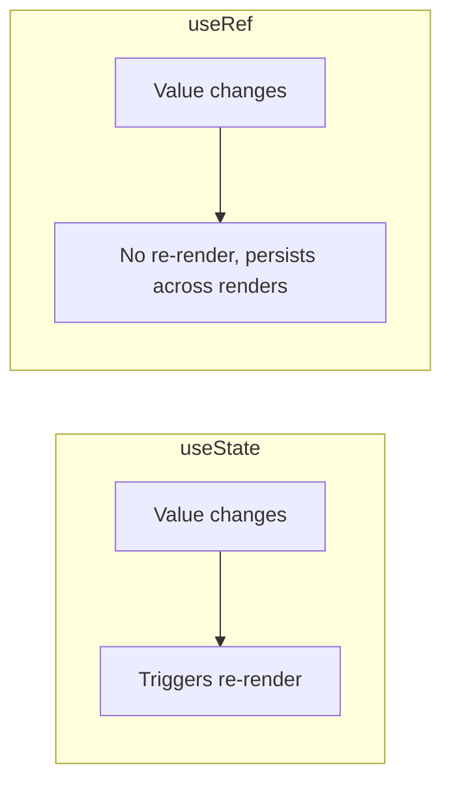
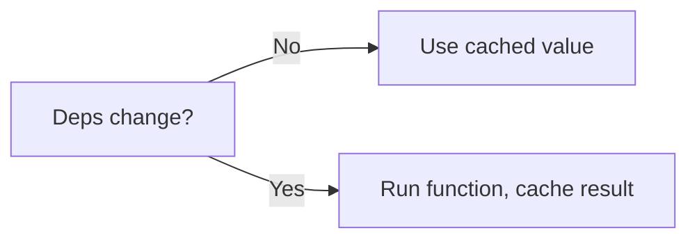

# 📅 Day 7: Common Hooks Deep Dive — useRef, useMemo, useCallback, useId

Hello students 👋 Welcome to **Day 7**! You've mastered `useState` and `useEffect`. Today we go beyond and explore **four more hooks** that senior developers use every day: `useRef`, `useMemo`, `useCallback`, and `useId`.

---

## 1. 🎯 Introduction — What We Learn Today?

- `useRef` — for DOM access + mutable values that don't trigger re-render
- `useMemo` — for caching expensive calculations
- `useCallback` — for caching functions (prevents unnecessary re-renders)
- `useId` — for stable unique IDs
- **When NOT to use them** (very important)

### Why this matters in real projects?
Without these hooks, large apps become slow. With them (used correctly), apps stay fast and smooth. But misuse adds complexity. Senior devs know *when to use* and *when not to use* them.

---

## 2. 📖 Concept Explanation

### useRef
A "box" that holds a value across renders **without** causing re-renders when updated. Also used to reference DOM elements directly.

```tsx
const ref = useRef<HTMLInputElement>(null);
// ref.current gives us direct DOM access
```

### useMemo
Caches the **result** of an expensive calculation. Only recomputes when dependencies change.

```tsx
const expensive = useMemo(() => heavyCalc(n), [n]);
```

### useCallback
Caches a **function reference**. Same function identity as long as dependencies don't change. Helpful when passing callbacks to memoized children.

```tsx
const handle = useCallback(() => doSomething(id), [id]);
```

### useId
Generates a **stable unique ID** — useful for accessibility (labels linked to inputs), especially in SSR.

```tsx
const id = useId();
<label htmlFor={id}>Name</label>
<input id={id} />
```

### When NOT to use them
- Don't wrap every function in `useCallback`. Only when the child is `React.memo` or used in a `useEffect` dep array.
- Don't `useMemo` on cheap math like `a + b`. It costs more to memoize.
- Don't use `useRef` when normal state works.

---

## 3. 💡 Visual Learning

### useRef vs useState



### useMemo flow



---

## 4. 💻 Code Examples

### Example 1 — useRef for DOM access

```tsx
import { useRef } from "react";

function FocusInput() {
  const inputRef = useRef<HTMLInputElement>(null);
  return (
    <>
      <input ref={inputRef} />
      <button onClick={() => inputRef.current?.focus()}>Focus</button>
    </>
  );
}
```

### Example 2 — useRef for mutable value

```tsx
function RenderCounter() {
  const count = useRef(0);
  count.current += 1; // does NOT re-render
  return <p>Rendered {count.current} times</p>;
}
```

### Example 3 — useMemo for expensive calculation

```tsx
import { useMemo, useState } from "react";

function slowFactorial(n: number): number {
  // simulate heavy work
  let r = 1;
  for (let i = 1; i <= n; i++) r *= i;
  return r;
}

function Calc() {
  const [n, setN] = useState(10);
  const [dark, setDark] = useState(false);

  const result = useMemo(() => slowFactorial(n), [n]);
  // toggling dark mode won't recompute

  return (
    <div style={{ background: dark ? "#222" : "#fff", color: dark ? "#fff" : "#000" }}>
      <input type="number" value={n} onChange={(e) => setN(Number(e.target.value))} />
      <p>{n}! = {result}</p>
      <button onClick={() => setDark(!dark)}>Toggle Theme</button>
    </div>
  );
}
```

### Example 4 — useCallback + React.memo

```tsx
import { memo, useCallback, useState } from "react";

type BtnProps = { onClick: () => void; label: string };
const Btn = memo(({ onClick, label }: BtnProps) => {
  console.log("Render:", label);
  return <button onClick={onClick}>{label}</button>;
});

function Parent() {
  const [count, setCount] = useState(0);
  const [other, setOther] = useState(0);

  const inc = useCallback(() => setCount((c) => c + 1), []);
  // without useCallback, Btn re-renders when `other` changes

  return (
    <>
      <Btn onClick={inc} label="Increment" />
      <p>Count: {count}</p>
      <button onClick={() => setOther((o) => o + 1)}>Other: {other}</button>
    </>
  );
}
```

### Example 5 — useId for accessibility

```tsx
import { useId } from "react";

function EmailField() {
  const id = useId();
  return (
    <>
      <label htmlFor={id}>Email</label>
      <input id={id} type="email" />
    </>
  );
}
```

### Example 6 — Debounced search with useRef + useMemo

```tsx
function Search({ data }: { data: string[] }) {
  const [q, setQ] = useState("");
  const timer = useRef<number | null>(null);
  const [debounced, setDebounced] = useState("");

  const handleChange = (e: React.ChangeEvent<HTMLInputElement>) => {
    setQ(e.target.value);
    if (timer.current) clearTimeout(timer.current);
    timer.current = window.setTimeout(() => setDebounced(e.target.value), 300);
  };

  const results = useMemo(
    () => data.filter((d) => d.toLowerCase().includes(debounced.toLowerCase())),
    [debounced, data]
  );

  return (
    <>
      <input value={q} onChange={handleChange} placeholder="Search..." />
      <ul>{results.map((r) => <li key={r}>{r}</li>)}</ul>
    </>
  );
}
```

**Mini question 🤔:** Does changing `ref.current` cause a re-render?
*(No — that's the whole point of `useRef`.)*

---

## 5. 🛠 Hands-on Practice

1. Auto-focus an input on component mount using `useRef`.
2. Count renders using `useRef` without triggering rerenders.
3. Build a factorial calculator with `useMemo`.
4. Build a list with a memoized `Row` + `useCallback`.
5. Create a form with 3 inputs each using `useId`.
6. Debounce a search input (300ms) using `useRef` + timeout.

---

## 6. ⚠️ Common Mistakes

- ❌ Using `useRef` for values that should be state (UI won't update).
- ❌ Using `useMemo` / `useCallback` everywhere → more complex, sometimes slower.
- ❌ Forgetting correct dependency array.
- ❌ Using `Math.random()` / `Date.now()` as IDs instead of `useId`.
- ❌ Mutating a DOM ref before it mounts (null check!).

---

## 7. 📝 Mini Assignment — "Search Optimization App"

Build a search bar:
- Fetch 100 users from API once
- Search box filters client-side
- Use `useMemo` for filtered list
- Use `useRef` to focus input on mount
- Use `useCallback` + `React.memo` for each user row
- Debounce the input 300ms
- Show render count (for fun) using `useRef`

---

## 8. 🔁 Recap

- `useRef` → DOM access + mutable values without re-render
- `useMemo` → cache expensive calculations
- `useCallback` → cache functions for memoized children
- `useId` → stable accessible IDs
- **Don't over-optimize** — only add these when profiling shows a need

### 🎤 Interview Questions (Day 7)
1. Difference between `useState` and `useRef`?
2. When would you use `useMemo`?
3. What problem does `useCallback` solve?
4. What is `React.memo` and how does it relate to `useCallback`?
5. Is `useId` the same as `Math.random()`?

Tomorrow → **Day 8: Custom Hooks** — build your own reusable logic 🧩
