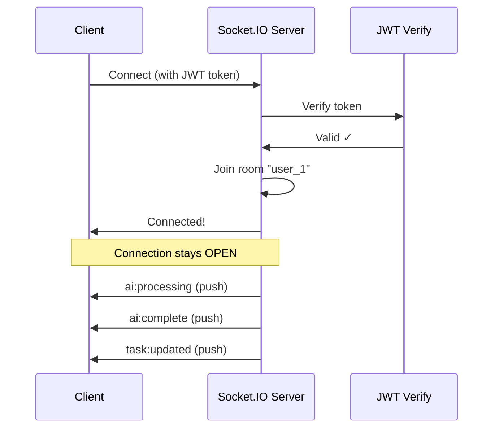
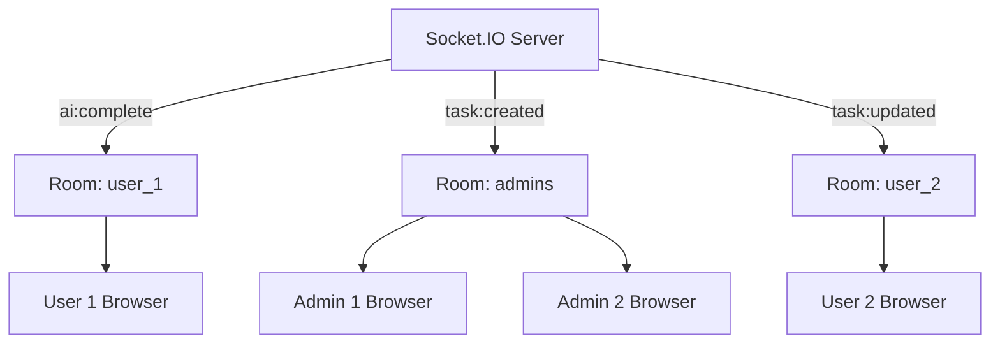
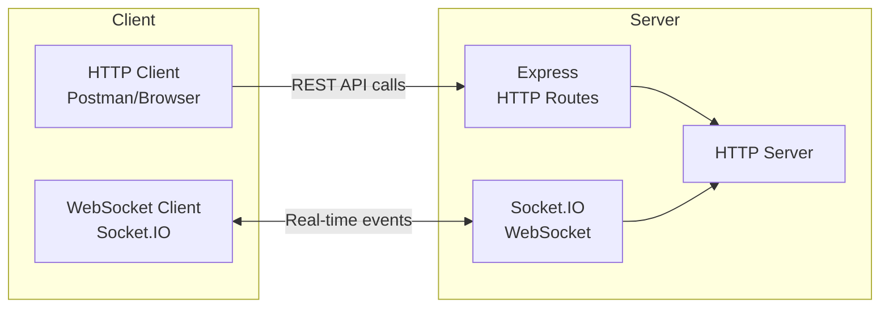

# Day 8: Real-time Notifications (WebSocket)

Hello developers! Welcome to Day 8 of our SmartTask AI project!

Yesterday we integrated ChatGPT. But AI responses can take a few seconds - wouldn't it be great if users got **instant notifications** when their response is ready? Today we add **real-time communication** with WebSockets!

---

## What We Will Build Today

- Setup **WebSocket** server using Socket.IO
- Send **real-time notifications** when AI responses are ready
- Notify users when **tasks are updated**
- Build a simple **notification system**

---

## Why Is This Important?

> Think about WhatsApp. When someone sends you a message, you don't need to refresh the page - it appears **instantly**. That's real-time communication.

**HTTP (Normal APIs):**
```
Client: "Any new messages?" → Server: "No"
Client: "Any new messages?" → Server: "No"
Client: "Any new messages?" → Server: "Yes! Here's one"
(Client keeps asking - wasteful!)
```

**WebSocket (Real-time):**
```
Client: "Hey, I'm connected"
Server: "Got it, I'll tell you when something happens"
...
Server: "New message for you!" (Server pushes to client)
```

---

## Concept Explanation

### HTTP vs WebSocket

| Feature | HTTP | WebSocket |
|---------|------|-----------|
| Connection | Opens and closes each request | Stays open |
| Direction | Client → Server only | Both ways (bidirectional) |
| Use case | CRUD operations | Real-time updates |
| Analogy | Sending letters | Phone call |

### What is Socket.IO?

Socket.IO is a library that makes WebSockets easy. It handles:
- Connection management
- Automatic reconnection
- Room-based messaging (send to specific users)
- Fallback to polling if WebSocket isn't available

### How Rooms Work

```
Room = A channel where specific users listen

Room "user_1" → Only User 1 receives messages
Room "user_2" → Only User 2 receives messages
Room "admins"  → All admins receive messages
```

**Quick Question:** Why do we use rooms instead of broadcasting to everyone?

**Answer:** Privacy and efficiency. When User 1's AI response is ready, only User 1 should be notified - not everyone!

---

## Folder Structure (Updated)

```
SmartTaskAI/
├── src/
│   ├── config/
│   │   ├── database.ts
│   │   ├── mongodb.ts
│   │   ├── openai.ts
│   │   └── socket.ts           ← NEW
│   ├── controllers/
│   │   ├── auth.controller.ts
│   │   ├── user.controller.ts
│   │   ├── task.controller.ts
│   │   ├── log.controller.ts
│   │   └── ai.controller.ts    ← UPDATED
│   ├── entities/
│   ├── models/
│   ├── middlewares/
│   ├── routes/
│   ├── services/
│   │   └── ai.service.ts       ← UPDATED
│   ├── utils/
│   └── index.ts                ← UPDATED
├── .env
├── tsconfig.json
└── package.json
```

---

## Step-by-Step Coding

### Step 1: Install Socket.IO

```bash
npm install socket.io
npm install -D @types/socket.io
```

### Step 2: Create Socket Configuration

Create `src/config/socket.ts`:

```typescript
import { Server as HttpServer } from "http";
import { Server as SocketServer, Socket } from "socket.io";
import { verifyToken } from "../utils/jwt.utils";

let io: SocketServer;

// Initialize Socket.IO server
export const initializeSocket = (httpServer: HttpServer): SocketServer => {
  io = new SocketServer(httpServer, {
    cors: {
      origin: "*", // In production, specify your frontend URL
      methods: ["GET", "POST"],
    },
  });

  // Middleware: Authenticate socket connections
  // Just like our HTTP auth middleware, but for WebSocket
  io.use((socket: Socket, next) => {
    try {
      const token = socket.handshake.auth.token;

      if (!token) {
        return next(new Error("Authentication required"));
      }

      // Verify the JWT token
      const decoded = verifyToken(token);

      // Attach user data to socket
      (socket as any).user = decoded;

      next();
    } catch (error) {
      next(new Error("Invalid token"));
    }
  });

  // Handle new connections
  io.on("connection", (socket: Socket) => {
    const user = (socket as any).user;

    console.log(`User connected: ${user.email} (ID: ${user.userId})`);

    // Join a personal room based on userId
    // This allows us to send messages to specific users
    socket.join(`user_${user.userId}`);

    // If user is admin, also join the admins room
    if (user.role === "admin") {
      socket.join("admins");
    }

    // Listen for client events
    socket.on("ping", () => {
      socket.emit("pong", { message: "Server is alive!", timestamp: new Date() });
    });

    // Handle disconnection
    socket.on("disconnect", () => {
      console.log(`User disconnected: ${user.email}`);
    });
  });

  console.log("Socket.IO initialized!");
  return io;
};

// Get the Socket.IO instance (used by other files to send notifications)
export const getIO = (): SocketServer => {
  if (!io) {
    throw new Error("Socket.IO not initialized!");
  }
  return io;
};
```

### Step 3: Create a Notification Helper

Create `src/utils/notification.ts`:

```typescript
import { getIO } from "../config/socket";

// Helper functions to send notifications to specific users

// Send notification to a specific user
export const notifyUser = (userId: number, event: string, data: any) => {
  try {
    const io = getIO();
    io.to(`user_${userId}`).emit(event, {
      ...data,
      timestamp: new Date(),
    });
  } catch (error) {
    // Socket not initialized - silently fail
    // Notifications are nice-to-have, not critical
    console.warn("Socket notification failed:", error);
  }
};

// Send notification to all admins
export const notifyAdmins = (event: string, data: any) => {
  try {
    const io = getIO();
    io.to("admins").emit(event, {
      ...data,
      timestamp: new Date(),
    });
  } catch (error) {
    console.warn("Socket notification failed:", error);
  }
};

// Send notification to all connected users
export const notifyAll = (event: string, data: any) => {
  try {
    const io = getIO();
    io.emit(event, {
      ...data,
      timestamp: new Date(),
    });
  } catch (error) {
    console.warn("Socket notification failed:", error);
  }
};
```

### Step 4: Update AI Service to Send Notifications

Update `src/services/ai.service.ts` - add notifications:

```typescript
import openai from "../config/openai";
import AIResponse from "../models/AIResponse";
import { Task } from "../entities/Task";
import AppDataSource from "../config/database";
import { notifyUser } from "../utils/notification";

const taskRepository = AppDataSource.getRepository(Task);

export class AIService {
  async getTaskSuggestion(taskId: number, userId: number) {
    const task = await taskRepository.findOneBy({ id: taskId, userId });

    if (!task) {
      throw new Error("Task not found");
    }

    // Notify user that AI is processing
    notifyUser(userId, "ai:processing", {
      message: "AI is analyzing your task...",
      taskId,
    });

    const prompt = `You are a helpful productivity assistant. A user has the following task:

Title: ${task.title}
Description: ${task.description || "No description provided"}
Status: ${task.status}
Priority: ${task.priority}
Due Date: ${task.dueDate ? task.dueDate.toISOString() : "No due date"}

Please provide:
1. A brief analysis of this task
2. 3 actionable steps to complete it
3. Any potential challenges
4. Time estimate

Keep the response concise and practical.`;

    const startTime = Date.now();

    const completion = await openai.chat.completions.create({
      model: "gpt-3.5-turbo",
      messages: [
        {
          role: "system",
          content: "You are a helpful productivity assistant.",
        },
        { role: "user", content: prompt },
      ],
      max_tokens: 500,
      temperature: 0.7,
    });

    const responseTime = Date.now() - startTime;
    const aiText = completion.choices[0]?.message?.content || "No response";
    const tokensUsed = completion.usage?.total_tokens || 0;

    const savedResponse = await AIResponse.create({
      userId,
      taskId,
      prompt,
      response: aiText,
      model: "gpt-3.5-turbo",
      tokensUsed,
      responseTime,
    });

    const result = {
      suggestion: aiText,
      task: { id: task.id, title: task.title, status: task.status },
      metadata: {
        model: "gpt-3.5-turbo",
        tokensUsed,
        responseTime: `${responseTime}ms`,
        savedId: savedResponse._id,
      },
    };

    // Notify user that AI response is ready!
    notifyUser(userId, "ai:complete", {
      message: "AI suggestion is ready!",
      taskId,
      suggestion: aiText,
    });

    return result;
  }

  async getTasksSummary(userId: number) {
    const tasks = await taskRepository.find({
      where: { userId },
      order: { priority: "ASC", dueDate: "ASC" },
    });

    if (tasks.length === 0) {
      throw new Error("No tasks found");
    }

    // Notify user that AI is processing
    notifyUser(userId, "ai:processing", {
      message: "AI is summarizing your tasks...",
    });

    const taskList = tasks
      .map(
        (t, i) =>
          `${i + 1}. [${t.status}] [${t.priority}] ${t.title}${
            t.dueDate ? ` (Due: ${t.dueDate.toISOString().split("T")[0]})` : ""
          }`
      )
      .join("\n");

    const prompt = `You are a productivity expert. Here are a user's tasks:\n\n${taskList}\n\nPlease provide:\n1. A brief overall summary\n2. Priority recommendations\n3. Any tasks at risk\n4. A motivational tip`;

    const startTime = Date.now();

    const completion = await openai.chat.completions.create({
      model: "gpt-3.5-turbo",
      messages: [
        {
          role: "system",
          content: "You are a productivity expert.",
        },
        { role: "user", content: prompt },
      ],
      max_tokens: 600,
      temperature: 0.7,
    });

    const responseTime = Date.now() - startTime;
    const aiText = completion.choices[0]?.message?.content || "No response";
    const tokensUsed = completion.usage?.total_tokens || 0;

    const savedResponse = await AIResponse.create({
      userId,
      taskId: 0,
      prompt,
      response: aiText,
      model: "gpt-3.5-turbo",
      tokensUsed,
      responseTime,
    });

    const result = {
      summary: aiText,
      taskCount: tasks.length,
      metadata: {
        model: "gpt-3.5-turbo",
        tokensUsed,
        responseTime: `${responseTime}ms`,
        savedId: savedResponse._id,
      },
    };

    // Notify user that summary is ready
    notifyUser(userId, "ai:complete", {
      message: "AI summary is ready!",
      summary: aiText,
    });

    return result;
  }

  async getAIHistory(userId: number, limit: number = 10) {
    return await AIResponse.find({ userId })
      .sort({ timestamp: -1 })
      .limit(limit)
      .select("-prompt");
  }

  async getAIResponseById(responseId: string) {
    return await AIResponse.findById(responseId);
  }
}
```

### Step 5: Add Notifications to Task Controller

Update task notifications in `src/controllers/task.controller.ts`. Add at the top:

```typescript
import { notifyUser, notifyAdmins } from "../utils/notification";
```

Then add notifications in the create method (after saving):

```typescript
// In the create method, after task is created:
// Notify admins about new task
notifyAdmins("task:created", {
  message: `New task created by user ${req.user!.userId}`,
  task: { id: task.id, title: task.title },
});

// In the update method, after task is updated:
notifyUser(existingTask.userId, "task:updated", {
  message: `Task "${existingTask.title}" was updated`,
  taskId: existingTask.id,
});

// In the delete method, after task is deleted:
notifyUser(existingTask.userId, "task:deleted", {
  message: `Task "${existingTask.title}" was deleted`,
  taskId: existingTask.id,
});
```

### Step 6: Update index.ts for WebSocket

Update `src/index.ts`:

```typescript
import "reflect-metadata";
import express, { Request, Response } from "express";
import { createServer } from "http";
import cors from "cors";
import dotenv from "dotenv";
import AppDataSource from "./config/database";
import { connectMongoDB } from "./config/mongodb";
import { initializeSocket } from "./config/socket";
import userRoutes from "./routes/user.routes";
import authRoutes from "./routes/auth.routes";
import taskRoutes from "./routes/task.routes";
import logRoutes from "./routes/log.routes";
import aiRoutes from "./routes/ai.routes";

dotenv.config();

const app = express();

// Create HTTP server (needed for Socket.IO)
// Socket.IO needs the raw HTTP server, not just Express
const httpServer = createServer(app);

app.use(express.json());
app.use(cors());

const PORT = process.env.PORT || 3000;

// Health check
app.get("/", (req: Request, res: Response) => {
  res.json({
    success: true,
    message: "SmartTask AI API is running!",
    timestamp: new Date().toISOString(),
  });
});

app.get("/api/health", (req: Request, res: Response) => {
  res.json({
    success: true,
    message: "Server is healthy!",
    environment: process.env.NODE_ENV,
    uptime: process.uptime(),
  });
});

// Routes
app.use("/api/auth", authRoutes);
app.use("/api/users", userRoutes);
app.use("/api/tasks", taskRoutes);
app.use("/api/logs", logRoutes);
app.use("/api/ai", aiRoutes);

// Initialize everything and start server
const startServer = async () => {
  try {
    // Connect PostgreSQL
    await AppDataSource.initialize();
    console.log("PostgreSQL connected!");

    // Connect MongoDB
    await connectMongoDB();

    // Initialize Socket.IO
    initializeSocket(httpServer);

    // Start the HTTP server (not app.listen!)
    // httpServer.listen is used because Socket.IO needs the HTTP server
    httpServer.listen(PORT, () => {
      console.log(`==========================================`);
      console.log(`  SmartTask AI Server`);
      console.log(`  Environment: ${process.env.NODE_ENV}`);
      console.log(`  Running on: http://localhost:${PORT}`);
      console.log(`  PostgreSQL: Connected`);
      console.log(`  MongoDB: Connected`);
      console.log(`  WebSocket: Ready`);
      console.log(`  AI: OpenAI Ready`);
      console.log(`==========================================`);
    });
  } catch (error) {
    console.error("Server startup failed:", error);
    process.exit(1);
  }
};

startServer();

export default app;
```

**Important change:** We switched from `app.listen()` to `httpServer.listen()`. Socket.IO needs the raw HTTP server!

### Step 7: Create a Simple Test Client

Create `src/utils/test-socket.html` (for testing WebSocket in browser):

```html
<!DOCTYPE html>
<html>
<head>
  <title>SmartTask AI - Socket Test</title>
  <script src="https://cdn.socket.io/4.7.4/socket.io.min.js"></script>
  <style>
    body { font-family: Arial; padding: 20px; background: #1a1a2e; color: #e0e0e0; }
    #log { background: #16213e; padding: 15px; border-radius: 8px; max-height: 400px; overflow-y: auto; }
    .event { margin: 5px 0; padding: 8px; border-radius: 4px; }
    .connected { background: #0f3460; color: #00ff88; }
    .notification { background: #1a1a40; color: #00d4ff; }
    .error { background: #3d0000; color: #ff4444; }
    input, button { padding: 8px 16px; margin: 5px; border-radius: 4px; border: none; }
    button { background: #0f3460; color: white; cursor: pointer; }
    input { background: #16213e; color: white; width: 400px; }
  </style>
</head>
<body>
  <h1>SmartTask AI - Real-time Test</h1>

  <div>
    <input id="token" placeholder="Paste your JWT token here" />
    <button onclick="connectSocket()">Connect</button>
    <button onclick="sendPing()">Send Ping</button>
  </div>

  <h3>Events:</h3>
  <div id="log"></div>

  <script>
    let socket;

    function log(message, className = 'notification') {
      const div = document.getElementById('log');
      const time = new Date().toLocaleTimeString();
      div.innerHTML += `<div class="event ${className}">[${time}] ${message}</div>`;
      div.scrollTop = div.scrollHeight;
    }

    function connectSocket() {
      const token = document.getElementById('token').value;
      if (!token) { alert('Enter a token!'); return; }

      socket = io('http://localhost:3000', {
        auth: { token }
      });

      socket.on('connect', () => {
        log('Connected to server!', 'connected');
      });

      socket.on('disconnect', () => {
        log('Disconnected from server', 'error');
      });

      socket.on('connect_error', (err) => {
        log(`Connection error: ${err.message}`, 'error');
      });

      // Listen for all our custom events
      socket.on('pong', (data) => {
        log(`Pong: ${JSON.stringify(data)}`);
      });

      socket.on('ai:processing', (data) => {
        log(`AI Processing: ${data.message}`);
      });

      socket.on('ai:complete', (data) => {
        log(`AI Complete: ${data.message}`);
      });

      socket.on('task:created', (data) => {
        log(`Task Created: ${data.message}`);
      });

      socket.on('task:updated', (data) => {
        log(`Task Updated: ${data.message}`);
      });

      socket.on('task:deleted', (data) => {
        log(`Task Deleted: ${data.message}`);
      });
    }

    function sendPing() {
      if (socket) {
        socket.emit('ping');
        log('Sent ping...', 'connected');
      }
    }
  </script>
</body>
</html>
```

---

## Flow Diagram

### WebSocket Connection Flow



### Notification Flow When AI Responds

```mermaid id="day8-flow2"
flowchart TD
    A[User requests AI suggestion via HTTP] --> B[AI Service processes request]
    B --> C[Sends 'ai:processing' via WebSocket]
    C --> D[User sees "AI is analyzing..."]
    B --> E[Gets response from ChatGPT]
    E --> F[Saves to MongoDB]
    F --> G[Sends 'ai:complete' via WebSocket]
    G --> H[User sees "AI suggestion ready!"]
    E --> I[Returns HTTP response too]
```

### Room-Based Messaging



### HTTP + WebSocket Architecture



---

## Test API (Postman + Browser)

### Step 1: Start the Server

```bash
npm run dev
```

### Step 2: Login to Get a Token

```
POST http://localhost:3000/api/auth/login
Body: { "email": "john@example.com", "password": "password123" }
```

Copy the token from the response.

### Step 3: Open the Test Client

Open `src/utils/test-socket.html` in your browser. Paste the token and click "Connect".

### Step 4: Test Ping

Click "Send Ping" - you should see a "Pong" response in the log.

### Step 5: Test AI Notification

While the socket test page is open, use Postman to:

```
POST http://localhost:3000/api/ai/suggest/1
Headers: Authorization: Bearer <TOKEN>
```

Watch the test page - you should see:
1. "AI Processing: AI is analyzing your task..."
2. "AI Complete: AI suggestion is ready!"

### Step 6: Test Task Notification

```
POST http://localhost:3000/api/tasks
Headers: Authorization: Bearer <TOKEN>
Body: { "title": "Test real-time notification" }
```

Admins connected via WebSocket will see: "Task Created: New task created by user 1"

---

## Common Mistakes

### 1. Using app.listen instead of httpServer.listen
```typescript
// WRONG - Socket.IO won't work!
app.listen(PORT);

// RIGHT - Socket.IO needs the HTTP server
const httpServer = createServer(app);
httpServer.listen(PORT);
```

### 2. Not authenticating WebSocket connections
```typescript
// WRONG - Anyone can connect!
io.on("connection", (socket) => { ... });

// RIGHT - Verify token before allowing connection
io.use((socket, next) => {
  const token = socket.handshake.auth.token;
  // Verify token...
});
```

### 3. Broadcasting when you should target
```typescript
// WRONG - All users see User 1's AI response
io.emit("ai:complete", data);

// RIGHT - Only User 1 sees their response
io.to(`user_${userId}`).emit("ai:complete", data);
```

### 4. Not handling Socket.IO errors gracefully
```typescript
// WRONG - App crashes if socket not initialized
const io = getIO();
io.emit("event", data);

// RIGHT - Wrap in try-catch
try {
  const io = getIO();
  io.to(`user_${userId}`).emit("event", data);
} catch (error) {
  console.warn("Socket not available");
}
```

---

## Recap

Today we accomplished:

- [x] Installed and configured Socket.IO
- [x] Authenticated WebSocket connections with JWT
- [x] Implemented room-based messaging (per user + admins)
- [x] Added real-time notifications for AI processing
- [x] Added task creation/update/delete notifications
- [x] Created a browser test client

### Events We Emit:

| Event | When | Who Receives |
|-------|------|-------------|
| `ai:processing` | AI starts processing | The requesting user |
| `ai:complete` | AI response ready | The requesting user |
| `task:created` | New task created | Admins |
| `task:updated` | Task updated | Task owner |
| `task:deleted` | Task deleted | Task owner |

### What's Coming Tomorrow?

**Day 9: Clean Architecture** - We'll refactor our code with proper error handling, environment configuration, and clean architecture patterns!

---

### Quick Quiz

1. What's the main difference between HTTP and WebSocket?
2. What is a "room" in Socket.IO?
3. Why do we use `httpServer.listen()` instead of `app.listen()`?
4. How do we authenticate WebSocket connections?
5. What does `io.to('user_1').emit()` do?

**Answers:**
1. HTTP is request-response (client asks, server answers). WebSocket is bidirectional (both can send anytime, connection stays open).
2. A room is a channel that groups specific sockets together - messages sent to a room only reach members of that room.
3. Socket.IO needs the raw HTTP server to attach to. Express's `app.listen()` creates one internally, but we need direct access.
4. Using a Socket.IO middleware that extracts and verifies the JWT token from `socket.handshake.auth.token`.
5. It sends an event only to sockets in the room called "user_1" (i.e., only to User 1).

---

> **Great job completing Day 8!** Your app now has real-time powers. Tomorrow we clean up the architecture!
