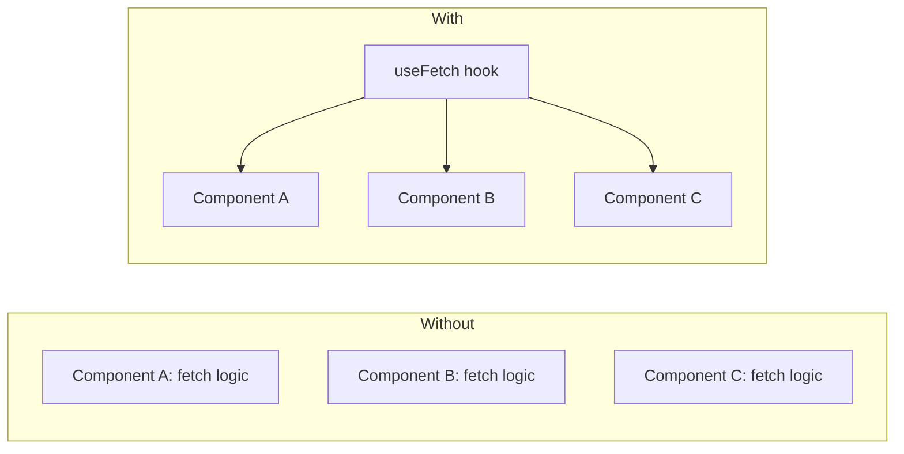
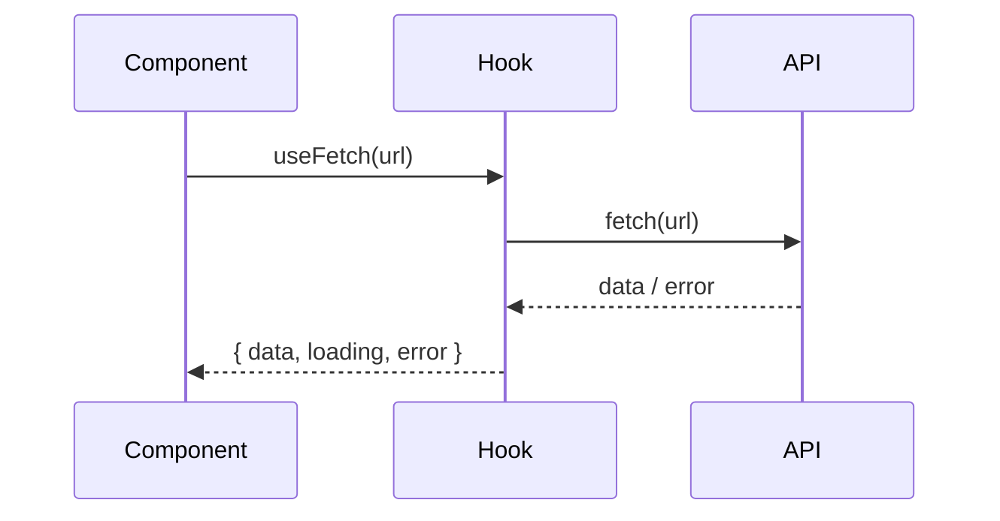

# 📅 Day 8: Custom Hooks — Build Your Own Reusable Logic

Hello students 👋 Welcome to **Day 8**! You've learned many built-in hooks. Today, we learn a **superpower**: building **your own custom hooks**. This is how professional React developers keep code clean and reusable.

---

## 1. 🎯 Introduction — What We Learn Today?

- Why custom hooks?
- Rules of custom hooks
- Build `useFetch` — reusable data fetching
- Build `useLocalStorage` — persistent state
- Build `useToggle`, `useDebounce` (bonus)

### Why this matters in real projects?
In real apps, you'll fetch data in 20 different components. Repeating the same code (loading, error, success) everywhere is wasteful. Custom hooks solve this elegantly — write once, reuse everywhere.

---

## 2. 📖 Concept Explanation

### What is a Custom Hook?
A **custom hook** is just a JavaScript function that:
1. Starts with the word `use` (e.g., `useFetch`, `useCart`)
2. Can call other hooks (`useState`, `useEffect`, etc.)
3. Returns whatever the consumer needs (value, setter, functions)

> It's like creating your **own `useState`** tailored to your app's needs.

### Why use custom hooks?
- DRY (Don't Repeat Yourself)
- Separation of concerns (logic ↔ UI)
- Easier unit testing
- Cleaner components

### Rules of custom hooks
- Name **must** start with `use`
- Must be called at the **top level** of a component or another hook
- Cannot be called inside loops, conditions, or regular functions

---

## 3. 💡 Visual Learning

### Without custom hook vs With custom hook



### Custom hook flow



---

## 4. 💻 Code Examples

### Example 1 — `useToggle`

```tsx
import { useState } from "react";

export function useToggle(initial = false) {
  const [on, setOn] = useState(initial);
  const toggle = () => setOn((p) => !p);
  return { on, toggle, setOn };
}

// usage
const { on, toggle } = useToggle();
<button onClick={toggle}>{on ? "ON" : "OFF"}</button>
```

### Example 2 — `useFetch`

```tsx
import { useEffect, useState } from "react";

type FetchState<T> = {
  data: T | null;
  loading: boolean;
  error: string | null;
};

export function useFetch<T>(url: string): FetchState<T> {
  const [state, setState] = useState<FetchState<T>>({
    data: null,
    loading: true,
    error: null,
  });

  useEffect(() => {
    const controller = new AbortController();
    setState({ data: null, loading: true, error: null });

    fetch(url, { signal: controller.signal })
      .then((r) => {
        if (!r.ok) throw new Error(`Error ${r.status}`);
        return r.json() as Promise<T>;
      })
      .then((data) => setState({ data, loading: false, error: null }))
      .catch((err) => {
        if (err.name !== "AbortError")
          setState({ data: null, loading: false, error: err.message });
      });

    return () => controller.abort();
  }, [url]);

  return state;
}
```

Usage:

```tsx
type User = { id: number; name: string };

function Users() {
  const { data, loading, error } = useFetch<User[]>(
    "https://jsonplaceholder.typicode.com/users"
  );

  if (loading) return <p>Loading...</p>;
  if (error) return <p>{error}</p>;

  return <ul>{data?.map((u) => <li key={u.id}>{u.name}</li>)}</ul>;
}
```

### Example 3 — `useLocalStorage`

```tsx
import { useEffect, useState } from "react";

export function useLocalStorage<T>(key: string, initial: T) {
  const [value, setValue] = useState<T>(() => {
    const stored = localStorage.getItem(key);
    return stored ? (JSON.parse(stored) as T) : initial;
  });

  useEffect(() => {
    localStorage.setItem(key, JSON.stringify(value));
  }, [key, value]);

  return [value, setValue] as const;
}

// usage
const [theme, setTheme] = useLocalStorage<"light" | "dark">("theme", "light");
```

### Example 4 — `useDebounce`

```tsx
import { useEffect, useState } from "react";

export function useDebounce<T>(value: T, delay = 300): T {
  const [debounced, setDebounced] = useState(value);
  useEffect(() => {
    const id = setTimeout(() => setDebounced(value), delay);
    return () => clearTimeout(id);
  }, [value, delay]);
  return debounced;
}

// usage
const [q, setQ] = useState("");
const dq = useDebounce(q, 400);
useEffect(() => { /* call API with dq */ }, [dq]);
```

### Example 5 — `useWindowSize`

```tsx
import { useEffect, useState } from "react";

export function useWindowSize() {
  const [size, setSize] = useState({ w: window.innerWidth, h: window.innerHeight });
  useEffect(() => {
    const handler = () => setSize({ w: window.innerWidth, h: window.innerHeight });
    window.addEventListener("resize", handler);
    return () => window.removeEventListener("resize", handler);
  }, []);
  return size;
}
```

**Mini question 🤔:** Does a custom hook MUST call another hook?
*(Yes — if it doesn't use any React hook, it's just a regular utility function.)*

---

## 5. 🛠 Hands-on Practice

1. Build `useToggle` and use it in a modal open/close.
2. Build `useCounter` with `increment`, `decrement`, `reset`.
3. Build `useFetch` and fetch posts.
4. Build `useLocalStorage` and persist a username.
5. Build `useDebounce` for a search input.
6. Build `useWindowSize` and show current screen width.

---

## 6. ⚠️ Common Mistakes

- ❌ Not starting with `use` → linter warnings, rule violations.
- ❌ Calling hooks conditionally inside custom hook.
- ❌ Not cleaning up subscriptions / aborts.
- ❌ Not generic-typing (`<T>`) — losing type safety.
- ❌ Forgetting `as const` when returning tuples.
- ❌ Memoizing expensive state that shouldn't be cached.

---

## 7. 📝 Mini Assignment — "Theme Switcher"

Build a theme switcher:
- Use `useLocalStorage` to persist `"light" | "dark"`.
- Create a `ThemeToggle` button component.
- Apply theme to `document.body` via `useEffect`.
- Build a `useToggle` hook and use it for a "show settings" panel.
- Bonus: show current `useWindowSize` values in a corner.

---

## 8. 🔁 Recap

- Custom hooks extract reusable logic
- Must start with `use`
- Obey Rules of Hooks
- Keep them small & typed with generics
- Common examples: `useFetch`, `useLocalStorage`, `useDebounce`

### 🎤 Interview Questions (Day 8)
1. What is a custom hook?
2. Why do names start with `use`?
3. Give a real use case of `useFetch`.
4. Can I call a hook conditionally inside a custom hook?
5. Difference between a utility function and a custom hook?

Tomorrow → **Day 9: Context API** — goodbye prop drilling 🚀
