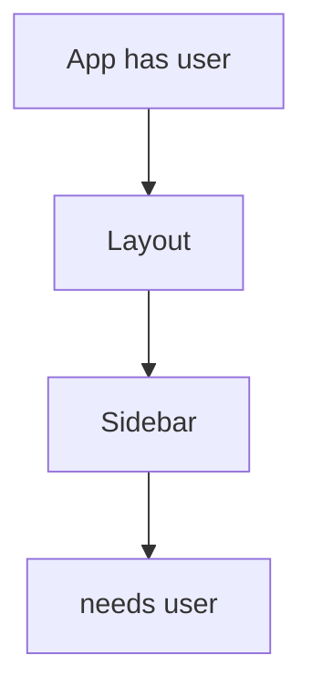
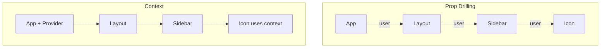
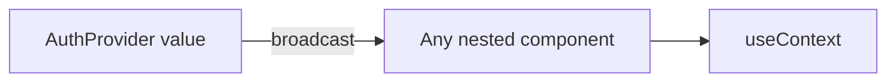

# 📅 Day 9: Context API — Goodbye Prop Drilling

Hello students 👋 Welcome to **Day 9**! Today we solve one of the biggest pain points in React: **prop drilling**. We'll learn the **Context API** — React's built-in way to share data globally.

---

## 1. 🎯 Introduction — What We Learn Today?

- What is prop drilling (and why it's bad)?
- `createContext`, `useContext`, `Provider` pattern
- Global state: theme, auth, cart
- Prop drilling vs Context vs Redux — when to use which

### Why this matters in real projects?
Auth info, theme, language, currency, cart — these are needed by many components. Passing props through 5 levels is painful. Context makes it easy and clean.

---

## 2. 📖 Concept Explanation

### Prop Drilling 😩
Passing props through many layers just to reach a deep child.



Every middle component must pass `user` even if it doesn't use it.

### Context API 🎉
A "broadcast channel". The **Provider** publishes data, and any component inside can **subscribe** via `useContext` — no matter how deep.

### 3-step pattern
1. `const MyContext = createContext(defaultValue)`
2. Wrap children: `<MyContext.Provider value={...}>`
3. Read: `const x = useContext(MyContext)`

### Prop Drilling vs Context vs Redux

| Feature | Prop Drilling | Context | Redux |
|---------|---------------|---------|-------|
| Setup | None | Light | Heavy |
| Scale | Small | Medium | Large |
| Debugging | Easy | Medium | Excellent (Redux DevTools) |
| Async | Manual | Manual | Middleware (Thunk) |
| Best for | 2-3 levels | Theme/Auth/Lang | Complex state, many slices |

---

## 3. 💡 Visual Learning

### Prop drilling vs Context



### Provider pattern



---

## 4. 💻 Code Examples

### Example 1 — ThemeContext

```tsx
// src/context/ThemeContext.tsx
import { createContext, useContext, useState, ReactNode } from "react";

type Theme = "light" | "dark";

type ThemeCtx = {
  theme: Theme;
  toggle: () => void;
};

const ThemeContext = createContext<ThemeCtx | undefined>(undefined);

export function ThemeProvider({ children }: { children: ReactNode }) {
  const [theme, setTheme] = useState<Theme>("light");
  const toggle = () => setTheme((t) => (t === "light" ? "dark" : "light"));
  return (
    <ThemeContext.Provider value={{ theme, toggle }}>
      {children}
    </ThemeContext.Provider>
  );
}

export function useTheme() {
  const ctx = useContext(ThemeContext);
  if (!ctx) throw new Error("useTheme must be used within ThemeProvider");
  return ctx;
}
```

```tsx
// src/main.tsx
import { ThemeProvider } from "./context/ThemeContext";
<ThemeProvider>
  <App />
</ThemeProvider>
```

```tsx
// usage
function Navbar() {
  const { theme, toggle } = useTheme();
  return <button onClick={toggle}>Current: {theme}</button>;
}
```

### Example 2 — AuthContext

```tsx
type User = { id: number; name: string; email: string };
type AuthCtx = {
  user: User | null;
  login: (u: User) => void;
  logout: () => void;
};
const AuthContext = createContext<AuthCtx | undefined>(undefined);

export function AuthProvider({ children }: { children: ReactNode }) {
  const [user, setUser] = useState<User | null>(null);
  const login = (u: User) => setUser(u);
  const logout = () => setUser(null);
  return (
    <AuthContext.Provider value={{ user, login, logout }}>
      {children}
    </AuthContext.Provider>
  );
}
export const useAuth = () => {
  const ctx = useContext(AuthContext);
  if (!ctx) throw new Error("useAuth must be inside AuthProvider");
  return ctx;
};
```

### Example 3 — CartContext

```tsx
type Item = { id: number; title: string; price: number; qty: number };
type CartCtx = {
  items: Item[];
  add: (i: Omit<Item, "qty">) => void;
  remove: (id: number) => void;
  total: number;
};
const CartContext = createContext<CartCtx | undefined>(undefined);

export function CartProvider({ children }: { children: ReactNode }) {
  const [items, setItems] = useState<Item[]>([]);

  const add = (item: Omit<Item, "qty">) => {
    setItems((prev) => {
      const existing = prev.find((p) => p.id === item.id);
      if (existing)
        return prev.map((p) =>
          p.id === item.id ? { ...p, qty: p.qty + 1 } : p
        );
      return [...prev, { ...item, qty: 1 }];
    });
  };

  const remove = (id: number) =>
    setItems((prev) => prev.filter((p) => p.id !== id));

  const total = items.reduce((sum, i) => sum + i.price * i.qty, 0);

  return (
    <CartContext.Provider value={{ items, add, remove, total }}>
      {children}
    </CartContext.Provider>
  );
}
export const useCart = () => {
  const ctx = useContext(CartContext);
  if (!ctx) throw new Error("useCart needs CartProvider");
  return ctx;
};
```

### Example 4 — Combining multiple providers

```tsx
<ThemeProvider>
  <AuthProvider>
    <CartProvider>
      <App />
    </CartProvider>
  </AuthProvider>
</ThemeProvider>
```

**Mini question 🤔:** Does Context replace Redux completely?
*(No. Context works great for small/simple global state. Redux wins for complex apps needing DevTools, middleware, and clear architecture.)*

---

## 5. 🛠 Hands-on Practice

1. Create a ThemeContext and toggle light/dark mode.
2. Create AuthContext — login/logout buttons flip UI.
3. Create CartContext with add/remove items.
4. Read theme inside a deeply nested component.
5. Combine 3 providers in `main.tsx`.
6. Persist theme using `localStorage` inside Provider.

---

## 6. ⚠️ Common Mistakes

- ❌ Creating context without a default/undefined check → runtime bugs.
- ❌ Putting too much state in one Context (re-renders everything).
- ❌ Forgetting to wrap the app in `<Provider>`.
- ❌ Using Context for high-frequency state (use Redux or local state).
- ❌ Not memoizing provider value → unnecessary re-renders of consumers.

---

## 7. 📝 Mini Assignment — "Dark Mode + Auth Context"

Build an app with:
- **ThemeProvider** (light/dark)
- **AuthProvider** (user/login/logout)
- Navbar shows current theme toggle + login/logout button
- If not logged in → show "Please login"
- If logged in → show user name + logout button
- Persist theme + user via `localStorage`

---

## 8. 🔁 Recap

- Context removes prop drilling
- 3 steps: createContext → Provider → useContext
- Best for app-wide concerns: theme, auth, language
- Keep contexts small & focused
- Wrap in a custom hook like `useTheme()` for safety

### 🎤 Interview Questions (Day 9)
1. What problem does Context API solve?
2. Can Context replace Redux?
3. Performance concerns with Context?
4. How do you split a Context?
5. When should you NOT use Context?

Tomorrow → **Day 10: useReducer** — advanced state management 🧠
