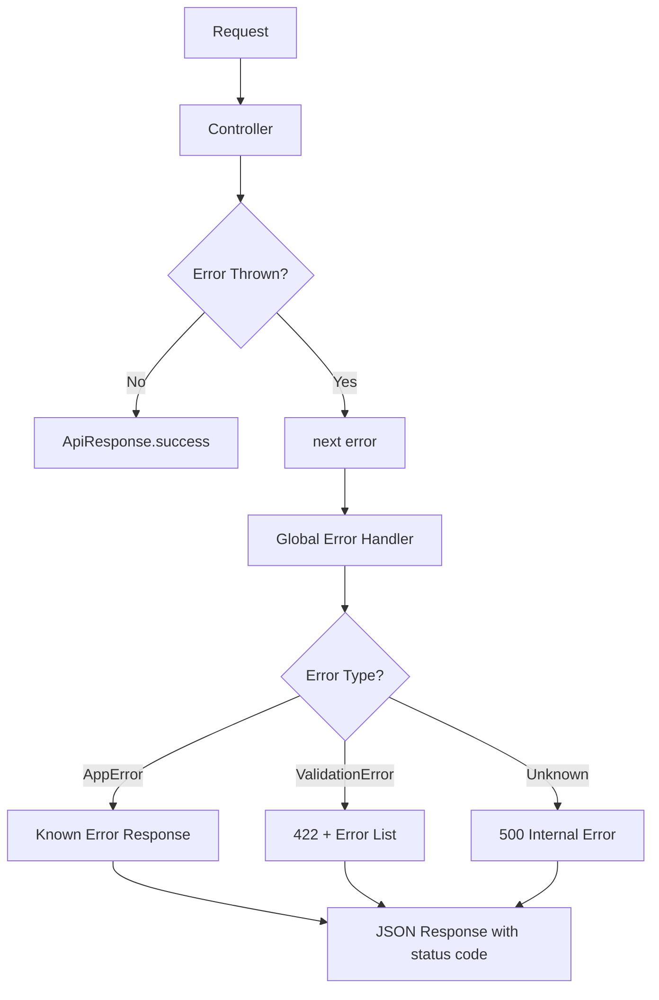
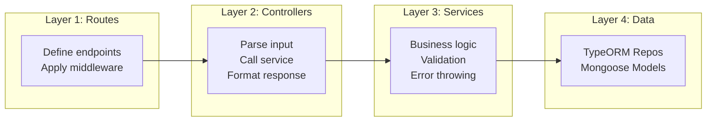
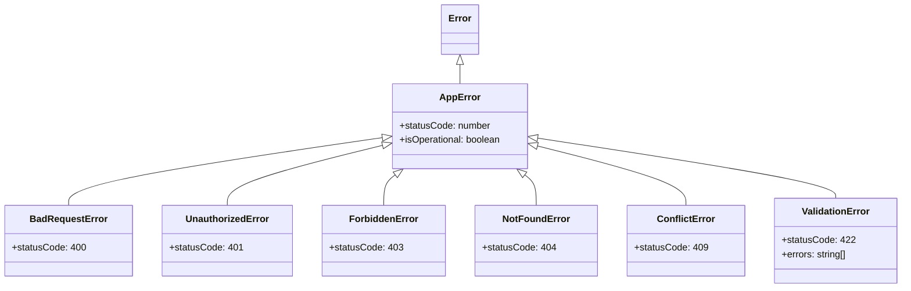
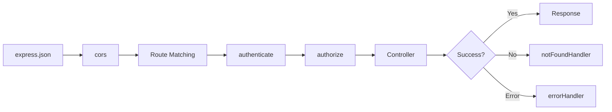

# Day 9: Clean Architecture & Error Handling

Hello developers! Welcome to Day 9 of our SmartTask AI project!

We've built a lot of features over the past 8 days. Today we step back and **clean up our code**. We'll add proper error handling, environment validation, and organize our code following clean architecture principles.

---

## What We Will Build Today

- **Global error handling** middleware
- **Custom error classes** for consistent errors
- **Environment validation** (fail fast if config is missing)
- **Request validation** utility
- **Response formatting** utility
- **Clean up** controllers and services

---

## Why Is This Important?

> Imagine a chef who cooks amazing food but leaves the kitchen a mess. Eventually, the mess slows them down, causes mistakes, and makes it hard for other chefs to help. **Clean code is a clean kitchen.**

Benefits of clean architecture:
- **Easier debugging** - errors give clear messages
- **Team-friendly** - new developers understand the code quickly
- **Scalable** - adding features doesn't create chaos
- **Production-ready** - handles edge cases gracefully

---

## Concept Explanation

### Error Handling Strategy

```
Without Error Handling:
- Server crashes on unexpected errors
- Users see ugly technical errors
- No way to track what went wrong

With Error Handling:
- Server stays running
- Users see friendly error messages
- All errors are logged and traceable
```

### The Error Handling Pyramid

```
1. Validation errors (400)   - Bad input from user
2. Auth errors (401/403)     - Not logged in or not allowed
3. Not found errors (404)    - Resource doesn't exist
4. Business logic errors     - Custom application rules
5. Server errors (500)       - Unexpected crashes
```

### Clean Architecture Layers

```
Request → Middleware → Controller → Service → Repository → Database
                                      ↑
                              Business Logic
                              Error Handling
                              Validation
```

Each layer has ONE responsibility:
- **Controller**: Parse request, call service, format response
- **Service**: Business logic, validation, error throwing
- **Repository**: Database operations only

---

## Folder Structure (Updated)

```
SmartTaskAI/
├── src/
│   ├── config/
│   │   ├── database.ts
│   │   ├── mongodb.ts
│   │   ├── openai.ts
│   │   ├── socket.ts
│   │   └── env.ts              ← NEW: Environment validation
│   ├── controllers/
│   │   ├── auth.controller.ts  ← UPDATED
│   │   ├── user.controller.ts
│   │   ├── task.controller.ts  ← UPDATED
│   │   ├── log.controller.ts
│   │   └── ai.controller.ts
│   ├── entities/
│   │   ├── User.ts
│   │   └── Task.ts
│   ├── models/
│   │   ├── ActivityLog.ts
│   │   └── AIResponse.ts
│   ├── middlewares/
│   │   ├── auth.middleware.ts
│   │   ├── role.middleware.ts
│   │   └── error.middleware.ts  ← NEW: Global error handler
│   ├── routes/
│   │   ├── auth.routes.ts
│   │   ├── user.routes.ts
│   │   ├── task.routes.ts
│   │   ├── log.routes.ts
│   │   └── ai.routes.ts
│   ├── services/
│   │   ├── auth.service.ts
│   │   ├── user.service.ts
│   │   ├── task.service.ts
│   │   ├── log.service.ts
│   │   └── ai.service.ts
│   ├── utils/
│   │   ├── jwt.utils.ts
│   │   ├── seed.ts
│   │   ├── notification.ts
│   │   ├── errors.ts           ← NEW: Custom error classes
│   │   └── response.ts         ← NEW: Response formatter
│   └── index.ts                ← UPDATED
├── .env
├── .env.example                ← NEW: Example env file
├── tsconfig.json
└── package.json
```

---

## Step-by-Step Coding

### Step 1: Create Custom Error Classes

Create `src/utils/errors.ts`:

```typescript
// Base class for all custom errors
// By extending Error, we get stack traces automatically
export class AppError extends Error {
  public statusCode: number;
  public isOperational: boolean;

  constructor(message: string, statusCode: number) {
    super(message);
    this.statusCode = statusCode;
    this.isOperational = true; // Distinguishes expected errors from bugs

    // Maintains proper stack trace
    Error.captureStackTrace(this, this.constructor);
  }
}

// 400 - Bad Request (invalid input)
export class BadRequestError extends AppError {
  constructor(message: string = "Bad request") {
    super(message, 400);
  }
}

// 401 - Unauthorized (not logged in)
export class UnauthorizedError extends AppError {
  constructor(message: string = "Authentication required") {
    super(message, 401);
  }
}

// 403 - Forbidden (no permission)
export class ForbiddenError extends AppError {
  constructor(message: string = "Access denied") {
    super(message, 403);
  }
}

// 404 - Not Found
export class NotFoundError extends AppError {
  constructor(resource: string = "Resource") {
    super(`${resource} not found`, 404);
  }
}

// 409 - Conflict (duplicate)
export class ConflictError extends AppError {
  constructor(message: string = "Resource already exists") {
    super(message, 409);
  }
}

// 422 - Validation Error
export class ValidationError extends AppError {
  public errors: string[];

  constructor(errors: string[]) {
    super("Validation failed", 422);
    this.errors = errors;
  }
}
```

**Why custom errors?**
- Controllers don't need to know HTTP status codes
- Services just throw the right error type
- The global error handler formats everything consistently

### Step 2: Create Response Formatter

Create `src/utils/response.ts`:

```typescript
import { Response } from "express";

// Consistent response format for all API endpoints
// Every response from our API will have the same structure

export class ApiResponse {
  // Success response
  static success(
    res: Response,
    data: any = null,
    message: string = "Success",
    statusCode: number = 200
  ) {
    return res.status(statusCode).json({
      success: true,
      message,
      data,
      timestamp: new Date().toISOString(),
    });
  }

  // Created response (201)
  static created(
    res: Response,
    data: any = null,
    message: string = "Created successfully"
  ) {
    return this.success(res, data, message, 201);
  }

  // Error response
  static error(
    res: Response,
    message: string = "Internal server error",
    statusCode: number = 500,
    errors: string[] = []
  ) {
    return res.status(statusCode).json({
      success: false,
      message,
      errors: errors.length > 0 ? errors : undefined,
      timestamp: new Date().toISOString(),
    });
  }
}
```

### Step 3: Create Global Error Handler Middleware

Create `src/middlewares/error.middleware.ts`:

```typescript
import { Request, Response, NextFunction } from "express";
import { AppError, ValidationError } from "../utils/errors";

// Global error handling middleware
// This catches ALL errors thrown in the application
// Must have 4 parameters (err, req, res, next) for Express to recognize it

export const errorHandler = (
  err: Error,
  req: Request,
  res: Response,
  next: NextFunction
): void => {
  // Log the error for debugging
  console.error(`[ERROR] ${err.message}`);
  if (process.env.NODE_ENV === "development") {
    console.error(err.stack);
  }

  // Handle our custom AppError instances
  if (err instanceof ValidationError) {
    res.status(err.statusCode).json({
      success: false,
      message: err.message,
      errors: err.errors,
      timestamp: new Date().toISOString(),
    });
    return;
  }

  if (err instanceof AppError) {
    res.status(err.statusCode).json({
      success: false,
      message: err.message,
      timestamp: new Date().toISOString(),
    });
    return;
  }

  // Handle TypeORM errors
  if (err.name === "QueryFailedError") {
    res.status(400).json({
      success: false,
      message: "Database query failed",
      timestamp: new Date().toISOString(),
    });
    return;
  }

  // Handle JSON parse errors
  if (err.name === "SyntaxError") {
    res.status(400).json({
      success: false,
      message: "Invalid JSON in request body",
      timestamp: new Date().toISOString(),
    });
    return;
  }

  // Handle unknown/unexpected errors
  // In production, don't expose error details
  res.status(500).json({
    success: false,
    message:
      process.env.NODE_ENV === "production"
        ? "Internal server error"
        : err.message,
    timestamp: new Date().toISOString(),
  });
};

// 404 handler for unmatched routes
export const notFoundHandler = (
  req: Request,
  res: Response,
  next: NextFunction
): void => {
  res.status(404).json({
    success: false,
    message: `Route ${req.method} ${req.originalUrl} not found`,
    timestamp: new Date().toISOString(),
  });
};
```

### Step 4: Create Environment Validation

Create `src/config/env.ts`:

```typescript
import dotenv from "dotenv";

// Load .env file
dotenv.config();

// Validate that all required environment variables are present
// This runs at startup - the app won't start if config is missing

interface EnvConfig {
  // Server
  PORT: number;
  NODE_ENV: string;

  // PostgreSQL
  PG_HOST: string;
  PG_PORT: number;
  PG_USERNAME: string;
  PG_PASSWORD: string;
  PG_DATABASE: string;

  // MongoDB
  MONGO_URI: string;

  // JWT
  JWT_SECRET: string;
  JWT_EXPIRES_IN: string;

  // OpenAI
  OPENAI_API_KEY: string;
}

// Helper to get required env var (throws if missing)
function getRequired(key: string): string {
  const value = process.env[key];
  if (!value) {
    throw new Error(`Missing required environment variable: ${key}`);
  }
  return value;
}

// Helper to get optional env var with default
function getOptional(key: string, defaultValue: string): string {
  return process.env[key] || defaultValue;
}

// Validate and export all config
export const env: EnvConfig = {
  PORT: parseInt(getOptional("PORT", "3000")),
  NODE_ENV: getOptional("NODE_ENV", "development"),

  PG_HOST: getOptional("PG_HOST", "localhost"),
  PG_PORT: parseInt(getOptional("PG_PORT", "5432")),
  PG_USERNAME: getOptional("PG_USERNAME", "postgres"),
  PG_PASSWORD: getRequired("PG_PASSWORD"),
  PG_DATABASE: getOptional("PG_DATABASE", "smarttask_db"),

  MONGO_URI: getOptional("MONGO_URI", "mongodb://localhost:27017/smarttask_logs"),

  JWT_SECRET: getRequired("JWT_SECRET"),
  JWT_EXPIRES_IN: getOptional("JWT_EXPIRES_IN", "7d"),

  OPENAI_API_KEY: getOptional("OPENAI_API_KEY", ""),
};

// Log config status (without sensitive values!)
export const logConfig = () => {
  console.log("Configuration loaded:");
  console.log(`  Environment: ${env.NODE_ENV}`);
  console.log(`  Port: ${env.PORT}`);
  console.log(`  PostgreSQL: ${env.PG_HOST}:${env.PG_PORT}/${env.PG_DATABASE}`);
  console.log(`  MongoDB: ${env.MONGO_URI ? "Configured" : "Not configured"}`);
  console.log(`  JWT: ${env.JWT_SECRET ? "Configured" : "Not configured"}`);
  console.log(`  OpenAI: ${env.OPENAI_API_KEY ? "Configured" : "Not configured"}`);
};
```

### Step 5: Create Example .env File

Create `.env.example`:

```env
# Server
PORT=3000
NODE_ENV=development

# PostgreSQL (REQUIRED)
PG_HOST=localhost
PG_PORT=5432
PG_USERNAME=postgres
PG_PASSWORD=your_password_here
PG_DATABASE=smarttask_db

# MongoDB
MONGO_URI=mongodb://localhost:27017/smarttask_logs

# JWT (REQUIRED)
JWT_SECRET=your_super_secret_key_change_this
JWT_EXPIRES_IN=7d

# OpenAI
OPENAI_API_KEY=sk-your-api-key-here
```

### Step 6: Refactor a Controller Using Clean Patterns

Let's refactor `src/controllers/task.controller.ts` as an example of the clean approach:

```typescript
import { Request, Response, NextFunction } from "express";
import { TaskService } from "../services/task.service";
import { LogService } from "../services/log.service";
import { ApiResponse } from "../utils/response";
import {
  BadRequestError,
  ForbiddenError,
  NotFoundError,
} from "../utils/errors";
import { notifyAdmins, notifyUser } from "../utils/notification";

const taskService = new TaskService();
const logService = new LogService();

export class TaskController {
  // Using asyncHandler pattern: let errors bubble up to global handler
  async create(req: Request, res: Response, next: NextFunction): Promise<void> {
    try {
      const { title, description, priority, dueDate } = req.body;
      const userId = req.user!.userId;

      // Validation - throw specific errors
      if (!title) {
        throw new BadRequestError("Task title is required");
      }

      const task = await taskService.createTask({
        title,
        description,
        priority,
        dueDate: dueDate ? new Date(dueDate) : undefined,
        userId,
      });

      // Log activity (fire-and-forget)
      logService.logActivity({
        userId,
        action: "create_task",
        resource: "task",
        resourceId: String(task.id),
        details: { title: task.title, priority: task.priority },
        ipAddress: req.ip,
      }).catch(console.error);

      // Notify admins
      notifyAdmins("task:created", {
        message: `New task created by user ${userId}`,
        task: { id: task.id, title: task.title },
      });

      // Consistent response format
      ApiResponse.created(res, task, "Task created successfully");
    } catch (error) {
      next(error); // Pass to global error handler
    }
  }

  async getAll(req: Request, res: Response, next: NextFunction): Promise<void> {
    try {
      let tasks;

      if (req.user!.role === "admin") {
        tasks = await taskService.getAllTasks();
        tasks = tasks.map((task) => {
          if (task.user) {
            const { password, ...userWithoutPassword } = task.user;
            return { ...task, user: userWithoutPassword };
          }
          return task;
        });
      } else {
        tasks = await taskService.getTasksByUser(req.user!.userId);
      }

      ApiResponse.success(res, { tasks, count: tasks.length });
    } catch (error) {
      next(error);
    }
  }

  async getStats(req: Request, res: Response, next: NextFunction): Promise<void> {
    try {
      const stats = await taskService.getTaskStats(req.user!.userId);
      ApiResponse.success(res, stats);
    } catch (error) {
      next(error);
    }
  }

  async getById(req: Request, res: Response, next: NextFunction): Promise<void> {
    try {
      const id = parseInt(req.params.id);
      if (isNaN(id)) throw new BadRequestError("Invalid task ID");

      const task = await taskService.getTaskById(id);
      if (!task) throw new NotFoundError("Task");

      // Ownership check
      if (req.user!.role !== "admin" && task.userId !== req.user!.userId) {
        throw new ForbiddenError("You can only view your own tasks");
      }

      ApiResponse.success(res, task);
    } catch (error) {
      next(error);
    }
  }

  async update(req: Request, res: Response, next: NextFunction): Promise<void> {
    try {
      const id = parseInt(req.params.id);
      if (isNaN(id)) throw new BadRequestError("Invalid task ID");

      const existingTask = await taskService.getTaskById(id);
      if (!existingTask) throw new NotFoundError("Task");

      if (req.user!.role !== "admin" && existingTask.userId !== req.user!.userId) {
        throw new ForbiddenError("You can only update your own tasks");
      }

      const { userId, ...updateData } = req.body;
      if (updateData.dueDate) updateData.dueDate = new Date(updateData.dueDate);

      const updatedTask = await taskService.updateTask(id, updateData);

      // Log and notify
      logService.logActivity({
        userId: req.user!.userId,
        action: "update_task",
        resource: "task",
        resourceId: String(id),
        details: { changes: updateData },
        ipAddress: req.ip,
      }).catch(console.error);

      notifyUser(existingTask.userId, "task:updated", {
        message: `Task "${existingTask.title}" was updated`,
        taskId: id,
      });

      ApiResponse.success(res, updatedTask, "Task updated successfully");
    } catch (error) {
      next(error);
    }
  }

  async delete(req: Request, res: Response, next: NextFunction): Promise<void> {
    try {
      const id = parseInt(req.params.id);
      if (isNaN(id)) throw new BadRequestError("Invalid task ID");

      const existingTask = await taskService.getTaskById(id);
      if (!existingTask) throw new NotFoundError("Task");

      if (req.user!.role !== "admin" && existingTask.userId !== req.user!.userId) {
        throw new ForbiddenError("You can only delete your own tasks");
      }

      await taskService.deleteTask(id);

      // Log and notify
      logService.logActivity({
        userId: req.user!.userId,
        action: "delete_task",
        resource: "task",
        resourceId: String(id),
        details: { title: existingTask.title },
        ipAddress: req.ip,
      }).catch(console.error);

      notifyUser(existingTask.userId, "task:deleted", {
        message: `Task "${existingTask.title}" was deleted`,
        taskId: id,
      });

      ApiResponse.success(res, null, "Task deleted successfully");
    } catch (error) {
      next(error);
    }
  }
}
```

### Step 7: Update Routes to Use next()

Update `src/routes/task.routes.ts`:

```typescript
import { Router } from "express";
import { TaskController } from "../controllers/task.controller";
import { authenticate } from "../middlewares/auth.middleware";

const router = Router();
const taskController = new TaskController();

// Now controllers pass errors to next(), which goes to global error handler
router.post("/", authenticate, (req, res, next) => taskController.create(req, res, next));
router.get("/", authenticate, (req, res, next) => taskController.getAll(req, res, next));
router.get("/stats", authenticate, (req, res, next) => taskController.getStats(req, res, next));
router.get("/:id", authenticate, (req, res, next) => taskController.getById(req, res, next));
router.put("/:id", authenticate, (req, res, next) => taskController.update(req, res, next));
router.delete("/:id", authenticate, (req, res, next) => taskController.delete(req, res, next));

export default router;
```

### Step 8: Update index.ts with Error Handlers

Update `src/index.ts`:

```typescript
import "reflect-metadata";
import express, { Request, Response } from "express";
import { createServer } from "http";
import cors from "cors";
import { env, logConfig } from "./config/env";
import AppDataSource from "./config/database";
import { connectMongoDB } from "./config/mongodb";
import { initializeSocket } from "./config/socket";
import { errorHandler, notFoundHandler } from "./middlewares/error.middleware";
import userRoutes from "./routes/user.routes";
import authRoutes from "./routes/auth.routes";
import taskRoutes from "./routes/task.routes";
import logRoutes from "./routes/log.routes";
import aiRoutes from "./routes/ai.routes";

const app = express();
const httpServer = createServer(app);

// Middleware
app.use(express.json());
app.use(cors());

// Health check
app.get("/", (req: Request, res: Response) => {
  res.json({
    success: true,
    message: "SmartTask AI API is running!",
    version: "1.0.0",
    timestamp: new Date().toISOString(),
  });
});

app.get("/api/health", (req: Request, res: Response) => {
  res.json({
    success: true,
    message: "Server is healthy!",
    environment: env.NODE_ENV,
    uptime: process.uptime(),
  });
});

// API Routes
app.use("/api/auth", authRoutes);
app.use("/api/users", userRoutes);
app.use("/api/tasks", taskRoutes);
app.use("/api/logs", logRoutes);
app.use("/api/ai", aiRoutes);

// 404 handler - MUST be after all routes
app.use(notFoundHandler);

// Global error handler - MUST be last middleware
app.use(errorHandler);

// Start server
const startServer = async () => {
  try {
    // Log configuration
    logConfig();

    // Connect databases
    await AppDataSource.initialize();
    console.log("PostgreSQL connected!");

    await connectMongoDB();

    // Initialize WebSocket
    initializeSocket(httpServer);

    // Start listening
    httpServer.listen(env.PORT, () => {
      console.log(`==========================================`);
      console.log(`  SmartTask AI Server v1.0.0`);
      console.log(`  Environment: ${env.NODE_ENV}`);
      console.log(`  Running on: http://localhost:${env.PORT}`);
      console.log(`  PostgreSQL: Connected`);
      console.log(`  MongoDB: Connected`);
      console.log(`  WebSocket: Ready`);
      console.log(`  AI: ${env.OPENAI_API_KEY ? "Ready" : "Not configured"}`);
      console.log(`==========================================`);
    });
  } catch (error) {
    console.error("Server startup failed:", error);
    process.exit(1);
  }
};

// Handle uncaught exceptions
process.on("uncaughtException", (error) => {
  console.error("UNCAUGHT EXCEPTION:", error);
  process.exit(1);
});

// Handle unhandled promise rejections
process.on("unhandledRejection", (reason) => {
  console.error("UNHANDLED REJECTION:", reason);
  process.exit(1);
});

startServer();

export default app;
```

---

## Flow Diagram

### Error Handling Flow



### Clean Architecture Flow



### Error Class Hierarchy



### Middleware Execution Order



---

## Test API (Postman Examples)

### Test 1: Hit a Non-Existent Route

```
Method: GET
URL: http://localhost:3000/api/nonexistent
```

**Expected Response (404):**
```json
{
  "success": false,
  "message": "Route GET /api/nonexistent not found",
  "timestamp": "2026-04-14T10:00:00.000Z"
}
```

### Test 2: Send Invalid JSON

```
Method: POST
URL: http://localhost:3000/api/auth/login
Headers: Content-Type: application/json
Body (raw text): { invalid json
```

**Expected Response (400):**
```json
{
  "success": false,
  "message": "Invalid JSON in request body",
  "timestamp": "2026-04-14T10:00:00.000Z"
}
```

### Test 3: Missing Required Field

```
Method: POST
URL: http://localhost:3000/api/tasks
Headers: Authorization: Bearer <TOKEN>
Body: {}
```

**Expected Response (400):**
```json
{
  "success": false,
  "message": "Task title is required",
  "timestamp": "2026-04-14T10:00:00.000Z"
}
```

### Test 4: Access Non-Existent Task

```
Method: GET
URL: http://localhost:3000/api/tasks/99999
Headers: Authorization: Bearer <TOKEN>
```

**Expected Response (404):**
```json
{
  "success": false,
  "message": "Task not found",
  "timestamp": "2026-04-14T10:00:00.000Z"
}
```

### Test 5: Consistent Success Response

```
Method: GET
URL: http://localhost:3000/api/tasks
Headers: Authorization: Bearer <TOKEN>
```

**Expected Response (200):**
```json
{
  "success": true,
  "message": "Success",
  "data": {
    "tasks": [...],
    "count": 5
  },
  "timestamp": "2026-04-14T10:00:00.000Z"
}
```

---

## Common Mistakes

### 1. Not placing error handler last
```typescript
// WRONG - Error handler won't catch route errors
app.use(errorHandler);
app.use("/api/tasks", taskRoutes); // Errors here skip the handler!

// RIGHT - Error handler must be AFTER all routes
app.use("/api/tasks", taskRoutes);
app.use(errorHandler); // Catches all errors above
```

### 2. Error handler with 3 params instead of 4
```typescript
// WRONG - Express won't recognize this as error handler
app.use((err, req, res) => { ... }); // Missing 'next'!

// RIGHT - Must have exactly 4 parameters
app.use((err, req, res, next) => { ... });
```

### 3. Not calling next(error) in controllers
```typescript
// WRONG - Error is swallowed, client hangs
async create(req, res, next) {
  try { ... }
  catch (error) {
    console.log(error); // Logged but not sent to client!
  }
}

// RIGHT - Pass error to global handler
async create(req, res, next) {
  try { ... }
  catch (error) {
    next(error); // Global handler sends response
  }
}
```

### 4. Exposing internal errors in production
```typescript
// WRONG - Hackers can see your database structure
res.status(500).json({ error: error.message, stack: error.stack });

// RIGHT - Generic message in production
res.status(500).json({
  message: process.env.NODE_ENV === "production"
    ? "Internal server error"
    : error.message
});
```

---

## Recap

Today we accomplished:

- [x] Created custom error classes (BadRequest, NotFound, Forbidden, etc.)
- [x] Built a global error handling middleware
- [x] Added 404 handler for unknown routes
- [x] Created consistent response formatting (ApiResponse)
- [x] Added environment validation
- [x] Refactored controllers to use clean patterns
- [x] Added process-level error handlers

### Before vs After:

| Before | After |
|--------|-------|
| try/catch in every controller with inline res.status() | throw error → global handler formats response |
| Different response formats across endpoints | Consistent ApiResponse.success/error |
| App crashes on unhandled errors | Process handlers catch and log everything |
| Missing .env crashes randomly | Validation at startup - fail fast |

### What's Coming Tomorrow?

**Day 10: Final Integration + Deployment** - We'll bring everything together, test the full flow, and prepare for deployment!

---

### Quick Quiz

1. Why do we use custom error classes instead of just `throw new Error()`?
2. What's the difference between `isOperational: true` and `false`?
3. Why must the error handler middleware have exactly 4 parameters?
4. Why should we validate environment variables at startup?
5. What does `next(error)` do in a controller?

**Answers:**
1. Custom errors carry status codes and types, so the global handler knows exactly how to respond
2. Operational errors are expected (bad input, not found), non-operational are bugs (null reference). We handle them differently.
3. Express uses the parameter count to distinguish error handlers (4 params) from regular middleware (3 params)
4. To "fail fast" - better to crash at startup with a clear message than to crash later in production when a feature needs the missing config
5. It passes the error to the next error-handling middleware (our global error handler)

---

> **Great job completing Day 9!** Your code is now clean, consistent, and production-ready. Tomorrow is the grand finale!
