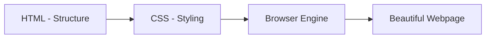
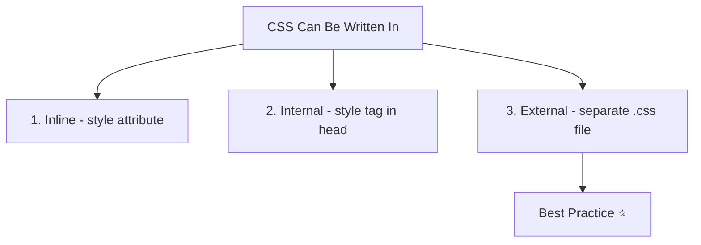
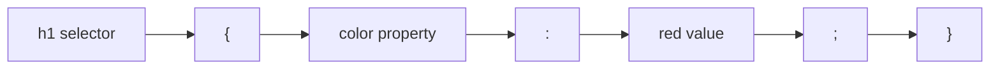

# 📘 Day 1: Introduction to CSS + Selectors

Hello students 👋

Welcome to your **very first day of CSS**! Today is the beginning of something exciting — by the end of this 8-day series, you will be able to design beautiful, responsive, and professional-looking websites. 🎨

Before we jump in, take a deep breath. CSS is **not** hard. It's just a language that tells the browser: *"make this look pretty."*

---

## 1. Introduction

### What will we learn today?

- What is CSS?
- Why do we even need CSS?
- The 3 ways to write CSS (Inline, Internal, External)
- CSS syntax: `selector { property: value; }`
- Element, Class, and ID selectors
- How to write comments in CSS
- How to link an external CSS file to HTML

### Why is CSS important?

Imagine you built a house with only bricks and no paint, no furniture, no decoration. Would you want to live there? 🧱

That's what a webpage looks like with only HTML — just raw text and structure. **CSS is the paint, the furniture, and the decoration** of your webpage.

Without CSS:
- Websites would look boring.
- No colors, no spacing, no fonts.
- Every webpage would look the same.

With CSS:
- You control **colors**, **layouts**, **fonts**, **spacing**, **animations**.
- You make websites look professional and user-friendly.

---

## 2. Concept Explanation

### What is CSS?

**CSS** stands for **Cascading Style Sheets**.

- **Cascading** → Styles flow down (parent to child).
- **Style** → Look and feel.
- **Sheets** → A file (or section) where we write the styling rules.

So CSS is basically a set of **styling rules** that tell the browser how HTML should look.

### How CSS works with HTML

Think of HTML and CSS like this:

| HTML | CSS |
|------|-----|
| Skeleton of the body 🦴 | Skin, clothes, makeup 👗 |
| Structure | Appearance |
| Nouns | Adjectives |

### Browser styling flow

When you open a webpage, here's what happens:

1. The browser **reads HTML** first → builds the structure.
2. The browser **reads CSS** → applies styles to HTML elements.
3. The browser **paints the page** → you see the final result.

---

## 3. 💡 Visual Learning

### How HTML and CSS work together



### The 3 ways to write CSS



### CSS Rule Anatomy



---

## 4. Syntax + Code Examples

### CSS Syntax

Every CSS rule follows this simple pattern:

```css
selector {
  property: value;
}
```

- **Selector** → which HTML element to style.
- **Property** → what you want to change (color, size, etc.).
- **Value** → the new setting.

Example:

```css
h1 {
  color: blue;
  font-size: 32px;
}
```

This says: *"Find all `<h1>` tags and make them blue with a font size of 32 pixels."*

---

### Way 1: Inline CSS

Written directly inside an HTML element using the `style` attribute.

```html
<h1 style="color: red; font-size: 40px;">Hello CSS!</h1>
```

✅ Good for quick tests.
❌ Not recommended for real projects (messy, hard to maintain).

---

### Way 2: Internal CSS

Written inside a `<style>` tag in the `<head>` section.

```html
<!DOCTYPE html>
<html>
  <head>
    <title>Internal CSS Demo</title>
    <style>
      h1 {
        color: green;
        text-align: center;
      }
      p {
        color: gray;
      }
    </style>
  </head>
  <body>
    <h1>Welcome to CSS</h1>
    <p>This is styled using internal CSS.</p>
  </body>
</html>
```

✅ Good for single-page demos.
❌ Not reusable across multiple pages.

---

### Way 3: External CSS ⭐ (BEST PRACTICE)

Write CSS in a **separate `.css` file** and link it to HTML.

**File: `index.html`**
```html
<!DOCTYPE html>
<html>
  <head>
    <title>External CSS Demo</title>
    <link rel="stylesheet" href="style.css" />
  </head>
  <body>
    <h1>Welcome Students</h1>
    <p class="intro">CSS is amazing!</p>
    <p id="note">This is a special note.</p>
  </body>
</html>
```

**File: `style.css`**
```css
/* This is a CSS comment */

h1 {
  color: navy;
  text-align: center;
}

.intro {
  color: darkgreen;
  font-size: 18px;
}

#note {
  color: red;
  font-weight: bold;
}
```

✅ Clean, reusable, maintainable.
✅ One CSS file can style 100 HTML pages.

---

### Types of Selectors

#### 1. Element Selector
Targets ALL elements of that tag.

```css
p {
  color: gray;
}
```
→ All `<p>` tags become gray.

#### 2. Class Selector (dot `.`)
Targets elements with a specific class.

```html
<p class="highlight">Important text</p>
```

```css
.highlight {
  background-color: yellow;
}
```
→ Only elements with `class="highlight"` get yellow background.

✨ Classes are **reusable** — use them on many elements.

#### 3. ID Selector (hash `#`)
Targets ONE unique element.

```html
<h1 id="main-title">Home Page</h1>
```

```css
#main-title {
  color: purple;
}
```

⚠️ IDs must be **unique** per page.

---

### Comments in CSS

Comments help you leave notes in your code.

```css
/* This styles the main heading */
h1 {
  color: blue;
}

/*
  Multi-line comments
  also work like this
*/
```

---

### Wrong vs Correct Examples

❌ **Wrong:**
```css
h1 
  color: blue
```
(Missing braces and semicolon.)

✅ **Correct:**
```css
h1 {
  color: blue;
}
```

❌ **Wrong:**
```css
.intro {
  color blue;
}
```
(Missing colon between property and value.)

✅ **Correct:**
```css
.intro {
  color: blue;
}
```

---

## 5. Live Output Explanation

When you open the external CSS example in a browser:

- `<h1>Welcome Students</h1>` → shows in **navy color**, **centered**.
- `<p class="intro">` → shows in **dark green**, **18px**.
- `<p id="note">` → shows in **red**, **bold**.

💡 **Tip:** Right-click the page → "Inspect" → opens Chrome DevTools where you can see and edit CSS live!

---

## 6. 🧪 Hands-on Practice

Try these 5 tasks:

1. **Task 1:** Create an HTML file with 3 headings (`h1`, `h2`, `h3`) and make each a different color using internal CSS.
2. **Task 2:** Create a class called `.big-text` that sets `font-size: 30px` and apply it to 2 paragraphs.
3. **Task 3:** Create an ID called `#highlight` with yellow background and apply it to one element only.
4. **Task 4:** Create an external `style.css` file and link it to your HTML. Style `body` with a light background color.
5. **Task 5:** Add 2 CSS comments in your file explaining what each rule does.

---

## 7. ⚠️ Common Mistakes

| Mistake | Fix |
|---------|-----|
| Forgetting the semicolon `;` after value | Always end each declaration with `;` |
| Using `.` for IDs or `#` for classes | `.` = class, `#` = ID |
| Missing braces `{ }` | Every rule needs `{ }` |
| Linking wrong CSS file path | Check `href="style.css"` is in the same folder |
| Spelling property names wrong (`colr`, `fnt-size`) | Always double-check property names |
| Using same ID twice | IDs must be **unique** |

---

## 8. 📝 Mini Assignment

**Build a Simple Personal Webpage** 🧑

Create a webpage with:

- Your name as `<h1>` (styled with a nice color + centered).
- A short bio paragraph with a class `.bio` (gray text, italic).
- A favorite quote with ID `#quote` (bold, larger font).
- An unordered list of your 3 hobbies (colored list items).

Use **external CSS** only.

✅ Requirements:
- At least 1 element selector
- At least 1 class selector
- At least 1 ID selector
- At least 2 comments

---

## 9. 🔁 Recap

Today we learned:

- ✅ CSS = Cascading Style Sheets (styling language).
- ✅ 3 ways to write CSS: **Inline**, **Internal**, **External** (best).
- ✅ CSS syntax: `selector { property: value; }`.
- ✅ Selector types: **element**, **class (`.`)**, **ID (`#`)**.
- ✅ Comments use `/* ... */`.
- ✅ Link external CSS with `<link rel="stylesheet" href="style.css" />`.

💡 **VS Code Tip:** Type `!` and press `Tab` to generate an HTML boilerplate instantly.
💡 **DevTools Tip:** Press `F12` in your browser → go to "Elements" → hover on your HTML to see applied CSS!

See you tomorrow for **Day 2: Colors, Units & Text Styling** 🎨

Keep practicing. You're doing great! 💪
