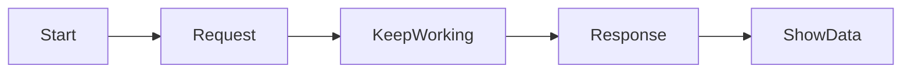
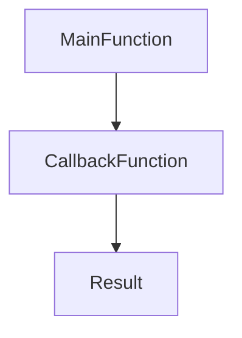
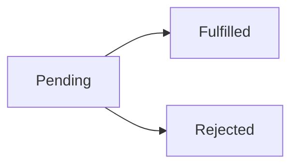
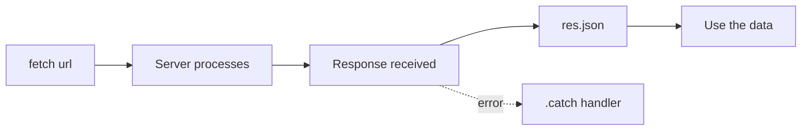
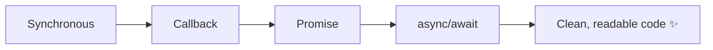

# Day 1 — Asynchronous JavaScript (Callbacks, Promises, Fetch, Async/Await)

> **Session Duration:** 1 – 1.5 hours
> **Branch:** `Async_concepts`
> **Audience:** Beginners who know variables, functions, and loops.

---

## Hello students 👋

Welcome to today's class! Today we are going to learn one of the **most important** topics in modern JavaScript — **Asynchronous Programming**.

Don't worry if it sounds scary. By the end of this session, you will:

- Understand how JavaScript handles waiting tasks
- Write your first **callback** function
- Use **Promises** with `.then()` and `.catch()`
- Call real APIs using **Fetch**
- Write clean code using **async / await**

Let's begin! 🚀

---

## 1. Introduction — Why Async JavaScript?

Imagine you go to a restaurant 🍔.

- You **order** a burger
- The chef takes **5 minutes** to cook
- During those 5 minutes, do you just sit frozen? **No!** You talk, drink water, scroll Instagram.
- When the burger is ready, the waiter **brings it to you**.

This is exactly how **Asynchronous JavaScript** works!

> JavaScript does not sit and wait. It continues doing other work and **calls you back** when the slow task is finished.

### Where do we use async code?

- Calling an API (fetching users, posts, products)
- Reading a file
- Waiting for a timer (`setTimeout`)
- Database queries
- File uploads

**Question to class:** 🤔 Can you think of one more real-life "waiting" situation?
(Examples: waiting for an Uber, waiting for a parcel, waiting for water to boil…)

---

## 2. Synchronous vs Asynchronous JavaScript

### 🐢 Synchronous (one-by-one)

Every line waits for the previous one to finish.

```js id="sync1"
console.log("1. Start");
console.log("2. Middle");
console.log("3. End");
```

**Output:**

```
1. Start
2. Middle
3. End
```

Simple — each line runs **in order**.

### ⚡ Asynchronous (non-blocking)

Some tasks take time. JavaScript **does not wait** — it keeps going.

```js id="async1"
console.log("1. Start");

setTimeout(() => {
  console.log("2. Middle (after 2 seconds)");
}, 2000);

console.log("3. End");
```

**Output:**

```
1. Start
3. End
2. Middle (after 2 seconds)
```

👀 Notice — `3. End` printed **before** `2. Middle`!
That's asynchronous behavior.

### Visual Flow



---

## 3. Callback Functions

### What is a Callback?

> A **callback** is a function passed as an argument to another function, to be **called later**.

**Real-world analogy:** 📞
You call a pizza shop. They say, *"We'll call you back when it's ready."*
Your phone number = the **callback**.

### Basic Example — Line by Line

```js id="cb1"
function greet(name, callback) {
  console.log("Hello " + name);
  callback(); // call the function passed in
}

function sayBye() {
  console.log("Bye bye!");
}

greet("Asif", sayBye);
```

**Explanation:**

- Line 1: `greet` takes two parameters — `name` and `callback` (a function).
- Line 2: Print hello.
- Line 3: Execute whatever function was passed.
- Line 10: We pass `sayBye` as the callback.

**Output:**

```
Hello Asif
Bye bye!
```

### Async Callback Example — Order Delivery

```js id="cb2"
function orderFood(item, callback) {
  console.log("Order placed for " + item);
  setTimeout(() => {
    console.log(item + " is ready! 🍕");
    callback();
  }, 2000);
}

orderFood("Pizza", () => {
  console.log("Thank you, let's eat!");
});
```

### Callback Flow Diagram



---

## 4. Callback Hell 😈

When callbacks are nested **inside** callbacks, inside callbacks…
The code becomes a "pyramid of doom".

```js id="hell1"
loginUser("asif", (user) => {
  getProfile(user.id, (profile) => {
    getPosts(profile.id, (posts) => {
      getComments(posts[0].id, (comments) => {
        console.log(comments);
        // 😵 unreadable!
      });
    });
  });
});
```

**Problems:**

- Hard to read
- Hard to debug
- Error handling is painful

👉 That's why **Promises** were invented!

---

## 5. Promises

### What is a Promise?

> A **Promise** is an object that represents a **future value** — something that will be completed later (success or failure).

**Real-world analogy:** 📦
When you order from Amazon, you get a **tracking promise**:

- It may **succeed** (delivered ✅)
- It may **fail** (lost in transit ❌)

### The 3 States of a Promise



| State | Meaning |
|-------|---------|
| Pending | Still working |
| Fulfilled | Success ✅ |
| Rejected | Failed ❌ |

### Creating a Promise

```js id="pr2"
const myPromise = new Promise((resolve, reject) => {
  const success = true;

  if (success) {
    resolve("Data loaded 🎉");
  } else {
    reject("Something went wrong 😢");
  }
});
```

---

## 6. `.then()` and `.catch()`

### `.then()` handles SUCCESS

### `.catch()` handles FAILURE

```js id="pr3"
myPromise
  .then((result) => {
    console.log("Success:", result);
  })
  .catch((error) => {
    console.log("Error:", error);
  });
```

### Chaining `.then()`

You can chain multiple `.then()` calls — **each one returns a new Promise**.

```js id="pr4"
fetch("https://jsonplaceholder.typicode.com/users")
  .then((res) => res.json())       // convert response to JSON
  .then((data) => console.log(data)) // show the data
  .catch((err) => console.log(err)); // handle any error
```

> ⚠️ **Remember:** Always `return` something inside `.then()` if you want the next `.then()` to receive it.

---

## 7. Fetch API 🌐

### What is Fetch?

`fetch()` is a built-in browser function to make HTTP requests (GET, POST, etc.).
It **returns a Promise**.

### Basic Syntax

```js id="fetch1"
fetch(url)
  .then((response) => response.json())
  .then((data) => console.log(data))
  .catch((error) => console.log("Error:", error));
```

### Example 1 — Fetch All Users

```js id="fetch2"
fetch("https://jsonplaceholder.typicode.com/users")
  .then((res) => res.json())
  .then((users) => {
    users.forEach((u) => console.log(u.name));
  })
  .catch((err) => console.log("Failed:", err));
```

### Example 2 — Fetch One User

```js id="fetch3"
fetch("https://jsonplaceholder.typicode.com/users/1")
  .then((res) => res.json())
  .then((user) => console.log(user))
  .catch((err) => console.log(err));
```

### Example 3 — Handle Wrong URL (404)

```js id="fetch4"
fetch("https://jsonplaceholder.typicode.com/wrong-endpoint")
  .then((res) => {
    if (!res.ok) {
      throw new Error("HTTP Error " + res.status);
    }
    return res.json();
  })
  .then((data) => console.log(data))
  .catch((err) => console.log("Caught:", err.message));
```

> ⚠️ **Important:** `fetch()` does **NOT** reject on 404/500!
> You must check `res.ok` yourself.

### Fetch Lifecycle



---

## 8. async / await — The Modern Way ✨

Writing many `.then()` chains can still look messy.
**`async / await`** makes asynchronous code look **synchronous** (top-to-bottom).

### Rules

1. Put `async` before a function → it now **returns a Promise**.
2. Use `await` **only inside** an `async` function.
3. `await` pauses the function until the Promise settles.

### Example — Rewriting `.then()` as async/await

**Old way (.then):**

```js id="aa0"
function getUsers() {
  fetch("https://jsonplaceholder.typicode.com/users")
    .then((res) => res.json())
    .then((data) => console.log(data))
    .catch((err) => console.log(err));
}
```

**Modern way (async/await):**

```js id="aa1"
async function getUsers() {
  try {
    const res = await fetch("https://jsonplaceholder.typicode.com/users");
    const data = await res.json();
    console.log(data);
  } catch (error) {
    console.log("Error:", error);
  }
}

getUsers();
```

**Line-by-line:**

- `async function` → this function returns a Promise.
- `await fetch(...)` → pause until response arrives.
- `await res.json()` → pause until body is parsed.
- `try/catch` → handles any error nicely.

---

## 9. try / catch with async

`try/catch` is the async version of `.catch()`.

```js id="tc1"
async function getUser(id) {
  try {
    const res = await fetch(`https://jsonplaceholder.typicode.com/users/${id}`);
    if (!res.ok) throw new Error("User not found");
    const user = await res.json();
    console.log(user);
  } catch (err) {
    console.log("Something went wrong:", err.message);
  }
}

getUser(1);   // ✅ works
getUser(999); // ❌ triggers catch
```

---

## 🌍 Real API Examples (Practice Playground)

All examples use **JSONPlaceholder** (free fake API):

- Users → `https://jsonplaceholder.typicode.com/users`
- Posts → `https://jsonplaceholder.typicode.com/posts`
- Comments → `https://jsonplaceholder.typicode.com/comments`

### Fetch Posts of a User

```js id="api1"
async function getPostsOfUser(userId) {
  const res = await fetch(`https://jsonplaceholder.typicode.com/posts?userId=${userId}`);
  const posts = await res.json();
  posts.forEach((p) => console.log(p.title));
}

getPostsOfUser(1);
```

---

## 🧪 Hands-On Practice (10 Tasks)

Try each one in the browser console or Node.js.

### Task 1 — Callback Calculator

```js id="t1"
function calculate(a, b, cb) {
  return cb(a, b);
}
const add = (x, y) => x + y;
console.log(calculate(5, 3, add)); // 8
```

### Task 2 — Simulate Order Delivery

```js id="t2"
function deliver(item, cb) {
  console.log("Order placed:", item);
  setTimeout(() => cb(item + " delivered ✅"), 1500);
}
deliver("Shoes", (msg) => console.log(msg));
```

### Task 3 — Fetch Users

```js id="t3"
fetch("https://jsonplaceholder.typicode.com/users")
  .then((r) => r.json())
  .then((u) => console.log(u));
```

### Task 4 — Fetch Posts

```js id="t4"
fetch("https://jsonplaceholder.typicode.com/posts")
  .then((r) => r.json())
  .then((p) => console.log(p.length, "posts"));
```

### Task 5 — Use `.then()`

```js id="t5"
Promise.resolve("Hi 👋").then((msg) => console.log(msg));
```

### Task 6 — Use `.catch()`

```js id="t6"
Promise.reject("Oops ❌").catch((err) => console.log("Caught:", err));
```

### Task 7 — Convert `.then()` to async/await

Convert this:

```js id="t7a"
fetch(url).then(r => r.json()).then(d => console.log(d));
```

Into:

```js id="t7b"
async function run() {
  const r = await fetch(url);
  const d = await r.json();
  console.log(d);
}
```

### Task 8 — Handle Network Error

```js id="t8"
async function safeFetch() {
  try {
    const r = await fetch("https://bad.url.test");
    console.log(await r.json());
  } catch (e) {
    console.log("Network failed:", e.message);
  }
}
safeFetch();
```

### Task 9 — Show Loading Message

```js id="t9"
async function loadUsers() {
  console.log("Loading... ⏳");
  const r = await fetch("https://jsonplaceholder.typicode.com/users");
  const users = await r.json();
  console.log("Done ✅", users.length, "users");
}
loadUsers();
```

### Task 10 — Chain Two API Calls

Get a user, then fetch their posts:

```js id="t10"
async function userAndPosts(id) {
  const u = await (await fetch(`https://jsonplaceholder.typicode.com/users/${id}`)).json();
  const p = await (await fetch(`https://jsonplaceholder.typicode.com/posts?userId=${id}`)).json();
  console.log(u.name, "has", p.length, "posts");
}
userAndPosts(1);
```

---

## ⚠️ Common Mistakes

| Mistake | Fix |
|---------|-----|
| Forgetting `return` inside `.then()` | Always return the next Promise/value |
| Missing `await` before a Promise | Add `await` so you get the value, not a Promise object |
| Using `await` outside `async` | Wrap code in an `async` function |
| Expecting `fetch` to throw on 404 | Manually check `res.ok` |
| Deeply nested callbacks | Switch to Promises or async/await |
| Not using `try/catch` with await | Always wrap await calls that may fail |

### Example — Missing `await`

```js id="mistake1"
// ❌ Wrong — prints a Promise object
async function bad() {
  const data = fetch(url);
  console.log(data);
}

// ✅ Correct
async function good() {
  const res = await fetch(url);
  const data = await res.json();
  console.log(data);
}
```

---

## 📝 Mini Project — "User Finder" 🔎

Build a small browser app that:

1. Takes a user ID from input
2. Shows `Loading...`
3. Fetches user from API
4. Shows user data
5. Shows an error if the ID is invalid

### HTML

```html id="mp1"
<input id="uid" type="number" placeholder="Enter user id (1-10)" />
<button id="btn">Find User</button>
<div id="output"></div>
```

### JavaScript

```js id="mp2"
const btn = document.getElementById("btn");
const out = document.getElementById("output");

btn.addEventListener("click", async () => {
  const id = document.getElementById("uid").value;
  out.innerText = "Loading... ⏳";

  try {
    const res = await fetch(`https://jsonplaceholder.typicode.com/users/${id}`);
    if (!res.ok) throw new Error("User not found");
    const user = await res.json();
    out.innerHTML = `
      <h3>${user.name}</h3>
      <p>📧 ${user.email}</p>
      <p>🏢 ${user.company.name}</p>
      <p>🌐 ${user.website}</p>
    `;
  } catch (err) {
    out.innerText = "❌ " + err.message;
  }
});
```

### Node.js Version (no DOM)

```js id="mp3"
// Node 18+ has fetch built-in
async function findUser(id) {
  console.log("Loading...");
  try {
    const res = await fetch(`https://jsonplaceholder.typicode.com/users/${id}`);
    if (!res.ok) throw new Error("User not found");
    const u = await res.json();
    console.log(`${u.name} — ${u.email}`);
  } catch (e) {
    console.log("Error:", e.message);
  }
}

findUser(3);
```

> 💡 **Browser vs Node.js:**
> - `fetch` works in all modern browsers and in **Node.js 18+** natively.
> - For older Node versions, install `node-fetch`.

---

## 🔁 Recap

| Concept | One-line Summary |
|---------|------------------|
| Callback | A function passed to another function to run later |
| Callback Hell | Too many nested callbacks — hard to read |
| Promise | An object representing a future value |
| `.then()` | Runs on success |
| `.catch()` | Runs on error |
| `fetch()` | Built-in function to call APIs; returns a Promise |
| `async` | Marks a function as asynchronous (returns a Promise) |
| `await` | Pauses until a Promise resolves |
| `try/catch` | Catches errors inside async functions |

### Final Mental Model



---

## 🎤 Beginner Interview Questions

1. What is the difference between synchronous and asynchronous JavaScript?
2. What is a callback function? Give a real-world example.
3. What is callback hell? How do we solve it?
4. What are the 3 states of a Promise?
5. What does `.then()` do? What does `.catch()` do?
6. Does `fetch()` reject on HTTP 404? Why or why not?
7. What does the `async` keyword do to a function?
8. Can we use `await` outside an `async` function? (Answer: only at the top level of ES modules.)
9. How do we handle errors in async/await?
10. Convert a `.then()` chain into async/await.

---

## 🏁 End of Day 1

By now you should be able to:

✅ Explain why async JavaScript exists
✅ Write and read callback functions
✅ Create and consume Promises
✅ Call real APIs using `fetch`
✅ Use `async/await` with `try/catch`
✅ Build a small working app (User Finder)

**Homework:** 📚
Build a "Post Viewer" — input a post ID (1–100), fetch the post and its comments, show both in the page.

See you in **Day 2** where we'll dive into **Promise.all, Promise.race, and real-world API projects!** 🚀