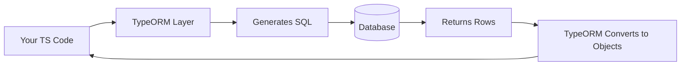
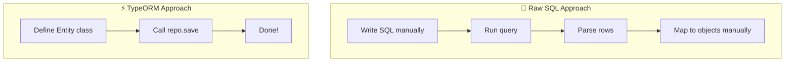

# 📅 Day 1: Introduction to TypeORM + Setup + Entities

Hello students 👋

Welcome to **Day 1** of our 4-day TypeORM journey! Today we begin a very exciting topic. By the end of this session, you will understand **what an ORM is**, **why TypeORM exists**, and **how to set up your first TypeORM project** from scratch.

Take a deep breath, open your laptop, and let's start step by step. 🚀

---

## 1. 🎯 Introduction — What Will We Learn Today?

Today's agenda:

1. What is an ORM?
2. Why not just write raw SQL?
3. What is TypeORM?
4. Setting up a Node.js + TypeScript project
5. Connecting to a database (PostgreSQL / MySQL)
6. Creating our very first **Entity**
7. Inserting and reading data

Small question before we start 🤔:
> If you already know SQL, why would you ever need TypeORM?

Keep this question in your mind. By the end of this session, you will have a very clear answer.

---

## 2. 🧠 Concept Explanation

### 2.1 What is ORM?

**ORM** stands for **Object-Relational Mapping**.

Think of it like a **translator** 🗣️ between two different worlds:

- World 1: Your **code** (TypeScript classes and objects)
- World 2: Your **database** (tables, rows, columns)

These two worlds speak different languages.

- In code, we say: `user.name = "Ali"`
- In SQL, we say: `INSERT INTO users (name) VALUES ('Ali');`

ORM is the **smart translator** that converts objects into SQL and SQL back into objects.

**Real-world analogy 🏦:**
Imagine a bank. The customer speaks **English** but the bank's internal system speaks **German**. A translator sits in the middle to convert messages. That translator = ORM.

### 2.2 Why Not Just Write Raw SQL?

Good question! Raw SQL works, but it has issues in large projects:

| Problem with Raw SQL | How ORM Helps |
|----------------------|----------------|
| Lots of repetitive code | Auto-generates queries |
| No type safety in TypeScript | Strong typing with classes |
| Hard to maintain in big apps | Clean, object-oriented code |
| Dangerous SQL injection risks | Parameterized queries by default |
| Database-specific syntax | One code, multiple databases |

### 2.3 What is TypeORM?

**TypeORM** is a popular ORM for **Node.js** that works beautifully with **TypeScript**.

It supports:
- PostgreSQL ✅
- MySQL ✅
- SQLite ✅
- SQL Server ✅
- Oracle ✅
- MongoDB (experimental) ✅

TypeORM lets you:
- Write database tables as **classes** (Entities)
- Write columns as **class properties**
- Query data like you query JavaScript arrays

---

## 3. 💡 Visual Learning

### How TypeORM Works Internally



### ORM vs Raw SQL Mental Model



See the difference? TypeORM removes the boring middle steps.

---

## 4. 🛠️ Project Setup

Let's build our first TypeORM project. Follow along.

### Step 1: Create a folder and initialize Node

```bash id="initproject"
mkdir typeorm-day1
cd typeorm-day1
npm init -y
```

### Step 2: Install TypeScript and TypeORM

```bash id="installdeps"
npm install typeorm reflect-metadata pg
npm install -D typescript ts-node @types/node
```

- `typeorm` → the ORM itself
- `reflect-metadata` → required for decorators (`@Entity`, `@Column`)
- `pg` → PostgreSQL driver (use `mysql2` for MySQL instead)
- `ts-node` → runs TypeScript directly

### Step 3: Create `tsconfig.json`

```json id="tsconfig"
{
  "compilerOptions": {
    "target": "ES2020",
    "module": "commonjs",
    "strict": true,
    "experimentalDecorators": true,
    "emitDecoratorMetadata": true,
    "esModuleInterop": true,
    "outDir": "./dist",
    "rootDir": "./src"
  }
}
```

⚠️ **Very important:** `experimentalDecorators` and `emitDecoratorMetadata` must be `true`. TypeORM uses decorators everywhere.

### Step 4: Folder Structure

```
typeorm-day1/
├── src/
│   ├── entity/
│   │   └── User.ts
│   ├── data-source.ts
│   └── index.ts
├── package.json
└── tsconfig.json
```

### Step 5: Create DataSource

The **DataSource** is the connection between your app and the database. Think of it as the **phone line** 📞 connecting your code to the database.

```ts id="datasource"
// src/data-source.ts
import "reflect-metadata";
import { DataSource } from "typeorm";
import { User } from "./entity/User";

export const AppDataSource = new DataSource({
  type: "postgres",
  host: "localhost",
  port: 5432,
  username: "postgres",
  password: "password",
  database: "typeorm_day1",
  synchronize: true,   // auto-creates tables (DEV ONLY)
  logging: true,       // shows SQL queries in console
  entities: [User],
});
```

> 🔴 **Warning:** `synchronize: true` is great for learning, but **NEVER** use it in production. It can delete your data. We'll use **migrations** on Day 4.

---

## 5. 🧱 Core Concepts + Code

### 5.1 What is an Entity?

An **Entity** = a TypeScript class that represents a **database table**.

- Class name → Table name
- Class properties → Columns
- Object of class → Row in table

### 5.2 Our First Entity: `User`

```ts id="userentity"
// src/entity/User.ts
import { Entity, PrimaryGeneratedColumn, Column } from "typeorm";

@Entity()
export class User {
  @PrimaryGeneratedColumn()
  id: number;

  @Column({ length: 100 })
  name: string;

  @Column({ unique: true })
  email: string;

  @Column({ default: true })
  isActive: boolean;
}
```

### 5.3 SQL Equivalent

Here's what TypeORM generates for you behind the scenes:

```sql id="usersql"
CREATE TABLE "user" (
  "id" SERIAL PRIMARY KEY,
  "name" VARCHAR(100) NOT NULL,
  "email" VARCHAR UNIQUE NOT NULL,
  "isActive" BOOLEAN NOT NULL DEFAULT true
);
```

Notice how **one decorator replaces multiple lines of SQL**. That's the power of ORM.

### 5.4 Common Column Decorators

| Decorator | Purpose |
|-----------|---------|
| `@PrimaryGeneratedColumn()` | Auto-incrementing primary key |
| `@PrimaryColumn()` | Manual primary key |
| `@Column()` | Regular column |
| `@Column({ nullable: true })` | Column that accepts `NULL` |
| `@Column({ unique: true })` | Unique constraint |
| `@Column({ default: "..." })` | Default value |
| `@CreateDateColumn()` | Auto-filled `createdAt` timestamp |
| `@UpdateDateColumn()` | Auto-filled `updatedAt` timestamp |

---

## 6. ✍️ First CRUD Operations (Insert + Select)

We'll dive deeper into CRUD tomorrow, but let's get our hands dirty today.

```ts id="firstindex"
// src/index.ts
import { AppDataSource } from "./data-source";
import { User } from "./entity/User";

async function main() {
  await AppDataSource.initialize();
  console.log("✅ Database connected!");

  // CREATE a user
  const user = new User();
  user.name = "Ali Khan";
  user.email = "ali@example.com";
  user.isActive = true;

  await AppDataSource.manager.save(user);
  console.log("User saved with ID:", user.id);

  // READ all users
  const users = await AppDataSource.manager.find(User);
  console.log("All users:", users);
}

main().catch((err) => console.error(err));
```

Run it:

```bash id="runfirst"
npx ts-node src/index.ts
```

You should see:
1. A log with the SQL `INSERT` query
2. A log with the SQL `SELECT` query
3. The saved user printed

### Comparison: Raw SQL vs TypeORM

**Raw SQL:**
```sql id="rawinsert"
INSERT INTO "user" ("name", "email", "isActive")
VALUES ('Ali Khan', 'ali@example.com', true);
```

**TypeORM:**
```ts id="ormsave"
await AppDataSource.manager.save(user);
```

Much cleaner, right?

---

## 7. 📦 Repository — A Quick Peek

A **Repository** is like a helper box 🧰 for one specific entity. It has methods like `save`, `find`, `findOne`, `delete`.

```ts id="repopeek"
const userRepo = AppDataSource.getRepository(User);
const allUsers = await userRepo.find();
```

We'll master repositories tomorrow on Day 2. Just remember the name today.

---

## 8. 🧪 Hands-on Practice

Try these 5 small exercises before the next class:

1. **Exercise 1:** Add a new column `age: number` to the `User` entity. Check if the table updates.
2. **Exercise 2:** Make the `email` column `nullable: true` and insert a user without email.
3. **Exercise 3:** Add `@CreateDateColumn()` for a field called `createdAt`.
4. **Exercise 4:** Insert 3 users using a `for` loop.
5. **Exercise 5:** Fetch only one user using `findOneBy({ id: 1 })`.

> Try them on your own. We'll discuss solutions tomorrow.

---

## 9. ⚠️ Common Mistakes

Beginners often hit these issues. Watch out:

1. **Forgetting `import "reflect-metadata"`**
   - Error: `Cannot read property 'prototype' of undefined`
   - ✅ Fix: Always import it at the top of your data source file.

2. **`synchronize: true` in production**
   - Can drop tables and lose data.
   - ✅ Fix: Use migrations (Day 4).

3. **Wrong decorator names**
   - Writing `@column()` (lowercase) instead of `@Column()`.
   - ✅ Fix: TypeORM decorators are PascalCase.

4. **Database connection errors**
   - Usually wrong username/password/port or DB not running.
   - ✅ Fix: Confirm your DB is running: `psql -U postgres`.

5. **Missing `experimentalDecorators`**
   - TypeScript won't compile decorators.
   - ✅ Fix: Set both decorator flags in `tsconfig.json`.

---

## 10. 📝 Mini Assignment

Build a simple **Product catalog** for an e-commerce store:

Create an entity `Product` with these columns:

| Column | Type | Notes |
|--------|------|-------|
| id | number | Auto-generated primary key |
| title | string | Required, max 150 chars |
| description | string | Optional (nullable) |
| price | decimal | Required |
| stock | number | Default = 0 |
| createdAt | Date | Auto-filled |

Then:
1. Insert 5 products
2. Fetch all products
3. Print them to the console

💡 **Bonus:** Add a `category` column with a default value of `"general"`.

---

## 11. 🔁 Recap

Today you learned:

- ✅ ORM is a translator between code and database
- ✅ TypeORM = ORM made for TypeScript + Node.js
- ✅ How to set up a project with TypeScript + TypeORM
- ✅ `DataSource` = connection to the DB
- ✅ `@Entity` = table, `@Column` = column, `@PrimaryGeneratedColumn` = auto PK
- ✅ `synchronize: true` auto-creates tables (dev only!)
- ✅ `manager.save()` and `manager.find()` for basic CRUD

**Tomorrow (Day 2):** We'll master **CRUD operations** and the **Repository pattern** in detail. Get ready to query like a pro! 💪

See you tomorrow, students! 👋
