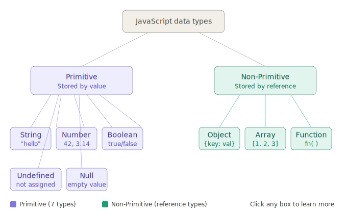
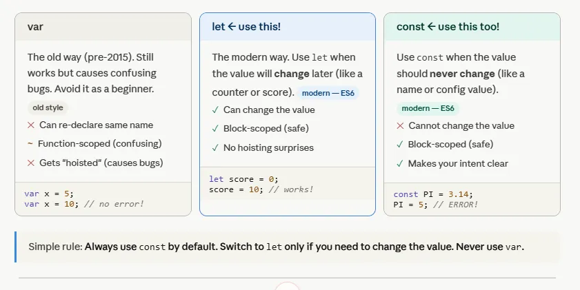
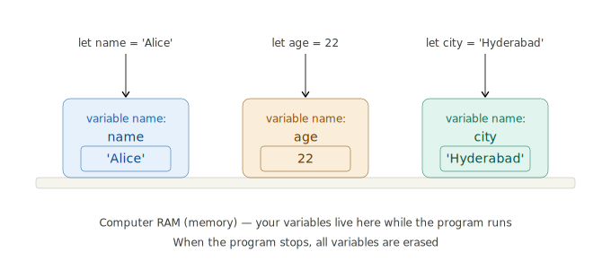
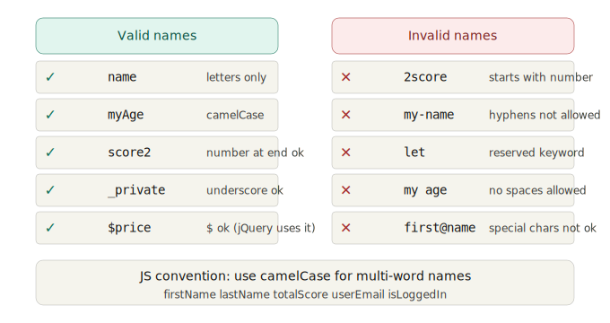

## What is Full Stack?

**Full stack** means building *both* the parts of a web application — what users see (frontend) and the logic that runs behind the scenes (backend + database). A "full stack developer" works across all these layers.

Your diagram shows three main layers:

---

### 1. 🖥️ Frontend — "What users see"
This runs **in the browser**. In your diagram, this is the **React** box (with TypeScript). It's responsible for displaying buttons, forms, pages, and everything a user interacts with. React breaks the UI into reusable components.

---

### 2. ⚙️ Backend — "The brain"
This runs **on a server**, invisible to the user. Your diagram shows **Node.js** (the runtime environment) with **Express** (a framework for handling HTTP requests). When a user clicks a button, the frontend sends an HTTP request → the backend receives it, runs logic, and sends back a response.

---

### 3. 🗄️ Database — "Memory"
This is where data is permanently stored. Your diagram shows two types:
- **MongoDB** — a NoSQL database that stores flexible, JSON-like documents
- **SQL Database** (MySQL/PostgreSQL) — stores structured data in tables with rows and columns

---

### 🔁 How they connect (as shown by the arrows in your diagram):
```
Browser (React) ←── HTTP ──→ Node.js + Express ←──→ MongoDB / SQL
```

The frontend talks to the backend via HTTP requests (like fetching your profile data), and the backend reads/writes to the database.

---

### 🔷 TypeScript's Role
TypeScript (shown in blue in your legend) is a layer that adds **type safety** across both frontend and backend code — it helps catch bugs before the app even runs.

---

In short: **Frontend = what you see, Backend = what it does, Database = what it remembers.** Full stack = all three together.



-----------------------------


# JavaScript Data Types — Complete Guide

> JavaScript has **two main categories** of data types:
> - **Primitive** (7 types) — stored by **value**
> - **Non-Primitive / Reference** (3 types) — stored by **reference**

---

## PART 1: Primitive Data Types

Primitive types store a single, simple value. When you copy them, you get a **new independent copy**.

---

### 1. String

A string is a sequence of characters used to represent text. Always wrapped in quotes (`'`, `"`, or backticks).

```javascript
let name = "Rahul";
let greeting = 'Hello, World!';
let message = `My name is ${name}`; // Template literal

console.log(typeof name);    // "string"
console.log(name.length);    // 5
console.log(name.toUpperCase()); // "RAHUL"
```

**Key Points:**
- Strings are **immutable** (you can't change a character directly)
- Use backticks (`` ` ``) for **template literals** to embed variables using `${}`

---

### 2. Number

JavaScript uses a single `Number` type for both integers and decimals (floating point).

```javascript
let age = 25;          // integer
let price = 99.99;     // decimal
let negative = -10;
let result = 10 / 3;   // 3.3333...

console.log(typeof age);     // "number"
console.log(Number.isInteger(age));  // true
console.log(isNaN("hello")); // true (Not a Number)
```

**Special Number values:**
```javascript
console.log(Infinity);   // Infinity
console.log(-Infinity);  // -Infinity
console.log(NaN);        // NaN (Not a Number)
```

---

### 3. Boolean

A boolean holds only one of two values: `true` or `false`. Used heavily in conditions and logic.

```javascript
let isLoggedIn = true;
let hasPermission = false;

console.log(typeof isLoggedIn);  // "boolean"

if (isLoggedIn) {
  console.log("Welcome back!");
} else {
  console.log("Please log in.");
}
```

**Truthy vs Falsy values:**
```javascript
// Falsy values in JavaScript:
false, 0, "", null, undefined, NaN

// Everything else is truthy
Boolean(0);       // false
Boolean("hello"); // true
Boolean([]);      // true (empty array is truthy!)
```

---

### 4. Undefined

A variable that has been **declared but not assigned** a value automatically gets `undefined`.

```javascript
let x;
console.log(x);          // undefined
console.log(typeof x);   // "undefined"

function greet(name) {
  console.log(name);     // undefined if no argument passed
}
greet(); // undefined
```

---

### 5. Null

`null` is an **intentional absence of value**. You explicitly assign it to indicate "no value here".

```javascript
let user = null;   // user exists but has no value yet
console.log(user);         // null
console.log(typeof null);  // "object" ← famous JavaScript bug!

// Difference between null and undefined
console.log(null == undefined);   // true  (loose equality)
console.log(null === undefined);  // false (strict equality)
```

> **Tip:** Use `null` when YOU want to empty a variable intentionally. `undefined` is assigned automatically by JavaScript.

---

### 6. BigInt

Used for very large integers that exceed the safe limit of the `Number` type. Created by adding `n` at the end.

```javascript
let bigNumber = 9007199254740991n;
let anotherBig = BigInt(12345678901234567890);

console.log(typeof bigNumber);     // "bigint"
console.log(bigNumber + 1n);       // 9007199254740992n

// Cannot mix BigInt with regular Number
// console.log(bigNumber + 1);     // ❌ TypeError
console.log(bigNumber + 1n);       // ✅ Correct
```

---

### 7. Symbol

A `Symbol` creates a **unique and immutable identifier**. Often used as object property keys to avoid name collisions.

```javascript
let id1 = Symbol("id");
let id2 = Symbol("id");

console.log(id1 === id2);     // false (always unique!)
console.log(typeof id1);      // "symbol"

let user = {
  [id1]: 101,
  name: "Priya"
};
console.log(user[id1]);  // 101
```

---

## PART 2: Non-Primitive (Reference) Data Types

Non-primitive types store a **reference (address)** to the data in memory. When you copy them, both variables point to the **same object**.

---

### 1. Object

An object stores data as **key-value pairs**. It's one of the most powerful types in JavaScript.

```javascript
let student = {
  name: "Ananya",
  age: 20,
  isEnrolled: true,
  greet: function() {
    return `Hi, I am ${this.name}`;
  }
};

console.log(student.name);       // "Ananya"
console.log(student["age"]);     // 20
console.log(student.greet());    // "Hi, I am Ananya"

// Adding / updating properties
student.city = "Hyderabad";
student.age = 21;

console.log(typeof student);     // "object"
```

**Reference behavior:**
```javascript
let obj1 = { x: 10 };
let obj2 = obj1;       // both point to the same object!
obj2.x = 99;
console.log(obj1.x);   // 99 ← obj1 also changed!
```

---

### 2. Array

An array is an **ordered list** of values. Index starts from `0`.

```javascript
let fruits = ["Apple", "Banana", "Mango"];
let numbers = [1, 2, 3, 4, 5];
let mixed = [42, "hello", true, null]; // can hold any type

console.log(fruits[0]);         // "Apple"
console.log(fruits.length);     // 3

fruits.push("Grapes");          // add to end
fruits.pop();                   // remove from end
fruits.unshift("Orange");       // add to beginning

console.log(typeof fruits);     // "object" (arrays are objects!)
console.log(Array.isArray(fruits)); // true
```

---

### 3. Function

Functions are **first-class citizens** in JavaScript — they are objects that can be stored, passed, and returned.

```javascript
// Function Declaration
function add(a, b) {
  return a + b;
}

// Function Expression
const multiply = function(a, b) {
  return a * b;
};

// Arrow Function
const square = (n) => n * n;

console.log(add(3, 4));        // 7
console.log(multiply(3, 4));   // 12
console.log(square(5));        // 25
console.log(typeof add);       // "function"
```

---

## Quick Reference Table

| Type | Category | Example | typeof |
|------|----------|---------|--------|
| String | Primitive | `"Hello"` | `"string"` |
| Number | Primitive | `42`, `3.14` | `"number"` |
| Boolean | Primitive | `true`, `false` | `"boolean"` |
| Undefined | Primitive | `let x;` | `"undefined"` |
| Null | Primitive | `null` | `"object"` ⚠️ |
| BigInt | Primitive | `100n` | `"bigint"` |
| Symbol | Primitive | `Symbol("id")` | `"symbol"` |
| Object | Non-Primitive | `{ key: value }` | `"object"` |
| Array | Non-Primitive | `[1, 2, 3]` | `"object"` |
| Function | Non-Primitive | `function() {}` | `"function"` |

---

## PART 3: Practice Questions for Students

### 🟢 Level 1 — Beginner

**Q1.** What will the following code output? Explain why.
```javascript
let x;
console.log(x);
console.log(typeof x);
```

**Q2.** What is the difference between `null` and `undefined`? Write one example of each.

**Q3.** What does `typeof` return for each of the following?
```javascript
typeof 42
typeof "JavaScript"
typeof true
typeof null
typeof undefined
typeof [1, 2, 3]
```

**Q4.** Create an object called `car` with properties: `brand`, `model`, `year`, and a method `describe()` that prints a sentence about the car.

**Q5.** Create an array of 5 student names. Then:
- Print the first and last name
- Add a new name to the end
- Print the total number of names

---

### 🟡 Level 2 — Intermediate

**Q6.** What is the output of the code below? Why?
```javascript
let a = { score: 100 };
let b = a;
b.score = 50;
console.log(a.score);
```

**Q7.** Write a function `checkType(value)` that accepts any value and returns a string like `"The type is: number"`.

**Q8.** What is the difference between `==` and `===` when comparing `null` and `undefined`? Demonstrate with code.

**Q9.** Convert the following values to Boolean using `Boolean()` and predict the output:
```javascript
Boolean(0)
Boolean("")
Boolean("0")
Boolean([])
Boolean(null)
Boolean(-1)
```

**Q10.** Write an arrow function `isEven(n)` that returns `true` if a number is even, `false` otherwise.

---

### 🔴 Level 3 — Advanced

**Q11.** Explain this output:
```javascript
console.log(typeof null);    // "object"
console.log(typeof NaN);     // "number"
```
Why does JavaScript behave this way?

**Q12.** What is the output?
```javascript
let x = 5;
let y = x;
y = 10;
console.log(x); // ?

let obj1 = { value: 5 };
let obj2 = obj1;
obj2.value = 10;
console.log(obj1.value); // ?
```
Explain the difference between how primitives and objects are copied.

**Q13.** Create a function `deepCopy(obj)` that makes a true copy of an object (not a reference copy).

**Q14.** What will this code print? Explain each line.
```javascript
let sym1 = Symbol("name");
let sym2 = Symbol("name");

console.log(sym1 == sym2);
console.log(sym1.toString());
console.log(typeof sym1);
```

**Q15.** Write a function `describeValue(val)` that:
- Returns `"null value"` if val is null
- Returns `"array with N items"` if val is an array
- Returns `"object"` if val is a non-null object
- Otherwise returns `"primitive: <type>"`

---

## Answer Hints

| Question | Hint |
|----------|------|
| Q1 | Unassigned variables are `undefined` |
| Q3 | `typeof null` returns `"object"` — a known JS quirk |
| Q6 | Objects are copied by **reference**, not by value |
| Q9 | `"0"` is truthy (non-empty string), `[]` is also truthy |
| Q13 | Use `JSON.parse(JSON.stringify(obj))` for simple deep copy |
| Q15 | Use `Array.isArray()` before checking `typeof` |

---

==================
# JavaScript: `var`, `let`, and `const` — Complete Guide


> **Simple Rule:** Always use `const` by default. Switch to `let` only if you need to change the value. **Never use `var`.**


---

## Overview

JavaScript has three ways to declare variables:

| Keyword | Era | Scope | Re-declare | Re-assign | Hoisted |
|---------|-----|-------|------------|-----------|---------|
| `var` | Old (pre-2015) | Function | ✅ Yes | ✅ Yes | ✅ Yes (as `undefined`) |
| `let` | Modern (ES6) | Block | ❌ No | ✅ Yes | ❌ No |
| `const` | Modern (ES6) | Block | ❌ No | ❌ No | ❌ No |

---

## PART 1: `var` — The Old Way (Avoid It)

`var` is the original way to declare variables in JavaScript (before 2015). It still works, but causes confusing bugs. Avoid it as a beginner.

### Problems with `var`

**Problem 1: Can re-declare the same variable (no error!)**
```javascript
var x = 5;
var x = 10;  // No error! Silently overwrites
console.log(x); // 10
```

**Problem 2: Function-scoped (not block-scoped)**
```javascript
function testVar() {
  if (true) {
    var message = "Hello";  // declared inside if-block
  }
  console.log(message);     // "Hello" — leaks out of the block!
}
testVar();
```

**Problem 3: Hoisting causes bugs**

`var` declarations are "hoisted" to the top of the function, but their value is not. This leads to confusing `undefined` errors.

```javascript
console.log(name); // undefined (no error, but confusing!)
var name = "Rahul";
console.log(name); // "Rahul"

// JavaScript internally treats it as:
// var name;           ← hoisted to top
// console.log(name);  ← undefined
// name = "Rahul";
```

**Problem 4: Leaks into global scope**
```javascript
for (var i = 0; i < 3; i++) {
  // i leaks outside the loop
}
console.log(i); // 3 — still accessible! (bug-prone)
```

### When to use `var`?
> **Never.** Always prefer `let` or `const` in modern JavaScript.

---

## PART 2: `let` — The Modern Way ✅

`let` is the modern (ES6) replacement for `var`. Use `let` when the value **will change** later (like a counter, score, or user input).

### Features of `let`

**✅ Can change (re-assign) the value**
```javascript
let score = 0;
score = 10;   // works!
score = 25;   // works!
console.log(score); // 25
```

**✅ Block-scoped (safe)**
```javascript
if (true) {
  let message = "Hello";
  console.log(message); // "Hello"
}
console.log(message); // ❌ ReferenceError: message is not defined
```

**✅ No hoisting surprises**
```javascript
console.log(city); // ❌ ReferenceError (not undefined like var)
let city = "Hyderabad";
```

**❌ Cannot re-declare in the same scope**
```javascript
let age = 20;
let age = 25; // ❌ SyntaxError: Identifier 'age' has already been declared
```

### Real-world `let` examples

```javascript
// Counter
let count = 0;
count++;
count++;
console.log(count); // 2

// Loop variable
for (let i = 0; i < 5; i++) {
  console.log(i); // 0, 1, 2, 3, 4
}
console.log(i); // ❌ ReferenceError — i stays inside the loop (safe!)

// User score in a game
let playerScore = 0;
playerScore += 100;
playerScore += 50;
console.log(playerScore); // 150
```

---

## PART 3: `const` — Use by Default ✅

`const` is for values that should **never change** — like a name, a config value, a mathematical constant, or an object/array reference.

### Features of `const`

**❌ Cannot re-assign the value**
```javascript
const PI = 3.14;
PI = 5; // ❌ TypeError: Assignment to constant variable
```

**✅ Block-scoped (safe)**
```javascript
if (true) {
  const greeting = "Namaste";
  console.log(greeting); // "Namaste"
}
console.log(greeting); // ❌ ReferenceError
```

**✅ Makes your intent clear**

When you (or a teammate) sees `const`, you immediately know: *this value won't change.*

**❌ Must be initialized at declaration**
```javascript
const name;        // ❌ SyntaxError: Missing initializer
const name = "Raj"; // ✅ Correct
```

### `const` with Objects and Arrays

> ⚠️ `const` prevents **re-assignment**, NOT mutation of the contents.

```javascript
const student = { name: "Ananya", age: 20 };
student.age = 21;         // ✅ Works — mutating a property
student.city = "Mumbai";  // ✅ Works — adding a property
console.log(student);     // { name: "Ananya", age: 21, city: "Mumbai" }

student = {};             // ❌ TypeError — cannot re-assign the variable
```

```javascript
const fruits = ["Apple", "Banana"];
fruits.push("Mango");    // ✅ Works — mutating the array
console.log(fruits);     // ["Apple", "Banana", "Mango"]

fruits = ["Grapes"];     // ❌ TypeError — cannot re-assign
```

### Real-world `const` examples

```javascript
// Mathematical constants
const PI = 3.14159;
const GRAVITY = 9.8;

// App configuration
const MAX_USERS = 100;
const API_URL = "https://api.example.com";

// DOM element (reference doesn't change)
const button = document.getElementById("submit");

// Arrow functions (the function reference doesn't change)
const greet = (name) => `Hello, ${name}!`;
console.log(greet("Priya")); // "Hello, Priya!"
```

---

## PART 4: Side-by-Side Comparison

```javascript
// ─── var (old, avoid) ───────────────────────────────
var x = 5;
var x = 10;       // ✅ re-declare — no error
x = 20;           // ✅ re-assign — no error
console.log(x);   // 20

// ─── let (modern, for changing values) ──────────────
let score = 0;
// let score = 5; // ❌ SyntaxError — cannot re-declare
score = 100;      // ✅ re-assign — allowed
console.log(score); // 100

// ─── const (modern, for fixed values) ───────────────
const name = "Rahul";
// const name = "Raj"; // ❌ SyntaxError — cannot re-declare
// name = "Raj";       // ❌ TypeError — cannot re-assign
console.log(name); // "Rahul"
```

---

## PART 5: Scope Explained Simply

**Scope** = where in your code a variable is accessible.

```javascript
// Global scope
const appName = "MyApp"; // accessible everywhere

function showInfo() {
  // Function scope
  let info = "Some info";

  if (true) {
    // Block scope
    let blockVar = "I'm block-scoped";
    const blockConst = "Me too";
    var funcVar = "I leak to function scope!";

    console.log(blockVar);   // ✅ accessible here
    console.log(blockConst); // ✅ accessible here
  }

  console.log(funcVar);   // ✅ var leaks out of block
  // console.log(blockVar);  // ❌ ReferenceError
  // console.log(blockConst); // ❌ ReferenceError
}

showInfo();
console.log(appName); // ✅ "MyApp"
```

---

## PART 6: Hoisting Deep Dive

Hoisting is JavaScript's behavior of moving declarations to the top of their scope before code runs.

```javascript
// var — hoisted with value undefined
console.log(a); // undefined (no error!)
var a = 10;
console.log(a); // 10

// let — hoisted but NOT initialized (Temporal Dead Zone)
console.log(b); // ❌ ReferenceError: Cannot access 'b' before initialization
let b = 10;

// const — same as let, in Temporal Dead Zone
console.log(c); // ❌ ReferenceError
const c = 10;
```

> The period between the start of a block and a `let`/`const` declaration is called the **Temporal Dead Zone (TDZ)**. Accessing the variable here throws a ReferenceError.

---

## Quick Decision Guide

```
Do you need to change this value later?
         |
        YES → Use let
         |
        NO  → Use const
         |
Should I use var?
         |
        NEVER → Always use let or const
```

---

## PART 7: Practice Questions for Students

### 🟢 Level 1 — Beginner

**Q1.** What is the output of the following? Explain why.
```javascript
var x = 5;
var x = 10;
console.log(x);
```

**Q2.** Which keyword should you use for each situation? `var`, `let`, or `const`?
- A variable storing the value of PI (3.14159)
- A counter in a loop that increases each iteration
- A player's name that never changes
- A score that increases as the player wins

**Q3.** Find the bug and fix it:
```javascript
const age = 18;
age = 21;
console.log(age);
```

**Q4.** Will this code throw an error? What will it print?
```javascript
let name = "Rahul";
let name = "Priya";
console.log(name);
```

**Q5.** Declare three variables using `const`: your name, your city, and your favourite programming language. Print them all in one sentence using a template literal.

---

### 🟡 Level 2 — Intermediate

**Q6.** What is the output? Explain the scope behavior.
```javascript
let x = "global";

function test() {
  let x = "local";
  console.log(x);
}

test();
console.log(x);
```

**Q7.** What is the output of this code? Why?
```javascript
console.log(a);
var a = 5;
console.log(a);
```

**Q8.** What is the output of this code? Why is it different from Q7?
```javascript
console.log(b);
let b = 5;
console.log(b);
```

**Q9.** Is this code valid? Why or why not?
```javascript
const person = { name: "Ananya", age: 20 };
person.age = 25;
person.city = "Hyderabad";
console.log(person);
```

**Q10.** Fix the loop so `i` is not accessible outside it:
```javascript
for (var i = 0; i < 3; i++) {
  console.log(i);
}
console.log(i); // should throw ReferenceError
```

---

### 🔴 Level 3 — Advanced

**Q11.** What is the output? Explain the Temporal Dead Zone.
```javascript
function testTDZ() {
  console.log(x);
  let x = 10;
  console.log(x);
}
testTDZ();
```

**Q12.** Predict the output and explain why each line behaves differently:
```javascript
var a = 1;
let b = 2;
const c = 3;

function check() {
  console.log(a); // ?
  console.log(b); // ?
  console.log(c); // ?
}

check();
```

**Q13.** What is the output? Why does `const` not prevent the array from changing?
```javascript
const colors = ["red", "green"];
colors.push("blue");
colors[0] = "yellow";
console.log(colors);

colors = ["pink"]; // What happens here?
```

**Q14.** Rewrite this code replacing `var` with `let` or `const` appropriately:
```javascript
var PI = 3.14;
var radius = 5;
var area = PI * radius * radius;
var message = "Area is: " + area;
console.log(message);
```

**Q15.** What is the difference between these two code blocks? What does each print?
```javascript
// Block A
for (var i = 0; i < 3; i++) {
  setTimeout(() => console.log(i), 100);
}

// Block B
for (let i = 0; i < 3; i++) {
  setTimeout(() => console.log(i), 100);
}
```
> Hint: This is a classic JavaScript interview question about closures and scope.

---

## Answer Hints

| Question | Hint |
|----------|------|
| Q1 | `var` allows re-declaration — the second `var x = 10` silently overwrites |
| Q2 | PI → `const`, counter → `let`, name → `const`, score → `let` |
| Q3 | `const` cannot be re-assigned; change `const` to `let` |
| Q4 | `let` cannot be re-declared — SyntaxError |
| Q6 | Each scope has its own `x`; inner `x` shadows outer `x` |
| Q7 | `var` is hoisted as `undefined`, then assigned `5` |
| Q8 | `let` is in the Temporal Dead Zone — ReferenceError |
| Q9 | Valid! `const` prevents re-assignment, not mutation of contents |
| Q10 | Replace `var` with `let` in the for loop |
| Q11 | ReferenceError — TDZ prevents access before the `let` declaration |
| Q13 | `push` and index assignment mutate the array (allowed). Re-assigning with `=` throws TypeError |
| Q14 | PI → `const`, others → `const` (none change after assignment) |
| Q15 | Block A prints `3 3 3` (var shares one `i`). Block B prints `0 1 2` (let creates a new `i` per iteration) |

---

Great question! These are the **absolute building blocks** of all code. Let's break them down one by one, starting from zero.

First, the big picture of how all three connect:Click any coloured piece above to ask about it. Now let's go deep on each part.

---

## What is a Variable?

Think of your computer's memory as a **huge shelf with thousands of empty boxes**. A variable is just one of those boxes — it holds a value so you can use it later.Every time your program runs, it reserves space in memory. Each variable gets its own little box. The name is the label. The value is what's inside.


---

## What is `let`?

`let` is a **keyword** — a special word that JavaScript already knows. It means *"hey JavaScript, create a new variable box for me."*

JavaScript has **3 ways** to create variables, and this is where beginners get confused. Here's the honest comparison:---


## What is `=`?


In JavaScript (and most programming languages), `=` does **not** mean "is equal to" like in maths. It means **"put this value into that box"** — it's called the **assignment operator**.This is one of the most important things to memorise: **one `=` stores, three `===` compares**.

---

---

## Naming Rules for Variables

You can't name a variable anything you want. Here are the rules:---


## The complete picture — everything in one place

Here is the full summary of everything you just learned:

```js
// 1. VARIABLE — a named box in memory
//    keyword   name    =   value   ;
      let       age   =    22     ;

// 2. let — value CAN change later
let score = 0;
score = 100;        // ✓ this is fine

// 3. const — value CANNOT change
const name = 'Alice';
name = 'Bob';       // ✗ ERROR!

// 4. = means ASSIGN (store a value)
let x = 10;         // put 10 into x

// 5. === means COMPARE (ask a question)
x === 10            // → true
x === 99            // → false

// 6. var — OLD, avoid it
var old = 'avoid';  // works but don't use
```

**The golden rule for beginners:**
- Use `const` for everything first
- Switch to `let` only if you need to change the value
- Never use `var`

---

**Homework — type all of this in your browser console (F12):**

1. `let myName = 'your name here'; console.log(myName);`
2. `let score = 0; score = score + 10; console.log(score);`
3. `const city = 'Hyderabad'; city = 'Mumbai';` — see the error!
4. `console.log(typeof myName);` — what type is it?
