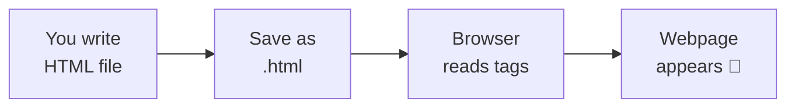
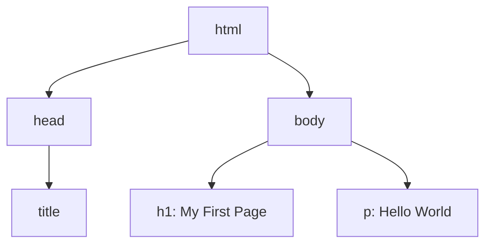

# 📘 Day 1: HTML Basics & Page Structure

> **Duration:** 1 to 1.5 hours
> **Level:** Absolute Beginner
> **Goal:** Build your very first webpage today! 🎉

---

## 👋 Hello students!

Hello students 👋
Welcome to **Day 1** of our HTML journey! Today is a very special day because by the end of this class, **you will create your first real webpage**. Yes — a real one that runs in the browser just like Google, Facebook, or YouTube!

Don't worry if you have **never written a single line of code**. HTML is the easiest, friendliest starting point in the whole world of programming. If you can write a letter or make a list, you can write HTML.

Let's begin! 🚀

---

## 1. 🎯 Introduction — What Will We Learn Today?

Today we will learn:

- What is HTML and why it exists
- A tiny bit of HTML history (fun and simple)
- How the browser reads your HTML file
- The difference between **structure** and **design**
- The **basic structure** of every HTML page
- Tags: `<!DOCTYPE html>`, `<html>`, `<head>`, `<title>`, `<body>`
- Headings `<h1>` to `<h6>`
- Paragraph `<p>`, Line break `<br>`, Comments `<!-- -->`
- How to save your file and open it in a browser

### ❓ Why is HTML important?

Think of any website you visit — Amazon, YouTube, Instagram. **Every single one of them is built on HTML.** HTML is the **skeleton** of the web. Without HTML, there is no webpage. Not a single one.

> 🧠 **Simple truth:** If you want to become a web developer, HTML is **lesson number one**. It's non-negotiable. But it's also **easy**. 🌟

---

## 2. 🧩 Concept Explanation

### What is HTML?

**HTML** stands for **H**yper**T**ext **M**arkup **L**anguage.

Let me break that scary name into 3 small pieces:

| Word | Meaning (in simple English) |
|------|------------------------------|
| **HyperText** | Text that can link to other text (click → jump to another page) |
| **Markup** | We "mark up" normal text with special tags to give it meaning |
| **Language** | A set of rules the browser understands |

👉 In short: **HTML tells the browser what each piece of content is** — "this is a heading", "this is a paragraph", "this is an image".

### 🏠 Real-World Analogy — The House

Imagine you're building a house:

- **HTML** = The **structure** (walls, rooms, doors, windows)
- **CSS** = The **design** (paint, wallpaper, decoration)
- **JavaScript** = The **behavior** (lights turning on, door bell ringing)

Today we focus **only on the structure** — the walls and rooms.

### 📰 Another Analogy — The Newspaper

Open any newspaper. You see:

- A big **headline** at the top
- Smaller **sub-headings**
- **Paragraphs** of news
- **Images** with captions
- **Lists** of match scores or stock prices

HTML lets us mark each of these the same way — "this is a headline", "this is a paragraph" — so the browser knows how to show them.

### 📜 A Tiny Bit of History

- HTML was invented in **1991** by **Tim Berners-Lee** (a British scientist at CERN).
- He wanted scientists around the world to **share documents easily**.
- That tiny idea grew into the **World Wide Web** we use every day!
- We are currently on **HTML5** — the modern version (since 2014).

> 💡 Fun fact: The very first website is still online → `info.cern.ch`. Just a few links on a white page. That's how it all started!

### 🖥️ How does the browser read HTML?

You write an HTML file → save it as `something.html` → double-click it → the browser opens it → the browser **reads your tags top to bottom** and **draws the page**.



### 🏗️ Structure vs. Design — Very Important!

| Structure (HTML) | Design (CSS) |
|------------------|--------------|
| What is on the page | How it looks |
| Headings, paragraphs, images | Colors, fonts, spacing |
| The skeleton | The skin and clothes |

Today: **100% structure.** We will not worry about colors or beauty. Trust me — structure first, beauty later.

---

## 3. 💡 Visual Learning — The DOM Tree

When the browser reads your HTML, it builds a **tree** inside its memory called the **DOM** (Document Object Model). Look at this:



👉 Everything lives **inside `<html>`**. Inside `<html>` we have two big children: `<head>` (invisible info) and `<body>` (visible content).

### ❓ Quick Question for You

If I want to show a welcome message on the screen, does it go inside `<head>` or `<body>`?

> ✅ Answer: **`<body>`** — because `<body>` is where **everything visible** lives.

---

## 4. 📝 Syntax + Code Examples

### 🔑 The Tag — HTML's Building Block

A **tag** looks like this: `<tagname>content</tagname>`

- `<p>` is the **opening tag**
- `</p>` is the **closing tag**
- The stuff in between is the **content**

```html
<p>This is a paragraph.</p>
```

Some tags have **no content** (they are called **self-closing / empty tags**):

```html
<br>
<hr>

```

### 🏠 The Basic Structure of Every HTML Page

Every HTML page — from Google.com to your tiny first page — follows this skeleton:

```html
<!DOCTYPE html>
<html>
  <head>
    <title>Page Title Goes Here</title>
  </head>
  <body>
    <!-- Visible content goes here -->
  </body>
</html>
```

### 🔍 Line-by-Line Explanation

| Line | What it does |
|------|--------------|
| `<!DOCTYPE html>` | Tells the browser: "Hey, this is HTML5, the modern version." Always write it on **line 1**. |
| `<html>` | The **root** tag. Everything lives inside it. |
| `<head>` | **Invisible info** about the page (title, settings, links). Not shown on screen. |
| `<title>` | The text that appears on the **browser tab**. |
| `<body>` | The **visible** part — text, images, buttons, everything the user sees. |

### 📰 Headings — `<h1>` to `<h6>`

HTML gives us **6 levels of headings**:

```html
<h1>Biggest heading — like a newspaper front-page headline</h1>
<h2>Second biggest</h2>
<h3>Third</h3>
<h4>Fourth</h4>
<h5>Fifth</h5>
<h6>Smallest heading</h6>
```

> 📏 **Rule of thumb:** Use **only one `<h1>`** per page — it's your main title. Then `<h2>` for sections, `<h3>` for sub-sections, and so on. Don't jump from `<h1>` straight to `<h4>` — be neat.

### 📝 Paragraph — `<p>`

```html
<p>HTML is the skeleton of every webpage on the internet.</p>
<p>It was invented in 1991 and today we are on HTML5.</p>
```

Each `<p>` starts on a **new line** automatically. Browsers handle spacing for you.

### ↩️ Line Break — `<br>`

Need a line break inside a paragraph? Use `<br>` (no closing tag needed):

```html
<p>Roses are red,<br>Violets are blue,<br>HTML is easy,<br>And so are you! 🌹</p>
```

### 💬 Comments — `<!-- ... -->`

Comments are **notes for yourself** (or your teammates). The browser **ignores** them completely.

```html
<!-- This is a comment. The browser will NOT show this. -->
<p>This paragraph WILL be shown.</p>
```

Use comments to:

- Explain tricky code
- Temporarily "hide" a block of HTML
- Leave TODO reminders

### ✅ Correct vs ❌ Wrong Examples

**❌ Wrong — missing closing tag:**

```html
<p>This paragraph has no closing tag
<p>And this one too
```

**✅ Correct:**

```html
<p>This paragraph is properly closed.</p>
<p>And so is this one.</p>
```

**❌ Wrong — bad nesting (tags crossing each other):**

```html
<h1>Hello <p>World</h1></p>
```

**✅ Correct — proper nesting (inner tag closes before outer):**

```html
<h1>Hello World</h1>
<p>Welcome to HTML</p>
```

> 🧠 **Golden Rule:** First opened, **last closed**. Like stacking plates — the one you put down first is the one you pick up last.

---

## 5. 🌐 Live Output Explanation — Your First Full Page

Here is a **complete, working HTML page**. Copy it exactly.

```html
<!DOCTYPE html>
<html>
  <head>
    <title>My First Webpage</title>
  </head>
  <body>
    <!-- Main heading of the page -->
    <h1>Welcome to My First Webpage 🎉</h1>

    <!-- Sub-heading -->
    <h2>About Me</h2>

    <p>Hello! My name is <b>Ravi</b> and I am learning HTML today.</p>
    <p>This is my very first webpage.<br>I am very excited!</p>

    <h2>My Hobbies</h2>
    <p>I love cricket, coding, and coffee ☕.</p>

    <h6>Created on Day 1 of my HTML journey.</h6>
  </body>
</html>
```

### 👀 What will you see in the browser?

- The **browser tab** will show: **"My First Webpage"** (from the `<title>`)
- The page will show:
  - A **big bold heading**: "Welcome to My First Webpage 🎉"
  - A medium heading: "About Me"
  - Two paragraphs, with a line break inside the second one
  - Another medium heading: "My Hobbies"
  - One paragraph about hobbies
  - A tiny heading at the bottom

### 💾 How to Save and Run

1. Open **VS Code** (or any text editor — even Notepad works!)
2. Click **File → New File**
3. Paste the code above
4. Click **File → Save As**
5. Name it exactly: `index.html` (the `.html` extension is critical!)
6. Go to your folder, **double-click** the file
7. 🎉 Your browser opens your page!

### ⌨️ Useful VS Code Shortcuts

| Shortcut | What it does |
|----------|---------------|
| `Ctrl` + `S` | Save file |
| `Ctrl` + `N` | New file |
| `Alt` + `Shift` + `F` | Auto-format the code neatly |
| `Ctrl` + `/` | Comment / uncomment a line |
| Type `!` then press `Tab` | Emmet magic — generates full HTML skeleton instantly! ✨ |

> 💡 **Pro tip:** Install the **"Live Server"** extension in VS Code. Right-click your HTML file → "Open with Live Server" → your page auto-refreshes every time you save. You'll love it!

---

## 6. 🧪 Hands-on Practice — 5 Tasks

Do these one by one. Don't skip! Practice = mastery. 💪

### ✏️ Task 1 — Hello World

Create a file `task1.html` with just one heading saying **"Hello World"** and one paragraph saying **"I am learning HTML."**

### ✏️ Task 2 — All 6 Headings

Create a file `task2.html` showing **all six headings** (`<h1>` to `<h6>`) — each with the text "This is heading level X". Notice the size difference!

### ✏️ Task 3 — About Me Page

Create `task3.html` with:

- An `<h1>` with your name
- A paragraph about **where you live**
- A paragraph about **your favorite food**
- A paragraph about **your dream job**

### ✏️ Task 4 — Use `<br>` and Comments

Write a small poem (4 lines) using a **single `<p>`** tag and `<br>` for line breaks. Add a `<!-- comment -->` above the poem describing it.

### ✏️ Task 5 — Daily Routine

Create `task5.html` with an `<h1>` "My Daily Routine" and **5 paragraphs** — one for each time of day: Morning, Afternoon, Evening, Night, Before Sleep.

---

## 7. ⚠️ Common Mistakes Beginners Make

### Mistake 1 — Forgetting the closing tag

```html
<!-- ❌ Wrong -->
<p>Hello
<p>World

<!-- ✅ Correct -->
<p>Hello</p>
<p>World</p>
```

### Mistake 2 — Saving with the wrong extension

If you save the file as `index.txt` instead of `index.html`, the browser will **not** render it. **The `.html` extension is what tells the browser "I am an HTML file!"**

### Mistake 3 — Wrong nesting

```html
<!-- ❌ Wrong -->
<h1><p>Wrong!</h1></p>

<!-- ✅ Correct -->
<h1>Correct!</h1>
<p>Also correct!</p>
```

### Mistake 4 — Typo in tag names

```html
<!-- ❌ Wrong -->
<heading>My Title</heading>
<paragraph>Some text</paragraph>

<!-- ✅ Correct -->
<h1>My Title</h1>
<p>Some text</p>
```

> There is no `<heading>` or `<paragraph>` tag. Tag names are **fixed** — you cannot invent them.

### Mistake 5 — Putting visible content inside `<head>`

```html
<!-- ❌ Wrong -->
<head>
  <title>My Page</title>
  <h1>Hello!</h1>   <!-- This will NOT show up properly -->
</head>
```

**Visible content always goes inside `<body>`.**

### Mistake 6 — Multiple `<h1>` tags everywhere

One `<h1>` per page is the recommended practice. Use `<h2>`, `<h3>` for the rest.

---

## 8. 📝 Mini Assignment — "My Introduction" Page

Create a complete webpage called **`introduction.html`**. Requirements:

- Proper HTML5 structure (DOCTYPE, html, head, body, title)
- Browser tab title: **"I am [Your Name]"**
- `<h1>`: "Hi, I'm [Your Name] 👋"
- `<h2>`: "About Me"
- A paragraph introducing yourself (at least 2 sentences)
- `<h2>`: "My Favorite Things"
- A paragraph listing **3 favorite things**, separated by `<br>`
- `<h2>`: "Why I'm Learning HTML"
- A final paragraph on your motivation
- At least **2 comments** in the code explaining sections
- Save and open in the browser

### 🌟 Bonus (optional)

Add an `<h3>` with today's date at the very bottom of the page, and make sure you can explain **every single line** of your code out loud.

---

## 9. 🔁 Recap — What Did We Learn Today?

- ✅ **HTML** = HyperText Markup Language — the skeleton of every webpage.
- ✅ HTML was invented in **1991** by **Tim Berners-Lee**. We are now on **HTML5**.
- ✅ **Structure (HTML)** is different from **design (CSS)**.
- ✅ Every HTML page follows the skeleton: `<!DOCTYPE html>` → `<html>` → `<head>` + `<body>`.
- ✅ `<head>` = **invisible** info (title, settings).
- ✅ `<body>` = **visible** content (everything the user sees).
- ✅ **Headings:** `<h1>` (biggest) to `<h6>` (smallest). Use one `<h1>` per page.
- ✅ **Paragraph:** `<p>`, **Line break:** `<br>`, **Comment:** `<!-- ... -->`.
- ✅ Always **close your tags** and **nest properly**.
- ✅ Save your file as `.html` and double-click to open in a browser.
- ✅ Use VS Code + Live Server for the smoothest workflow.

### 🎯 Your Mission Before Day 2

1. Complete all **5 hands-on tasks**.
2. Finish the **Introduction Assignment**.
3. Create **1 extra page** about your family or your city — just for fun.
4. Come to Day 2 ready to learn **links, images, lists, and tables**! 🚀

> 💬 **Remember:** Every great web developer started exactly where you are today — a blank page and a curious mind. You are officially on your way. See you on **Day 2**! 👋
