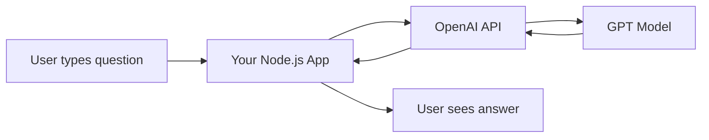
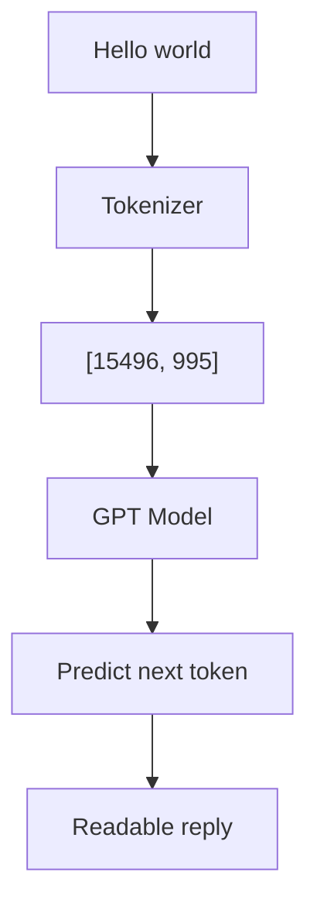
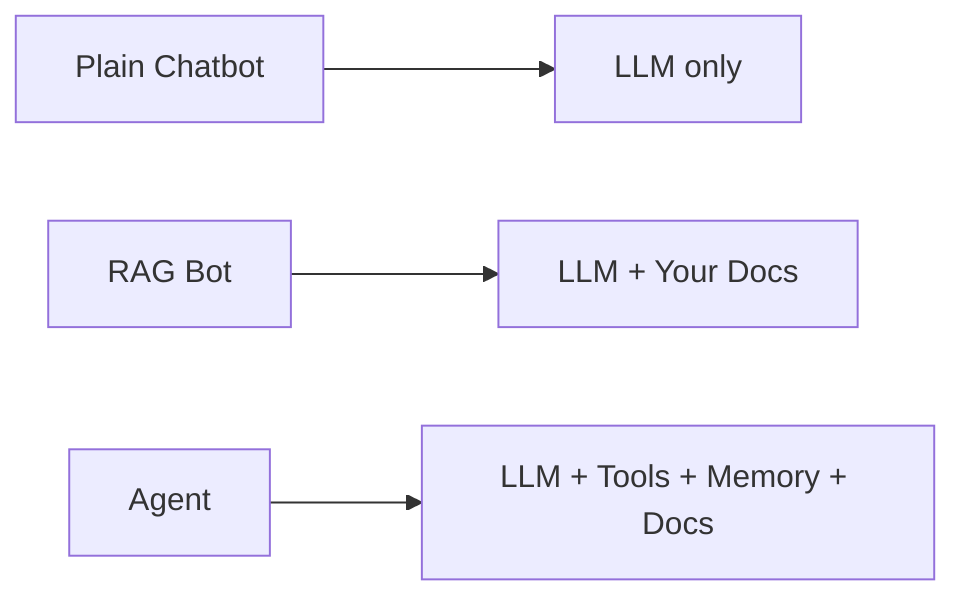

# 📅 Day 1 — AI Foundations + LLM + OpenAI API (JS/TS)

Hello students 👋

Welcome to **Day 1** of our 8-day RAG + OpenAI Agent SDK journey.
Today we start from absolute zero — no AI experience needed. By the end of today, **you will make your computer talk to GPT using Node.js**. 🚀

---

## 1. Introduction

### 🎯 What we learn today?
- What is **AI**, **LLM**, and **GPT** in simple words
- How **chat completion** actually works behind the scenes
- What are **tokens** and why they cost money
- **Prompting basics** (how to talk to AI properly)
- Setup a **Node.js + TypeScript project**
- Connect to the **OpenAI API**
- Build our first AI response script
- 💻 Mini project: **"Ask anything" CLI chatbot**

### 🌍 Why it matters in real-world AI apps?
Every AI product you use today — ChatGPT, GitHub Copilot, customer support bots, coding assistants — is built on top of the **same OpenAI API calls** you will learn today. Once you master today's building blocks, everything else (RAG, Agents, Tools) is just **LEGO pieces on top**. 🧱

---

## 2. Concept Explanation

### 🤖 What is AI?
**Artificial Intelligence (AI)** means making computers do things that usually need a human brain — like understanding language, seeing images, or writing code.

### 🧠 What is an LLM?
**LLM = Large Language Model**.
It is a program trained on **billions of sentences** from books, websites, and code. It learned patterns of language so well that it can **predict the next word** very accurately.

> Think of LLM as a very smart friend who has read the entire internet.

### 💬 What is GPT?
**GPT = Generative Pre-trained Transformer**.
It is OpenAI's family of LLMs (GPT-3.5, GPT-4, GPT-4o, etc.). "Generative" = it generates text. That's it!

### 🗨️ How chat completion works
When you send a message to GPT, here is what happens:

1. Your text is cut into tiny pieces called **tokens** (~4 characters each).
2. Tokens are converted into **numbers** (vectors).
3. The model predicts the **next token**, then the next, then the next…
4. These tokens are stitched back into readable text.
5. You receive the reply.

### 🪙 What are tokens?
- `"Hello"` = 1 token
- `"ChatGPT is amazing"` = ~4 tokens
- 1 English word ≈ 0.75 tokens
- **You pay per token** (input + output).

### 📜 Prompting basics
A **prompt** is the instruction you give to the LLM. Better prompt = better answer.

Simple rules:
- Be clear about the **role** ("You are a helpful assistant").
- Be clear about the **task** ("Summarize in 3 bullets").
- Be clear about the **format** ("Return as JSON").

---

## 3. 💡 Visual Learning

### How a chat request flows end-to-end



### Tokens lifecycle



### Chatbot vs RAG vs Agent (preview)



---

## 4. 🛠️ Setup Node.js + TypeScript Project

### Step 1: Create project folder

```bash id="day1setup1"
mkdir ai-day1
cd ai-day1
npm init -y
```

### Step 2: Install packages

```bash id="day1setup2"
npm install openai dotenv
npm install -D typescript ts-node @types/node
npx tsc --init
```

### Step 3: `.env` file

Create a file named `.env` in the root:

```env id="day1env"
OPENAI_API_KEY=sk-your-real-key-here
```

> 🔒 Never commit `.env` to Git. Add it to `.gitignore`.

### Step 4: Folder structure

```text id="day1folder"
ai-day1/
├── src/
│   └── index.ts
├── .env
├── package.json
└── tsconfig.json
```

---

## 5. Code Examples

### ✅ First OpenAI call (JavaScript)

```js id="day1js1"
// src/index.js
require("dotenv").config();
const OpenAI = require("openai");

const client = new OpenAI({ apiKey: process.env.OPENAI_API_KEY });

async function main() {
  const res = await client.chat.completions.create({
    model: "gpt-4o-mini",
    messages: [
      { role: "system", content: "You are a friendly teacher." },
      { role: "user", content: "Explain what an LLM is in one sentence." }
    ]
  });

  console.log(res.choices[0].message.content);
}

main();
```

### ✅ First OpenAI call (TypeScript)

```ts id="day1ts1"
// src/index.ts
import "dotenv/config";
import OpenAI from "openai";

const client = new OpenAI({ apiKey: process.env.OPENAI_API_KEY });

async function main(): Promise<void> {
  const res = await client.chat.completions.create({
    model: "gpt-4o-mini",
    messages: [
      { role: "system", content: "You are a friendly teacher." },
      { role: "user", content: "Explain what an LLM is in one sentence." }
    ]
  });

  console.log(res.choices[0].message.content);
}

main();
```

Run it:

```bash id="day1run"
npx ts-node src/index.ts
```

### ✅ Understanding roles

| Role | Purpose | Example |
|------|---------|---------|
| `system` | Set behavior of AI | "You are a polite support bot" |
| `user` | The human message | "What is RAG?" |
| `assistant` | Past AI reply (used in memory) | "RAG means..." |

---

## 6. 🧾 JSON Response Design

Even on Day 1, let us build the habit of **structured JSON responses** — this is how production apps work.

```ts id="day1jsonwrap"
import "dotenv/config";
import OpenAI from "openai";

interface AIResponse {
  success: boolean;
  question: string;
  answer: string;
  model: string;
  tokensUsed: number;
}

const client = new OpenAI({ apiKey: process.env.OPENAI_API_KEY });

export async function askAI(question: string): Promise<AIResponse> {
  const res = await client.chat.completions.create({
    model: "gpt-4o-mini",
    messages: [
      { role: "system", content: "Answer in one short sentence." },
      { role: "user", content: question }
    ]
  });

  return {
    success: true,
    question,
    answer: res.choices[0].message.content ?? "",
    model: res.model,
    tokensUsed: res.usage?.total_tokens ?? 0
  };
}

askAI("What is Node.js?").then((r) => console.log(JSON.stringify(r, null, 2)));
```

Expected output shape:

```json id="day1json1"
{
  "success": true,
  "question": "What is Node.js?",
  "answer": "Node.js is a JavaScript runtime built on Chrome's V8 engine.",
  "model": "gpt-4o-mini",
  "tokensUsed": 42
}
```

---

## 7. 💻 Hands-on Practice (Try at least 5)

1. Change the system prompt to: *"You are a pirate. Reply like a pirate."* and test.
2. Ask the AI to reply **only in 3 bullet points**.
3. Add a `temperature: 0` and ask the same question 3 times — notice the answer is the same.
4. Change `temperature: 1.2` — notice more creative but less reliable answers.
5. Print the full raw response (`console.log(res)`) and find the `usage` object.
6. Ask the AI a question in Hindi, Urdu, or Arabic — it will reply in that language.
7. Wrap the call in a `try/catch` and intentionally break the API key to see the error.

---

## 8. ⚠️ Common Mistakes

- ❌ **Hardcoding the API key** in source code → leaks on GitHub. Always use `.env`.
- ❌ **Ignoring `usage.total_tokens`** → you won't know your bill until it is too late.
- ❌ **Using `gpt-4` for simple tasks** → `gpt-4o-mini` is 10x cheaper for basic chat.
- ❌ **Writing vague prompts** like "Tell me something" → you get garbage back.
- ❌ **No error handling** → your app crashes on network errors or rate limits.
- ❌ **Expecting AI to know today's date or live data** — it doesn't, unless you give it.

---

## 9. 📝 Mini Assignment — "Ask Anything" CLI Chatbot

Build a terminal chatbot that keeps asking you for input and replies until you type `exit`.

**Requirements:**
- Use TypeScript
- Keep **conversation history** (all previous messages)
- Return the answer wrapped in JSON (`{ success, answer, tokensUsed }`)
- Use `gpt-4o-mini`

**Starter code:**

```ts id="day1assign"
import "dotenv/config";
import OpenAI from "openai";
import readline from "readline";

const client = new OpenAI({ apiKey: process.env.OPENAI_API_KEY });
const history: { role: "system" | "user" | "assistant"; content: string }[] = [
  { role: "system", content: "You are a helpful assistant." }
];

const rl = readline.createInterface({ input: process.stdin, output: process.stdout });

function ask() {
  rl.question("You: ", async (input) => {
    if (input.trim().toLowerCase() === "exit") return rl.close();

    history.push({ role: "user", content: input });

    const res = await client.chat.completions.create({
      model: "gpt-4o-mini",
      messages: history
    });

    const reply = res.choices[0].message.content ?? "";
    history.push({ role: "assistant", content: reply });

    console.log(JSON.stringify({
      success: true,
      answer: reply,
      tokensUsed: res.usage?.total_tokens ?? 0
    }, null, 2));

    ask();
  });
}

ask();
```

---

## 10. 🔁 Recap

- **AI** → broad field, **LLM** → language brain, **GPT** → OpenAI's LLM family.
- Chat completion works by **predicting tokens one by one**.
- **Tokens = money** → always check `usage.total_tokens`.
- A good prompt has a **role + task + format**.
- `system` sets behavior, `user` is you, `assistant` is the AI's reply.
- Always **return JSON** from production functions — even on Day 1.
- `.env` for secrets, **never** commit keys.

See you tomorrow for **Day 2 — Structured Output + JSON Responses** where we make the AI return **perfect, validated JSON** every single time. 🎯
