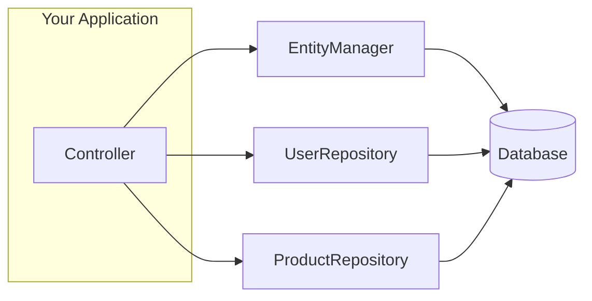
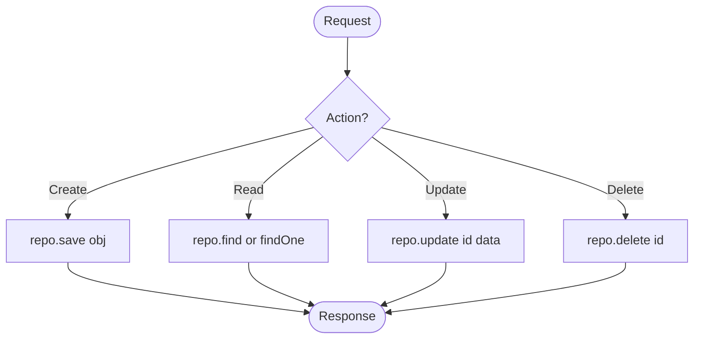

# 📅 Day 2: CRUD Operations + Repository Pattern

Hello students 👋

Welcome back to **Day 2**! Yesterday we built our first TypeORM project and created an entity. Today is the **real fun part** — we will learn **CRUD operations** in depth.

CRUD = **C**reate, **R**ead, **U**pdate, **D**elete.

Almost every backend app you'll ever build is just CRUD with business rules on top. Master this, and you've mastered 70% of backend work. 💪

---

## 1. 🎯 Introduction — What Will We Learn Today?

Today's agenda:

1. What is a **Repository**?
2. Why use the Repository pattern?
3. **Create** data (`save`, `insert`, `create`)
4. **Read** data (`find`, `findOne`, `findBy`, conditions)
5. **Update** data (`update`, `save`)
6. **Delete** data (`delete`, `remove`, `softDelete`)
7. Difference between `EntityManager` and `Repository`

Small question 🤔:
> If `manager.save()` already works, why do we need a repository?

We'll answer it shortly.

---

## 2. 🧠 Concept Explanation

### 2.1 Why is CRUD Important?

Think of any app — Instagram, Amazon, WhatsApp, your college portal. What do they all do?

- Instagram → **Create** a post, **Read** feed, **Update** caption, **Delete** post
- Amazon → **Create** an order, **Read** products, **Update** cart, **Delete** from wishlist
- WhatsApp → **Create** message, **Read** chats, **Update** status, **Delete** message

See? **Every app is just CRUD**. Master CRUD and you can build anything.

### 2.2 What is a Repository?

A **Repository** is a dedicated helper class for **one entity**.

Real-world analogy 🏬:
Imagine a supermarket. There's a **cashier** (EntityManager) who can help with any product, but there's also a **fruit specialist** at the fruit counter (Repository) who knows only fruits but knows them deeply.

- `EntityManager` → generic, works for all entities
- `Repository<User>` → specialized, only for `User`

### 2.3 Why Use Repository Pattern?

Three reasons:

1. **Cleaner code** — each entity has its own helper
2. **Easier testing** — mock the repo in unit tests
3. **Separation of concerns** — business logic stays out of the database layer

---

## 3. 💡 Visual Learning

### Repository vs EntityManager



### CRUD Lifecycle



---

## 4. 🛠️ Project Setup (Continuing from Day 1)

We'll build on yesterday's project. Let's add one more entity for today's practice.

```ts id="userentityday2"
// src/entity/User.ts
import {
  Entity,
  PrimaryGeneratedColumn,
  Column,
  CreateDateColumn,
  UpdateDateColumn,
} from "typeorm";

@Entity()
export class User {
  @PrimaryGeneratedColumn()
  id: number;

  @Column({ length: 100 })
  name: string;

  @Column({ unique: true })
  email: string;

  @Column({ type: "int", default: 18 })
  age: number;

  @Column({ default: true })
  isActive: boolean;

  @CreateDateColumn()
  createdAt: Date;

  @UpdateDateColumn()
  updatedAt: Date;
}
```

Remember to keep `synchronize: true` in your `data-source.ts` during learning mode.

---

## 5. 📦 Getting a Repository

```ts id="getrepo"
import { AppDataSource } from "./data-source";
import { User } from "./entity/User";

const userRepo = AppDataSource.getRepository(User);
```

Now `userRepo` has every method we need. Let's use it.

---

## 6. ✨ CREATE — Inserting Data

TypeORM gives you **three** ways to insert. Let's look at each.

### 6.1 Method 1: `save()` (Most Common)

```ts id="createsave"
const user = new User();
user.name = "Ayesha";
user.email = "ayesha@mail.com";
user.age = 24;

await userRepo.save(user);
console.log("Saved:", user);
```

✅ `save()` is **smart**: if the entity has an `id`, it updates. If not, it inserts.

### 6.2 Method 2: `create()` + `save()`

```ts id="createandsave"
const user = userRepo.create({
  name: "Bilal",
  email: "bilal@mail.com",
  age: 30,
});

await userRepo.save(user);
```

👉 `create()` **doesn't touch the DB** — it just builds an object. You still need `save()`.

### 6.3 Method 3: `insert()` (Pure INSERT)

```ts id="insertonly"
await userRepo.insert({
  name: "Carla",
  email: "carla@mail.com",
  age: 28,
});
```

`insert()` runs a pure SQL `INSERT`. Faster but it won't trigger entity lifecycle hooks.

### SQL Equivalent

```sql id="createsql"
INSERT INTO "user" ("name", "email", "age")
VALUES ('Ayesha', 'ayesha@mail.com', 24);
```

---

## 7. 🔍 READ — Fetching Data

### 7.1 Find All

```ts id="findall"
const users = await userRepo.find();
```

**SQL:**
```sql id="findallsql"
SELECT * FROM "user";
```

### 7.2 Find with Conditions

```ts id="findwhere"
const activeUsers = await userRepo.find({
  where: { isActive: true },
});
```

**SQL:**
```sql id="findwheresql"
SELECT * FROM "user" WHERE "isActive" = true;
```

### 7.3 Find One

```ts id="findone"
const user = await userRepo.findOne({
  where: { id: 1 },
});
```

Or the shortcut:

```ts id="findoneby"
const user = await userRepo.findOneBy({ id: 1 });
```

### 7.4 Select Specific Columns

```ts id="selectspecific"
const users = await userRepo.find({
  select: ["id", "name"],
  where: { isActive: true },
});
```

### 7.5 Ordering and Limiting

```ts id="orderandlimit"
const users = await userRepo.find({
  order: { createdAt: "DESC" },
  take: 10,     // LIMIT 10
  skip: 20,     // OFFSET 20 (for pagination)
});
```

### 7.6 Advanced Operators

```ts id="advancedoperators"
import { Like, MoreThan, LessThan, In, Between } from "typeorm";

// names starting with 'A'
await userRepo.find({ where: { name: Like("A%") } });

// age greater than 25
await userRepo.find({ where: { age: MoreThan(25) } });

// age between 20 and 30
await userRepo.find({ where: { age: Between(20, 30) } });

// id in a list
await userRepo.find({ where: { id: In([1, 2, 3]) } });
```

### 7.7 Counting

```ts id="counting"
const total = await userRepo.count({ where: { isActive: true } });
console.log("Active users:", total);
```

---

## 8. ✏️ UPDATE — Modifying Data

### 8.1 Method 1: `update()` (Direct SQL UPDATE)

```ts id="updatedirect"
await userRepo.update(
  { id: 1 },                 // WHERE
  { name: "Ayesha Khan" },   // SET
);
```

**SQL:**
```sql id="updatesql"
UPDATE "user" SET "name" = 'Ayesha Khan' WHERE "id" = 1;
```

### 8.2 Method 2: Load + Modify + Save

```ts id="updateloadsave"
const user = await userRepo.findOneBy({ id: 1 });
if (user) {
  user.name = "Ayesha Khan";
  user.age = 25;
  await userRepo.save(user);
}
```

👉 Use this when you have **business rules** that must run before saving (e.g., validation, hashing password).

### 8.3 When to Use Which?

| Scenario | Use |
|----------|-----|
| Simple bulk update | `update()` |
| Updating one row with logic | `findOne + save` |
| Updating many rows at once | `update()` or `QueryBuilder` |

---

## 9. 🗑️ DELETE — Removing Data

### 9.1 Method 1: `delete()` (Hard Delete)

```ts id="deletedirect"
await userRepo.delete({ id: 1 });
```

**SQL:**
```sql id="deletesql"
DELETE FROM "user" WHERE "id" = 1;
```

### 9.2 Method 2: `remove()`

```ts id="deleteremove"
const user = await userRepo.findOneBy({ id: 1 });
if (user) await userRepo.remove(user);
```

### 9.3 Soft Delete (Recommended for Real Apps)

Sometimes you don't want to **actually** delete data — you want to mark it as deleted. This is called a **soft delete**.

Add `@DeleteDateColumn()` to the entity:

```ts id="softdeleteentity"
import { DeleteDateColumn } from "typeorm";

@DeleteDateColumn()
deletedAt: Date;
```

Then:

```ts id="softdeleteusage"
await userRepo.softDelete({ id: 1 });
// later
await userRepo.restore({ id: 1 });
```

**SQL:**
```sql id="softdeletesql"
UPDATE "user" SET "deletedAt" = NOW() WHERE "id" = 1;
```

> 🏦 **Real-world:** Banks **never** hard delete transactions. They soft-delete so audits can verify history.

---

## 10. 🧩 Putting It All Together

A complete CRUD script:

```ts id="fullcrud"
// src/index.ts
import { AppDataSource } from "./data-source";
import { User } from "./entity/User";

async function run() {
  await AppDataSource.initialize();
  const userRepo = AppDataSource.getRepository(User);

  // CREATE
  const u = userRepo.create({
    name: "Zara",
    email: "zara@mail.com",
    age: 22,
  });
  await userRepo.save(u);
  console.log("Created:", u);

  // READ
  const all = await userRepo.find({ order: { id: "ASC" } });
  console.log("All users:", all);

  // UPDATE
  await userRepo.update({ id: u.id }, { age: 23 });
  const updated = await userRepo.findOneBy({ id: u.id });
  console.log("Updated:", updated);

  // DELETE
  await userRepo.delete({ id: u.id });
  console.log("Deleted user id:", u.id);
}

run().catch(console.error);
```

---

## 11. 🧪 Hands-on Practice

Try these 5 exercises:

1. **Exercise 1:** Insert 10 users in one go using `userRepo.save([...])`.
2. **Exercise 2:** Find all users older than 25 using `MoreThan()`.
3. **Exercise 3:** Implement pagination: page 2, 5 users per page.
4. **Exercise 4:** Update all inactive users to set `age = 0`.
5. **Exercise 5:** Add `@DeleteDateColumn` and implement soft-delete + restore.

---

## 12. ⚠️ Common Mistakes

1. **Calling `create()` and forgetting `save()`**
   - `create()` only builds the object in memory.
   - ✅ Fix: Always call `save()` after `create()`.

2. **Using `save()` for bulk updates**
   - `save()` loads each entity first — slow for big datasets.
   - ✅ Fix: Use `update()` for bulk changes.

3. **Forgetting `where` in `update()` or `delete()`**
   - ⚠️ This will **update/delete EVERY row** in the table! 😱
   - ✅ Fix: Always pass a `where` object.

4. **Comparing string and number IDs**
   - `findOneBy({ id: "1" })` may return nothing because `id` is a number.
   - ✅ Fix: Convert with `Number(req.params.id)`.

5. **Querying inside a loop**
   - Causes N+1 problem (we'll see this in Day 3).
   - ✅ Fix: Use `In()` or a single query.

---

## 13. 📝 Mini Assignment

Build a **User management CLI**:

1. Create an `Admin` entity with: `id`, `username`, `email`, `role` (default `"admin"`), `createdAt`.
2. Write functions:
   - `createAdmin(data)`
   - `listAdmins()`
   - `findAdminByEmail(email)`
   - `updateAdminRole(id, role)`
   - `softDeleteAdmin(id)`
3. Test each function by calling them from `index.ts`.

💡 **Bonus:** Print the total number of admins created today (hint: use `Between` on `createdAt`).

---

## 14. 🔁 Recap

Today you learned:

- ✅ `Repository` = specialized helper for one entity
- ✅ CREATE → `create()` + `save()`, or `insert()`
- ✅ READ → `find()`, `findOne()`, `findBy()`, operators like `Like`, `MoreThan`, `In`
- ✅ UPDATE → `update()` for direct SQL, `save()` for object-based
- ✅ DELETE → `delete()`, `remove()`, and `softDelete()` for audit-friendly deletes
- ✅ Pagination with `take` + `skip`

**Tomorrow (Day 3):** We'll connect tables together using **Relationships** — One-to-One, One-to-Many, Many-to-Many. This is where ORMs really shine! 🌟

See you tomorrow! 👋
