## **Operators** 
First, the complete map:Six categories. We'll go through each one with live examples and animations. Let's start!


---

## Category 1 — Arithmetic Operators

These do **maths** — the ones you already know from school, plus two special ones


`<style>
  h2.sr-only{position:absolute;width:1px;height:1px;overflow:hidden;clip:rect(0,0,0,0)}
  .code{background:var(--color-background-secondary);border:0.5px solid var(--color-border-tertiary);border-radius:var(--border-radius-md);padding:.75rem 1rem;font-family:var(--font-mono);font-size:13px;line-height:1.9;color:var(--color-text-primary);margin:.4rem 0}
  .kw{color:#534AB7}.num{color:#854F0B}.cm{color:var(--color-text-tertiary);font-style:italic}.op{color:#D85A30;font-weight:500}
  .op-grid{display:grid;grid-template-columns:repeat(4,1fr);gap:8px;margin:.75rem 0}
  .op-card{background:var(--color-background-primary);border:0.5px solid var(--color-border-secondary);border-radius:var(--border-radius-lg);padding:.65rem .75rem;cursor:pointer;transition:all .2s;text-align:center}
  .op-card:hover{border-color:#1D9E75;background:var(--color-background-secondary)}
  .op-card.active{border-color:#1D9E75;border-width:1.5px;background:#E1F5EE}
  .op-sym{font-size:28px;font-weight:500;font-family:var(--font-mono);color:#D85A30;line-height:1.2}
  .op-name{font-size:11px;color:var(--color-text-secondary);margin-top:2px}
  .calc-area{background:var(--color-background-secondary);border-radius:var(--border-radius-lg);padding:1rem;margin:.5rem 0}
  .calc-row{display:flex;gap:8px;align-items:center;margin-bottom:.5rem;flex-wrap:wrap}
  .calc-row label{font-size:12px;color:var(--color-text-secondary);min-width:16px}
  .calc-row input{font-family:var(--font-mono);font-size:14px;width:80px;text-align:center}
  .result-big{font-size:32px;font-weight:500;font-family:var(--font-mono);color:#085041;padding:.5rem 1rem;background:#E1F5EE;border-radius:var(--border-radius-md);text-align:center;margin:.5rem 0;min-height:56px;line-height:1.5;transition:all .25s}
  .explain{font-size:13px;color:var(--color-text-secondary);margin:.4rem 0;min-height:20px}
  .special-box{background:var(--color-background-secondary);border-left:3px solid #D85A30;border-radius:0 var(--border-radius-md) var(--border-radius-md) 0;padding:.6rem 1rem;margin:.5rem 0;font-size:13px;color:var(--color-text-primary)}
  @media(max-width:480px){.op-grid{grid-template-columns:repeat(2,1fr)}}
</style>

<h2 class="sr-only">Interactive arithmetic operators calculator</h2>

<div class="op-grid" id="op-btns">
  <div class="op-card active" onclick="selectOp('+',this)"><div class="op-sym">+</div><div class="op-name">addition</div></div>
  <div class="op-card" onclick="selectOp('-',this)"><div class="op-sym">-</div><div class="op-name">subtraction</div></div>
  <div class="op-card" onclick="selectOp('*',this)"><div class="op-sym">*</div><div class="op-name">multiplication</div></div>
  <div class="op-card" onclick="selectOp('/',this)"><div class="op-sym">/</div><div class="op-name">division</div></div>
  <div class="op-card" onclick="selectOp('%',this)"><div class="op-sym">%</div><div class="op-name">modulus (remainder)</div></div>
  <div class="op-card" onclick="selectOp('**',this)"><div class="op-sym">**</div><div class="op-name">exponent (power)</div></div>
  <div class="op-card" onclick="selectOp('++',this)"><div class="op-sym">++</div><div class="op-name">increment +1</div></div>
  <div class="op-card" onclick="selectOp('--',this)"><div class="op-sym">--</div><div class="op-name">decrement -1</div></div>
</div>

<div class="calc-area">
  <div id="inc-dec-area" style="display:none">
    <div class="calc-row">
      <label>n =</label>
      <input type="number" id="single-n" value="5"/>
    </div>
    <div style="display:flex;gap:8px;margin:.5rem 0">
      <button onclick="doIncDec()">Apply</button>
    </div>
  </div>
  <div id="two-arg-area">
    <div class="calc-row">
      <label>a =</label>
      <input type="number" id="inp-a" value="10"/>
      <span id="op-display" style="font-size:22px;font-weight:500;color:#D85A30;font-family:var(--font-mono);min-width:36px;text-align:center">+</span>
      <label>b =</label>
      <input type="number" id="inp-b" value="3"/>
      <button onclick="calculate()" style="margin-left:4px">=</button>
    </div>
  </div>
  <div class="result-big" id="result-display">10 + 3 = 13</div>
  <div class="explain" id="explain-text">Addition: adds two numbers together</div>
</div>

<div class="special-box" id="special-note">
  <strong>% modulus tip:</strong> Use it to check if a number is even or odd:<br>
  <code>if (n % 2 === 0) → even</code><br>
  <code>if (n % 2 !== 0) → odd</code>
</div>

<script>
let curOp='+';
const explains={
  '+':'Addition: adds two numbers together.',
  '-':'Subtraction: takes the second number away from the first.',
  '*':'Multiplication: multiplies two numbers.',
  '/':'Division: divides the first number by the second.',
  '%':'Modulus: gives the REMAINDER after division. 10 % 3 = 1 because 10 ÷ 3 = 3 remainder 1.',
  '**':'Exponent (power): 2 ** 3 = 2 × 2 × 2 = 8.',
  '++':'Increment: adds 1 to a variable. n++ is the same as n = n + 1.',
  '--':'Decrement: subtracts 1 from a variable. n-- is the same as n = n - 1.'
};
const notes={
  '+':'<strong>+</strong> with numbers adds them. With strings it joins them: "Hello" + " World" = "Hello World"',
  '-':'Negative results are fine: 3 - 10 = -7',
  '*':'Decimals work too: 2.5 * 4 = 10',
  '/':'Dividing by 0 gives Infinity in JavaScript: 5 / 0 = Infinity',
  '%':'<strong>% modulus tip:</strong> Use it to check even/odd: <code>n % 2 === 0</code> means even!',
  '**':'<strong>** exponent:</strong> 2**10 = 1024 &nbsp;|&nbsp; 9**0.5 = 3 (square root trick!)',
  '++':'<strong>Pre vs post:</strong> <code>++n</code> increments BEFORE using. <code>n++</code> increments AFTER using.',
  '--':'Used in loops constantly: <code>while(n-- > 0)</code> counts down.'
};

function selectOp(op, el){
  curOp=op;
  document.querySelectorAll('.op-card').forEach(c=>c.classList.remove('active'));
  el.classList.add('active');
  document.getElementById('op-display').textContent=op;
  document.getElementById('explain-text').textContent=explains[op];
  document.getElementById('special-note').innerHTML=notes[op];
  const isInc=op==='++'||op==='--';
  document.getElementById('inc-dec-area').style.display=isInc?'block':'none';
  document.getElementById('two-arg-area').style.display=isInc?'none':'block';
  if(!isInc) calculate(); else doIncDec();
}

function calculate(){
  const a=parseFloat(document.getElementById('inp-a').value)||0;
  const b=parseFloat(document.getElementById('inp-b').value)||0;
  let r;
  if(curOp==='+') r=a+b;
  else if(curOp==='-') r=a-b;
  else if(curOp==='*') r=a*b;
  else if(curOp==='/') r=b!==0?a/b:'Infinity';
  else if(curOp==='%') r=a%b;
  else if(curOp==='**') r=Math.pow(a,b);
  const disp=typeof r==='number'?parseFloat(r.toFixed(8)):r;
  document.getElementById('result-display').textContent=a+' '+curOp+' '+b+' = '+disp;
}

function doIncDec(){
  const n=parseFloat(document.getElementById('single-n').value)||0;
  const r=curOp==='++'?n+1:n-1;
  document.getElementById('result-display').textContent='n = '+n+'  →  n'+curOp+' = '+r;
  document.getElementById('single-n').value=r;
}
</script>`

Click every operator card — especially `%` (modulus) and `**` (exponent) which are new. Change the numbers and press `=` to see live results. Try `**` with `2` and `10` — you get 1024!

---

## Category 2 — Assignment Operators

These **store values into variables**. You know `=` already — now meet its shortcuts:Click each operator, change the operand, and press **Apply** — watch x update each time. Try doing `+=` five times with 10 — x grows from 10 → 20 → 30 → 40 → 50!

---

## Category 3 — Comparison Operators

These **compare two values** and always return `true` or `false`. This is what powers every `if` statement:Click the tricky tests at the bottom — especially `5 === "5"` and `0 === false`. These are where beginners make mistakes every day!

---

## Category 4 — Logical Operators

These combine **multiple conditions** together. Think of them as the words **"AND"**, **"OR"**, and **"NOT"** in English:Toggle the two switches — watch all three results update instantly. Try switching one off and see how `&&` breaks but `||` still works. This is exactly what login and permission checks look like in a real app!

---

## Category 5 — String & Ternary OperatorsOn the left — type your own words and see how `+` joins them. On the right — change `age` and `min` to see the ternary flip between Adult and Minor. Try all 4 real-world examples at the bottom!

---

## Complete Cheat Sheet — All Operators

```js
// ── ARITHMETIC ──────────────────────────────────
10 + 3    // 13   addition
10 - 3    // 7    subtraction
10 * 3    // 30   multiplication
10 / 3    // 3.33 division
10 % 3    // 1    remainder (modulus)
2  ** 8   // 256  power (2 to the 8th)
let n=5; n++;  // n is now 6   (increment)
let m=5; m--;  // m is now 4   (decrement)

// ── ASSIGNMENT ──────────────────────────────────
let x = 10;   // store 10
x += 5;       // x = x + 5  → 15
x -= 3;       // x = x - 3  → 12
x *= 2;       // x = x * 2  → 24
x /= 4;       // x = x / 4  → 6
x %= 4;       // x = x % 4  → 2

// ── COMPARISON (always returns true/false) ──────
5 === 5       // true   (same value, same type)
5 === "5"     // false  (different type!)
5 !== 10      // true   (they ARE different)
10 > 5        // true
10 < 5        // false
10 >= 10      // true   (equal counts!)
5  <= 10      // true

// ── LOGICAL ─────────────────────────────────────
true && true  // true   (AND — both must be true)
true && false // false
true || false // true   (OR  — one is enough)
false|| false // false
!true         // false  (NOT — flip it)
!false        // true

// ── STRING ──────────────────────────────────────
"Hello" + " " + "World"     // "Hello World"
`My name is ${"Alice"}`     // "My name is Alice"

// ── TERNARY (one-line if/else) ───────────────────
let age = 20;
let label = age >= 18 ? "Adult" : "Minor"; // "Adult"
```

---

**Homework — paste this in your console (F12):**

```js
let score = 85;

// 1. Arithmetic
console.log(score + 10);  // add bonus
console.log(score % 10);  // last digit

// 2. Assignment shortcut
score += 5;
console.log(score);       // 90

// 3. Comparison
console.log(score >= 90); // true or false?
console.log(score === 90);

// 4. Logical
let passed  = score >= 50;
let topMark = score >= 90;
console.log(passed && topMark);  // both?
console.log(passed || topMark);  // either?

// 5. Ternary
let grade = score >= 90 ? "A" : score >= 75 ? "B" : "C";
console.log(grade);
```

Ready for the next topic? We can move into **Objects and JSON** (the data structure behind every API and MongoDB document), or cover **DOM Manipulation** (how JS controls what you see in the browser). What would you like? 🚀