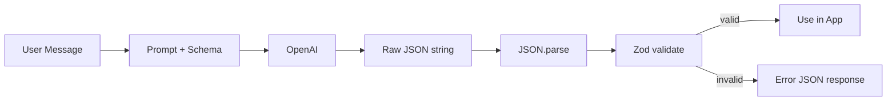
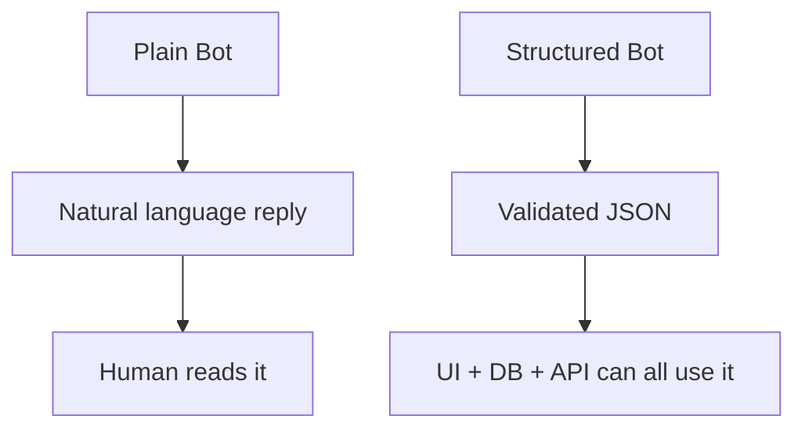

# 📅 Day 2 — Structured Output + JSON Responses

Hello students 👋

Welcome to **Day 2**! Yesterday we made the AI *speak*. Today we make the AI **speak in a predictable, machine-readable format** — so that our backend, frontend, and database can all understand it. This is the **#1 skill** that separates a hobby project from a production AI app. 💼

---

## 1. Introduction

### 🎯 What we learn today?
- Why **JSON output** matters in real apps
- Schema-based prompting
- **JSON mode** & **Structured Outputs** in OpenAI
- Response validation with **Zod**
- Graceful error responses
- TypeScript **interfaces** for AI output
- 💻 Mini project: **Customer Support Bot returning JSON**

### 🌍 Why it matters
Imagine building a support app. The AI replies:
> *"Sure! I think the user is very angry and wants a refund 😅"*

Cool for humans. **Useless for a backend.** Your server needs:

```json id="day2whymatter"
{ "intent": "refund", "sentiment": "angry", "priority": "high" }
```

That is a **machine-consumable reply**. Today we learn to guarantee this shape.

---

## 2. Concept Explanation

### 📦 Why JSON output matters
- Frontend can render it into a UI
- Backend can save it to MongoDB / Postgres
- Other services can consume it via API
- You can **validate** it before using
- You can **log / audit** it

### 🧭 Three ways to get JSON from OpenAI

| Approach | Reliability | Effort | Recommended |
|----------|-------------|--------|-------------|
| Plain prompt ("reply in JSON") | ⭐⭐ | Low | ❌ Risky |
| JSON mode (`response_format: { type: "json_object" }`) | ⭐⭐⭐⭐ | Medium | ✅ Good |
| Structured Outputs (JSON schema) | ⭐⭐⭐⭐⭐ | Slightly more | ✅✅ Best |

### 🛡️ Validation
Even when the AI returns JSON, you MUST validate it before using. We'll use **Zod**, the industry standard.

---

## 3. 💡 Visual Learning

### Flow: From user message to validated JSON



### Plain chatbot vs Structured bot



---

## 4. 🛠️ Setup

Continue in the same `ai-day1` folder or create a new `ai-day2` folder.

```bash id="day2install"
npm install openai zod dotenv
npm install -D typescript ts-node @types/node
```

`.env`:

```env id="day2env"
OPENAI_API_KEY=sk-your-key
```

---

## 5. Code Examples

### ✅ Approach 1 — JSON Mode (easy & solid)

```ts id="day2jsonmode"
import "dotenv/config";
import OpenAI from "openai";

const client = new OpenAI({ apiKey: process.env.OPENAI_API_KEY });

async function classify(message: string) {
  const res = await client.chat.completions.create({
    model: "gpt-4o-mini",
    response_format: { type: "json_object" },
    messages: [
      {
        role: "system",
        content: `You classify support messages. Reply ONLY with JSON:
{ "intent": "refund|complaint|question|other",
  "sentiment": "positive|neutral|angry",
  "priority": "low|medium|high" }`
      },
      { role: "user", content: message }
    ]
  });

  return JSON.parse(res.choices[0].message.content ?? "{}");
}

classify("I want my money back, this is the third time!").then(console.log);
```

### ✅ Approach 2 — Structured Outputs with Zod (production grade)

```ts id="day2zodschema"
import "dotenv/config";
import OpenAI from "openai";
import { z } from "zod";
import { zodResponseFormat } from "openai/helpers/zod";

const client = new OpenAI({ apiKey: process.env.OPENAI_API_KEY });

const Ticket = z.object({
  intent: z.enum(["refund", "complaint", "question", "other"]),
  sentiment: z.enum(["positive", "neutral", "angry"]),
  priority: z.enum(["low", "medium", "high"]),
  summary: z.string().max(120)
});

type TicketType = z.infer<typeof Ticket>;

export async function classifyStructured(message: string): Promise<TicketType> {
  const res = await client.chat.completions.parse({
    model: "gpt-4o-mini",
    response_format: zodResponseFormat(Ticket, "ticket"),
    messages: [
      { role: "system", content: "You classify customer support messages." },
      { role: "user", content: message }
    ]
  });

  return res.choices[0].message.parsed as TicketType;
}

classifyStructured("My order is late again, give me a refund!")
  .then((t) => console.log(JSON.stringify(t, null, 2)));
```

### ✅ Approach 3 — Manual validation fallback

```ts id="day2validate"
import { z } from "zod";

const schema = z.object({
  answer: z.string(),
  confidence: z.number().min(0).max(1)
});

function safeParse(raw: string) {
  try {
    const parsed = JSON.parse(raw);
    return { ok: true as const, data: schema.parse(parsed) };
  } catch (e) {
    return { ok: false as const, error: (e as Error).message };
  }
}
```

---

## 6. 🧾 JSON Response Design — Standard Envelope

Adopt ONE response format across your entire app:

```json id="day2envelope"
{
  "success": true,
  "data": {
    "intent": "refund",
    "sentiment": "angry",
    "priority": "high",
    "summary": "Customer wants refund for repeated delay"
  },
  "error": null,
  "meta": {
    "model": "gpt-4o-mini",
    "tokensUsed": 187,
    "latencyMs": 842
  }
}
```

Error version:

```json id="day2error"
{
  "success": false,
  "data": null,
  "error": {
    "code": "VALIDATION_FAILED",
    "message": "Field 'priority' must be one of low|medium|high"
  },
  "meta": { "model": "gpt-4o-mini", "tokensUsed": 120, "latencyMs": 540 }
}
```

### TypeScript interfaces

```ts id="day2interfaces"
export interface ApiResponse<T> {
  success: boolean;
  data: T | null;
  error: { code: string; message: string } | null;
  meta: { model: string; tokensUsed: number; latencyMs: number };
}
```

### Full wrapper function

```ts id="day2wrapper"
import "dotenv/config";
import OpenAI from "openai";
import { z } from "zod";
import { zodResponseFormat } from "openai/helpers/zod";

const client = new OpenAI({ apiKey: process.env.OPENAI_API_KEY });

const Ticket = z.object({
  intent: z.enum(["refund", "complaint", "question", "other"]),
  sentiment: z.enum(["positive", "neutral", "angry"]),
  priority: z.enum(["low", "medium", "high"]),
  summary: z.string().max(120)
});

export async function handle(message: string) {
  const start = Date.now();
  try {
    const res = await client.chat.completions.parse({
      model: "gpt-4o-mini",
      response_format: zodResponseFormat(Ticket, "ticket"),
      messages: [
        { role: "system", content: "Classify support messages." },
        { role: "user", content: message }
      ]
    });

    return {
      success: true,
      data: res.choices[0].message.parsed,
      error: null,
      meta: {
        model: res.model,
        tokensUsed: res.usage?.total_tokens ?? 0,
        latencyMs: Date.now() - start
      }
    };
  } catch (e) {
    return {
      success: false,
      data: null,
      error: { code: "AI_ERROR", message: (e as Error).message },
      meta: { model: "gpt-4o-mini", tokensUsed: 0, latencyMs: Date.now() - start }
    };
  }
}
```

---

## 7. 💻 Hands-on Practice

1. Add a new field `language` to the `Ticket` schema (enum: english, urdu, arabic, other).
2. Make the `summary` field **between 20 and 100 characters**.
3. Write a schema for a **product review** response: `{ stars, pros[], cons[], verdict }`.
4. Trigger an error intentionally (e.g., send an empty message) and check the error JSON envelope.
5. Build a classifier for **email category**: `work | spam | personal | promotion`.
6. Extract structured data from a **resume-style paragraph** (`name`, `skills[]`, `yearsOfExperience`).
7. Compare `response_format: { type: "json_object" }` vs `zodResponseFormat` — which one fails more often? Why?

---

## 8. ⚠️ Common Mistakes

- ❌ Asking for JSON in the prompt but **forgetting `response_format`** → AI adds text like "Sure! Here's the JSON:" and `JSON.parse` breaks.
- ❌ **Not validating** the JSON → AI can add extra fields or wrong types.
- ❌ Using **free-form strings** instead of enums → inconsistent values like "angry", "Angry", "ANGRY".
- ❌ **No error envelope** → frontend cannot handle errors uniformly.
- ❌ **Huge schemas with 30 fields** → more errors, more tokens, slower. Start small.
- ❌ Forgetting that **Structured Outputs require a supported model** (e.g., `gpt-4o-mini`, `gpt-4o`).

---

## 9. 📝 Mini Assignment — Customer Support Bot (JSON only)

Build a support bot that classifies a message AND drafts a reply:

```ts id="day2assignschema"
const Support = z.object({
  intent: z.enum(["refund", "complaint", "question", "other"]),
  sentiment: z.enum(["positive", "neutral", "angry"]),
  priority: z.enum(["low", "medium", "high"]),
  suggestedReply: z.string(),
  needsHumanAgent: z.boolean()
});
```

**Requirements:**
- Use `zodResponseFormat`
- Wrap result in the standard `ApiResponse` envelope
- Print results for 3 test messages:
  1. "Thank you so much, the delivery was super fast!"
  2. "My package never arrived, this is unacceptable."
  3. "What are your opening hours?"

**Expected output shape:**

```json id="day2assignexpected"
{
  "success": true,
  "data": {
    "intent": "complaint",
    "sentiment": "angry",
    "priority": "high",
    "suggestedReply": "I'm sorry your package didn't arrive...",
    "needsHumanAgent": true
  },
  "error": null,
  "meta": { "model": "gpt-4o-mini", "tokensUsed": 210, "latencyMs": 900 }
}
```

---

## 10. 🔁 Recap

- Plain-text replies are useless for backends — always prefer **JSON**.
- **JSON mode** (`response_format: { type: "json_object" }`) is easy.
- **Structured Outputs** + **Zod** is the **production-grade** way.
- Use a **standard envelope**: `{ success, data, error, meta }`.
- **Validate everything** — never trust AI output blindly.
- Enums > free strings. Small schemas > huge schemas.

Tomorrow we open the door to **RAG**. We'll teach the AI about **your own documents** so it stops guessing. See you on **Day 3**! 🚀
