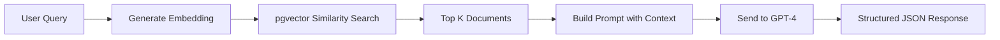
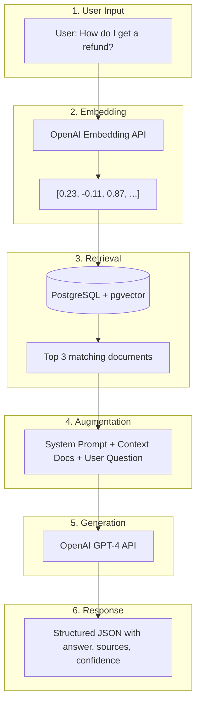
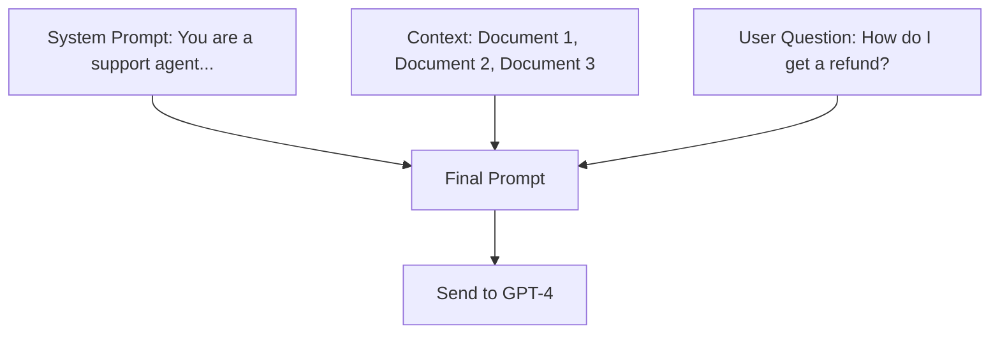
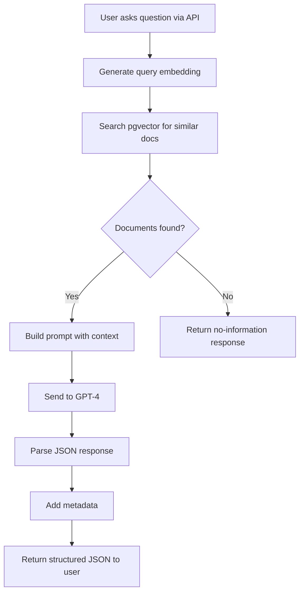

# 📅 Day 2: Full RAG Pipeline + AI Response Structuring

**Duration:** 1 to 1.5 hours  
**Prerequisites:** Day 1 completed (PostgreSQL + pgvector setup, documents seeded)  

---

## 1. Introduction

Hello students 👋

Welcome back to Day 2! Yesterday we learned the **foundation** — embeddings, vector storage, and similarity search.

Today we're going to **put it all together** and build a complete, working RAG pipeline. By the end of this session, you'll have a fully functional AI-powered FAQ bot that:

1. Takes a user question
2. Finds relevant documents from your database
3. Sends them as context to an LLM
4. Returns a beautifully structured JSON response

### What we will learn today:

- How to build a complete RAG pipeline end-to-end
- How to write effective prompts for RAG (prompt engineering basics)
- How to structure AI responses in JSON format
- How to handle edge cases (no results, low confidence, errors)
- How to build a clean, production-ready architecture

### Why does this matter?

Every AI product you use — from Notion AI to customer support chatbots — follows this exact pattern. After today, you'll know how to build any of them.

> 💡 Think about it: ChatGPT's "Browse with Bing" feature? That's RAG. Google's AI Overview? That's RAG. Copilot reading your codebase? That's RAG.

---

## 2. Concept Explanation

### The Full RAG Pipeline

Yesterday we did Steps 1-3. Today we complete the pipeline:

| Step | What Happens | We Built This |
|------|-------------|---------------|
| 1 | User asks a question | Today |
| 2 | Convert question to embedding | ✅ Day 1 |
| 3 | Find similar documents in pgvector | ✅ Day 1 |
| 4 | Build a prompt with context | Today |
| 5 | Send to LLM (GPT-4) | Today |
| 6 | Parse and return structured JSON | Today |

### Real-World Analogy: The Research Assistant 🧑‍💼

Imagine you hired a brilliant research assistant:

1. **You ask:** "What's our refund policy for digital products?"
2. **Assistant goes to the filing cabinet** (vector search) and pulls out the 3 most relevant documents
3. **Assistant reads them** and highlights the important parts (context building)
4. **Assistant writes you a clear answer** based on those documents (LLM generation)
5. **Assistant cites the sources** so you can verify (structured response)

That's exactly what our code will do!

### What is Prompt Engineering?

Prompt engineering is the art of **telling the AI exactly what you want** in a way it understands best.

**Bad prompt:** "Answer this question"  
**Good prompt:** "You are a helpful customer support agent. Using ONLY the provided context documents, answer the user's question. If the answer is not in the context, say 'I don't have information about that.'"

**Question for you:** Why do we say "using ONLY the provided context"? What happens if we don't? *(Answer: The AI might hallucinate — make up facts that sound correct but aren't!)*

---

## 3. Architecture Flow

### Complete RAG Pipeline



### Detailed Architecture



### How the Prompt is Built



---

## 4. Hands-on Code

### Project Structure (Final)

```
rag-pgvector-app/
├── .env                   # API keys and database URL
├── db.js                  # PostgreSQL connection (from Day 1)
├── embedding.js           # OpenAI embedding generation (from Day 1)
├── store.js               # Store documents (from Day 1)
├── seed.js                # Load sample data (from Day 1)
├── search.js              # Similarity search (from Day 1)
├── rag.js                 # 🆕 Complete RAG pipeline
├── prompt-builder.js      # 🆕 Prompt construction
├── response-formatter.js  # 🆕 JSON response formatting
└── server.js              # 🆕 Express API endpoint
```

### Step 1: Prompt Builder

Create `prompt-builder.js`:

```js id="promptBuilder"
// prompt-builder.js - Constructs the prompt sent to the LLM

/**
 * Build a system prompt that tells the AI how to behave
 */
function buildSystemPrompt() {
  return `You are a helpful and friendly customer support assistant.

RULES:
1. Answer the user's question using ONLY the information provided in the CONTEXT section below.
2. If the context does not contain enough information to answer, say "I don't have specific information about that in our documentation."
3. Be concise and direct. Keep answers under 3 sentences when possible.
4. Always mention which document(s) you used to form your answer.
5. If the user asks something completely unrelated to the context, politely redirect them.
6. NEVER make up information that is not in the context.

RESPONSE FORMAT:
You must respond in valid JSON format with this structure:
{
  "answer": "Your helpful answer here",
  "sources_used": ["title of source 1", "title of source 2"],
  "confidence": 0.0 to 1.0 (how confident you are based on context relevance),
  "follow_up_suggestion": "A helpful follow-up question the user might want to ask"
}`;
}

/**
 * Build the context section from retrieved documents
 * 
 * @param {Array} documents - Retrieved documents from pgvector
 * @returns {string} - Formatted context string
 */
function buildContext(documents) {
  if (documents.length === 0) {
    return "CONTEXT: No relevant documents found.";
  }

  let context = "CONTEXT:\n";
  context += "Use the following documents to answer the user's question:\n\n";

  documents.forEach((doc, index) => {
    context += `--- Document ${index + 1} ---\n`;
    context += `Title: ${doc.title}\n`;
    context += `Source: ${doc.source}\n`;
    context += `Content: ${doc.content}\n`;
    context += `Relevance Score: ${(doc.similarity * 100).toFixed(1)}%\n\n`;
  });

  return context;
}

/**
 * Build the complete prompt combining system, context, and user query
 */
function buildFullPrompt(userQuery, documents) {
  const systemPrompt = buildSystemPrompt();
  const context = buildContext(documents);

  return {
    systemPrompt,
    userMessage: `${context}\n\nUSER QUESTION: ${userQuery}`,
  };
}

module.exports = { buildSystemPrompt, buildContext, buildFullPrompt };
```

**Key lesson:** Notice how we separate the system prompt, context, and user query. This is a best practice in prompt engineering — each part has a clear role.

### Step 2: Response Formatter

Create `response-formatter.js`:

```js id="responseFormatter"
// response-formatter.js - Parse and structure the AI response

/**
 * Parse the LLM's JSON response and add metadata
 * 
 * @param {string} llmResponse - Raw response from the LLM
 * @param {object} metadata - Additional metadata to include
 * @returns {object} - Structured JSON response
 */
function formatResponse(llmResponse, metadata = {}) {
  let parsed;

  try {
    // Try to parse the LLM's response as JSON
    // Sometimes the LLM wraps JSON in markdown code blocks
    const cleanedResponse = llmResponse
      .replace(/```json\n?/g, "")
      .replace(/```\n?/g, "")
      .trim();

    parsed = JSON.parse(cleanedResponse);
  } catch {
    // If parsing fails, create a fallback response
    parsed = {
      answer: llmResponse,
      sources_used: [],
      confidence: 0.5,
      follow_up_suggestion: null,
    };
  }

  // Build the final structured response
  return {
    success: true,
    data: {
      answer: parsed.answer,
      sources: parsed.sources_used || [],
      confidence: parsed.confidence || 0,
      follow_up_suggestion: parsed.follow_up_suggestion || null,
    },
    metadata: {
      model: metadata.model || "gpt-4",
      tokens_used: metadata.tokens_used || null,
      documents_retrieved: metadata.documents_retrieved || 0,
      search_time_ms: metadata.search_time_ms || null,
      response_time_ms: metadata.response_time_ms || null,
      timestamp: new Date().toISOString(),
    },
  };
}

/**
 * Create an error response in the same JSON structure
 */
function formatErrorResponse(error, query) {
  return {
    success: false,
    data: {
      answer: "I'm sorry, I encountered an error processing your question. Please try again.",
      sources: [],
      confidence: 0,
      follow_up_suggestion: "Could you try rephrasing your question?",
    },
    error: {
      message: error.message,
      code: error.code || "UNKNOWN_ERROR",
    },
    metadata: {
      query,
      timestamp: new Date().toISOString(),
    },
  };
}

module.exports = { formatResponse, formatErrorResponse };
```

### Step 3: The RAG Pipeline (The Main Event!)

Create `rag.js`:

```js id="ragPipeline"
// rag.js - The complete RAG pipeline
const OpenAI = require("openai");
const pool = require("./db");
const { generateEmbedding } = require("./embedding");
const { buildFullPrompt } = require("./prompt-builder");
const { formatResponse, formatErrorResponse } = require("./response-formatter");
require("dotenv").config();

const openai = new OpenAI({
  apiKey: process.env.OPENAI_API_KEY,
});

/**
 * Step 1: Retrieve relevant documents from pgvector
 */
async function retrieveDocuments(query, topK = 3, similarityThreshold = 0.7) {
  const startTime = Date.now();

  // Generate embedding for the query
  const queryEmbedding = await generateEmbedding(query);
  const embeddingStr = `[${queryEmbedding.join(",")}]`;

  // Search for similar documents
  const result = await pool.query(
    `
    SELECT 
      id, title, content, source,
      1 - (embedding <=> $1::vector) AS similarity
    FROM documents
    WHERE 1 - (embedding <=> $1::vector) > $3
    ORDER BY embedding <=> $1::vector
    LIMIT $2
    `,
    [embeddingStr, topK, similarityThreshold]
  );

  const searchTimeMs = Date.now() - startTime;

  return {
    documents: result.rows,
    searchTimeMs,
  };
}

/**
 * Step 2: Generate AI response using retrieved context
 */
async function generateResponse(query, documents) {
  const { systemPrompt, userMessage } = buildFullPrompt(query, documents);

  const response = await openai.chat.completions.create({
    model: "gpt-4",
    messages: [
      { role: "system", content: systemPrompt },
      { role: "user", content: userMessage },
    ],
    temperature: 0.3,       // Low temperature = more factual, less creative
    max_tokens: 500,
    response_format: { type: "json_object" },  // Force JSON output
  });

  return {
    content: response.choices[0].message.content,
    tokensUsed:
      response.usage.prompt_tokens + response.usage.completion_tokens,
    model: response.model,
  };
}

/**
 * The main RAG function — ties everything together
 * 
 * This is the function you call from your API endpoint
 */
async function askQuestion(query) {
  const startTime = Date.now();

  try {
    console.log(`\n${"=".repeat(60)}`);
    console.log(`📝 Question: "${query}"`);
    console.log(`${"=".repeat(60)}\n`);

    // Step 1: Retrieve relevant documents
    console.log("🔍 Step 1: Retrieving relevant documents...");
    const { documents, searchTimeMs } = await retrieveDocuments(query);
    console.log(`   Found ${documents.length} relevant documents (${searchTimeMs}ms)`);

    documents.forEach((doc, i) => {
      console.log(`   ${i + 1}. ${doc.title} (${(doc.similarity * 100).toFixed(1)}%)`);
    });

    // Step 2: Generate AI response
    console.log("\n🤖 Step 2: Generating AI response...");
    const llmResult = await generateResponse(query, documents);
    console.log(`   Response generated (${llmResult.tokensUsed} tokens used)`);

    // Step 3: Format the response
    const totalTimeMs = Date.now() - startTime;
    const formattedResponse = formatResponse(llmResult.content, {
      model: llmResult.model,
      tokens_used: llmResult.tokensUsed,
      documents_retrieved: documents.length,
      search_time_ms: searchTimeMs,
      response_time_ms: totalTimeMs,
    });

    console.log("\n✅ Final Response:");
    console.log(JSON.stringify(formattedResponse, null, 2));

    return formattedResponse;
  } catch (error) {
    console.error("\n❌ RAG pipeline error:", error.message);
    return formatErrorResponse(error, query);
  }
}

module.exports = { askQuestion, retrieveDocuments, generateResponse };
```

### Step 4: Test the Pipeline

Create `test-rag.js`:

```js id="testRag"
// test-rag.js - Test the complete RAG pipeline
const { askQuestion } = require("./rag");
const pool = require("./db");

async function runTests() {
  console.log("🧪 Testing RAG Pipeline\n");

  // Test 1: Direct match question
  console.log("\n📋 Test 1: Password question");
  await askQuestion("How can I reset my password?");

  // Test 2: Indirect/semantic match
  console.log("\n📋 Test 2: Refund question (indirect phrasing)");
  await askQuestion("I want my money back for a digital purchase");

  // Test 3: Multi-topic question
  console.log("\n📋 Test 3: Security question");
  await askQuestion("How do I make my account more secure?");

  // Test 4: Question with no relevant context
  console.log("\n📋 Test 4: Unrelated question");
  await askQuestion("What is the meaning of life?");

  // Test 5: Specific detail question
  console.log("\n📋 Test 5: Specific detail");
  await askQuestion("How long does international shipping take?");

  await pool.end();
  console.log("\n\n🎉 All tests completed!");
}

runTests();
```

Run it:

```bash id="runtests"
node test-rag.js
```

### Step 5: Build an Express API

Create `server.js`:

```js id="expressServer"
// server.js - REST API for the RAG pipeline
const express = require("express");
const { askQuestion } = require("./rag");
const { storeDocument } = require("./store");
const pool = require("./db");
require("dotenv").config();

const app = express();
app.use(express.json());

/**
 * POST /api/ask
 * Ask a question and get a RAG-powered response
 * 
 * Body: { "question": "How do I reset my password?" }
 */
app.post("/api/ask", async (req, res) => {
  const { question } = req.body;

  if (!question || question.trim().length === 0) {
    return res.status(400).json({
      success: false,
      error: { message: "Question is required", code: "MISSING_QUESTION" },
    });
  }

  const response = await askQuestion(question);
  res.json(response);
});

/**
 * POST /api/documents
 * Add a new document to the knowledge base
 * 
 * Body: { "title": "...", "content": "...", "source": "..." }
 */
app.post("/api/documents", async (req, res) => {
  const { title, content, source } = req.body;

  if (!title || !content) {
    return res.status(400).json({
      success: false,
      error: { message: "Title and content are required", code: "MISSING_FIELDS" },
    });
  }

  try {
    const doc = await storeDocument(title, content, source || "manual-upload");
    res.status(201).json({
      success: true,
      data: doc,
      message: "Document stored with embedding successfully",
    });
  } catch (error) {
    res.status(500).json({
      success: false,
      error: { message: error.message, code: "STORE_ERROR" },
    });
  }
});

/**
 * GET /api/documents
 * List all documents in the knowledge base
 */
app.get("/api/documents", async (req, res) => {
  const result = await pool.query(
    "SELECT id, title, source, created_at FROM documents ORDER BY created_at DESC"
  );

  res.json({
    success: true,
    data: result.rows,
    total: result.rows.length,
  });
});

/**
 * GET /api/health
 * Health check endpoint
 */
app.get("/api/health", async (req, res) => {
  try {
    await pool.query("SELECT 1");
    res.json({ status: "healthy", database: "connected" });
  } catch {
    res.status(500).json({ status: "unhealthy", database: "disconnected" });
  }
});

const PORT = process.env.PORT || 3000;
app.listen(PORT, () => {
  console.log(`\n🚀 RAG API Server running on http://localhost:${PORT}`);
  console.log(`\n📖 Endpoints:`);
  console.log(`   POST /api/ask          - Ask a question`);
  console.log(`   POST /api/documents    - Add a document`);
  console.log(`   GET  /api/documents    - List all documents`);
  console.log(`   GET  /api/health       - Health check\n`);
});
```

Install Express and start the server:

```bash id="startserver"
npm install express

node server.js
```

### Step 6: Test with cURL

```bash id="curltest"
# Health check
curl http://localhost:3000/api/health

# Ask a question
curl -X POST http://localhost:3000/api/ask \
  -H "Content-Type: application/json" \
  -d '{"question": "How do I reset my password?"}'

# Add a new document
curl -X POST http://localhost:3000/api/documents \
  -H "Content-Type: application/json" \
  -d '{
    "title": "Business Hours",
    "content": "Our customer support is available Monday to Friday, 9 AM to 6 PM EST. Weekend support is available via email only with a 24-hour response time.",
    "source": "help-center/general"
  }'

# Ask about the new document
curl -X POST http://localhost:3000/api/ask \
  -H "Content-Type: application/json" \
  -d '{"question": "When can I reach customer support?"}'

# List all documents
curl http://localhost:3000/api/documents
```

---

## 5. JSON Response Design (Deep Dive)

### The Response Structure

Here is the complete JSON response our API returns:

```json id="fullresponse"
{
  "success": true,
  "data": {
    "answer": "To reset your password, go to the login page and click 'Forgot Password'. Enter your registered email address and you'll receive a reset link within 5 minutes. Your new password must be at least 8 characters with one uppercase letter and one number.",
    "sources": ["Password Reset"],
    "confidence": 0.95,
    "follow_up_suggestion": "Would you like to know how to enable two-factor authentication for extra security?"
  },
  "metadata": {
    "model": "gpt-4",
    "tokens_used": 245,
    "documents_retrieved": 3,
    "search_time_ms": 42,
    "response_time_ms": 1830,
    "timestamp": "2026-04-14T10:30:00.000Z"
  }
}
```

### Why Each Field Matters

| Field | Purpose | Real-World Use |
|-------|---------|----------------|
| `success` | Quick check if the request worked | Frontend error handling |
| `answer` | The actual AI response | Display to user |
| `sources` | Which documents were used | Trust & verification |
| `confidence` | How sure the AI is (0-1) | Show warning if low |
| `follow_up_suggestion` | Next logical question | Better UX, keep user engaged |
| `model` | Which AI model was used | Debugging & cost tracking |
| `tokens_used` | How many tokens consumed | Cost monitoring |
| `documents_retrieved` | How many docs were found | Retrieval quality monitoring |
| `search_time_ms` | Vector search duration | Performance monitoring |
| `response_time_ms` | Total request duration | SLA monitoring |

### Handling Low Confidence

```js id="lowConfidence"
// In your frontend or API middleware
function handleResponse(response) {
  if (!response.success) {
    return showError(response.error.message);
  }

  const { confidence, answer } = response.data;

  if (confidence >= 0.8) {
    // High confidence — show answer directly
    showAnswer(answer);
  } else if (confidence >= 0.5) {
    // Medium confidence — show with a disclaimer
    showAnswer(answer, {
      disclaimer: "This answer may not be fully accurate. Please verify with our support team."
    });
  } else {
    // Low confidence — suggest contacting support
    showFallback("I'm not confident enough to answer this. Let me connect you with a human agent.");
  }
}
```

### Error Response Format

```json id="errorresponse"
{
  "success": false,
  "data": {
    "answer": "I'm sorry, I encountered an error processing your question. Please try again.",
    "sources": [],
    "confidence": 0,
    "follow_up_suggestion": "Could you try rephrasing your question?"
  },
  "error": {
    "message": "OpenAI API rate limit exceeded",
    "code": "RATE_LIMIT_ERROR"
  },
  "metadata": {
    "query": "How do I reset my password?",
    "timestamp": "2026-04-14T10:30:00.000Z"
  }
}
```

---

## 6. Advanced: Improving Your RAG Pipeline

### Technique 1: Chunk Large Documents

Large documents should be split into smaller chunks for better retrieval:

```js id="chunking"
// chunk.js - Split large documents into smaller pieces

/**
 * Split text into chunks of roughly equal size
 * 
 * @param {string} text - The document text
 * @param {number} chunkSize - Max characters per chunk (default: 500)
 * @param {number} overlap - Character overlap between chunks (default: 50)
 * @returns {string[]} - Array of text chunks
 */
function chunkText(text, chunkSize = 500, overlap = 50) {
  const chunks = [];
  let start = 0;

  while (start < text.length) {
    let end = start + chunkSize;

    // Try to break at a sentence boundary
    if (end < text.length) {
      const lastPeriod = text.lastIndexOf(".", end);
      if (lastPeriod > start + chunkSize / 2) {
        end = lastPeriod + 1;
      }
    }

    chunks.push(text.substring(start, end).trim());
    start = end - overlap;
  }

  return chunks;
}

// Example usage
const longDocument = `
PostgreSQL is a powerful, open source object-relational database system. 
It has more than 35 years of active development. It has earned a strong 
reputation for reliability, feature robustness, and performance. 
PostgreSQL runs on all major operating systems. It is fully ACID compliant 
and has full support for foreign keys, joins, views, triggers, and stored 
procedures. PostgreSQL supports various data types including JSON, XML, 
and arrays. The pgvector extension adds support for vector operations, 
making it suitable for AI applications that require similarity search.
`;

const chunks = chunkText(longDocument, 200, 30);
chunks.forEach((chunk, i) => {
  console.log(`\nChunk ${i + 1} (${chunk.length} chars):`);
  console.log(chunk);
});
```

### Technique 2: Re-Ranking Results

Sometimes the top similarity result isn't the best answer. Re-ranking helps:

```js id="reranking"
// rerank.js - Re-rank retrieved documents for better relevance

/**
 * Re-rank documents using keyword matching as a secondary signal
 * Combines semantic similarity with keyword relevance
 */
function rerankDocuments(documents, query) {
  const queryWords = query.toLowerCase().split(/\s+/);

  return documents
    .map((doc) => {
      // Count how many query words appear in the document
      const contentLower = doc.content.toLowerCase();
      const keywordHits = queryWords.filter(
        (word) => word.length > 3 && contentLower.includes(word)
      ).length;

      // Combine semantic similarity (70%) with keyword matching (30%)
      const keywordScore = keywordHits / queryWords.length;
      const combinedScore = doc.similarity * 0.7 + keywordScore * 0.3;

      return { ...doc, combinedScore, keywordHits };
    })
    .sort((a, b) => b.combinedScore - a.combinedScore);
}
```

### Technique 3: Conversation Memory

Make your RAG chatbot remember previous questions in the same session:

```js id="conversationMemory"
// conversation.js - Multi-turn RAG with conversation memory

class RAGConversation {
  constructor() {
    this.history = [];
  }

  /**
   * Ask a question with conversation context
   */
  async ask(question) {
    // Add previous Q&A pairs to give the LLM context
    const messages = [
      { role: "system", content: buildSystemPrompt() },
    ];

    // Add conversation history (last 5 turns)
    const recentHistory = this.history.slice(-5);
    for (const turn of recentHistory) {
      messages.push({ role: "user", content: turn.question });
      messages.push({ role: "assistant", content: turn.answer });
    }

    // Retrieve documents for the current question
    const { documents } = await retrieveDocuments(question);
    const context = buildContext(documents);

    // Add the current question with context
    messages.push({
      role: "user",
      content: `${context}\n\nUSER QUESTION: ${question}`,
    });

    // Get the response
    const response = await openai.chat.completions.create({
      model: "gpt-4",
      messages,
      temperature: 0.3,
      response_format: { type: "json_object" },
    });

    const answer = response.choices[0].message.content;

    // Save to history
    this.history.push({ question, answer });

    return answer;
  }
}

// Usage:
// const chat = new RAGConversation();
// await chat.ask("What's your refund policy?");
// await chat.ask("Does that apply to digital products too?");  
// ^ The AI remembers the context from the first question!
```

---

## 7. 🧪 Practice Tasks

### Task 1: Build a Document Search API
Add a `GET /api/search?q=password&limit=5` endpoint that returns matching documents with their similarity scores (without calling the LLM). This is useful for showing "Related Articles" in a UI.

### Task 2: Add a Confidence Threshold
Modify the `/api/ask` endpoint to accept an optional `minConfidence` parameter. If the AI's confidence is below this threshold, return a different response suggesting the user contact human support.

### Task 3: Build a Document Upload Endpoint
Create a `POST /api/documents/bulk` endpoint that accepts an array of documents and stores them all with embeddings. Return a summary of how many succeeded and failed.

```json
// Request body:
{
  "documents": [
    { "title": "...", "content": "...", "source": "..." },
    { "title": "...", "content": "...", "source": "..." }
  ]
}
```

### Task 4: Add Response Caching
Implement a simple in-memory cache that stores question-answer pairs. If the same question (or a very similar one) is asked again within 5 minutes, return the cached response instead of calling the LLM.

```js id="task4cache"
// Hint: Simple cache structure
const cache = new Map();

function getCachedResponse(question) {
  const key = question.toLowerCase().trim();
  const cached = cache.get(key);

  if (cached && Date.now() - cached.timestamp < 5 * 60 * 1000) {
    return cached.response;
  }

  return null;
}
```

### Task 5: Build a Simple Chat UI
Create a basic HTML page with a text input and a submit button. When the user types a question and clicks submit, call your `/api/ask` endpoint and display the response beautifully. Show the answer, sources, and confidence score.

---

## 8. ⚠️ Common Mistakes

### Mistake 1: Not Using `response_format: { type: "json_object" }`

```js
// ❌ Bad - LLM might return plain text or markdown
const response = await openai.chat.completions.create({
  model: "gpt-4",
  messages: [...],
});

// ✅ Good - Forces JSON output
const response = await openai.chat.completions.create({
  model: "gpt-4",
  messages: [...],
  response_format: { type: "json_object" },
});
```

Without this flag, the LLM might return: `"Here is your answer: ..."` instead of valid JSON.

### Mistake 2: Sending Too Many Documents as Context

```js
// ❌ Bad - 20 documents = too much context, expensive, confusing for LLM
const { documents } = await retrieveDocuments(query, 20);

// ✅ Good - 3-5 documents is the sweet spot
const { documents } = await retrieveDocuments(query, 3);
```

**Why?** More documents means more tokens (higher cost) and the AI might get confused by contradicting information. Quality over quantity.

### Mistake 3: High Temperature for Factual RAG

```js
// ❌ Bad - High temperature = creative/random responses
temperature: 0.9

// ✅ Good - Low temperature = factual, consistent responses
temperature: 0.2  // or 0.3
```

**Rule:** For RAG (factual answers), use temperature 0.1-0.3. For creative tasks (writing stories), use 0.7-0.9.

### Mistake 4: Not Handling the "No Documents Found" Case

```js
// ❌ Bad - Sends empty context to LLM (will hallucinate)
const { documents } = await retrieveDocuments(query);
const response = await generateResponse(query, documents);

// ✅ Good - Check if documents were found
const { documents } = await retrieveDocuments(query);
if (documents.length === 0) {
  return formatResponse({
    answer: "I don't have information about that topic in my knowledge base.",
    sources_used: [],
    confidence: 0,
    follow_up_suggestion: "Try asking about our products, refunds, or account settings."
  }, {});
}
```

### Mistake 5: Ignoring the Similarity Threshold

```js
// ❌ Bad - Returns documents even if they're barely relevant (30% similarity)
const result = await pool.query(`
  SELECT * FROM documents
  ORDER BY embedding <=> $1::vector
  LIMIT 3
`);

// ✅ Good - Only return documents above a minimum relevance
const result = await pool.query(`
  SELECT *, 1 - (embedding <=> $1::vector) AS similarity
  FROM documents
  WHERE 1 - (embedding <=> $1::vector) > 0.7
  ORDER BY embedding <=> $1::vector
  LIMIT 3
`);
```

### Mistake 6: Not Validating the LLM's JSON Response

```js
// ❌ Bad - Assumes LLM always returns valid JSON
const data = JSON.parse(llmResponse);

// ✅ Good - Handle parsing errors gracefully
try {
  const cleaned = llmResponse.replace(/```json\n?/g, "").replace(/```\n?/g, "").trim();
  const data = JSON.parse(cleaned);
} catch {
  // Fallback: return the raw response as the answer
}
```

---

## 9. 🔁 Recap

### What We Built Today



### Complete 2-Day Summary

| Day | What We Learned | What We Built |
|-----|----------------|---------------|
| **Day 1** | RAG concepts, embeddings, pgvector setup, similarity search | Database schema, embedding generation, document storage, search function |
| **Day 2** | Full RAG pipeline, prompt engineering, JSON response design | Prompt builder, response formatter, RAG pipeline, REST API |

### Key Concepts Mastered

| Concept | One-Line Summary |
|---------|-----------------|
| **RAG** | Find relevant docs first, then ask AI — like an open-book exam |
| **Embeddings** | Text → numbers that capture meaning (like GPS for words) |
| **pgvector** | PostgreSQL extension for storing/searching vectors |
| **Cosine Distance** | Measures how similar two pieces of text are |
| **Prompt Engineering** | Structuring instructions for the AI to get better answers |
| **JSON Response** | Standardized output format with answer, sources, confidence |
| **Chunking** | Splitting large documents for better retrieval |
| **Temperature** | Controls AI creativity — low for facts, high for creativity |

### Your Final Project Structure

```
rag-pgvector-app/
├── .env                     # Secrets (API key, DB URL)
├── package.json             # Dependencies
├── db.js                    # PostgreSQL connection
├── embedding.js             # OpenAI embedding generation
├── store.js                 # Document storage
├── seed.js                  # Sample data loader
├── search.js                # Vector similarity search
├── prompt-builder.js        # Prompt construction
├── response-formatter.js    # JSON response formatting
├── rag.js                   # Complete RAG pipeline
├── test-rag.js              # Pipeline tests
├── chunk.js                 # Document chunking (advanced)
└── server.js                # Express REST API
```

### What You Can Build Now

With what you've learned in these 2 days, you can build:

- **Customer Support Bot** — Answer questions from your FAQ/docs
- **Internal Knowledge Base** — Search company documents with AI
- **Legal Document Assistant** — Find relevant clauses and explain them
- **Medical FAQ System** — Answer health questions from verified sources
- **E-commerce Product Finder** — "Find me a laptop under $1000 for gaming"
- **Code Documentation Search** — Ask questions about your codebase

---

### 🚀 Next Steps

1. **Add authentication** to your API (JWT or API keys)
2. **Deploy** to a cloud provider (Railway, Render, or AWS)
3. **Use a managed vector database** for scale (Pinecone, Weaviate, or Supabase with pgvector)
4. **Add file upload** — parse PDFs and store them as chunks
5. **Build a frontend** — React or Next.js chat interface
6. **Add streaming** — Stream the LLM response token by token for better UX

---

*Congratulations on completing the RAG module! You now have the skills to build production-grade AI-powered backend systems. Go build something amazing! 🎉*
