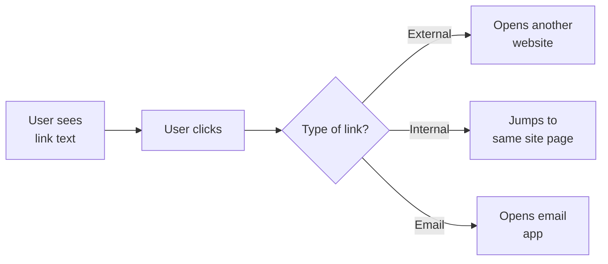
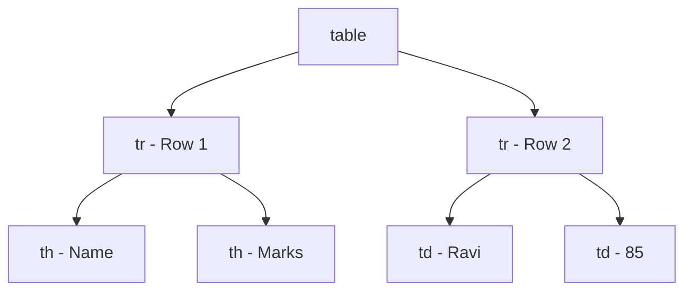
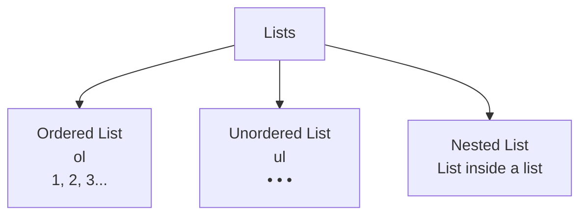

# 📘 Day 2: Links, Images, Lists & Tables

> **Duration:** 1 to 1.5 hours
> **Level:** Beginner (after Day 1)
> **Goal:** Make your webpages interactive, rich with images, and organized with tables! 🎨

---

## 👋 Hello students!

Hello students 👋
Welcome back to **Day 2** of our HTML journey! Yesterday, you built your **very first webpage** with headings, paragraphs, and line breaks. 🎉 Give yourself a big round of applause!

Today we will take a huge step forward. By the end of this class, your webpage will have:

- **Clickable links** (like on every real website)
- **Beautiful images**
- **Organized lists** (bullets and numbers)
- **Professional tables** (just like a school mark sheet)

This is the day your webpages start **looking like real websites**. Excited? Let's go! 🚀

---

## 1. 🎯 Introduction — What Will We Learn Today?

Today we will cover:

- **Anchor tag** (`<a>`) — making clickable links
- **Internal links** (within the same site) and **external links** (to other websites)
- **Image tag** (``) — adding pictures
- **Ordered lists** (`<ol>`) — numbered lists
- **Unordered lists** (`<ul>`) — bullet lists
- **Nested lists** — list inside a list
- **Tables** (`<table>`, `<tr>`, `<td>`, `<th>`)
- **`colspan`** and **`rowspan`** — merging cells
- A real-world **Student Marks Table**

### ❓ Why is today important?

Because **90% of what you see on any real website** — YouTube, Amazon, Wikipedia — is built with these exact tags: links, images, lists, and tables. Master these four and you can build almost any basic layout. 💪

---

## 2. 🧩 Concept Explanation

### 🔗 What is a Link?

A **link** (also called a **hyperlink**) is text or an image that the user can **click** to go to another page — another website, another part of the same page, or even an email app.

> 🌐 **Analogy:** A link is like a **door**. You click it, and it takes you to another room (another page).

### 🖼️ What is an Image Tag?

The `` tag lets us embed a **picture** — a logo, a photo, a banner — into our webpage. Images make pages alive. Imagine Instagram without images. Unthinkable. 😅

### 📋 What is a List?

A **list** is a series of items. HTML gives us two main types:

- **Ordered list** — numbered (1, 2, 3…) — use when **sequence matters** (recipes, steps).
- **Unordered list** — bulleted (•) — use when **order doesn't matter** (favorite movies, grocery list).

> 🛒 **Analogy:** Your **shopping list** = unordered. A **recipe's steps** = ordered.

### 📊 What is a Table?

A **table** organizes data into **rows** and **columns** — exactly like an Excel sheet or a newspaper's cricket scoreboard.

> 📰 **Analogy:** Open any newspaper → stock market page → that's a table in HTML too!

---

## 3. 💡 Visual Learning — How Links and Tables Work

### 🔗 How a Link Works



### 📊 How a Table is Built



### 📋 List Types at a Glance



---

## 4. 📝 Syntax + Code Examples

### 🔗 4.1 Anchor Tag — `<a>`

The anchor tag creates a **clickable link**. The `href` attribute tells the browser **where to go**.

```html
<a href="https://www.google.com">Go to Google</a>
```

Breakdown:

- `<a>` = the tag
- `href="..."` = **H**ypertext **Ref**erence — the destination URL
- Text between `<a>` and `</a>` = what the user sees and clicks

### 🌍 External Link (to another website)

```html
<a href="https://www.youtube.com">Visit YouTube</a>
```

### 🏠 Internal Link (to another page in YOUR site)

```html
<a href="about.html">About Me</a>
<a href="contact.html">Contact</a>
```

> 💡 Both files must be in the **same folder** for this to work.

### 📧 Email Link

```html
<a href="mailto:teacher@example.com">Email the teacher</a>
```

Clicking this opens the user's **email app** automatically.

### 🎯 Open Link in a New Tab

Add `target="_blank"`:

```html
<a href="https://www.google.com" target="_blank">Open Google in new tab</a>
```

> ⚠️ Useful for external sites so users don't leave your page.

### 🔖 Jump to a Section on the Same Page

```html
<a href="#about">Go to About section</a>

<!-- Somewhere else on the same page: -->
<h2 id="about">About Me</h2>
```

The `#about` matches the `id="about"`.

---

### 🖼️ 4.2 Image Tag — ``

The `` tag is **self-closing** (no closing tag). It has 2 important attributes:

```html

```

- `src` = **source** — path to the image file
- `alt` = **alternative text** — description shown if the image fails to load (also read by screen readers for blind users — very important for accessibility!)

### 🖼️ Image from Your Own Folder

```html

```

### 🌐 Image from the Internet

```html

```

### 📏 Controlling Size

```html

```

> 💡 **Tip:** Prefer setting only `width` — the height adjusts automatically to keep proportions.

### ❌ Wrong vs ✅ Correct

```html
<!-- ❌ Wrong: missing alt -->


<!-- ❌ Wrong: invalid closing tag -->
</img>

<!-- ✅ Correct -->

```

---

### 📋 4.3 Lists

### Unordered List — `<ul>`

```html
<h3>My Favorite Fruits</h3>
<ul>
  <li>Apple</li>
  <li>Banana</li>
  <li>Mango</li>
</ul>
```

**Output (browser):**

- Apple
- Banana
- Mango

Each item is wrapped in `<li>` (**l**ist **i**tem).

### Ordered List — `<ol>`

```html
<h3>How to Make Tea ☕</h3>
<ol>
  <li>Boil water</li>
  <li>Add tea leaves</li>
  <li>Add milk and sugar</li>
  <li>Pour into a cup</li>
</ol>
```

**Output (browser):**

1. Boil water
2. Add tea leaves
3. Add milk and sugar
4. Pour into a cup

### Nested List (list inside a list)

```html
<h3>My Courses</h3>
<ul>
  <li>Frontend
    <ul>
      <li>HTML</li>
      <li>CSS</li>
      <li>JavaScript</li>
    </ul>
  </li>
  <li>Backend
    <ul>
      <li>Node.js</li>
      <li>Express</li>
    </ul>
  </li>
  <li>Database
    <ol>
      <li>MongoDB</li>
      <li>MySQL</li>
    </ol>
  </li>
</ul>
```

> ✅ **Indent** nested lists so your code is easy to read.

---

### 📊 4.4 Tables — The Star of Today

Table anatomy:

| Tag | Meaning |
|-----|---------|
| `<table>` | The whole table container |
| `<tr>` | **T**able **R**ow — one horizontal row |
| `<th>` | **T**able **H**eader — bold heading cell |
| `<td>` | **T**able **D**ata — normal cell |
| `<caption>` | Title above the table |

### 🟢 A Simple Table

```html
<table border="1">
  <caption>My Weekly Schedule</caption>
  <tr>
    <th>Day</th>
    <th>Subject</th>
  </tr>
  <tr>
    <td>Monday</td>
    <td>HTML</td>
  </tr>
  <tr>
    <td>Tuesday</td>
    <td>CSS</td>
  </tr>
  <tr>
    <td>Wednesday</td>
    <td>JavaScript</td>
  </tr>
</table>
```

> 💡 `border="1"` is a quick way to draw lines. For real projects we use CSS — but today this is perfect.

### 🟠 `colspan` — Merge Cells Horizontally

```html
<table border="1">
  <tr>
    <th colspan="2">Name</th>
    <th>Marks</th>
  </tr>
  <tr>
    <td>Ravi</td>
    <td>Kumar</td>
    <td>85</td>
  </tr>
</table>
```

Here, the **Name** header spans across 2 columns (First + Last name).

### 🟣 `rowspan` — Merge Cells Vertically

```html
<table border="1">
  <tr>
    <th>Class</th>
    <th>Subject</th>
  </tr>
  <tr>
    <td rowspan="2">Grade 10</td>
    <td>Math</td>
  </tr>
  <tr>
    <td>Science</td>
  </tr>
</table>
```

"Grade 10" is written **once** but spans **2 rows**.

---

### 🏫 4.5 Real-World Example: Student Marks Table

Here is a complete, working example you can copy:

```html
<!DOCTYPE html>
<html>
  <head>
    <title>Class Marks Sheet</title>
  </head>
  <body>
    <h1>Grade 10 - Mid-Term Marks Sheet 📊</h1>

    <table border="1" cellpadding="8">
      <caption><b>Academic Year 2025-26</b></caption>

      <tr>
        <th rowspan="2">Roll No</th>
        <th rowspan="2">Name</th>
        <th colspan="3">Subjects</th>
        <th rowspan="2">Total</th>
      </tr>
      <tr>
        <th>Math</th>
        <th>Science</th>
        <th>English</th>
      </tr>

      <tr>
        <td>1</td>
        <td>Ravi Kumar</td>
        <td>85</td>
        <td>90</td>
        <td>78</td>
        <td>253</td>
      </tr>
      <tr>
        <td>2</td>
        <td>Anita Sharma</td>
        <td>92</td>
        <td>88</td>
        <td>95</td>
        <td>275</td>
      </tr>
      <tr>
        <td>3</td>
        <td>Suresh Patel</td>
        <td>70</td>
        <td>75</td>
        <td>80</td>
        <td>225</td>
      </tr>
    </table>
  </body>
</html>
```

### 👀 What Will This Look Like?

A clean marks sheet with:

- A caption **"Academic Year 2025-26"** on top
- Two header rows (first row uses `rowspan` + `colspan` neatly)
- Three student rows with their marks and total

---

## 5. 🌐 Live Output Explanation — Full Webpage

Combine everything into one real page:

```html
<!DOCTYPE html>
<html>
  <head>
    <title>My Profile</title>
  </head>
  <body>
    <h1>Hi, I'm Ravi 👋</h1>

    

    <h2>About Me</h2>
    <p>I am a student learning web development.</p>

    <h2>My Favorite Websites</h2>
    <ul>
      <li><a href="https://www.google.com" target="_blank">Google</a></li>
      <li><a href="https://www.youtube.com" target="_blank">YouTube</a></li>
      <li><a href="https://www.wikipedia.org" target="_blank">Wikipedia</a></li>
    </ul>

    <h2>Contact</h2>
    <p><a href="mailto:ravi@example.com">Email me</a></p>

    <h2>My Weekly Study Plan</h2>
    <table border="1" cellpadding="6">
      <tr>
        <th>Day</th>
        <th>Topic</th>
      </tr>
      <tr>
        <td>Mon</td>
        <td>HTML</td>
      </tr>
      <tr>
        <td>Tue</td>
        <td>CSS</td>
      </tr>
      <tr>
        <td>Wed</td>
        <td>JavaScript</td>
      </tr>
    </table>
  </body>
</html>
```

### 👀 What You See in the Browser

- Your name as a big heading
- A circular placeholder image
- A clickable list of favorite websites (opens in new tab!)
- An **Email me** link that opens the mail app
- A mini weekly study table with borders

This is already starting to look like a **real website!** 🎉

---

## 6. 🧪 Hands-on Practice — 5 Tasks

### ✏️ Task 1 — My Favorite Websites

Create `links.html` with a `<ul>` of **5 favorite websites**, each as a clickable link that opens in a **new tab**.

### ✏️ Task 2 — Photo Gallery

Create `gallery.html` with:

- A `<h1>` "My Photo Gallery"
- **4 images** (use placeholder URLs if you don't have photos) with proper `alt` text
- Each image with `width="200"`

### ✏️ Task 3 — Recipe Page

Create `recipe.html` describing how to make **Maggi noodles** 🍜:

- `<h1>` title
- **Unordered list** of ingredients
- **Ordered list** of cooking steps
- An image at the top

### ✏️ Task 4 — Multi-Page Website

Create **3 files** in the same folder:

- `home.html`
- `about.html`
- `contact.html`

At the top of each page, create a menu with **3 internal links** to navigate between them. Congratulations — you've built a multi-page site! 🎉

### ✏️ Task 5 — Class Timetable Table

Create `timetable.html` with a 6-period-per-day timetable for Monday to Friday. Use `<th>` for headers. Bonus: use `colspan` to merge the **Lunch** cell across multiple columns.

---

## 7. ⚠️ Common Mistakes

### Mistake 1 — Forgetting `alt` in images

```html
<!-- ❌ Wrong -->


<!-- ✅ Correct -->

```

`alt` matters for **accessibility** and **SEO**.

### Mistake 2 — Broken image paths

```html
<!-- ❌ Wrong: file is in 'images/' folder but we wrote only filename -->


<!-- ✅ Correct -->

```

If the image doesn't load, the path is probably wrong.

### Mistake 3 — Forgetting `href` in links

```html
<!-- ❌ Wrong -->
<a>Click me</a>

<!-- ✅ Correct -->
<a href="https://google.com">Click me</a>
```

Without `href`, it's just plain text — not a link.

### Mistake 4 — Wrong list structure

```html
<!-- ❌ Wrong -->
<ul>
  <p>Item 1</p>
  <p>Item 2</p>
</ul>

<!-- ✅ Correct -->
<ul>
  <li>Item 1</li>
  <li>Item 2</li>
</ul>
```

Inside `<ul>` / `<ol>`, **only `<li>` is allowed** as a direct child.

### Mistake 5 — Mismatched rows/columns

If a table header row has **4 columns** but a data row has **3**, the table will look broken. Always check that each `<tr>` has the correct number of cells (considering `colspan` / `rowspan`).

### Mistake 6 — Typing `URL` in wrong case

Some servers are **case-sensitive**: `image.JPG` and `image.jpg` are different files. Always match the exact case in your filenames.

---

## 8. 📝 Mini Assignment — "My Online Resume" Page

Create a file **`resume.html`** that includes:

- Proper HTML5 skeleton
- Browser tab title: **"[Your Name] — Resume"**
- `<h1>` with your name
- A profile **image** (any placeholder)
- An **About Me** paragraph
- **Skills** as an unordered list (at least 5 skills)
- **Education** as a table (School/College, Year, Grade) — at least 2 rows
- **Experience/Projects** as an ordered list (at least 3 items)
- A **Contact** section with:
  - An email link (`mailto:`)
  - A clickable link to your GitHub/LinkedIn (opens in new tab)
- Use at least **3 comments** in the code

### 🌟 Bonus

Use `colspan` or `rowspan` somewhere meaningfully in the Education table.

---

## 9. 🔁 Recap — What Did We Learn Today?

- ✅ **Links** are made with `<a href="...">text</a>`.
- ✅ Links can be **external**, **internal**, **email** (`mailto:`), or **anchor links** (`#id`).
- ✅ `target="_blank"` opens the link in a new tab.
- ✅ **Images** use `` — always provide `alt`.
- ✅ **Unordered lists** (`<ul>`) = bullets. **Ordered lists** (`<ol>`) = numbers. Both use `<li>` for items.
- ✅ Lists can be **nested** (list inside a list).
- ✅ **Tables** are built with `<table>`, `<tr>` (row), `<th>` (header), `<td>` (data).
- ✅ Use `colspan` to merge cells **horizontally**, `rowspan` to merge **vertically**.
- ✅ `<caption>` adds a title to a table.
- ✅ Use `border="1"` for a quick visible grid (we'll use CSS later for beautiful styling).

### 🎯 Your Mission Before Day 3

1. Finish **all 5 hands-on tasks**.
2. Complete the **Online Resume** assignment.
3. Explore real websites and **observe how they use lists and tables**.
4. Come ready for Day 3: **Forms, Semantic HTML, and a Mini Project!** 🚀

> 💬 **Great job today!** You are no longer just writing HTML — you are **building websites**. Tomorrow, we make them **interactive** with forms. See you on **Day 3**! 👋
