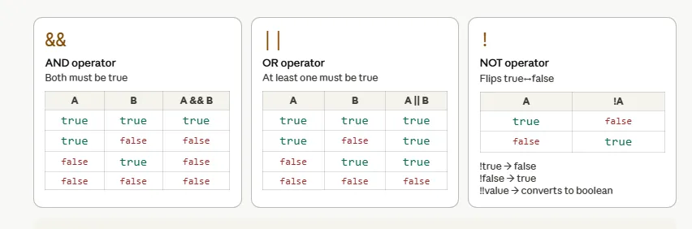
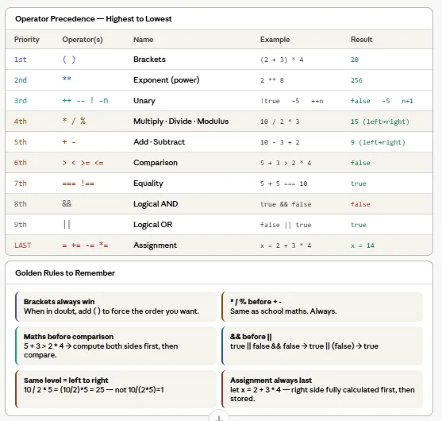

# Day 2 — Operators & Operator Precedence in JavaScript

---

## What are Operators?

An **operator** is a special symbol (or keyword) that tells JavaScript to perform a specific action on one or more values. Think of operators as **verbs** — they *do* something. The values they act on are called **operands**.

```js
// Example:
5 + 3
// ↑   ↑   ← these are operands (the values)
//   ↑     ← this is the operator (the action — addition)
```

JavaScript has **six categories** of operators. Here is the complete map:


---

## Category 1 — Arithmetic Operators

### Definition

Arithmetic operators perform **mathematical calculations** on numbers — addition, subtraction, multiplication, division, and more. These are the same operations you learned in school, plus two extras: **modulus** (`%`) and **exponentiation** (`**`).

| Operator | Name           | Example    | Result |
|----------|----------------|------------|--------|
| `+`      | Addition       | `10 + 3`   | `13`   |
| `-`      | Subtraction    | `10 - 3`   | `7`    |
| `*`      | Multiplication | `10 * 3`   | `30`   |
| `/`      | Division       | `10 / 3`   | `3.33` |
| `%`      | Modulus         | `10 % 3`   | `1`    |
| `**`     | Exponentiation | `2 ** 8`   | `256`  |
| `++`     | Increment      | `n++`      | `n + 1`|
| `--`     | Decrement      | `n--`      | `n - 1`|

> **Modulus (`%`)** gives the *remainder* after division. For example, `10 % 3` means "divide 10 by 3, keep only the remainder" — which is `1`.
>
> **Exponentiation (`**`)** raises a number to a power. `2 ** 10` means "2 multiplied by itself 10 times" — which is `1024`.

### Interactive Simulation

[Click here to open the Arithmetic Operators Simulation](https://ak9347128658.github.io/MERN_Batch_April_2026/day2/arithmetic_operators_interactive.html)

Click every operator card — especially `%` (modulus) and `**` (exponent) which are new. Change the numbers and press `=` to see live results. Try `**` with `2` and `10` — you get 1024!

### Practice Questions — Arithmetic Operators

Try solving these in your head first, then verify in the console (`F12`).

**Q1.** What is the output?
```js
let a = 25;
let b = 7;
console.log(a + b);
console.log(a - b);
console.log(a * b);
console.log(a / b);
console.log(a % b);
```

<details>
<summary>Click to see solution</summary>

```js
console.log(a + b);   // 32
console.log(a - b);   // 18
console.log(a * b);   // 175
console.log(a / b);   // 3.5714285714285716
console.log(a % b);   // 4  (25 ÷ 7 = 3 remainder 4)
```
</details>

---

**Q2.** Use modulus to check if a number is even or odd.
```js
let num = 15;
// Write an expression that gives 0 if even, 1 if odd
console.log(/* your code here */);
```

<details>
<summary>Click to see solution</summary>

```js
let num = 15;
console.log(num % 2);  // 1 → odd
// If num were 20 → 20 % 2 = 0 → even
```
**Explanation:** Any number `% 2` gives `0` for even and `1` for odd. This is one of the most common uses of modulus in real programming.
</details>

---

**Q3.** What is the output of each line?
```js
console.log(2 ** 5);
console.log(10 ** 0);
console.log(9 ** 0.5);
```

<details>
<summary>Click to see solution</summary>

```js
console.log(2 ** 5);    // 32  (2×2×2×2×2)
console.log(10 ** 0);   // 1   (any number to the power 0 is 1)
console.log(9 ** 0.5);  // 3   (0.5 power = square root, √9 = 3)
```
</details>

---

**Q4.** What is the value of `x` after each line?
```js
let x = 10;
x++;
x++;
x--;
console.log(x);
```

<details>
<summary>Click to see solution</summary>

```js
let x = 10;
x++;        // x = 11
x++;        // x = 12
x--;        // x = 11
console.log(x);  // 11
```
</details>

---

**Q5.** Calculate the area and perimeter of a rectangle with `length = 12` and `width = 5`.
```js
let length = 12;
let width = 5;
// Calculate area (length × width)
// Calculate perimeter (2 × (length + width))
```

<details>
<summary>Click to see solution</summary>

```js
let length = 12;
let width = 5;
let area = length * width;
let perimeter = 2 * (length + width);
console.log("Area:", area);           // Area: 60
console.log("Perimeter:", perimeter); // Perimeter: 34
```
</details>

---

## Category 2 — Assignment Operators

### Definition

Assignment operators **store (assign) a value into a variable**. The basic one is `=`, but JavaScript provides **shorthand versions** that combine an arithmetic operation with assignment in a single step.

| Operator | Name                  | Longhand      | Shorthand   | If x = 10 |
|----------|-----------------------|---------------|-------------|-----------|
| `=`      | Assign                | `x = 10`      | `x = 10`    | `10`      |
| `+=`     | Add and assign        | `x = x + 5`  | `x += 5`    | `15`      |
| `-=`     | Subtract and assign   | `x = x - 3`  | `x -= 3`    | `7`       |
| `*=`     | Multiply and assign   | `x = x * 2`  | `x *= 2`    | `20`      |
| `/=`     | Divide and assign     | `x = x / 4`  | `x /= 4`    | `2.5`     |
| `%=`     | Modulus and assign    | `x = x % 4`  | `x %= 4`    | `2`       |

> These shortcuts exist because updating a variable based on its current value is extremely common in programming. Writing `score += 10` is cleaner and less error-prone than `score = score + 10`.

### Interactive Simulation

[Click here to open the Assignment Operators Simulation](https://ak9347128658.github.io/MERN_Batch_April_2026/day2/assignment_operators_demo.html)

Click each operator, change the operand, and press **Apply** — watch x update each time. Try doing `+=` five times with 10 — x grows from 10 → 20 → 30 → 40 → 50!

### Practice Questions — Assignment Operators

**Q1.** What is the final value of `x`?
```js
let x = 50;
x += 20;
x -= 10;
x *= 2;
console.log(x);
```

<details>
<summary>Click to see solution</summary>

```js
let x = 50;
x += 20;   // x = 50 + 20 = 70
x -= 10;   // x = 70 - 10 = 60
x *= 2;    // x = 60 * 2  = 120
console.log(x);  // 120
```
</details>

---

**Q2.** What is the final value of `price`?
```js
let price = 200;
price /= 4;
price += 15;
price %= 7;
console.log(price);
```

<details>
<summary>Click to see solution</summary>

```js
let price = 200;
price /= 4;    // price = 200 / 4 = 50
price += 15;   // price = 50 + 15  = 65
price %= 7;    // price = 65 % 7   = 2  (65 ÷ 7 = 9 remainder 2)
console.log(price);  // 2
```
</details>

---

**Q3.** Rewrite each line using assignment shorthand operators.
```js
let a = 10;
a = a + 5;
a = a * 3;
a = a - 10;
a = a / 5;
a = a % 3;
```

<details>
<summary>Click to see solution</summary>

```js
let a = 10;
a += 5;    // a = 15
a *= 3;    // a = 45
a -= 10;   // a = 35
a /= 5;    // a = 7
a %= 3;    // a = 1
console.log(a);  // 1
```
</details>

---

**Q4.** A player starts with 100 health points. They take 30 damage, then heal 15, then take 25 damage. What is their final health?
```js
let health = 100;
// Use -= and += to update health
```

<details>
<summary>Click to see solution</summary>

```js
let health = 100;
health -= 30;   // took damage → 70
health += 15;   // healed     → 85
health -= 25;   // took damage → 60
console.log(health);  // 60
```
</details>

---

## Category 3 — Comparison Operators

### Definition

Comparison operators **compare two values** and always return a **boolean** — either `true` or `false`. These are the foundation of every `if` statement and conditional logic in JavaScript.

| Operator | Name                     | Example       | Result  |
|----------|--------------------------|---------------|---------|
| `===`    | Strict equal (value + type) | `5 === 5`   | `true`  |
| `===`    | Strict equal (type mismatch)| `5 === "5"` | `false` |
| `!==`    | Strict not equal         | `5 !== 10`    | `true`  |
| `>`      | Greater than             | `10 > 5`      | `true`  |
| `<`      | Less than                | `10 < 5`      | `false` |
| `>=`     | Greater than or equal    | `10 >= 10`    | `true`  |
| `<=`     | Less than or equal       | `5 <= 10`     | `true`  |

> **Why `===` instead of `==`?**
> - `===` (strict equality) checks **both value AND type**. `5 === "5"` is `false` because one is a number and the other is a string.
> - `==` (loose equality) only checks value and performs type coercion. `5 == "5"` is `true` — which often leads to bugs.
> - **Always use `===` and `!==`** in your code. This is a best practice followed by professional developers.

### Interactive Simulation

[Click here to open the Comparison Operators Simulation](https://ak9347128658.github.io/MERN_Batch_April_2026/day2/comparison_operators_interactive.html)

Click the tricky tests at the bottom — especially `5 === "5"` and `0 === false`. These are where beginners make mistakes every day!

### Practice Questions — Comparison Operators

**Q1.** Predict `true` or `false` for each line.
```js
console.log(10 === 10);
console.log(10 === "10");
console.log(10 !== "10");
console.log(5 > 5);
console.log(5 >= 5);
console.log(3 < 8);
```

<details>
<summary>Click to see solution</summary>

```js
console.log(10 === 10);    // true  — same value, same type (number)
console.log(10 === "10");  // false — same value, different type (number vs string)
console.log(10 !== "10");  // true  — they ARE different (type mismatch)
console.log(5 > 5);        // false — 5 is NOT greater than 5
console.log(5 >= 5);       // true  — 5 IS greater than or equal to 5
console.log(3 < 8);        // true  — 3 IS less than 8
```
</details>

---

**Q2.** A student scored 72 marks. Write comparison expressions to check:
```js
let marks = 72;
// a) Did they score above 50?
// b) Did they score exactly 100?
// c) Did they score 72 or below?
// d) Did they fail (below 35)?
```

<details>
<summary>Click to see solution</summary>

```js
let marks = 72;
console.log(marks > 50);    // true  — scored above 50
console.log(marks === 100); // false — did not score exactly 100
console.log(marks <= 72);   // true  — scored 72 or below
console.log(marks < 35);    // false — did not fail
```
</details>

---

**Q3.** What is the difference between `==` and `===`? Predict the output.
```js
console.log(0 == false);
console.log(0 === false);
console.log("" == false);
console.log("" === false);
console.log(null == undefined);
console.log(null === undefined);
```

<details>
<summary>Click to see solution</summary>

```js
console.log(0 == false);          // true  — == converts false to 0, then 0 == 0
console.log(0 === false);         // false — number vs boolean, different types
console.log("" == false);         // true  — == converts both to 0
console.log("" === false);        // false — string vs boolean, different types
console.log(null == undefined);   // true  — special rule: null and undefined are == to each other
console.log(null === undefined);  // false — null is type "object", undefined is type "undefined"
```
**Takeaway:** `==` does sneaky type conversions that cause bugs. Always use `===`.
</details>

---

**Q4.** Write an expression to check if a person's age is between 18 and 65 (inclusive).
```js
let age = 30;
// How would you check: 18 <= age <= 65 ?
// Hint: you can't write it like maths — you need a logical operator (next topic!)
```

<details>
<summary>Click to see solution</summary>

```js
let age = 30;
console.log(age >= 18 && age <= 65);  // true
// You need && (AND) to combine two comparisons
// age >= 18 → true  AND  age <= 65 → true  → true
```
</details>

---

## Category 4 — Logical Operators

### Definition

Logical operators **combine multiple conditions** together. Think of them as the words **"AND"**, **"OR"**, and **"NOT"** in English. They are essential for building complex decision-making logic.

| Operator | Name | What it does                              | Example            | Result  |
|----------|------|-------------------------------------------|--------------------|---------|
| `&&`     | AND  | `true` only if **both** sides are true    | `true && true`     | `true`  |
| `&&`     | AND  |                                           | `true && false`    | `false` |
| `\|\|`   | OR   | `true` if **at least one** side is true   | `true \|\| false`  | `true`  |
| `\|\|`   | OR   |                                           | `false \|\| false` | `false` |
| `!`      | NOT  | **Flips** the value to its opposite       | `!true`            | `false` |
| `!`      | NOT  |                                           | `!false`           | `true`  |

> **Real-world analogy:**
> - `&&` (AND) — A door opens only if you have the key **AND** the passcode. Both conditions must be true.
> - `||` (OR) — You can pay with cash **OR** card. Either one works.
> - `!` (NOT) — If `isLoggedIn` is `true`, then `!isLoggedIn` is `false` — the user is NOT logged in.

### Interactive Simulation

[Click here to open the Logical Operators Simulation](https://ak9347128658.github.io/MERN_Batch_April_2026/day2/logical_operators_interactive.html)

Toggle the two switches — watch all three results update instantly. Try switching one off and see how `&&` breaks but `||` still works. This is exactly what login and permission checks look like in a real app!

### Practice Questions — Logical Operators

**Q1.** Predict `true` or `false` for each line.
```js
console.log(true && true);
console.log(true && false);
console.log(false || true);
console.log(false || false);
console.log(!true);
console.log(!false);
console.log(!(5 > 3));
```

<details>
<summary>Click to see solution</summary>

```js
console.log(true && true);    // true  — both true
console.log(true && false);   // false — one is false, AND fails
console.log(false || true);   // true  — one is true, OR passes
console.log(false || false);  // false — neither is true
console.log(!true);           // false — flip true
console.log(!false);          // true  — flip false
console.log(!(5 > 3));        // false — 5 > 3 is true, !true = false
```
</details>

---

**Q2.** A website allows login only if the user has entered both a valid email AND a correct password. Write the logic.
```js
let hasValidEmail = true;
let hasCorrectPassword = false;
// Can the user log in?
```

<details>
<summary>Click to see solution</summary>

```js
let hasValidEmail = true;
let hasCorrectPassword = false;
let canLogin = hasValidEmail && hasCorrectPassword;
console.log(canLogin);  // false — password is wrong, AND fails
// Both must be true for login to succeed
```
</details>

---

**Q3.** A movie ticket is free if the person is under 5 OR over 65. Write the check.
```js
let age = 70;
// Is the ticket free?
```

<details>
<summary>Click to see solution</summary>

```js
let age = 70;
let isFree = age < 5 || age > 65;
console.log(isFree);  // true — age 70 is over 65
// Try with age = 3 → true (under 5)
// Try with age = 30 → false (neither condition met)
```
</details>

---

**Q4.** A user can access admin panel only if they are logged in AND are an admin AND are NOT banned. What is the result?
```js
let isLoggedIn = true;
let isAdmin = true;
let isBanned = true;
// Can they access the admin panel?
```

<details>
<summary>Click to see solution</summary>

```js
let isLoggedIn = true;
let isAdmin = true;
let isBanned = true;
let canAccess = isLoggedIn && isAdmin && !isBanned;
console.log(canAccess);  // false
// isLoggedIn = true ✓
// isAdmin = true ✓
// !isBanned = !true = false ✗  ← blocked because they are banned
// true && true && false = false
```
</details>

---

**Q5.** What is the output? Think carefully!
```js
console.log(true || false && false);
console.log((true || false) && false);
```

<details>
<summary>Click to see solution</summary>

```js
console.log(true || false && false);
// && runs first: false && false = false
// then: true || false = true
// Answer: true

console.log((true || false) && false);
// Brackets first: true || false = true
// then: true && false = false
// Answer: false

// Same operators, different result — brackets change everything!
```
</details>

---

## Category 5 — String & Ternary Operators

### Definition

**String operators** let you **join (concatenate) text** together. The `+` operator, when used with strings, glues them side by side. Template literals (backticks) offer a modern, cleaner way to embed variables inside strings.

**The ternary operator** (`? :`) is a **one-line shortcut for if/else**. It takes three parts: a condition, a value if true, and a value if false.

| Operator | Name              | Example                               | Result             |
|----------|-------------------|---------------------------------------|--------------------|
| `+`      | String concatenation | `"Hello" + " " + "World"`         | `"Hello World"`    |
| `` ` ` ``| Template literal   | `` `My name is ${"Alice"}` ``        | `"My name is Alice"`|
| `? :`    | Ternary            | `age >= 18 ? "Adult" : "Minor"`      | `"Adult"` (if age=20)|

```js
// String concatenation
let firstName = "John";
let lastName = "Doe";
let fullName = firstName + " " + lastName;  // "John Doe"

// Template literal (modern way — use backticks)
let greeting = `Hello, ${firstName} ${lastName}!`;  // "Hello, John Doe!"

// Ternary operator (one-line if/else)
let age = 20;
let status = age >= 18 ? "Adult" : "Minor";  // "Adult"
```

> **When to use the ternary operator:** Use it for simple, short conditions where you need to pick between two values. If the logic is complex, stick with a regular `if/else` block for readability.



### Interactive Simulation

[Click here to open the String & Ternary Operators Simulation](https://ak9347128658.github.io/MERN_Batch_April_2026/day2/string_ternary_operators.html)

On the left — type your own words and see how `+` joins them. On the right — change `age` and `min` to see the ternary flip between Adult and Minor. Try all 4 real-world examples at the bottom!

### Practice Questions — String & Ternary Operators

**Q1.** Join these variables into a single sentence using `+` concatenation.
```js
let city = "Mumbai";
let country = "India";
// Output: "I live in Mumbai, India."
```

<details>
<summary>Click to see solution</summary>

```js
let city = "Mumbai";
let country = "India";
let sentence = "I live in " + city + ", " + country + ".";
console.log(sentence);  // "I live in Mumbai, India."
```
</details>

---

**Q2.** Rewrite Q1 using template literals (backticks).
```js
let city = "Mumbai";
let country = "India";
// Use backticks `` and ${} to build the same sentence
```

<details>
<summary>Click to see solution</summary>

```js
let city = "Mumbai";
let country = "India";
let sentence = `I live in ${city}, ${country}.`;
console.log(sentence);  // "I live in Mumbai, India."
// Template literals are cleaner — no need for + and extra quotes
```
</details>

---

**Q3.** Use the ternary operator to set `result` to "Pass" if `marks >= 35`, otherwise "Fail".
```js
let marks = 28;
// Write one line using ternary
```

<details>
<summary>Click to see solution</summary>

```js
let marks = 28;
let result = marks >= 35 ? "Pass" : "Fail";
console.log(result);  // "Fail" — 28 is less than 35
```
</details>

---

**Q4.** Use the ternary operator to check if a number is even or odd.
```js
let num = 7;
// Output: "odd" or "even"
```

<details>
<summary>Click to see solution</summary>

```js
let num = 7;
let type = num % 2 === 0 ? "even" : "odd";
console.log(type);  // "odd" — 7 % 2 = 1, which is not 0
```
</details>

---

**Q5.** Build a greeting message using template literals and ternary together.
```js
let name = "Rahul";
let hour = 14;  // 24-hour format
// Output: "Good afternoon, Rahul!" (if hour >= 12)
// Output: "Good morning, Rahul!"   (if hour < 12)
```

<details>
<summary>Click to see solution</summary>

```js
let name = "Rahul";
let hour = 14;
let greeting = `Good ${hour >= 12 ? "afternoon" : "morning"}, ${name}!`;
console.log(greeting);  // "Good afternoon, Rahul!"
// This combines template literals + ternary — very common in real apps!
```
</details>

---

**Q6.** Nested ternary — assign a shipping label based on weight.
```js
let weight = 12;  // kg
// "Light" if weight < 5
// "Medium" if weight >= 5 and < 20
// "Heavy" if weight >= 20
```

<details>
<summary>Click to see solution</summary>

```js
let weight = 12;
let label = weight < 5 ? "Light" : weight < 20 ? "Medium" : "Heavy";
console.log(label);  // "Medium" — 12 is >= 5 but < 20

// How it works step by step:
// weight < 5?  → 12 < 5 = false → go to else
// weight < 20? → 12 < 20 = true → "Medium"
```
</details>

---

## Complete Cheat Sheet — All Operators

```js
// ── ARITHMETIC ──────────────────────────────────
10 + 3    // 13   addition
10 - 3    // 7    subtraction
10 * 3    // 30   multiplication
10 / 3    // 3.33 division
10 % 3    // 1    remainder (modulus)
2  ** 8   // 256  power (2 to the 8th)
let n=5; n++;  // n is now 6   (increment)
let m=5; m--;  // m is now 4   (decrement)

// ── ASSIGNMENT ──────────────────────────────────
let x = 10;   // store 10
x += 5;       // x = x + 5  → 15
x -= 3;       // x = x - 3  → 12
x *= 2;       // x = x * 2  → 24
x /= 4;       // x = x / 4  → 6
x %= 4;       // x = x % 4  → 2

// ── COMPARISON (always returns true/false) ──────
5 === 5       // true   (same value, same type)
5 === "5"     // false  (different type!)
5 !== 10      // true   (they ARE different)
10 > 5        // true
10 < 5        // false
10 >= 10      // true   (equal counts!)
5  <= 10      // true

// ── LOGICAL ─────────────────────────────────────
true && true  // true   (AND — both must be true)
true && false // false
true || false // true   (OR  — one is enough)
false|| false // false
!true         // false  (NOT — flip it)
!false        // true

// ── STRING ──────────────────────────────────────
"Hello" + " " + "World"     // "Hello World"
`My name is ${"Alice"}`     // "My name is Alice"

// ── TERNARY (one-line if/else) ───────────────────
let age = 20;
let label = age >= 18 ? "Adult" : "Minor"; // "Adult"
```

---

## Homework — Operators Practice

Paste this in your browser console (`F12` → Console tab):

```js
let score = 85;

// 1. Arithmetic
console.log(score + 10);  // add bonus → 95
console.log(score % 10);  // last digit → 5

// 2. Assignment shortcut
score += 5;
console.log(score);       // → 90

// 3. Comparison
console.log(score >= 90); // → true
console.log(score === 90);// → true

// 4. Logical
let passed  = score >= 50;
let topMark = score >= 90;
console.log(passed && topMark);  // both true? → true
console.log(passed || topMark);  // either true? → true

// 5. Ternary
let grade = score >= 90 ? "A" : score >= 75 ? "B" : "C";
console.log(grade);  // → "A"
```

---

# Operator Precedence (BODMAS / BIDMAS)

## What is Operator Precedence?

**Operator precedence** determines the **order in which operators are evaluated** when multiple operators appear in a single expression. It is the same concept as **BODMAS / BIDMAS** from school maths.

When JavaScript sees `2 + 3 * 4`, it doesn't just read left to right. It follows a strict priority system — **multiplication runs before addition**, so the answer is `14`, not `20`.

> **Simple rule:** Higher precedence = executes first. When two operators have the **same** precedence, they are evaluated **left to right** (except exponentiation `**` which goes right to left).

Here is the full precedence tower — **higher = runs first**:



---

## Part 1 — BODMAS in Action: Step-by-Step Solver

### The BODMAS Rule

| Letter | Stands For      | Operators        | Priority |
|--------|-----------------|------------------|----------|
| **B**  | Brackets        | `( )`            | 1st (highest) |
| **O**  | Orders / Power  | `**`             | 2nd      |
| **D**  | Division        | `/`              | 3rd      |
| **M**  | Multiplication  | `*`, `%`         | 3rd (same as D) |
| **A**  | Addition        | `+`              | 4th      |
| **S**  | Subtraction     | `-`              | 4th (same as A) |

Then in JavaScript, after maths:

| Priority | Category       | Operators           |
|----------|----------------|---------------------|
| 5th      | Comparison     | `>`, `<`, `>=`, `<=`|
| 6th      | Equality       | `===`, `!==`        |
| 7th      | Logical AND    | `&&`                |
| 8th      | Logical OR     | `\|\|`              |
| Last     | Assignment     | `=`, `+=`, `-=` etc.|

### Interactive Simulation

[Click here to open the BODMAS Step-by-Step Solver](https://ak9347128658.github.io/MERN_Batch_April_2026/day2/bodmas_step_solver.html)

Press **Play all** on each expression — watch the steps reveal one by one. Try `2 + 3 * 4` first — most beginners get this wrong thinking the answer is 20!

### Practice Questions — BODMAS

**Q1.** Solve step by step — what is the output?
```js
console.log(4 + 6 * 2 - 3);
```

<details>
<summary>Click to see solution</summary>

```js
// Step 1: 6 * 2 = 12  (multiplication first)
// Step 2: 4 + 12 = 16  (addition)
// Step 3: 16 - 3 = 13  (subtraction)
console.log(4 + 6 * 2 - 3);  // 13
```
</details>

---

**Q2.** What is the output?
```js
console.log((4 + 6) * (2 - 3));
```

<details>
<summary>Click to see solution</summary>

```js
// Step 1: (4 + 6) = 10  (brackets first)
// Step 2: (2 - 3) = -1  (brackets first)
// Step 3: 10 * -1 = -10
console.log((4 + 6) * (2 - 3));  // -10
```
</details>

---

**Q3.** What is the output?
```js
console.log(100 / 5 / 2);
console.log(100 / (5 / 2));
```

<details>
<summary>Click to see solution</summary>

```js
console.log(100 / 5 / 2);
// Left to right: 100 / 5 = 20, then 20 / 2 = 10
// Answer: 10

console.log(100 / (5 / 2));
// Brackets first: 5 / 2 = 2.5, then 100 / 2.5 = 40
// Answer: 40

// Same numbers, different grouping — completely different answers!
```
</details>

---

**Q4.** Add brackets to make this expression equal `36`.
```js
// Original: 2 + 4 * 8 - 2
// Currently: 2 + 32 - 2 = 32  (not 36!)
// Add brackets so it equals 36
```

<details>
<summary>Click to see solution</summary>

```js
console.log((2 + 4) * (8 - 2));  // 6 * 6 = 36
```
</details>

---

## Part 2 — Common Precedence Mistakes (Animated)

These are the **exact mistakes** every beginner makes in their first week. Knowing them now saves you hours of debugging later!

| Mistake | What beginners think | What actually happens | Why |
|---------|---------------------|----------------------|-----|
| `2 + 3 * 4 = 20` | Left to right | `3 * 4` first → `14` | `*` has higher precedence than `+` |
| `true \|\| false && false = false` | Left to right | `&&` first → `true` | `&&` has higher precedence than `\|\|` |
| `10 > 5 + 4 = true then > 4` | `10 > 5` first | `5 + 4` first → `10 > 9` → `true` | `+` has higher precedence than `>` |

### Interactive Simulation

[Click here to open the Common Mistakes Simulation](https://ak9347128658.github.io/MERN_Batch_April_2026/day2/precedence_common_mistakes.html)

Open every card — these are the traps you need to know!

### Practice Questions — Precedence Traps

**Q1.** What is the output? Most beginners get this wrong.
```js
console.log(5 + 3 > 7);
console.log(5 > 3 + 2);
```

<details>
<summary>Click to see solution</summary>

```js
console.log(5 + 3 > 7);
// Step 1: 5 + 3 = 8  (+ before >)
// Step 2: 8 > 7 = true
// Answer: true

console.log(5 > 3 + 2);
// Step 1: 3 + 2 = 5  (+ before >)
// Step 2: 5 > 5 = false  (not greater, just equal!)
// Answer: false
```
</details>

---

**Q2.** What is the output?
```js
console.log(true || false && false);
console.log(false || true && true);
console.log(false && true || true);
```

<details>
<summary>Click to see solution</summary>

```js
console.log(true || false && false);
// && first: false && false = false
// then: true || false = true
// Answer: true

console.log(false || true && true);
// && first: true && true = true
// then: false || true = true
// Answer: true

console.log(false && true || true);
// && first: false && true = false
// then: false || true = true
// Answer: true
```
**Rule:** `&&` always runs before `||`, no matter the position.
</details>

---

**Q3.** What is the value of `x`?
```js
let x = 2 + 3 * 4 > 10 + 2;
console.log(x);
```

<details>
<summary>Click to see solution</summary>

```js
let x = 2 + 3 * 4 > 10 + 2;
// Step 1: 3 * 4 = 12          (multiplication)
// Step 2: 2 + 12 = 14         (addition left side)
// Step 3: 10 + 2 = 12         (addition right side)
// Step 4: 14 > 12 = true      (comparison)
// Step 5: x = true            (assignment — always last)
console.log(x);  // true
```
</details>

---

## Part 3 — Precedence Quiz

**Guess before you click!** This quiz has 8 questions covering all the tricky cases. The explanation below each answer tells you exactly *why* the answer is what it is.

### Interactive Simulation

[Click here to open the Precedence Quiz](https://ak9347128658.github.io/MERN_Batch_April_2026/day2/precedence_quiz_tester.html)

---

## Part 4 — The BODMAS / Precedence Cheat Card



---

## Complete Precedence Summary

```js
// ── BODMAS RULE — same as school maths ─────────────────
// B  → Brackets      ( )          runs 1st
// O  → Orders/Power  **           runs 2nd
// D  → Division      /            runs 3rd (with M)
// M  → Multiplication *  %        runs 3rd
// A  → Addition      +            runs 4th (with S)
// S  → Subtraction   -            runs 4th

// ── THEN in JavaScript: ────────────────────────────────
// Comparison   > < >= <=          runs 5th
// Equality     === !==            runs 6th
// Logical AND  &&                 runs 7th
// Logical OR   ||                 runs 8th
// Assignment   = += -= etc.       runs LAST

// ── EXAMPLES ───────────────────────────────────────────
2 + 3 * 4          // 14  (not 20 — * before +)
(2 + 3) * 4        // 20  (brackets first)
10 - 2 ** 3        // 2   (** before -)
20 / 4 + 3 * 2     // 11  (/ and * before +)
5 + 3 > 2 * 4      // false  (8 > 8 → false)
true || false && false  // true  (&& before ||)
let x = 2 + 3 * 4  // x = 14  (right side first, then =)

// ── GOLDEN RULE ────────────────────────────────────────
// When in doubt — use BRACKETS!
// (2 + 3) * 4   is better than hoping JS does what you think
```

### Practice Questions — Complete Precedence

**Q1.** What is the output of each?
```js
console.log(2 ** 3 ** 2);
console.log((2 ** 3) ** 2);
```

<details>
<summary>Click to see solution</summary>

```js
console.log(2 ** 3 ** 2);
// ** is right-to-left! So: 3 ** 2 = 9 first, then 2 ** 9 = 512
// Answer: 512

console.log((2 ** 3) ** 2);
// Brackets first: 2 ** 3 = 8, then 8 ** 2 = 64
// Answer: 64

// Exponentiation is the ONLY operator that goes right to left!
```
</details>

---

**Q2.** What is the value of `result`?
```js
let a = 10, b = 5, c = 3;
let result = a - b + c * 2 > b * c && a % c === 1;
console.log(result);
```

<details>
<summary>Click to see solution</summary>

```js
let a = 10, b = 5, c = 3;
let result = a - b + c * 2 > b * c && a % c === 1;

// Step 1 — Multiplication & Modulus (same level, left to right):
//   c * 2 = 6
//   b * c = 15
//   a % c = 1

// Step 2 — Addition & Subtraction (left to right):
//   a - b + 6 = 10 - 5 + 6 = 11

// Step 3 — Comparison:
//   11 > 15 = false

// Step 4 — Equality:
//   1 === 1 = true

// Step 5 — Logical AND:
//   false && true = false

console.log(result);  // false
```
</details>

---

**Q3.** Fix this expression using brackets so it works correctly.
```js
// A store gives 20% discount if customer is a member OR spent over 1000
// Currently broken:
let isMember = false;
let totalSpent = 1500;
let discount = 20;

let finalPrice = totalSpent - totalSpent * discount / 100;
// This always applies discount! We need it only when condition is true.
// Fix it using ternary + proper brackets.
```

<details>
<summary>Click to see solution</summary>

```js
let isMember = false;
let totalSpent = 1500;
let discount = 20;

let finalPrice = (isMember || totalSpent > 1000)
  ? totalSpent - (totalSpent * discount / 100)
  : totalSpent;

console.log(finalPrice);  // 1200
// isMember = false, but totalSpent > 1000 = true
// false || true = true → discount applied
// 1500 - (1500 * 20 / 100) = 1500 - 300 = 1200
```
</details>

---

## Homework — Predict Before You Run

Predict each answer **before** running it in your console (`F12`):

```js
console.log( 2 + 5 * 3 );              // ? → 17  (* first)
console.log( (2 + 5) * 3 );            // ? → 21  (brackets first)
console.log( 10 - 3 + 2 );             // ? → 9   (left to right)
console.log( 2 ** 2 ** 3 );            // ? → 256 (right to left!)
console.log( 6 / 2 * 3 );              // ? → 9   (left to right)
console.log( 10 > 5 + 4 );             // ? → true (5+4=9, 10>9)
console.log( true || false && false );  // ? → true (&& first)
console.log( !false && true );          // ? → true (! first)
```

---
