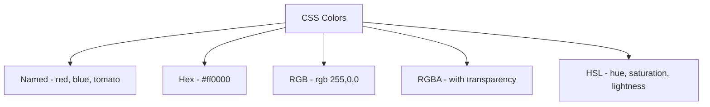
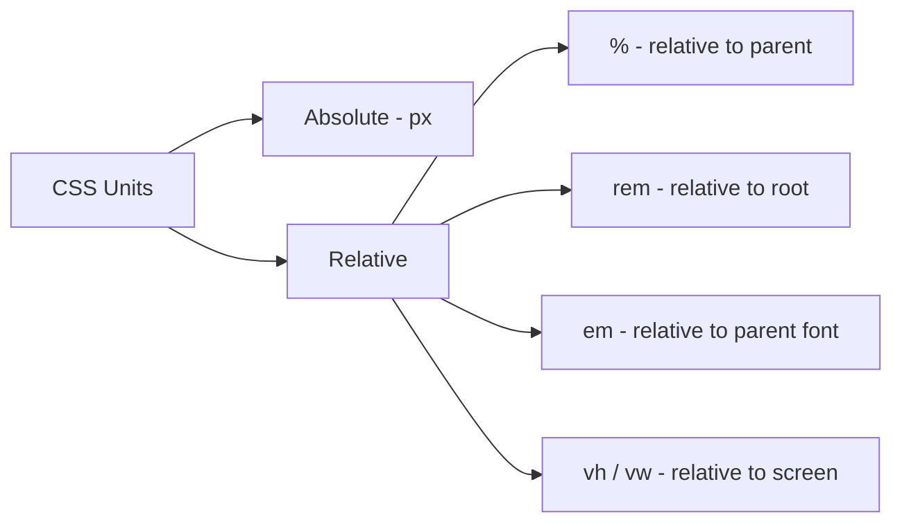
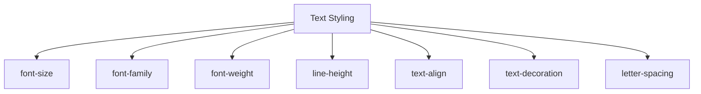

# 📘 Day 2: Colors, Units & Text Styling

Hello students 👋

Welcome back! Yesterday we learned **how to write CSS** and **how to select elements**. Today is going to be extra fun because we will learn how to make our webpage look **beautiful and professional** using **colors**, **units**, and **text styling**.

Think of today's lesson as *"learning to paint"* 🎨. Yesterday you learned how to hold the brush. Today you will learn which color to pick and how to mix it.

---

## 1. Introduction

### What will we learn today?

- Different ways to use colors (name, hex, rgb, rgba, hsl)
- CSS units (px, %, rem, em, vh, vw)
- Text styling: `font-size`, `font-family`, `font-weight`, `line-height`
- Alignment: `text-align`
- Decoration: `text-decoration`, `letter-spacing`

### Why is this important?

Most of what users **see and read** on a website is **text**. If the text looks bad — ugly font, poor spacing, wrong size — users will leave the site in seconds. Good typography makes your page feel premium. ✨

---

## 2. Concept Explanation

### Colors

A color in CSS can be written in many ways, but the browser understands all of them the same way. You just pick the format that's easiest.

### Units

Units tell the browser **how big** something should be. `px` means pixels (fixed), `%` means relative to parent, `rem` is relative to root font-size, and so on.

### Text properties

Text properties control **how words appear** — size, weight (boldness), spacing between lines, alignment, underlines, and more.

---

## 3. 💡 Visual Learning

### Color Formats Overview



### Units Categories



### Text Styling Map



---

## 4. Syntax + Code Examples

### Colors

#### 1. Named Colors
Over 140 colors have names.

```css
h1 { color: red; }
p  { color: tomato; }
a  { color: steelblue; }
```

#### 2. Hex Colors (#RRGGBB)
`#` followed by 6 hex digits.

```css
h1 { color: #ff0000; }   /* red */
p  { color: #00ff00; }   /* green */
a  { color: #333333; }   /* dark gray */
```

💡 Short hex also works: `#f00` = `#ff0000`.

#### 3. RGB

```css
h1 { color: rgb(255, 0, 0); }   /* red */
p  { color: rgb(50, 150, 200); }
```

#### 4. RGBA (with transparency)
Last value is **alpha** (0 = invisible, 1 = fully visible).

```css
.box { background-color: rgba(0, 0, 0, 0.5); } /* semi-transparent black */
```

#### 5. HSL (Hue, Saturation, Lightness)

```css
h1 { color: hsl(0, 100%, 50%); }   /* pure red */
```

---

### Units

#### `px` — Pixels (Fixed)
```css
h1 { font-size: 32px; }
```

#### `%` — Percentage (Relative to parent)
```css
.container { width: 80%; }  /* 80% of parent width */
```

#### `rem` — Root em (Relative to root HTML font size)
Default root = 16px → `1rem = 16px`.
```css
h1 { font-size: 2rem; }     /* 32px */
```

#### `em` — Relative to parent font size
```css
.card { font-size: 20px; }
.card p { font-size: 1.5em; }  /* 30px */
```

#### `vh` / `vw` — Viewport height/width
```css
.hero { height: 100vh; }   /* full screen height */
.banner { width: 50vw; }   /* half of screen width */
```

---

### Text Styling Examples

```css
h1 {
  font-family: 'Arial', sans-serif;
  font-size: 36px;
  font-weight: bold;
  color: #222;
  text-align: center;
  letter-spacing: 2px;
}

p {
  font-family: 'Georgia', serif;
  font-size: 1rem;
  font-weight: 400;
  line-height: 1.6;
  color: #555;
  text-align: justify;
}

a {
  text-decoration: none;   /* removes underline */
  color: steelblue;
}

a:hover {
  text-decoration: underline;
}
```

---

### Full Working Example

**File: `index.html`**
```html
<!DOCTYPE html>
<html>
  <head>
    <title>Day 2 - Text Styling</title>
    <link rel="stylesheet" href="style.css" />
  </head>
  <body>
    <h1>CSS Typography</h1>
    <p class="intro">
      Beautiful typography makes a website feel professional and trustworthy.
    </p>
    <a href="#">Learn More</a>
  </body>
</html>
```

**File: `style.css`**
```css
body {
  font-family: 'Segoe UI', sans-serif;
  background-color: #f5f5f5;
  padding: 20px;
}

h1 {
  color: #2c3e50;
  text-align: center;
  font-size: 2.5rem;
  letter-spacing: 3px;
}

.intro {
  font-size: 1.1rem;
  color: #555;
  line-height: 1.8;
  text-align: center;
}

a {
  color: #e74c3c;
  text-decoration: none;
  font-weight: bold;
}

a:hover {
  text-decoration: underline;
}
```

---

### Wrong vs Correct

❌ **Wrong:**
```css
h1 {
  color: #GG0000;   /* invalid hex */
}
```

✅ **Correct:**
```css
h1 {
  color: #FF0000;
}
```

❌ **Wrong:**
```css
p {
  font-size: 16;   /* missing unit */
}
```

✅ **Correct:**
```css
p {
  font-size: 16px;
}
```

---

## 5. Live Output Explanation

When you open the example in the browser:

- The heading appears **large**, **centered**, with wide letter spacing — giving it a **premium** feel.
- The paragraph is **soft gray**, with comfortable line spacing, making it **easy to read**.
- The link appears **red**, **bold**, and shows underline only when you hover — which feels interactive.

💡 **DevTools Tip:** Open DevTools → click on the text → change `font-size` or `color` in the Styles panel to see live changes.

---

## 6. 🧪 Hands-on Practice

1. **Task 1:** Create 3 paragraphs — use **named**, **hex**, and **rgb** colors for each.
2. **Task 2:** Create a `<div>` with `width: 50%` and `height: 100vh` and give it a background color.
3. **Task 3:** Use 3 different font families for 3 headings (Arial, Georgia, Courier New).
4. **Task 4:** Make a paragraph with `line-height: 2` and `letter-spacing: 3px`.
5. **Task 5:** Create a navigation with 4 links — remove the underline and add hover underline.

---

## 7. ⚠️ Common Mistakes

| Mistake | Fix |
|---------|-----|
| Writing `font-size: 16` | Always add unit: `16px` |
| Using wrong hex like `#GGGGGG` | Hex must be 0–9 and A–F |
| Mixing quotes: `font-family: Arial",` | Close the quotes properly |
| Forgetting fallback fonts | Always add a generic fallback: `'Arial', sans-serif` |
| Too many different fonts | Use max 2–3 fonts in a project |
| Huge `line-height` like `100px` | Use `1.4` – `1.8` as relative values |

---

## 8. 📝 Mini Assignment

**Design an Article Page** 📰

Create an article layout:

- Title (`h1`) — large, bold, centered, with letter-spacing.
- Subtitle (`h2`) — lighter color, smaller font, italic.
- Author line (`<p class="author">`) — gray, small.
- Main article (3 paragraphs) — good line-height, justified text.
- A "Read More" link — no underline, hover underline.

✅ Use external CSS.
✅ Use at least 3 different units (`px`, `rem`, `%`).
✅ Use at least 2 color formats (hex, rgb).

---

## 9. 🔁 Recap

Today we learned:

- ✅ Colors: **name**, **hex**, **rgb(a)**, **hsl**.
- ✅ Units: **px (fixed)**, **% (parent)**, **rem (root)**, **em (parent font)**, **vh/vw (viewport)**.
- ✅ Text styling: `font-size`, `font-family`, `font-weight`, `line-height`, `letter-spacing`, `text-align`, `text-decoration`.
- ✅ Always include **fallback fonts** and **correct units**.

💡 **VS Code Tip:** Install the **"Color Highlight"** extension — it shows you the actual color next to your code.
💡 **DevTools Tip:** Use the color picker in DevTools to try colors live.

See you on **Day 3: The Box Model** 📦 — where we will learn how every element on a webpage is actually a box!

Keep coding! 🚀
