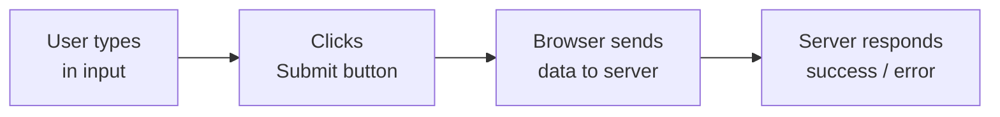
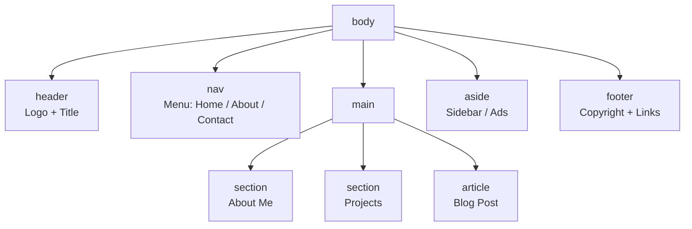
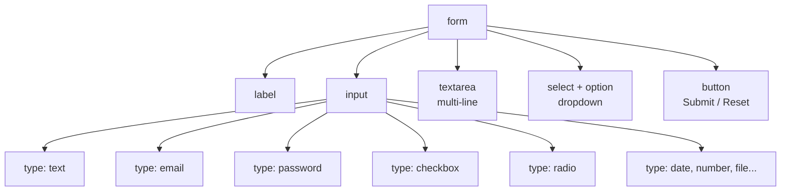

# 📘 Day 3: Forms + Semantic HTML + Mini Project

> **Duration:** 1 to 1.5 hours
> **Level:** Beginner (after Day 1 & Day 2)
> **Goal:** Build **real, interactive webpages** — forms, semantic layout, and a complete mini project! 🚀

---

## 👋 Hello students!

Hello students 👋
Welcome to the **final day** of our HTML journey! Today is a **celebration day** because by the end of this class, you will have built a **complete, real-world webpage** from scratch — something you can proudly show to your family, friends, and even future employers!

In the last two days we learned:

- **Day 1:** Structure, headings, paragraphs.
- **Day 2:** Links, images, lists, tables.
- **Day 3 (today):** Forms + Semantic HTML + **Mini Project** 🎉

Let's finish strong! 💪

---

## 1. 🎯 Introduction — What Will We Learn Today?

Today's agenda:

- What is a **Form** and why do we need it
- **Input types**: text, email, password, number, date, file…
- **`<label>`** — why it's important
- **`<textarea>`** — multi-line input
- **`<select>`** and **`<option>`** — dropdowns
- **Checkbox** and **Radio button** — when to use which
- **`<button>`** — the action trigger
- Common **form attributes** (`action`, `method`, `name`, `required`, `placeholder`)
- **Semantic HTML** — `<header>`, `<nav>`, `<section>`, `<article>`, `<aside>`, `<footer>`
- 🏆 **Mini Project** — a complete **Personal Portfolio Page**

### ❓ Why are forms important?

Every time you **login to Facebook**, **search on Google**, **sign up on Amazon**, or **order on Swiggy** — you are filling a **form**. Forms are how the web **collects information from users**. No website without forms. 🙌

### ❓ Why semantic HTML?

The word **"semantic"** simply means **"meaningful"**. Instead of throwing everything into `<div>` boxes (which say nothing), we use tags like `<header>`, `<nav>`, `<footer>` that **tell the browser, Google, and screen readers** what each section actually is.

---

## 2. 🧩 Concept Explanation

### 📋 What is a Form?

A **form** is an area on a webpage where the user can **type information or make choices**, then **submit** it to the server (or another page).

> 🏦 **Analogy:** A form is like a **bank account opening form** — you fill name, address, phone number… and hand it to the clerk. In HTML, the "clerk" is the server.

### 🧱 Semantic HTML — Why Bother?

Imagine reading a newspaper where **every article** is on a plain white page with no headline, no section dividers, no page numbers. Chaos, right?

That's what a webpage looks like **without semantic tags**.

| Without Semantic (old way) | With Semantic (modern way) |
|-----------------------------|-----------------------------|
| `<div>` everywhere | `<header>`, `<nav>`, `<main>`, `<footer>` |
| Browser has no clue what is what | Browser knows instantly |
| Bad for accessibility / SEO | Excellent for Google & screen readers |

---

## 3. 💡 Visual Learning — Forms and Semantic Layout

### 📝 How a Form Works



### 🏛️ Semantic Layout of a Webpage



### 🧭 Form Element Family



---

## 4. 📝 Syntax + Code Examples

### 🎯 4.1 The `<form>` Tag

A form starts with the `<form>` tag. Everything inside belongs to that form.

```html
<form action="/submit" method="post">
  <!-- Inputs go here -->
</form>
```

| Attribute | Meaning |
|-----------|---------|
| `action` | URL where data is sent when form is submitted |
| `method` | `get` (data in URL) or `post` (hidden in request) |

> 💡 For today's practice, we won't connect to a server — we'll just focus on building the form visually.

---

### 🔤 4.2 Input Types — The Most Important List

The `<input>` tag is **self-closing** and its behavior changes based on the `type` attribute.

```html
<!-- Single-line text -->
<input type="text" name="username" placeholder="Enter your name">

<!-- Email (browser validates @ sign) -->
<input type="email" name="email" placeholder="you@example.com">

<!-- Password (characters hidden) -->
<input type="password" name="pwd" placeholder="Enter password">

<!-- Number -->
<input type="number" name="age" min="1" max="120">

<!-- Date picker -->
<input type="date" name="dob">

<!-- File upload -->
<input type="file" name="resume">

<!-- Color picker -->
<input type="color" name="favColor">

<!-- Range slider -->
<input type="range" name="volume" min="0" max="100">

<!-- Checkbox (multi-select) -->
<input type="checkbox" name="hobby" value="cricket"> Cricket

<!-- Radio button (single-select) -->
<input type="radio" name="gender" value="male"> Male
<input type="radio" name="gender" value="female"> Female

<!-- Submit button -->
<input type="submit" value="Submit Form">
```

> 📏 **Rule:** Inputs with the **same `name`** in a radio group = user picks **only one**.

---

### 🏷️ 4.3 `<label>` — Never Skip This

A **label** is the text that describes an input. Always connect it with the `for` attribute, matching the input's `id`.

```html
<label for="username">Your Name:</label>
<input type="text" id="username" name="username">
```

### ❓ Why bother with labels?

1. Clicking the **label** focuses the input automatically (better UX!).
2. **Screen readers** use labels to describe inputs to blind users.
3. Looks more professional.

### ❌ Wrong vs ✅ Correct

```html
<!-- ❌ Wrong: no label -->
Name: <input type="text" name="name">

<!-- ✅ Correct -->
<label for="name">Name:</label>
<input type="text" id="name" name="name">
```

---

### 📝 4.4 `<textarea>` — Multi-Line Text

For long text (messages, comments, bios):

```html
<label for="msg">Your Message:</label>
<textarea id="msg" name="message" rows="5" cols="40" placeholder="Type here..."></textarea>
```

- `rows` = height (in lines)
- `cols` = width (in characters)

> ⚠️ `<textarea>` is **NOT** self-closing — it must have `</textarea>`.

---

### 🔽 4.5 `<select>` — Dropdown

```html
<label for="country">Country:</label>
<select id="country" name="country">
  <option value="india">India</option>
  <option value="usa">USA</option>
  <option value="uk">UK</option>
  <option value="japan">Japan</option>
</select>
```

### Pre-select an option

```html
<option value="india" selected>India</option>
```

---

### ☑️ 4.6 Checkbox vs 🔘 Radio — When to Use Which?

| Checkbox | Radio Button |
|----------|--------------|
| User can select **multiple** | User picks **only one** |
| Example: hobbies | Example: gender, marital status |

```html
<h4>Select your hobbies:</h4>
<input type="checkbox" id="h1" name="hobby" value="reading">
<label for="h1">Reading</label><br>
<input type="checkbox" id="h2" name="hobby" value="gaming">
<label for="h2">Gaming</label><br>
<input type="checkbox" id="h3" name="hobby" value="music">
<label for="h3">Music</label>

<h4>Select your gender:</h4>
<input type="radio" id="g1" name="gender" value="male">
<label for="g1">Male</label>
<input type="radio" id="g2" name="gender" value="female">
<label for="g2">Female</label>
<input type="radio" id="g3" name="gender" value="other">
<label for="g3">Other</label>
```

> 📌 **Critical:** Radios in a group must share the **same `name`**, otherwise the user can select all of them!

---

### 🔘 4.7 `<button>` — The Action Trigger

```html
<button type="submit">Submit</button>
<button type="reset">Reset</button>
<button type="button">Just a button</button>
```

- `type="submit"` — submits the form
- `type="reset"` — clears all fields
- `type="button"` — does nothing by default (used with JavaScript later)

---

### 📋 4.8 Common Form Attributes

| Attribute | Purpose |
|-----------|---------|
| `placeholder` | Grey hint text inside the input |
| `required` | Field must be filled to submit |
| `readonly` | User can see but can't edit |
| `disabled` | Greyed out and inactive |
| `maxlength` | Maximum characters allowed |
| `min` / `max` | Range for numbers / dates |
| `name` | Identifies the field when data is sent |
| `value` | The pre-filled or default value |

Example:

```html
<input type="text" name="username" placeholder="Enter username"
       required minlength="3" maxlength="20">
```

---

### 🏛️ 4.9 Semantic HTML — The Modern Way

Instead of using `<div>` for everything, use **meaningful tags**:

```html
<body>
  <header>
    <h1>My Website</h1>
  </header>

  <nav>
    <a href="#home">Home</a>
    <a href="#about">About</a>
    <a href="#contact">Contact</a>
  </nav>

  <main>
    <section id="about">
      <h2>About Me</h2>
      <p>I love coding.</p>
    </section>

    <article>
      <h2>My Latest Blog Post</h2>
      <p>Today I learned about semantic HTML...</p>
    </article>

    <aside>
      <h3>Related Links</h3>
      <p>Sidebar content.</p>
    </aside>
  </main>

  <footer>
    <p>&copy; 2026 Ravi. All rights reserved.</p>
  </footer>
</body>
```

### Quick Meaning Guide

| Tag | Meaning |
|-----|---------|
| `<header>` | Top section (logo, main title) |
| `<nav>` | Navigation menu |
| `<main>` | Main unique content of the page |
| `<section>` | A thematic group of content |
| `<article>` | Standalone content (blog post, news) |
| `<aside>` | Sidebar, ads, related links |
| `<footer>` | Bottom section (copyright, contact) |

> 📈 **SEO bonus:** Google **loves** semantic HTML. Using these tags can improve your search rankings!

---

## 5. 🌐 Live Output Explanation — A Complete Form

```html
<!DOCTYPE html>
<html>
  <head>
    <title>Registration Form</title>
  </head>
  <body>
    <h1>Student Registration 📋</h1>

    <form action="/register" method="post">

      <label for="fullname">Full Name:</label><br>
      <input type="text" id="fullname" name="fullname" placeholder="Ravi Kumar" required><br><br>

      <label for="email">Email:</label><br>
      <input type="email" id="email" name="email" placeholder="you@example.com" required><br><br>

      <label for="pwd">Password:</label><br>
      <input type="password" id="pwd" name="pwd" minlength="6" required><br><br>

      <label for="dob">Date of Birth:</label><br>
      <input type="date" id="dob" name="dob"><br><br>

      <label>Gender:</label><br>
      <input type="radio" id="m" name="gender" value="male">
      <label for="m">Male</label>
      <input type="radio" id="f" name="gender" value="female">
      <label for="f">Female</label><br><br>

      <label>Hobbies:</label><br>
      <input type="checkbox" id="h1" name="hobby" value="cricket">
      <label for="h1">Cricket</label>
      <input type="checkbox" id="h2" name="hobby" value="music">
      <label for="h2">Music</label>
      <input type="checkbox" id="h3" name="hobby" value="coding">
      <label for="h3">Coding</label><br><br>

      <label for="country">Country:</label><br>
      <select id="country" name="country">
        <option value="india">India</option>
        <option value="usa">USA</option>
        <option value="uk">UK</option>
      </select><br><br>

      <label for="bio">Short Bio:</label><br>
      <textarea id="bio" name="bio" rows="4" cols="40" placeholder="Tell us about yourself"></textarea><br><br>

      <button type="submit">Register</button>
      <button type="reset">Clear</button>

    </form>
  </body>
</html>
```

### 👀 What You'll See

A complete, working registration form with:

- Text, email, password, date inputs
- Radio buttons for gender
- Checkboxes for hobbies
- A country dropdown
- A bio textarea
- Submit and Reset buttons

Try clicking **Submit** without filling the "Full Name" field — the browser will stop you because of `required`. Nice, right? ✨

---

## 6. 🧪 Hands-on Practice — 5 Tasks

### ✏️ Task 1 — Login Form

Create `login.html` with:

- Email field (required)
- Password field (required, minlength 6)
- A "Remember me" checkbox
- A Login button

### ✏️ Task 2 — Contact Us Form

Create `contact.html` with:

- Full name, email, phone (number), subject (dropdown with 4 options), message (textarea)
- Submit button

### ✏️ Task 3 — Survey Form

Create `survey.html` asking:

- Favorite color (color picker)
- Age (number, min 5, max 120)
- Favorite programming language (radio — HTML / CSS / JS)
- Learning mediums (checkboxes — YouTube / Books / Courses / Practice)

### ✏️ Task 4 — Semantic Layout

Create `layout.html` using **only semantic tags** (`<header>`, `<nav>`, `<main>`, `<section>`, `<footer>`). No `<div>` allowed! Fill with dummy content about your favorite movie.

### ✏️ Task 5 — Job Application Form

Create `job.html` for applying to a software job:

- Personal info (name, email, phone)
- Resume upload (`type="file"`)
- Years of experience (number)
- Skills (checkboxes)
- Cover letter (textarea)
- Submit button

---

## 7. ⚠️ Common Mistakes

### Mistake 1 — Radio buttons with different `name`s

```html
<!-- ❌ Wrong: user can select BOTH -->
<input type="radio" name="gender1" value="male"> Male
<input type="radio" name="gender2" value="female"> Female

<!-- ✅ Correct -->
<input type="radio" name="gender" value="male"> Male
<input type="radio" name="gender" value="female"> Female
```

### Mistake 2 — Forgetting the closing `</textarea>`

```html
<!-- ❌ Wrong (self-closing — NOT allowed for textarea) -->
<textarea rows="4" cols="40" />

<!-- ✅ Correct -->
<textarea rows="4" cols="40"></textarea>
```

### Mistake 3 — `<label>` not linked to input

```html
<!-- ❌ Wrong: label and input not connected -->
<label>Name</label>
<input type="text" name="name">

<!-- ✅ Correct: label's 'for' matches input's 'id' -->
<label for="name">Name</label>
<input type="text" id="name" name="name">
```

### Mistake 4 — Forgetting `name` attribute

Without `name`, the form data **won't be sent** to the server:

```html
<!-- ❌ Wrong -->
<input type="text" id="email">

<!-- ✅ Correct -->
<input type="text" id="email" name="email">
```

### Mistake 5 — Using `<div>` instead of semantic tags

```html
<!-- ❌ Old-fashioned -->
<div class="header">...</div>
<div class="footer">...</div>

<!-- ✅ Modern, semantic -->
<header>...</header>
<footer>...</footer>
```

### Mistake 6 — Multiple `<main>` tags

A page should have **only one** `<main>` tag.

---

## 8. 📝 Mini Project — 🏆 Personal Portfolio Page

This is your **graduation project** for HTML. Combine **everything** you've learned into one beautiful webpage called **`portfolio.html`**.

### 📋 Requirements

Your portfolio must include:

1. **`<header>`** with your name (`<h1>`) and a tagline (`<p>`).
2. **`<nav>`** with links to the sections: Home, About, Skills, Projects, Contact. Use anchor links (`#about`, `#skills`, etc.).
3. **`<main>`** containing **`<section>`** blocks:
   - **About Me:** short bio + a profile image
   - **Skills:** unordered list of at least 5 skills
   - **Education:** a **table** with at least 2 rows
   - **Projects:** a numbered (`<ol>`) list of at least 3 projects — each with a link
4. **`<article>`** containing one short "latest blog" post.
5. **`<aside>`** with fun facts about yourself (at least 3 bullet points).
6. **`<section id="contact">`** containing a **contact form** with:
   - Name (required)
   - Email (required)
   - Subject (dropdown of 4 options)
   - Message (textarea)
   - Send button
7. **`<footer>`** with copyright text and social media links.

### 🌟 Bonus

- Use `colspan` or `rowspan` in your Education table.
- Use an image inside your About Me section.
- Add at least **5 comments** in your code explaining different sections.

### 📐 Starter Skeleton

```html
<!DOCTYPE html>
<html>
<head>
  <title>Ravi Kumar — Portfolio</title>
</head>
<body>

  <header>
    <h1>Ravi Kumar</h1>
    <p>Aspiring Web Developer | HTML Learner | Coffee Lover ☕</p>
  </header>

  <nav>
    <a href="#about">About</a> |
    <a href="#skills">Skills</a> |
    <a href="#projects">Projects</a> |
    <a href="#contact">Contact</a>
  </nav>

  <main>
    <section id="about">
      <h2>About Me</h2>
      <!-- Add image + paragraph here -->
    </section>

    <section id="skills">
      <h2>Skills</h2>
      <!-- <ul> with <li> -->
    </section>

    <section id="education">
      <h2>Education</h2>
      <!-- <table> here -->
    </section>

    <section id="projects">
      <h2>Projects</h2>
      <!-- <ol> with links -->
    </section>

    <article>
      <h2>Latest from My Blog</h2>
      <p>My HTML learning journey...</p>
    </article>

    <aside>
      <h3>Fun Facts</h3>
      <!-- <ul> with 3 items -->
    </aside>

    <section id="contact">
      <h2>Contact Me</h2>
      <form>
        <!-- form fields here -->
      </form>
    </section>
  </main>

  <footer>
    <p>&copy; 2026 Ravi Kumar. Built with pure HTML ❤️</p>
  </footer>

</body>
</html>
```

Fill in the blanks — and you have a **real portfolio page**! Upload it to **GitHub Pages** later to share with the world. 🌍

---

## 9. 🔁 Recap — What Did We Learn Today?

- ✅ `<form>` wraps all form elements. Use `action` and `method` attributes.
- ✅ `<input>` is the most versatile tag — its behavior depends on `type`.
- ✅ Input types: `text`, `email`, `password`, `number`, `date`, `file`, `color`, `range`, `checkbox`, `radio`, `submit`.
- ✅ **`<label>`** — always link with `for` and `id` for accessibility.
- ✅ **`<textarea>`** — multi-line input, needs closing tag.
- ✅ **`<select>` + `<option>`** — dropdown menus.
- ✅ **Checkbox** — pick many; **Radio** — pick one (same `name`).
- ✅ **`<button>`** — `submit`, `reset`, `button` types.
- ✅ Key attributes: `placeholder`, `required`, `name`, `value`, `min/max`, `maxlength`.
- ✅ **Semantic tags** give meaning: `<header>`, `<nav>`, `<main>`, `<section>`, `<article>`, `<aside>`, `<footer>`.
- ✅ Semantic HTML = better **accessibility + SEO + code readability**.

### 🏁 What You've Achieved in 3 Days

- Day 1: Wrote your first HTML page ✅
- Day 2: Built multi-page sites with images, links, and tables ✅
- Day 3: Mastered forms and semantic structure ✅

You now know enough HTML to build **any basic webpage** on the planet! 🌍

### 🚀 What's Next?

- **CSS** — To make your pages **look beautiful** (colors, fonts, layouts).
- **JavaScript** — To make your pages **interactive** (clicks, animations, real-time validation).
- **React + Node.js + MongoDB** — to build **full-stack applications** (MERN).

### 🎯 Final Mission

1. Complete **all 5 hands-on tasks**.
2. Finish your **Personal Portfolio Page** 🏆.
3. Share it with a friend and get feedback.
4. Celebrate — **you are officially an HTML developer**! 🎉

> 💬 **Congratulations, students!** You walked in on Day 1 having never written a line of code, and today you can build real webpages with forms and semantic structure. That is **massive progress**. Be proud of yourself. See you in the **CSS series** next — we'll make your pages look **stunning**! 👋
