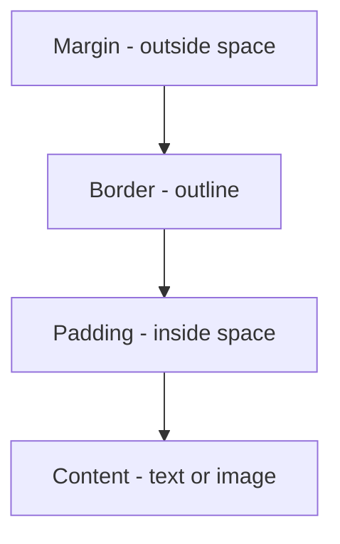
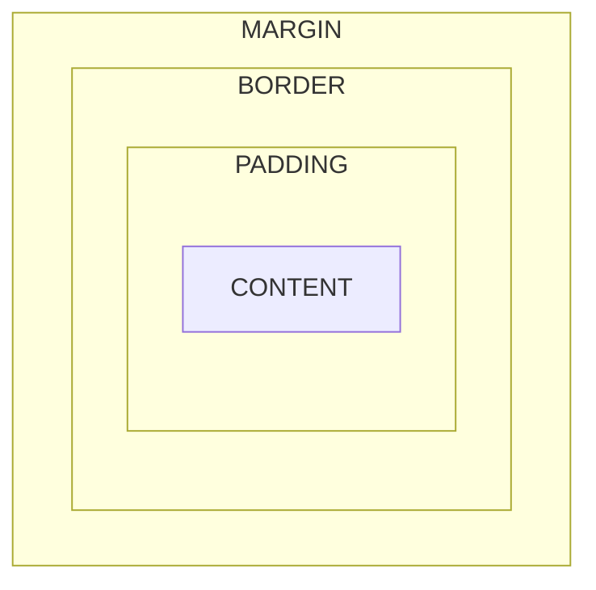
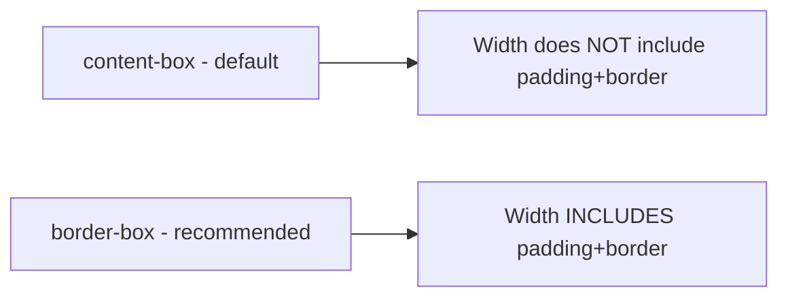

# 📘 Day 3: The CSS Box Model

Hello students 👋

Welcome to **Day 3**! Today we learn the **single most important concept in CSS** — the **Box Model**.

If you understand the box model well, 70% of CSS layout problems will disappear. 🎯

Here's a secret: in CSS, **everything is a box**. Your heading is a box. Your paragraph is a box. Even the tiny icon in the corner is a box. Once you learn how to control these boxes, you control the layout.

---

## 1. Introduction

### What will we learn today?

- `width` and `height`
- `padding` (space inside the box)
- `margin` (space outside the box)
- `border`
- `border-radius` (for rounded corners)
- `box-sizing` (how width is calculated)
- `overflow` (what happens if content is too big)

### Why is the Box Model important?

Imagine you're arranging furniture in a room 🛋️. Every piece of furniture has:
- Its own **size** (width, height).
- **Padding** inside (cushion on a sofa).
- A **border** (frame around it).
- A **margin** (space between furniture pieces).

That's exactly how the **CSS Box Model** works!

---

## 2. Concept Explanation

Every HTML element is rendered as a rectangular box with 4 layers (from inside out):

1. **Content** — the text/image itself.
2. **Padding** — space between content and border.
3. **Border** — the outline around the padding.
4. **Margin** — space between the border and other elements.

---

## 3. 💡 Visual Learning

### The Box Model (4 layers)



### Visual Representation



### box-sizing comparison



---

## 4. Syntax + Code Examples

### Width and Height

```css
.box {
  width: 300px;
  height: 150px;
  background-color: lightblue;
}
```

### Padding (space inside)

```css
.box {
  padding: 20px;              /* all 4 sides */
  padding: 10px 20px;         /* top/bottom 10, left/right 20 */
  padding: 5px 10px 15px 20px;/* top right bottom left */
  padding-top: 10px;
  padding-left: 15px;
}
```

### Margin (space outside)

```css
.box {
  margin: 20px;
  margin: 10px auto;          /* center horizontally */
  margin-top: 30px;
  margin-bottom: 30px;
}
```

💡 `margin: 0 auto;` is the classic way to **center a box horizontally**.

### Border

```css
.box {
  border: 2px solid black;
  border: 3px dashed red;
  border-top: 5px solid blue;
  border-radius: 10px;         /* rounded corners */
  border-radius: 50%;          /* perfect circle */
}
```

### box-sizing

By default, `width: 300px` + `padding: 20px` + `border: 2px` makes the real box **344px wide**. That's confusing.

Use `box-sizing: border-box` to make width **include** padding and border.

```css
* {
  box-sizing: border-box;
}
```

✅ **Recommended for every project.**

### Overflow

What happens if content is too big for the box?

```css
.box {
  width: 200px;
  height: 100px;
  overflow: hidden;     /* hide extra content */
  overflow: scroll;     /* always show scrollbar */
  overflow: auto;       /* show scrollbar only when needed */
  overflow: visible;    /* default - content spills out */
}
```

---

### Full Working Example

**File: `index.html`**
```html
<!DOCTYPE html>
<html>
  <head>
    <title>Day 3 - Box Model</title>
    <link rel="stylesheet" href="style.css" />
  </head>
  <body>
    <div class="card">
      <h2>iPhone 15 Pro</h2>
      <p>The best iPhone ever made. Experience power and design.</p>
      <button>Buy Now</button>
    </div>
  </body>
</html>
```

**File: `style.css`**
```css
* {
  box-sizing: border-box;
  margin: 0;
  padding: 0;
}

body {
  background: #f0f0f0;
  padding: 40px;
  font-family: Arial, sans-serif;
}

.card {
  width: 300px;
  padding: 20px;
  border: 1px solid #ddd;
  border-radius: 12px;
  background-color: white;
  margin: 0 auto;              /* center horizontally */
}

.card h2 {
  font-size: 22px;
  margin-bottom: 10px;
  color: #222;
}

.card p {
  color: #666;
  line-height: 1.5;
  margin-bottom: 15px;
}

.card button {
  padding: 10px 20px;
  background-color: #007bff;
  color: white;
  border: none;
  border-radius: 6px;
  cursor: pointer;
}

.card button:hover {
  background-color: #0056b3;
}
```

---

### Wrong vs Correct

❌ **Wrong (no box-sizing, unexpected sizes):**
```css
.box {
  width: 200px;
  padding: 30px;
  border: 5px solid black;
  /* Real width = 270px — surprise! */
}
```

✅ **Correct:**
```css
* { box-sizing: border-box; }

.box {
  width: 200px;
  padding: 30px;
  border: 5px solid black;
  /* Real width = 200px */
}
```

---

## 5. Live Output Explanation

When you open the card example:

- You see a **white card** in the center of a gray background.
- It has **rounded corners**, a **subtle border**, and **internal spacing** (padding).
- The heading, paragraph, and button have **vertical spacing** between them (margins).
- The button **changes color on hover**.

💡 **DevTools Tip:** Open DevTools → click any element → scroll to the bottom of the right panel → you'll see a **visual diagram** of the box model (margin, border, padding, content) with exact numbers!

---

## 6. 🧪 Hands-on Practice

1. **Task 1:** Create a box with width 200px, height 200px, red background, black border.
2. **Task 2:** Give the box `padding: 20px` and `margin: 30px` — observe the difference.
3. **Task 3:** Make a circle using only `border-radius`.
4. **Task 4:** Create a box where content overflows — use `overflow: auto`.
5. **Task 5:** Center a card horizontally using `margin: 0 auto;`.

---

## 7. ⚠️ Common Mistakes

| Mistake | Fix |
|---------|-----|
| Forgetting `box-sizing: border-box` → unexpected sizes | Add it globally with `*` |
| Using `margin` when you need `padding` | Padding = inside, Margin = outside |
| Setting fixed `height` → text gets cut off | Let height grow with content when possible |
| Padding without unit: `padding: 20` | Always add unit: `padding: 20px` |
| Using `margin: auto` without fixed width | Auto centers only works with a set width |
| Overusing `!important` to fix spacing | Fix the real rule instead |

---

## 8. 📝 Mini Assignment

**Build a Product Card UI** 🛒

Create a simple product card:

- A **box** with a border and rounded corners.
- Product **image** (use a placeholder).
- Product **title** (h2).
- Short **description** (paragraph).
- **Price** in a highlighted color.
- A **"Add to Cart"** button.

✅ Requirements:
- Use `box-sizing: border-box`.
- Center the card on the page.
- Use padding, margin, border.
- Use `border-radius: 10px` for softer look.
- Give the button padding and hover effect.

---

## 9. 🔁 Recap

Today we learned:

- ✅ Every HTML element is a **box** with 4 layers.
- ✅ **Content → Padding → Border → Margin** (inside out).
- ✅ `padding` = space inside.
- ✅ `margin` = space outside.
- ✅ `border` = the frame.
- ✅ `border-radius` = rounded corners.
- ✅ `box-sizing: border-box` = makes sizing predictable.
- ✅ `overflow` controls content that doesn't fit.
- ✅ `margin: 0 auto` centers a fixed-width box.

💡 **Pro tip:** Always add this at the top of your CSS file:
```css
* { box-sizing: border-box; margin: 0; padding: 0; }
```

See you on **Day 4: Backgrounds, Display & Position** 🎨 — where we'll learn how to position elements anywhere on the screen!

You're building a strong foundation. Keep going! 💪
