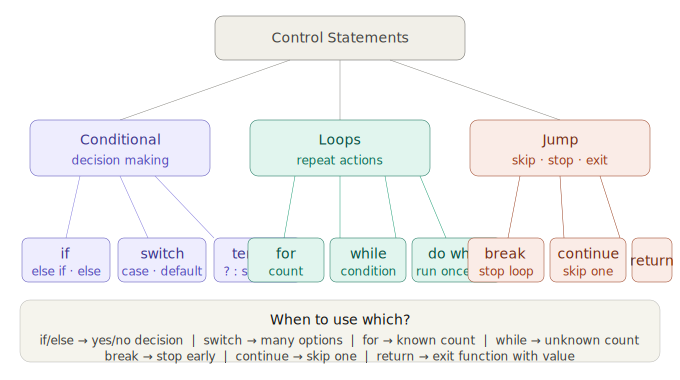

## Control Statements



---

## Part 1 — All Conditional Statements TogetherGo through all 4 tabs — especially **"compare all 3"** which shows `if`, `switch`, and ternary doing the exact same job. The slider helps you feel how the conditions fire at different values.

---

## Part 2 — All Loop Types with AnimationGo through every tab. Most importantly — on **do...while** press **"Run (max 0)"** to see the famous difference: it runs once even when the condition is already false!

---

## Part 3 — break, continue, return side by sideAll three jump statements animated side by side! Change the `break` slider, try all 3 `continue` modes, and use `find` to search for different values with `return`.

---

## Part 4 — Full Revision Quiz10 questions covering every control statement. Read the explanation after each answer — they reveal the tricky details!

---

## Complete Revision Cheat Sheet

```js
// ═══════════════════════════════════════════
//  CONDITIONAL STATEMENTS
// ═══════════════════════════════════════════

// 1. if / else if / else
if (score >= 90)      { console.log("A"); }
else if (score >= 75) { console.log("B"); }
else if (score >= 60) { console.log("C"); }
else                  { console.log("F"); }

// 2. switch — best for exact value matching
switch (day) {
  case "Monday":  console.log("Start!"); break;
  case "Friday":  console.log("TGIF!");  break;
  case "Saturday":
  case "Sunday":  console.log("Weekend!"); break;   // shared case
  default:        console.log("Weekday");
}

// 3. ternary — one-line if/else
let label = age >= 18 ? "Adult" : "Minor";


// ═══════════════════════════════════════════
//  LOOPS
// ═══════════════════════════════════════════

// 4. for — known count
for (let i = 0; i < 5; i++) {
  console.log(i);  // 0 1 2 3 4
}

// 5. while — unknown count
let n = 10;
while (n > 0) {
  console.log(n);
  n -= 3;          // 10 7 4 1
}

// 6. do...while — run at LEAST once
do {
  console.log("Hello!");  // runs once even if false
} while (false);

// 7. forEach — loop over arrays
["Alice","Bob","Charlie"].forEach((name, i) => {
  console.log(i + ": " + name);
});

// 8. for...of — cleaner array loop
for (let name of ["Alice","Bob"]) {
  console.log(name);
}


// ═══════════════════════════════════════════
//  JUMP STATEMENTS
// ═══════════════════════════════════════════

// 9. break — stop the loop immediately
for (let i = 0; i < 10; i++) {
  if (i === 5) break;      // stops at 5
  console.log(i);          // prints 0 1 2 3 4
}

// 10. continue — skip this iteration
for (let i = 0; i < 6; i++) {
  if (i % 2 === 0) continue;  // skip even
  console.log(i);              // prints 1 3 5
}

// 11. return — exit function with a value
function isAdult(age) {
  if (age >= 18) return true;   // exits here
  return false;                  // or here
}
```

---

**Homework — write ALL of this from scratch in your console:**

```js
// 1. if/else — check a number
let num = 42;
if (num > 0) console.log("positive");
else if (num < 0) console.log("negative");
else console.log("zero");

// 2. for loop — sum 1 to 10
let sum = 0;
for (let i = 1; i <= 10; i++) { sum += i; }
console.log("Sum:", sum);  // 55

// 3. while — count down
let count = 5;
while (count > 0) { console.log(count); count--; }

// 4. break — find first number divisible by 7
for (let i = 1; i <= 100; i++) {
  if (i % 7 === 0) { console.log("First:", i); break; }
}

// 5. continue — print only even numbers 1-10
for (let i = 1; i <= 10; i++) {
  if (i % 2 !== 0) continue;
  console.log(i);
}
```
