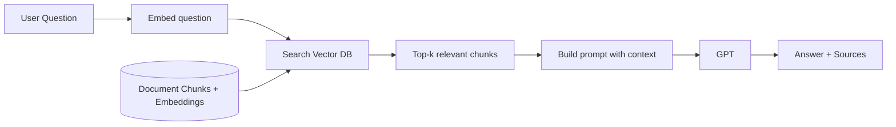
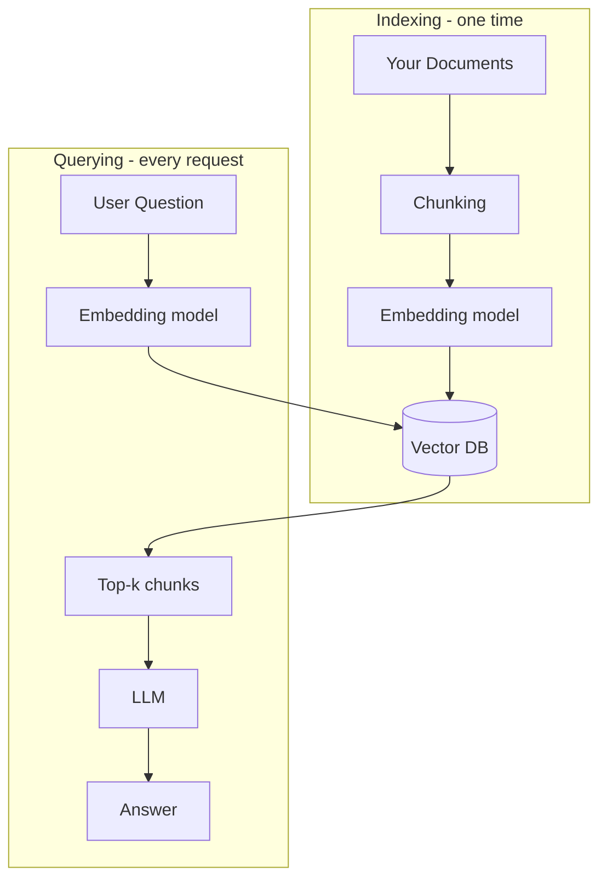
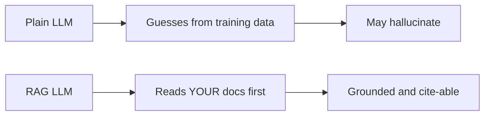

# 📅 Day 3 — RAG Fundamentals

Hello students 👋

Welcome to **Day 3**! Today is a **BIG** day. You are going to learn the secret behind ChatGPT-style "ask your documents" bots, company knowledge assistants, and customer support tools that quote from a real policy PDF. This is called **RAG — Retrieval-Augmented Generation**. 🧠📚

---

## 1. Introduction

### 🎯 What we learn today?
- What is **RAG** and why it was invented
- Why an LLM's memory is **limited and frozen**
- What are **embeddings** and **vectors**
- What are **chunks** and why we split text
- **Vector database** basics
- The full **retrieval → generation** flow
- 💻 Mini project: **FAQ document search bot**

### 🌍 Why it matters
Plain ChatGPT only knows what it learned during training. It **does not know** your company's refund policy, internal HR rules, or yesterday's sales report. RAG **connects the LLM to your private data** safely, cheaply, and in real-time. Every serious AI startup uses RAG somewhere.

---

## 2. Concept Explanation

### 🧠 What is RAG?
**RAG = Retrieval-Augmented Generation.**

Three words, three steps:
1. **Retrieval** → Find the relevant text from your documents.
2. **Augmented** → Add that text into the prompt.
3. **Generation** → Let the LLM answer using that text.

> RAG is like an **open-book exam**. The LLM is smart, but it can now "open the book" (your documents) before answering.

### ⛔ Why LLM memory is limited
- LLMs are **frozen** after training — no new knowledge after their cutoff.
- They have a **context window** limit (e.g., 128k tokens) — you can't paste a 500-page PDF.
- They **hallucinate** (make up facts) when they don't know something.
- You can't retrain them daily — too expensive.

**Solution:** don't retrain. Instead, **fetch the right paragraph at the right time**.

### 🔢 What are embeddings?
An **embedding** is a list of numbers (a vector, e.g., 1536 dimensions) that represents the **meaning** of a piece of text.

- Sentences with **similar meaning** → vectors **close to each other** in space.
- Sentences with **different meaning** → vectors **far apart**.

Example:
- `"How do I get a refund?"` → `[0.12, -0.03, 0.88, ...]`
- `"What is the return policy?"` → `[0.11, -0.04, 0.90, ...]` ← very close!
- `"What is the weather today?"` → `[-0.77, 0.55, 0.01, ...]` ← far away

### ✂️ What are chunks?
A long document is split into small **chunks** (e.g., 300–800 tokens each) because:
- You can't embed 100 pages at once (too big).
- Smaller chunks = **more precise** retrieval.
- Overlap between chunks avoids cutting a sentence in half.

### 🗄️ What is a vector database?
A **vector database** stores chunks + their embeddings and lets you ask: *"Give me the top 5 chunks most similar to this query."*

Popular options:
- **Pinecone** (managed cloud)
- **Supabase + pgvector** (Postgres-based)
- **Qdrant, Weaviate, Chroma** (open source)
- **In-memory** (for learning — we'll use this today)

### 🔁 Full RAG flow

1. User asks: *"What is the refund period?"*
2. Convert question → embedding vector.
3. Search vector DB for top-k similar chunks.
4. Inject those chunks into the prompt.
5. LLM answers using those chunks.
6. Return answer + sources.

---

## 3. 💡 Visual Learning

### The RAG pipeline



### Indexing (offline) vs Querying (online)



### Plain LLM vs RAG



---

## 4. 🛠️ Setup

```bash id="day3install"
npm install openai dotenv
npm install -D typescript ts-node @types/node
```

`.env`:

```env id="day3env"
OPENAI_API_KEY=sk-your-key
```

Folder structure:

```text id="day3folder"
ai-day3/
├── src/
│   ├── embeddings.ts
│   ├── chunk.ts
│   ├── store.ts
│   └── ragBot.ts
├── data/
│   └── faq.txt
└── .env
```

---

## 5. Code Examples

### ✅ Step 1: Create embeddings

```ts id="day3embed"
// src/embeddings.ts
import "dotenv/config";
import OpenAI from "openai";

const client = new OpenAI({ apiKey: process.env.OPENAI_API_KEY });

export async function embed(text: string): Promise<number[]> {
  const res = await client.embeddings.create({
    model: "text-embedding-3-small",
    input: text
  });
  return res.data[0].embedding;
}
```

### ✅ Step 2: Chunk the text

```ts id="day3chunk"
// src/chunk.ts
export function chunkText(text: string, size = 500, overlap = 80): string[] {
  const words = text.split(/\s+/);
  const chunks: string[] = [];
  for (let i = 0; i < words.length; i += size - overlap) {
    chunks.push(words.slice(i, i + size).join(" "));
  }
  return chunks;
}
```

### ✅ Step 3: In-memory vector store (for learning)

```ts id="day3store"
// src/store.ts
interface Row { id: string; text: string; vector: number[]; }
const db: Row[] = [];

function cosine(a: number[], b: number[]): number {
  let dot = 0, na = 0, nb = 0;
  for (let i = 0; i < a.length; i++) {
    dot += a[i] * b[i];
    na += a[i] * a[i];
    nb += b[i] * b[i];
  }
  return dot / (Math.sqrt(na) * Math.sqrt(nb));
}

export function addChunk(id: string, text: string, vector: number[]) {
  db.push({ id, text, vector });
}

export function search(queryVec: number[], k = 3) {
  return db
    .map((r) => ({ ...r, score: cosine(queryVec, r.vector) }))
    .sort((a, b) => b.score - a.score)
    .slice(0, k);
}
```

### ✅ Step 4: The RAG bot

```ts id="day3ragbot"
// src/ragBot.ts
import "dotenv/config";
import OpenAI from "openai";
import fs from "fs";
import { embed } from "./embeddings";
import { chunkText } from "./chunk";
import { addChunk, search } from "./store";

const client = new OpenAI({ apiKey: process.env.OPENAI_API_KEY });

async function indexDocs() {
  const raw = fs.readFileSync("data/faq.txt", "utf-8");
  const chunks = chunkText(raw);
  for (let i = 0; i < chunks.length; i++) {
    const v = await embed(chunks[i]);
    addChunk(`chunk-${i}`, chunks[i], v);
  }
  console.log(`✅ Indexed ${chunks.length} chunks`);
}

async function ask(question: string) {
  const qv = await embed(question);
  const hits = search(qv, 3);
  const context = hits.map((h, i) => `[${i + 1}] ${h.text}`).join("\n\n");

  const res = await client.chat.completions.create({
    model: "gpt-4o-mini",
    messages: [
      {
        role: "system",
        content:
          "You are a support bot. Answer ONLY using the provided context. " +
          "If the answer is not in the context, say 'I don't know from the docs.'"
      },
      { role: "user", content: `Context:\n${context}\n\nQuestion: ${question}` }
    ]
  });

  return {
    success: true,
    question,
    answer: res.choices[0].message.content,
    sources: hits.map((h) => ({ id: h.id, score: h.score.toFixed(3) })),
    tokensUsed: res.usage?.total_tokens ?? 0
  };
}

(async () => {
  await indexDocs();
  const out = await ask("How many days do I have to return a product?");
  console.log(JSON.stringify(out, null, 2));
})();
```

### ✅ Sample `data/faq.txt`

```text id="day3faq"
Our refund policy allows returns within 7 days of delivery.
To return a product, email support@shop.com with your order ID.
Shipping is free for orders above $50.
We deliver across India within 3-5 business days.
Customer support is available Monday to Friday, 9am to 6pm IST.
```

---

## 6. 🧾 JSON Response Design

```json id="day3jsonout"
{
  "success": true,
  "question": "How many days do I have to return a product?",
  "answer": "You can return a product within 7 days of delivery.",
  "sources": [
    { "id": "chunk-0", "score": "0.892" },
    { "id": "chunk-1", "score": "0.641" }
  ],
  "confidence": 0.89,
  "tokensUsed": 198
}
```

Always include:
- The `answer`
- The `sources` with **similarity scores** (builds trust)
- A `confidence` number (you can use the top score)

---

## 7. 💻 Hands-on Practice

1. Replace `faq.txt` with your **own** knowledge file (e.g., about your favorite movie, game, or product).
2. Change `k=3` to `k=5` — compare answers. More context ≠ always better.
3. Change `size` in `chunkText` to 200 vs 1000 — observe retrieval quality.
4. Ask an **out-of-scope** question (e.g., "Who is the PM of France?") — bot should say *"I don't know from the docs."*
5. Add a new rule: if the top score is below `0.5`, don't send to the LLM at all — return "No relevant info found."
6. Print every retrieved chunk to console so you can debug the retrieval.
7. Try `text-embedding-3-large` — bigger, more accurate, more expensive.

---

## 8. ⚠️ Common Mistakes

- ❌ **Huge chunks** (2000+ words) → retrieval becomes inaccurate.
- ❌ **Tiny chunks** (30 words) → no context, answers become vague.
- ❌ **No overlap** → sentences get cut in half, meaning lost.
- ❌ **Not filtering low-score results** → LLM sees irrelevant junk and hallucinates.
- ❌ **Forgetting to tell the LLM** to answer *only* from context → it will still make things up.
- ❌ **Mixing embedding models** → embeddings from model A and B are **incompatible**.
- ❌ **Not storing sources** → users can't verify answers.

---

## 9. 📝 Mini Assignment — FAQ Document Search Bot

Build an **FAQ bot** over a real text file (company policy, game rules, recipe book — your choice).

**Requirements:**
- At least **20 chunks** indexed
- Use `text-embedding-3-small`
- Return structured JSON: `{ success, question, answer, sources[], confidence }`
- If top similarity `< 0.4`, return answer = *"I don't know from the docs."*
- CLI interface — user keeps asking until `exit`

**Bonus:** Save embeddings to a JSON file so you don't re-embed every time.

```ts id="day3savecache"
import fs from "fs";
fs.writeFileSync("cache.json", JSON.stringify(db));
```

---

## 10. 🔁 Recap

- **RAG = Retrieval + Augmented + Generation.**
- LLMs are **frozen** and **context-limited** → RAG fixes both.
- **Embeddings** = numbers representing meaning of text.
- **Chunking** = split docs into small retrievable pieces (with overlap).
- **Vector DB** = specialized store for fast similarity search.
- Always return **answer + sources + confidence**.
- Never let the LLM answer from outside the provided context.

Tomorrow on **Day 4**, we turn this into a **real production RAG pipeline** with PDFs, a real vector database, and proper architecture. See you! 🚀
