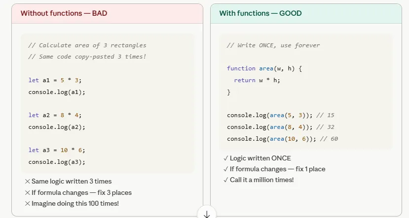

# Day 4 — JavaScript Functions

> **A function is a reusable set of instructions with a name.**

That's it. Nothing more. Let me show you what I mean:



See that? A tea machine is the perfect analogy. You put things IN — you get something OUT. The machine does the work in between. That's a function.

### Definition

A **function** is a block of organized, reusable code that performs a single action. Instead of writing the same code again and again, you wrap it inside a function and call it whenever you need it. Functions make your code **shorter**, **cleaner**, and **easier to debug**.

Now let's learn the 5 parts of every function:

---

## Lesson 1 — The 5 Parts of a Function

**5 parts. Learn them by heart:**



### Explanation

Every function in JavaScript is built from exactly 5 parts:

| # | Part | What it does |
|---|------|-------------|
| 1 | `function` | The keyword that tells JavaScript "I'm creating a function" |
| 2 | `name` | The name you give your function (e.g. `add`, `greet`, `calculateTax`) |
| 3 | `(parameters)` | The inputs your function accepts — placeholders for values you'll pass later |
| 4 | `{ body }` | The curly braces that hold your actual code — the instructions the function runs |
| 5 | `return` | Sends the final answer back to whoever called the function |

### Example

```js
function add(a, b) {
    return a + b;
}

console.log(add(3, 7)); // 10
```

Here:
- `function` — keyword
- `add` — name
- `(a, b)` — parameters
- `{ return a + b; }` — body
- `return` — sends the result back

### Practice Questions

**Q1.** Identify the 5 parts of this function:

```js
function multiply(x, y) {
    return x * y;
}
```

**Solution:**
1. `function` — keyword
2. `multiply` — name
3. `(x, y)` — parameters
4. `{ return x * y; }` — body
5. `return` — sends the product back

---

**Q2.** Write a function called `subtract` that takes two numbers and returns their difference.

**Solution:**

```js
function subtract(a, b) {
    return a - b;
}

console.log(subtract(10, 4)); // 6
```

---

## Lesson 2 — WHY Do We Need Functions?

### Definition

Without functions, you would **copy-paste** the same code every time you need it. This leads to:
- **Longer code** — harder to read
- **More bugs** — fix one place, forget another
- **No reusability** — every change must be made everywhere

Functions solve all three problems. **Write once, use everywhere.**

### The Problem Without Functions



### Example — Without Functions (Bad)

```js
// Calculating area of rectangles WITHOUT a function
let area1 = 10 * 5;
console.log("Area 1:", area1);

let area2 = 7 * 3;
console.log("Area 2:", area2);

let area3 = 12 * 8;
console.log("Area 3:", area3);
```

### Example — With Functions (Good)

```js
// Calculating area of rectangles WITH a function
function area(length, width) {
    return length * width;
}

console.log("Area 1:", area(10, 5));  // 50
console.log("Area 2:", area(7, 3));   // 21
console.log("Area 3:", area(12, 8));  // 96
```

One function. Three calls. Zero repetition.

### Practice Questions

**Q1.** You need to print "Welcome to MERN Batch!" 5 times in your program. Write a function to do it instead of repeating `console.log` 5 times.

**Solution:**

```js
function welcome() {
    console.log("Welcome to MERN Batch!");
}

welcome(); // call it as many times as needed
welcome();
welcome();
welcome();
welcome();
```

---

**Q2.** Write a function `double` that takes a number and returns it multiplied by 2. Use it 3 times with different values.

**Solution:**

```js
function double(n) {
    return n * 2;
}

console.log(double(5));   // 10
console.log(double(12));  // 24
console.log(double(100)); // 200
```

---

## Lesson 3 — The 4 Ways to Write Functions

### Definition

JavaScript gives you **4 different syntaxes** to create a function. All of them do the same thing — create reusable code — but they look different and have subtle behavior differences.

| # | Type | Syntax | When to use |
|---|------|--------|-------------|
| 1 | **Function Declaration** | `function name() {}` | The default, most common way |
| 2 | **Function Expression** | `const name = function() {}` | When you want to store a function in a variable |
| 3 | **Arrow Function** | `const name = () => {}` | Modern, shorter syntax — used heavily in React & Node |
| 4 | **Default Parameters** | `function name(x = 10) {}` | When you want fallback values for missing arguments |

### Examples of All 4 Types

**Type 1 — Function Declaration:**

```js
function greet(name) {
    return "Hello, " + name + "!";
}
console.log(greet("Alice")); // "Hello, Alice!"
```

**Type 2 — Function Expression:**

```js
const multiply = function(a, b) {
    return a * b;
};
console.log(multiply(4, 5)); // 20
```

**Type 3 — Arrow Function:**

```js
const square = (n) => n * n;
console.log(square(6)); // 36

// Multi-line arrow function:
const add = (a, b) => {
    let sum = a + b;
    return sum;
};
console.log(add(3, 7)); // 10
```

**Type 4 — Default Parameters:**

```js
function welcome(name = "Student", course = "MERN") {
    return `Hi ${name}, welcome to ${course}!`;
}
console.log(welcome());                // Hi Student, welcome to MERN!
console.log(welcome("Ali"));           // Hi Ali, welcome to MERN!
console.log(welcome("Ali", "React"));  // Hi Ali, welcome to React!
```

### Interactive Simulation

Click Run on every card. On card 4 — leave the boxes empty and press Run. Then type just your name. Watch the defaults kick in!

[Click link to open Simulation for why functions](https://ak9347128658.github.io/MERN_Batch_April_2026/day4/four_function_types_classroom.html)

### Practice Questions

**Q1.** Convert this function declaration into an arrow function:

```js
function cube(n) {
    return n * n * n;
}
```

**Solution:**

```js
const cube = (n) => n * n * n;
console.log(cube(3)); // 27
```

---

**Q2.** Write a function expression that takes a string and returns it in UPPERCASE.

**Solution:**

```js
const toUpper = function(str) {
    return str.toUpperCase();
};
console.log(toUpper("hello")); // "HELLO"
```

---

**Q3.** Write a function with default parameters that calculates the price after tax. Default tax rate should be 18%.

**Solution:**

```js
function priceAfterTax(price, taxRate = 18) {
    return price + (price * taxRate) / 100;
}

console.log(priceAfterTax(1000));      // 1180  (uses default 18%)
console.log(priceAfterTax(1000, 5));   // 1050  (uses custom 5%)
```

---

## Lesson 4 — What Does `return` Actually Do?

### Definition

`return` is a statement that **sends a value back** from inside the function to wherever the function was called. Think of it as the function's answer.

**Key rules:**
- `return` immediately **stops** the function — no code after it will run
- A function **without** `return` gives back `undefined`
- You can `return` any value: a number, string, boolean, array, object, or even another function

### Example — With and Without Return

```js
// WITH return — works correctly
function addGood(a, b) {
    return a + b;
}
console.log(addGood(3, 5)); // 8

// WITHOUT return — gives undefined
function addBad(a, b) {
    a + b;  // calculated but never sent back!
}
console.log(addBad(3, 5)); // undefined
```

### Example — Return Stops the Function

```js
function check(age) {
    if (age < 18) {
        return "Not allowed";  // function stops here
    }
    return "Welcome!";         // only runs if age >= 18
}

console.log(check(15)); // "Not allowed"
console.log(check(21)); // "Welcome!"
```

### Interactive Simulation

Press **Play animation** — watch the steps light up one by one. Change the numbers and play again. The warning at the bottom shows what happens without `return` — the #1 beginner mistake!

[Click link to open Simulation for function return](https://ak9347128658.github.io/MERN_Batch_April_2026/day4/return_statement_classroom.html)

### Practice Questions

**Q1.** What will this code print? Explain why.

```js
function mystery(x) {
    x * 2;
}
console.log(mystery(5));
```

**Solution:**
It prints `undefined`. The function calculates `x * 2` but never uses `return` to send it back. Fix: `return x * 2;`

---

**Q2.** What will this code print?

```js
function test() {
    return "Hello";
    console.log("World");
}
console.log(test());
```

**Solution:**
It prints `"Hello"` only. The `console.log("World")` never runs because `return` immediately exits the function.

---

**Q3.** Write a function `isAdult` that takes an age and returns `true` if 18 or above, `false` otherwise.

**Solution:**

```js
function isAdult(age) {
    return age >= 18;
}

console.log(isAdult(20)); // true
console.log(isAdult(15)); // false
```

---

## Lesson 5 — Real World Examples (Live Lab)

### Definition

The best way to understand functions is to **use them in real scenarios**. Functions are used everywhere in real projects — calculating totals in a shopping cart, validating form inputs, formatting dates, making API calls, and much more.

### Interactive Simulation

Work through all 5 tabs — especially **"Write your own"** where you type a function yourself from scratch. That's how you really learn.

[Click link to open Simulation for Real world examples](https://ak9347128658.github.io/MERN_Batch_April_2026/day4/functions_real_world_lab.html)

### Practice Questions

**Q1.** Write a function `celsiusToFahrenheit` that converts temperature from Celsius to Fahrenheit. Formula: `F = (C * 9/5) + 32`

**Solution:**

```js
function celsiusToFahrenheit(celsius) {
    return (celsius * 9 / 5) + 32;
}

console.log(celsiusToFahrenheit(0));    // 32
console.log(celsiusToFahrenheit(100));  // 212
console.log(celsiusToFahrenheit(37));   // 98.6
```

---

**Q2.** Write an arrow function `getFullName` that takes `firstName` and `lastName` and returns the full name.

**Solution:**

```js
const getFullName = (firstName, lastName) => firstName + " " + lastName;

console.log(getFullName("Amit", "Kumar")); // "Amit Kumar"
```

---

**Q3.** Write a function `calculateBMI` that takes weight (kg) and height (meters) and returns the BMI. Formula: `BMI = weight / (height * height)`

**Solution:**

```js
function calculateBMI(weight, height) {
    return weight / (height * height);
}

console.log(calculateBMI(70, 1.75));  // 22.86 (approx)
console.log(calculateBMI(90, 1.80));  // 27.78 (approx)
```

---

## Lesson 6 — Parameters vs Arguments

### Definition

These two words confuse almost everyone. Here's the simple rule:

- **Parameter** = the **placeholder name** in the function definition (like a blank form field)
- **Argument** = the **actual value** you pass when calling the function (like filling in that field)

### Example

```js
//              parameters ↓
function add(a, b) {
    return a + b;
}

//         arguments ↓
add(3, 5);
```

- `a` and `b` are **parameters** — they don't have values yet
- `3` and `5` are **arguments** — the real values passed in

### Practice Questions

**Q1.** In the following code, identify the parameters and arguments:

```js
function greet(name, greeting) {
    return greeting + ", " + name + "!";
}

greet("Sara", "Good morning");
```

**Solution:**
- **Parameters:** `name`, `greeting` (in the function definition)
- **Arguments:** `"Sara"`, `"Good morning"` (in the function call)

---

## Lesson 7 — Scope

### Definition

**Scope** determines **where a variable is visible** (accessible) in your code. JavaScript has two main types of scope:

| Scope | Where declared | Where accessible |
|-------|---------------|-----------------|
| **Global** | Outside any function | Everywhere in your code |
| **Local** | Inside a function | Only inside that function |

### Example

```js
let x = 10;              // global — visible everywhere

function test() {
    let y = 20;          // local — only inside test()
    console.log(x);      // 10 — can see global x
    console.log(y);      // 20 — can see local y
}

test();
console.log(x);          // 10 — works fine
console.log(y);          // ReferenceError! y is not defined
```

### Why Does Scope Matter?

- It **protects** variables from being accidentally changed by other parts of your code
- It **prevents naming conflicts** — two functions can each have their own variable called `i`
- It keeps your code **organized and predictable**

### Practice Questions

**Q1.** What will this code print?

```js
let color = "red";

function paint() {
    let color = "blue";
    console.log(color);
}

paint();
console.log(color);
```

**Solution:**
```
blue
red
```
Inside `paint()`, the local `color` is `"blue"`. Outside, the global `color` is still `"red"`. The local variable does not change the global one.

---

**Q2.** Will this code work? Why or why not?

```js
function setAge() {
    let age = 25;
}

setAge();
console.log(age);
```

**Solution:**
No, it will throw a `ReferenceError`. The variable `age` is declared inside `setAge()` — it is **local** to that function and cannot be accessed outside.

---

## The Complete Notes — Everything in One Place

```js
// ════════════════════════════════════════════
//  WHAT IS A FUNCTION?
//  A reusable block of code with a name.
//  Write once → use a thousand times.
// ════════════════════════════════════════════


// ─── WAY 1: Function Declaration ────────────
function greet(name) {
    return "Hello, " + name + "!";
}
greet("Alice");   // "Hello, Alice!"
greet("Bob");     // "Hello, Bob!"


// ─── WAY 2: Function Expression ─────────────
const multiply = function(a, b) {
    return a * b;
};
multiply(4, 5);   // 20


// ─── WAY 3: Arrow Function ──────────────────
const square = (n) => n * n;   // one line!
square(6);        // 36

// Multi-line arrow function:
const add = (a, b) => {
    let sum = a + b;
    return sum;
};


// ─── WAY 4: Default Parameters ──────────────
function welcome(name = "Student", course = "MERN") {
    return `Hi ${name}, welcome to ${course}!`;
}
welcome();           // Hi Student, welcome to MERN!
welcome("Ali");      // Hi Ali, welcome to MERN!
welcome("Ali","React"); // Hi Ali, welcome to React!


// ─── PARAMETERS vs ARGUMENTS ────────────────
//  parameter = placeholder in the definition
//  argument  = real value when you call it
function add(a, b) { ... }  // a, b → parameters
add(3, 5);                  // 3, 5 → arguments


// ─── RETURN ──────────────────────────────────
// return sends a value back to the caller
// without return → function gives undefined
function addGood(a, b) { return a + b; }  // ✓
function addBad(a, b)  { a + b; }         // ✗ gives undefined


// ─── SCOPE ───────────────────────────────────
let x = 10;              // global — visible everywhere

function test() {
    let y = 20;          // local — only inside test()
    console.log(x);      // ✓ can see global x
    console.log(y);      // ✓ can see local y
}

console.log(x);          // ✓
console.log(y);          // ✗ ReferenceError!
```

---

## Class Summary — What You Learned Today

| Concept | One-line summary |
|---|---|
| Function | Reusable code with a name |
| Declaration | `function name() {}` — most common |
| Expression | `const fn = function() {}` |
| Arrow | `const fn = () => {}` — used in React/Node |
| Parameter | Input placeholder in definition |
| Argument | Real value passed when calling |
| Return | Sends a value back out |
| Scope | Where a variable is visible |
| Default params | `function f(x = 10)` — fallback value |

---

## Homework — Write These 5 Functions Yourself

Open your browser console and type each one. **Don't copy-paste — type it manually.** That's how your brain remembers.

```js
// 1. Greet someone
function greet(name) {
    return "Hello, " + name + "!";
}
console.log(greet("Your Name"));

// 2. Check if a number is even
const isEven = (n) => n % 2 === 0;
console.log(isEven(4));   // true
console.log(isEven(7));   // false

// 3. Find the bigger number
function max(a, b) {
    return a > b ? a : b;
}
console.log(max(10, 25));  // 25

// 4. Calculate simple interest
function simpleInterest(p, r, t) {
    return (p * r * t) / 100;
}
console.log(simpleInterest(1000, 5, 2));  // 100

// 5. Arrow — convert kg to grams
const toGrams = (kg) => kg * 1000;
console.log(toGrams(2.5));  // 2500
```
