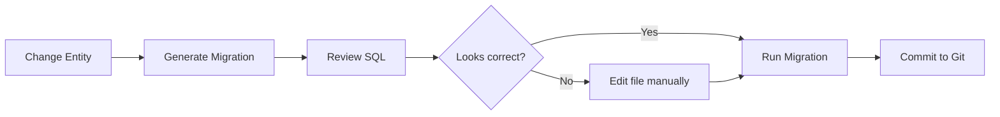
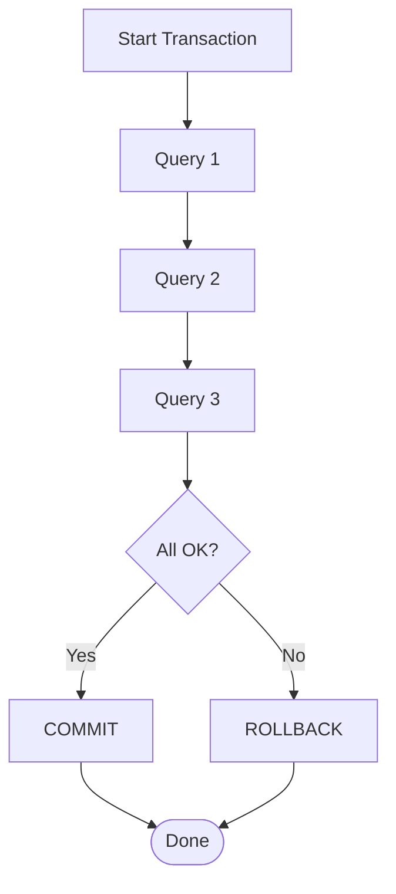
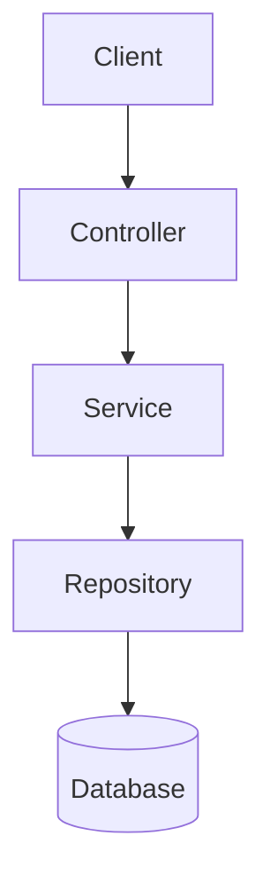

# 📅 Day 4: Advanced TypeORM + Real Mini Project

Hello students 👋

Welcome to the **final day** of our TypeORM series! You've already come so far:

- Day 1: Setup + Entities
- Day 2: CRUD + Repositories
- Day 3: Relationships

Today we go pro. We'll learn **QueryBuilder**, **Migrations**, and **Transactions** — then apply everything in a **real mini project**: a User + Order system with clean architecture.

After today, you'll be able to build **production-grade** backends with TypeORM. 💼

Let's finish strong! 🚀

---

## 1. 🎯 Introduction — What Will We Learn Today?

Today's agenda:

1. **QueryBuilder** — for complex, dynamic queries
2. **Migrations** — professional way to evolve DB schema
3. **Transactions** — safe multi-step operations
4. **Clean architecture** — Entity → Repository → Service → Controller
5. **Mini Project** — User + Order system with Express

Small question 🤔:
> If `find()` and `save()` already work, why do we need QueryBuilder?

Answer: because real apps have queries `find()` **can't** express easily — like `GROUP BY`, complex `JOIN`s, subqueries, dynamic filters. Let's see!

---

## 2. 🔨 QueryBuilder — The Power Tool

Think of `QueryBuilder` as the **power tool** 🛠️ in your TypeORM toolbox. Use it when simple finders aren't enough.

### 2.1 Basic Syntax

```ts id="qbbasic"
const users = await userRepo
  .createQueryBuilder("u")
  .where("u.age > :minAge", { minAge: 18 })
  .orderBy("u.name", "ASC")
  .take(10)
  .getMany();
```

- `"u"` is an **alias** — like a short nickname for the table
- `:minAge` is a **parameter** — prevents SQL injection ✅

### 2.2 Select Specific Columns

```ts id="qbselect"
const names = await userRepo
  .createQueryBuilder("u")
  .select(["u.id", "u.name"])
  .where("u.isActive = :active", { active: true })
  .getMany();
```

### 2.3 Joins

```ts id="qbjoin"
const usersWithOrders = await userRepo
  .createQueryBuilder("u")
  .leftJoinAndSelect("u.orders", "o")
  .where("o.total > :min", { min: 500 })
  .getMany();
```

**SQL generated:**
```sql id="qbjoinsql"
SELECT u.*, o.*
FROM "user" u
LEFT JOIN "order" o ON o."userId" = u.id
WHERE o.total > 500;
```

### 2.4 Aggregations (GROUP BY, COUNT, SUM)

```ts id="qbaggregate"
const stats = await orderRepo
  .createQueryBuilder("o")
  .select("o.userId", "userId")
  .addSelect("COUNT(o.id)", "orderCount")
  .addSelect("SUM(o.total)", "totalSpent")
  .groupBy("o.userId")
  .getRawMany();
```

Output example:
```json id="qbaggregateresult"
[
  { "userId": 1, "orderCount": "5", "totalSpent": "2499.50" },
  { "userId": 2, "orderCount": "2", "totalSpent": "199.00" }
]
```

### 2.5 Dynamic Filters (Super Useful!)

```ts id="qbdynamic"
async function searchUsers(filters: {
  name?: string;
  minAge?: number;
  isActive?: boolean;
}) {
  const qb = userRepo.createQueryBuilder("u");

  if (filters.name) {
    qb.andWhere("u.name ILIKE :name", { name: `%${filters.name}%` });
  }
  if (filters.minAge !== undefined) {
    qb.andWhere("u.age >= :age", { age: filters.minAge });
  }
  if (filters.isActive !== undefined) {
    qb.andWhere("u.isActive = :active", { active: filters.isActive });
  }

  return qb.orderBy("u.id", "DESC").getMany();
}
```

This is how real search/filter APIs are built. 💡

### 2.6 Insert & Update via QueryBuilder

```ts id="qbinsertupdate"
// INSERT many rows fast
await AppDataSource
  .createQueryBuilder()
  .insert()
  .into(User)
  .values([
    { name: "A", email: "a@x.com", age: 20 },
    { name: "B", email: "b@x.com", age: 21 },
  ])
  .execute();

// Bulk UPDATE
await AppDataSource
  .createQueryBuilder()
  .update(User)
  .set({ isActive: false })
  .where("age < :age", { age: 18 })
  .execute();
```

---

## 3. 🧬 Migrations — Professional Schema Evolution

### 3.1 Why Migrations?

Remember `synchronize: true`? It's dangerous in production because:

- It can **drop columns** without warning
- It doesn't handle complex changes (renames, data conversions)
- No history of schema changes

**Migrations** are the solution. They are **versioned scripts** that tell the DB exactly how to change.

Real-world analogy 📚:
Migrations are like a **diary** of all changes to your database. Every entry says: "On this date, we did this change."

### 3.2 Configure DataSource for Migrations

```ts id="datasourcemigrations"
// src/data-source.ts
import "reflect-metadata";
import { DataSource } from "typeorm";
import { User } from "./entity/User";
import { Order } from "./entity/Order";

export const AppDataSource = new DataSource({
  type: "postgres",
  host: "localhost",
  port: 5432,
  username: "postgres",
  password: "password",
  database: "typeorm_day4",
  synchronize: false,   // 🔴 disabled — we use migrations now
  logging: true,
  entities: [User, Order],
  migrations: ["src/migration/*.ts"],
});
```

### 3.3 Generate a Migration

Add these scripts to `package.json`:

```json id="migrationscripts"
{
  "scripts": {
    "typeorm": "typeorm-ts-node-commonjs -d src/data-source.ts",
    "migration:generate": "npm run typeorm -- migration:generate",
    "migration:run": "npm run typeorm -- migration:run",
    "migration:revert": "npm run typeorm -- migration:revert"
  }
}
```

Now generate a migration:

```bash id="generatemigration"
npm run migration:generate src/migration/InitialSchema
```

TypeORM will **compare your entities with the actual DB** and create a file like:

```ts id="migrationfile"
import { MigrationInterface, QueryRunner } from "typeorm";

export class InitialSchema1713456789000 implements MigrationInterface {
  public async up(queryRunner: QueryRunner): Promise<void> {
    await queryRunner.query(`
      CREATE TABLE "user" (
        "id" SERIAL PRIMARY KEY,
        "name" VARCHAR NOT NULL,
        "email" VARCHAR NOT NULL UNIQUE
      )
    `);
  }

  public async down(queryRunner: QueryRunner): Promise<void> {
    await queryRunner.query(`DROP TABLE "user"`);
  }
}
```

### 3.4 Run and Revert

```bash id="runmigration"
npm run migration:run      # applies pending migrations
npm run migration:revert   # reverts the last migration
```

### 3.5 Migration Workflow



> 💡 **Golden rule:** **Always review** generated migrations before running them in production.

---

## 4. 🔒 Transactions — All or Nothing

### 4.1 Why Transactions?

Imagine a **bank transfer** 🏦:
1. Deduct $100 from A's account
2. Add $100 to B's account

What if step 1 succeeds but step 2 fails? Money vanishes! 😱

A **transaction** ensures both steps succeed, or **neither** does. This is called **atomicity**.

### 4.2 Transaction with `DataSource.transaction()`

```ts id="transactionbasic"
await AppDataSource.transaction(async (manager) => {
  const accountA = await manager.findOneBy(Account, { id: 1 });
  const accountB = await manager.findOneBy(Account, { id: 2 });

  accountA!.balance -= 100;
  accountB!.balance += 100;

  await manager.save(accountA!);
  await manager.save(accountB!);
});
```

If any line throws, **everything rolls back**. Magic ✨.

### 4.3 Transaction with QueryRunner (More Control)

```ts id="transactionrunner"
const runner = AppDataSource.createQueryRunner();
await runner.connect();
await runner.startTransaction();

try {
  await runner.manager.save(order);
  await runner.manager.decrement(Product, { id: productId }, "stock", 1);
  await runner.commitTransaction();
} catch (err) {
  await runner.rollbackTransaction();
  throw err;
} finally {
  await runner.release();
}
```

Use this style when you need **fine control** (savepoints, error handling per step).

### 4.4 Transaction Flow



---

## 5. 🏛️ Clean Architecture

Professional backends separate concerns into **layers**:



| Layer | Responsibility |
|-------|----------------|
| **Controller** | HTTP — parse request, send response |
| **Service** | Business logic — validate, compute, orchestrate |
| **Repository** | Data access — talk to the DB |
| **Entity** | Shape of the data |

Why? **Separation of concerns** = easier tests, easier changes, cleaner code.

---

## 6. 🚀 MINI PROJECT — User + Order API

Let's build it step by step.

### 6.1 Folder Structure

```
user-order-api/
├── src/
│   ├── entity/
│   │   ├── User.ts
│   │   └── Order.ts
│   ├── service/
│   │   ├── UserService.ts
│   │   └── OrderService.ts
│   ├── controller/
│   │   ├── UserController.ts
│   │   └── OrderController.ts
│   ├── migration/
│   ├── data-source.ts
│   └── index.ts
├── tsconfig.json
└── package.json
```

### 6.2 Install Express

```bash id="installexpress"
npm install express
npm install -D @types/express
```

### 6.3 Entities

```ts id="projectuserentity"
// src/entity/User.ts
import {
  Entity,
  PrimaryGeneratedColumn,
  Column,
  OneToMany,
  CreateDateColumn,
} from "typeorm";
import { Order } from "./Order";

@Entity()
export class User {
  @PrimaryGeneratedColumn()
  id: number;

  @Column({ length: 100 })
  name: string;

  @Column({ unique: true })
  email: string;

  @CreateDateColumn()
  createdAt: Date;

  @OneToMany(() => Order, (order) => order.user)
  orders: Order[];
}
```

```ts id="projectorderentity"
// src/entity/Order.ts
import {
  Entity,
  PrimaryGeneratedColumn,
  Column,
  ManyToOne,
  CreateDateColumn,
} from "typeorm";
import { User } from "./User";

@Entity()
export class Order {
  @PrimaryGeneratedColumn()
  id: number;

  @Column()
  product: string;

  @Column("decimal", { precision: 10, scale: 2 })
  total: number;

  @Column({ default: "pending" })
  status: "pending" | "paid" | "cancelled";

  @CreateDateColumn()
  createdAt: Date;

  @ManyToOne(() => User, (user) => user.orders, { onDelete: "CASCADE" })
  user: User;
}
```

### 6.4 Services (Business Logic)

```ts id="projectuserservice"
// src/service/UserService.ts
import { AppDataSource } from "../data-source";
import { User } from "../entity/User";

const repo = () => AppDataSource.getRepository(User);

export const UserService = {
  create: async (data: { name: string; email: string }) => {
    const existing = await repo().findOneBy({ email: data.email });
    if (existing) throw new Error("Email already in use");
    return repo().save(repo().create(data));
  },

  list: () => repo().find({ relations: ["orders"] }),

  findById: (id: number) =>
    repo().findOne({ where: { id }, relations: ["orders"] }),

  remove: (id: number) => repo().delete({ id }),
};
```

```ts id="projectorderservice"
// src/service/OrderService.ts
import { AppDataSource } from "../data-source";
import { Order } from "../entity/Order";
import { User } from "../entity/User";

export const OrderService = {
  place: async (userId: number, product: string, total: number) => {
    return AppDataSource.transaction(async (manager) => {
      const user = await manager.findOneBy(User, { id: userId });
      if (!user) throw new Error("User not found");

      const order = manager.create(Order, {
        product,
        total,
        user,
      });
      return manager.save(order);
    });
  },

  cancel: async (id: number) => {
    const repo = AppDataSource.getRepository(Order);
    const result = await repo.update({ id }, { status: "cancelled" });
    if (result.affected === 0) throw new Error("Order not found");
  },

  report: async () => {
    return AppDataSource.getRepository(Order)
      .createQueryBuilder("o")
      .select("o.userId", "userId")
      .addSelect("COUNT(o.id)", "orders")
      .addSelect("SUM(o.total)", "spent")
      .groupBy("o.userId")
      .getRawMany();
  },
};
```

### 6.5 Controllers (HTTP Layer)

```ts id="projectusercontroller"
// src/controller/UserController.ts
import { Router } from "express";
import { UserService } from "../service/UserService";

export const userRouter = Router();

userRouter.post("/", async (req, res) => {
  try {
    const user = await UserService.create(req.body);
    res.status(201).json(user);
  } catch (err: any) {
    res.status(400).json({ error: err.message });
  }
});

userRouter.get("/", async (_req, res) => {
  res.json(await UserService.list());
});

userRouter.get("/:id", async (req, res) => {
  const user = await UserService.findById(Number(req.params.id));
  if (!user) return res.status(404).json({ error: "Not found" });
  res.json(user);
});

userRouter.delete("/:id", async (req, res) => {
  await UserService.remove(Number(req.params.id));
  res.status(204).send();
});
```

```ts id="projectordercontroller"
// src/controller/OrderController.ts
import { Router } from "express";
import { OrderService } from "../service/OrderService";

export const orderRouter = Router();

orderRouter.post("/", async (req, res) => {
  try {
    const { userId, product, total } = req.body;
    const order = await OrderService.place(userId, product, total);
    res.status(201).json(order);
  } catch (err: any) {
    res.status(400).json({ error: err.message });
  }
});

orderRouter.post("/:id/cancel", async (req, res) => {
  try {
    await OrderService.cancel(Number(req.params.id));
    res.json({ ok: true });
  } catch (err: any) {
    res.status(404).json({ error: err.message });
  }
});

orderRouter.get("/report", async (_req, res) => {
  res.json(await OrderService.report());
});
```

### 6.6 Main App

```ts id="projectindex"
// src/index.ts
import "reflect-metadata";
import express from "express";
import { AppDataSource } from "./data-source";
import { userRouter } from "./controller/UserController";
import { orderRouter } from "./controller/OrderController";

async function bootstrap() {
  await AppDataSource.initialize();
  console.log("✅ DB connected");

  const app = express();
  app.use(express.json());

  app.use("/users", userRouter);
  app.use("/orders", orderRouter);

  app.listen(3000, () => console.log("🚀 Server on http://localhost:3000"));
}

bootstrap().catch(console.error);
```

### 6.7 Testing the API

```bash id="testingapi"
# Create a user
curl -X POST http://localhost:3000/users \
  -H "Content-Type: application/json" \
  -d '{"name":"Ali","email":"ali@mail.com"}'

# Place an order
curl -X POST http://localhost:3000/orders \
  -H "Content-Type: application/json" \
  -d '{"userId":1,"product":"Laptop","total":1299.99}'

# Get user with orders
curl http://localhost:3000/users/1

# Aggregated report
curl http://localhost:3000/orders/report
```

🎉 **Congratulations!** You just built a real backend API with layered architecture, transactions, and TypeORM.

---

## 7. 🧪 Hands-on Practice

Extend the mini project with these 5 tasks:

1. **Exercise 1:** Add a `Product` entity. Change `Order` to reference `Product` (N:1) instead of a string.
2. **Exercise 2:** Add a `Category` entity with Many-to-Many on `Product`.
3. **Exercise 3:** Implement search: `GET /users?q=ali&minAge=20` using QueryBuilder with dynamic filters.
4. **Exercise 4:** Add pagination: `GET /orders?page=2&limit=10`.
5. **Exercise 5:** Generate and run a migration when you add a new `phone` column to `User`.

---

## 8. ⚠️ Common Mistakes

1. **Using `synchronize: true` in production**
   - ✅ Fix: Always use migrations in production.

2. **Forgetting to await `AppDataSource.initialize()`**
   - App starts before DB is ready → first request crashes.
   - ✅ Fix: Await initialization **before** starting Express.

3. **Not wrapping multi-step writes in a transaction**
   - Partial writes create data inconsistency.
   - ✅ Fix: Use `AppDataSource.transaction()` for any 2+ related writes.

4. **String concatenation in QueryBuilder `where()`**
   - ❌ `.where("name = '" + req.query.name + "'")` → SQL injection!
   - ✅ Fix: Always use `:params` syntax.

5. **Exposing entities directly in HTTP responses**
   - Leaks internal fields (e.g., `password`).
   - ✅ Fix: Map to DTOs (Data Transfer Objects) before responding.

---

## 9. 📝 Final Assignment — Full Mini Project

Build a **Bookstore API** combining everything you've learned:

**Entities:**
- `Author` (id, name, bio)
- `Book` (id, title, price, stock, publishedAt, `author`: Many-to-One)
- `Customer` (id, name, email, `profile`: One-to-One `CustomerProfile`)
- `CustomerProfile` (id, address, phone)
- `Purchase` (id, `customer`: Many-to-One, `book`: Many-to-One, quantity, totalPrice, createdAt)

**Required Endpoints:**

| Method | Path | Purpose |
|--------|------|---------|
| POST | /authors | Create author |
| POST | /books | Create book (with author) |
| POST | /customers | Register customer with profile (use cascade) |
| POST | /purchases | **Transaction:** deduct stock + create purchase + fail if stock < qty |
| GET | /books/search?q=&minPrice=&maxPrice= | Dynamic QueryBuilder search |
| GET | /reports/top-customers | Top 5 customers by total spend |
| GET | /books/:id | Book with author and purchase count |

**Requirements:**
- ✅ Clean architecture (entity/service/controller)
- ✅ At least one migration
- ✅ Transactions for purchases
- ✅ QueryBuilder for the reports endpoint

💡 **Stretch goal:** Add JWT authentication for customers.

---

## 10. 🔁 Recap — Your TypeORM Journey

### Today

- ✅ **QueryBuilder** — complex queries, joins, aggregates, dynamic filters
- ✅ **Migrations** — safe, versioned schema changes for production
- ✅ **Transactions** — atomic multi-step writes
- ✅ **Clean architecture** — entity → repository → service → controller
- ✅ Built a real **User + Order API**

### Entire Series

| Day | Topic |
|-----|-------|
| 1 | ORM concept + setup + first entity |
| 2 | CRUD + Repositories |
| 3 | Relationships (1:1, 1:N, N:M) |
| 4 | QueryBuilder + Migrations + Transactions + Real Project |

### You Can Now

- 🧠 Understand **why** ORMs exist and when to use them
- 🏗️ Design **relational schemas** cleanly
- 🔍 Write **complex queries** safely
- 🚢 Ship **production-ready** TypeORM backends

---

## 🎓 Final Words

Students, you did it! 🎉

From "What is ORM?" on Day 1 to building a clean, transactional backend with migrations on Day 4 — that's a huge leap in **just four sessions**.

Now go build something real. Pick a tiny idea — a todo app, a blog, a mini e-commerce — and ship it using what you've learned. The only way to truly master TypeORM is by **using it on your own projects**.

Keep these tips close:
1. 📖 **Read the SQL** TypeORM generates (keep `logging: true` in dev)
2. 🧪 **Test** every endpoint
3. 🌱 **Use migrations** from day one on any real project
4. 🔒 **Wrap** related writes in transactions
5. ❤️ **Have fun** learning

Thank you for showing up every day. I'm proud of you. 🙌

Happy coding! 👨‍💻👩‍💻

— Your Instructor 👋
