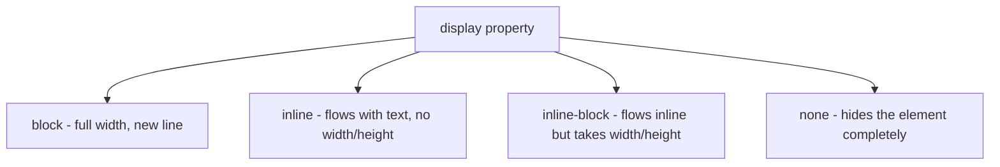
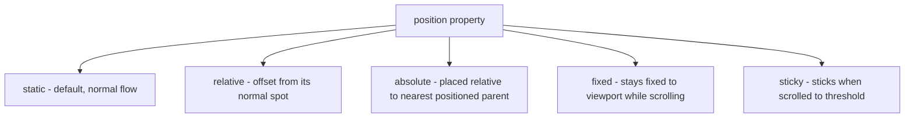
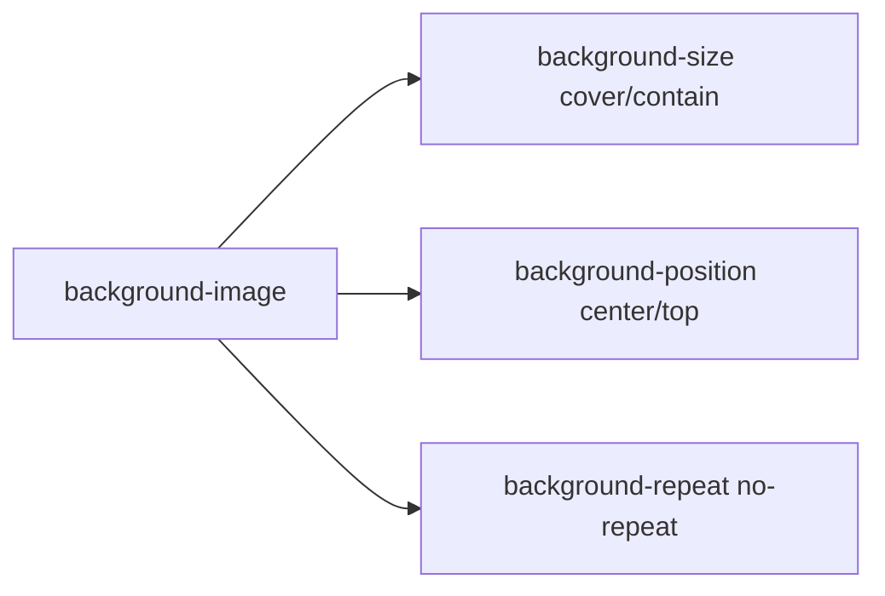

# 📘 Day 4: Backgrounds, Display & Position

Hello students 👋

Welcome to **Day 4**! By now you know how to write CSS, style text, and control boxes. Today we'll learn how to:

- Add **beautiful backgrounds** (colors + images).
- Control how elements appear using **display**.
- **Position** elements anywhere on the screen using **position**.

These are the tools that transform a plain layout into a **stunning webpage**. 🔥

---

## 1. Introduction

### What will we learn today?

- `background-color`, `background-image`
- `background-size`: `cover` vs `contain`
- `background-position`, `background-repeat`
- `display`: `block`, `inline`, `inline-block`, `none`
- `position`: `static`, `relative`, `absolute`, `fixed`, `sticky`
- `z-index`

### Why is this important?

- **Backgrounds** give your page personality (think hero banners).
- **Display** controls how elements flow on the page.
- **Position** lets you place things anywhere (headers, modals, floating buttons).

---

## 2. Concept Explanation

### Display

Every HTML element has a default display behavior:

- `<div>`, `<p>`, `<h1>` → **block** (takes full width, new line).
- `<span>`, `<a>`, `<strong>` → **inline** (flows with text).

We can **change** this using `display`.

### Position

By default, elements sit where they naturally appear. But sometimes you want to **move** an element somewhere specific — like a "New!" badge on a card, or a sticky navbar.

That's where **position** comes in.

---

## 3. 💡 Visual Learning

### Display Types



### Position Types



### Background Image Flow



---

## 4. Syntax + Code Examples

### Backgrounds

```css
.hero {
  background-color: #333;
  background-image: url('hero.jpg');
  background-size: cover;         /* fills the entire box */
  background-position: center;    /* centers the image */
  background-repeat: no-repeat;   /* don't tile it */
  height: 400px;
  color: white;
}
```

Shorthand:
```css
.hero {
  background: #333 url('hero.jpg') center/cover no-repeat;
}
```

**`cover` vs `contain`:**
- `cover` → image fills the box entirely (may crop edges).
- `contain` → image fits fully inside (may leave empty space).

---

### Display

```css
.block-el   { display: block; }
.inline-el  { display: inline; }
.ib-el      { display: inline-block; }
.hidden     { display: none; }
```

#### block
Takes full width, starts on a new line.
```css
div { display: block; }   /* default */
```

#### inline
Flows with text. **Cannot** set width/height.
```css
span { display: inline; }
```

#### inline-block
Flows inline BUT you **can** set width/height.
```css
.btn {
  display: inline-block;
  width: 120px;
  height: 40px;
}
```

#### none
Completely removes the element (doesn't take space).
```css
.modal.hidden { display: none; }
```

---

### Position

#### static (default)
Normal flow. Can't use `top`, `left`, etc.

#### relative
Moves element from its **original position**. Still takes its original space.
```css
.box {
  position: relative;
  top: 20px;
  left: 30px;
}
```

#### absolute
Taken out of normal flow. Positioned relative to the **nearest positioned ancestor** (or the page if none).
```css
.parent { position: relative; }

.badge {
  position: absolute;
  top: 10px;
  right: 10px;
}
```

#### fixed
Stays fixed to the **viewport** while scrolling.
```css
.navbar {
  position: fixed;
  top: 0;
  left: 0;
  width: 100%;
}
```

#### sticky
Scrolls normally until it hits a threshold, then sticks.
```css
.header {
  position: sticky;
  top: 0;
}
```

### z-index
Controls which element appears on top (only works on positioned elements).

```css
.modal { position: fixed; z-index: 999; }
.overlay { position: fixed; z-index: 998; }
```

Higher number = on top.

---

### Full Working Example (Hero Banner)

**File: `index.html`**
```html
<!DOCTYPE html>
<html>
  <head>
    <title>Day 4 - Hero Banner</title>
    <link rel="stylesheet" href="style.css" />
  </head>
  <body>
    <nav class="navbar">
      <span class="logo">🚀 MySite</span>
      <a href="#">Home</a>
      <a href="#">About</a>
      <a href="#">Contact</a>
    </nav>

    <section class="hero">
      <div class="hero-content">
        <h1>Welcome to the Future</h1>
        <p>Build amazing websites with CSS.</p>
        <button>Get Started</button>
      </div>
      <span class="badge">NEW</span>
    </section>
  </body>
</html>
```

**File: `style.css`**
```css
* {
  box-sizing: border-box;
  margin: 0;
  padding: 0;
}

body {
  font-family: Arial, sans-serif;
}

.navbar {
  position: fixed;
  top: 0;
  left: 0;
  width: 100%;
  background: #222;
  color: white;
  padding: 15px 30px;
  z-index: 100;
}

.navbar a {
  color: white;
  text-decoration: none;
  margin-left: 20px;
}

.logo {
  font-weight: bold;
  font-size: 18px;
}

.hero {
  position: relative;        /* so badge can be absolute inside */
  height: 100vh;
  background: linear-gradient(rgba(0,0,0,0.5), rgba(0,0,0,0.5)),
              url('https://picsum.photos/1600/900') center/cover no-repeat;
  color: white;
  display: flex;
  align-items: center;
  justify-content: center;
  text-align: center;
}

.hero-content h1 {
  font-size: 3rem;
  margin-bottom: 20px;
}

.hero-content button {
  padding: 12px 30px;
  background: #ff5722;
  color: white;
  border: none;
  border-radius: 6px;
  cursor: pointer;
  font-size: 16px;
}

.badge {
  position: absolute;
  top: 80px;
  right: 30px;
  background: red;
  color: white;
  padding: 5px 10px;
  border-radius: 4px;
  font-weight: bold;
}
```

---

### Wrong vs Correct

❌ **Wrong:**
```css
.badge {
  position: absolute;
  top: 10px;
  right: 10px;
}
/* Parent has no position — badge floats to the whole page! */
```

✅ **Correct:**
```css
.parent { position: relative; }
.badge {
  position: absolute;
  top: 10px;
  right: 10px;
}
```

---

## 5. Live Output Explanation

When you open the hero example:

- The **navbar** stays fixed at the top even when you scroll.
- The **hero section** fills the entire screen (`100vh`) with a dark-tinted background image.
- The **"NEW" badge** is placed in the top-right corner of the hero — not the page.
- A heading, description, and call-to-action button are **centered** in the hero.

💡 **DevTools Tip:** Toggle `display: none` on an element in DevTools to see how the layout changes.

---

## 6. 🧪 Hands-on Practice

1. **Task 1:** Create a box with `background-image` and `background-size: cover`.
2. **Task 2:** Convert a `<div>` from `display: block` to `inline-block` and place 3 side-by-side.
3. **Task 3:** Make a **sticky** header that stays on top when you scroll.
4. **Task 4:** Place a **"Sale"** badge in the top-right corner of a card using `position: absolute`.
5. **Task 5:** Use `z-index` to make a modal overlay appear above everything else.

---

## 7. ⚠️ Common Mistakes

| Mistake | Fix |
|---------|-----|
| `position: absolute` on a child without `position: relative` on parent | Always set the parent's position |
| Using `display: none` when you want `visibility: hidden` | `none` removes from layout, `visibility: hidden` keeps the space |
| Setting width/height on `display: inline` | Use `inline-block` or `block` |
| Forgetting `background-repeat: no-repeat` | Image will tile across the box |
| `z-index` not working | Element must have `position` set (not static) |
| Fixed navbar hides content | Add `padding-top` equal to navbar height to body |

---

## 8. 📝 Mini Assignment

**Build a Hero Banner Section** 🎬

Create a landing page hero with:

- A **fixed navbar** (logo + 3 links).
- A **full-screen hero** (`100vh`) with a background image + dark overlay.
- Centered **heading**, **subtitle**, and **CTA button**.
- A **floating badge** ("NEW") in the top-right corner of the hero.

✅ Requirements:
- Use `position: fixed` for navbar.
- Use `background-size: cover`.
- Use `position: absolute` for the badge.
- Use `z-index` so the navbar stays on top.

---

## 9. 🔁 Recap

Today we learned:

- ✅ **Backgrounds:** color, image, size (`cover`, `contain`), position, repeat.
- ✅ **Display:** `block`, `inline`, `inline-block`, `none`.
- ✅ **Position:** `static`, `relative`, `absolute`, `fixed`, `sticky`.
- ✅ `absolute` is relative to the **nearest positioned ancestor**.
- ✅ `z-index` controls stacking order (only works on positioned elements).

💡 **VS Code Tip:** Press `Ctrl + /` to comment/uncomment CSS lines quickly.
💡 **DevTools Tip:** Use the "Computed" tab to see the final values of all CSS properties after cascading.

Next up: **Day 5 — Flexbox** — the **most important layout tool in modern CSS**! Don't miss it. 💪

See you tomorrow! 🚀
