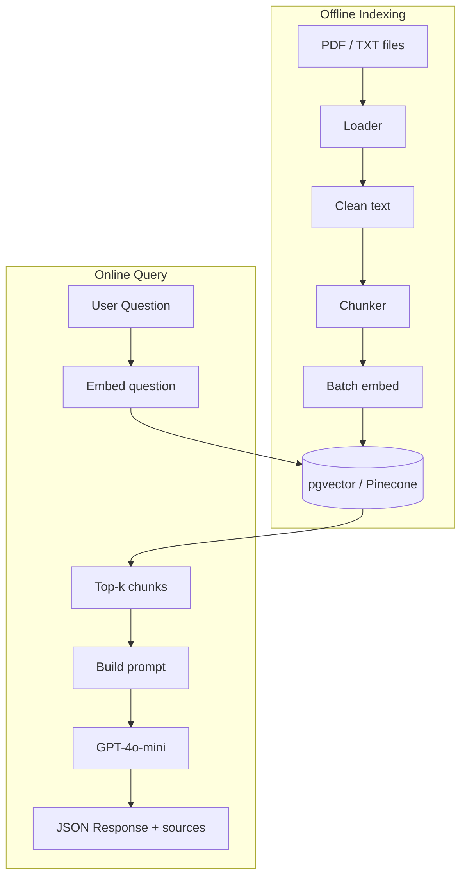
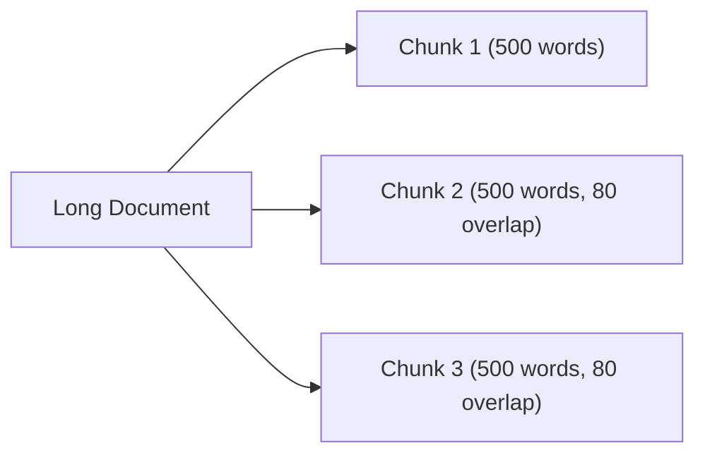

# 📅 Day 4 — Build RAG in JavaScript / TypeScript (Production-Style)

Hello students 👋

Welcome to **Day 4**! Yesterday we understood RAG with an in-memory demo. Today we **build the real thing**: load PDFs, chunk properly, create embeddings, store them in a **real vector database**, retrieve top-k, inject context, and return a clean JSON answer. This is the **exact architecture used by most AI startups**. 🏗️

---

## 1. Introduction

### 🎯 What we learn today?
- Load **PDF** and text documents in Node.js
- Smart chunking strategies (fixed, sentence-based, paragraph-based)
- Create embeddings in **batches**
- Store in a vector DB — we'll use **Supabase + pgvector** (free tier) and also show a **local file** fallback
- Retrieve **top-k** relevant chunks
- Inject context into the prompt safely
- Return a **production-grade JSON** with sources
- 💻 Mini project: **Company Policy Assistant**

### 🌍 Why it matters
Every serious "Chat with your docs" product (Notion AI, Glean, Mendable, private ChatGPTs) uses exactly the pipeline we build today. After this, you can sell RAG services. 💼

---

## 2. Concept Explanation

### 📂 Loading documents
Sources: PDFs, `.txt`, `.md`, Word docs, web pages, SQL tables. For Node.js we'll use `pdf-parse` for PDFs.

### 🔪 Chunking strategies

| Strategy | When to use | Pros | Cons |
|----------|-------------|------|------|
| Fixed-size (tokens/words) | Uniform text | Simple, predictable | May cut sentences |
| Sentence-based | Articles, books | Natural boundaries | Variable sizes |
| Paragraph-based | Policies, docs | Semantic units | Long paragraphs hurt |
| Recursive (split on `\n\n` → `\n` → `.`) | General purpose | Best of both | More code |

**Rule of thumb:** 300–800 tokens per chunk, 10–15% overlap.

### ⚡ Batching embeddings
OpenAI lets you embed **many texts in one call**. This is 10x cheaper and faster than one-by-one calls.

### 🗄️ Real vector database
We'll use **Supabase pgvector** (free Postgres with vector support).
Alternative you can swap in: **Pinecone**, **Qdrant**, **Chroma**, **Weaviate**.

### 🎯 Top-k retrieval + re-ranking
Fetch more candidates than you need (e.g., `k=10`), then **re-rank** or filter to the final 3–5 before sending to LLM.

### 💉 Prompt injection of context
Give the LLM:
- Clear system instructions
- The retrieved chunks labeled `[1]`, `[2]`, `[3]`…
- The user's question
- A rule to cite `[1]`, `[2]` in the answer

---

## 3. 💡 Visual Learning

### Full production RAG architecture



### Chunking visualized



---

## 4. 🛠️ Setup

```bash id="day4install"
npm install openai dotenv pdf-parse @supabase/supabase-js
npm install -D typescript ts-node @types/node
```

`.env`:

```env id="day4env"
OPENAI_API_KEY=sk-your-key
SUPABASE_URL=https://xxxx.supabase.co
SUPABASE_KEY=your-service-key
```

### Supabase schema (run once in SQL editor)

```sql id="day4sql"
create extension if not exists vector;

create table documents (
  id bigserial primary key,
  content text not null,
  source text,
  embedding vector(1536)
);

create index on documents using ivfflat (embedding vector_cosine_ops) with (lists = 100);

create or replace function match_documents(
  query_embedding vector(1536),
  match_count int
) returns table(id bigint, content text, source text, similarity float)
language sql stable as $$
  select id, content, source,
         1 - (embedding <=> query_embedding) as similarity
  from documents
  order by embedding <=> query_embedding
  limit match_count;
$$;
```

---

## 5. Code Examples

### ✅ Folder structure

```text id="day4folder"
ai-day4/
├── data/
│   └── company_policy.pdf
├── src/
│   ├── loader.ts
│   ├── chunker.ts
│   ├── embedder.ts
│   ├── store.ts
│   ├── indexer.ts
│   └── ask.ts
└── .env
```

### ✅ Loader — PDF + TXT

```ts id="day4loader"
// src/loader.ts
import fs from "fs";
import pdf from "pdf-parse";

export async function loadFile(path: string): Promise<string> {
  if (path.endsWith(".pdf")) {
    const buf = fs.readFileSync(path);
    const data = await pdf(buf);
    return data.text;
  }
  return fs.readFileSync(path, "utf-8");
}
```

### ✅ Smart chunker (recursive)

```ts id="day4chunker"
// src/chunker.ts
export function smartChunk(text: string, target = 500, overlap = 80): string[] {
  const paragraphs = text.split(/\n\s*\n/);
  const chunks: string[] = [];
  let buf = "";

  for (const p of paragraphs) {
    if ((buf + p).split(/\s+/).length > target) {
      if (buf) chunks.push(buf.trim());
      const words = buf.split(/\s+/);
      buf = words.slice(-overlap).join(" ") + " " + p;
    } else {
      buf += "\n\n" + p;
    }
  }
  if (buf.trim()) chunks.push(buf.trim());
  return chunks.filter((c) => c.length > 50);
}
```

### ✅ Batch embedder

```ts id="day4embedder"
// src/embedder.ts
import "dotenv/config";
import OpenAI from "openai";

const client = new OpenAI({ apiKey: process.env.OPENAI_API_KEY });

export async function embedBatch(texts: string[]): Promise<number[][]> {
  const res = await client.embeddings.create({
    model: "text-embedding-3-small",
    input: texts
  });
  return res.data.map((d) => d.embedding);
}

export async function embedOne(text: string): Promise<number[]> {
  const [v] = await embedBatch([text]);
  return v;
}
```

### ✅ Supabase vector store

```ts id="day4store"
// src/store.ts
import "dotenv/config";
import { createClient } from "@supabase/supabase-js";

export const supabase = createClient(
  process.env.SUPABASE_URL!,
  process.env.SUPABASE_KEY!
);

export async function insertChunks(
  rows: { content: string; source: string; embedding: number[] }[]
) {
  const { error } = await supabase.from("documents").insert(rows);
  if (error) throw error;
}

export async function searchSimilar(queryVec: number[], k = 5) {
  const { data, error } = await supabase.rpc("match_documents", {
    query_embedding: queryVec,
    match_count: k
  });
  if (error) throw error;
  return data as { id: number; content: string; source: string; similarity: number }[];
}
```

### ✅ Indexer — run once per doc

```ts id="day4indexer"
// src/indexer.ts
import { loadFile } from "./loader";
import { smartChunk } from "./chunker";
import { embedBatch } from "./embedder";
import { insertChunks } from "./store";

export async function indexDocument(path: string) {
  const raw = await loadFile(path);
  const chunks = smartChunk(raw);
  console.log(`📄 ${path} → ${chunks.length} chunks`);

  const BATCH = 50;
  for (let i = 0; i < chunks.length; i += BATCH) {
    const slice = chunks.slice(i, i + BATCH);
    const vectors = await embedBatch(slice);
    await insertChunks(
      slice.map((content, j) => ({ content, source: path, embedding: vectors[j] }))
    );
    console.log(`  indexed ${i + slice.length}/${chunks.length}`);
  }
}

indexDocument("data/company_policy.pdf").then(() => console.log("✅ done"));
```

### ✅ Ask — the query path

```ts id="day4ask"
// src/ask.ts
import "dotenv/config";
import OpenAI from "openai";
import { embedOne } from "./embedder";
import { searchSimilar } from "./store";

const client = new OpenAI({ apiKey: process.env.OPENAI_API_KEY });

export async function ask(question: string) {
  const start = Date.now();
  const qv = await embedOne(question);
  const hits = await searchSimilar(qv, 5);

  const strong = hits.filter((h) => h.similarity > 0.4);
  if (strong.length === 0) {
    return {
      success: true,
      question,
      answer: "I could not find this in the knowledge base.",
      sources: [],
      confidence: 0,
      meta: { tokensUsed: 0, latencyMs: Date.now() - start }
    };
  }

  const context = strong
    .map((h, i) => `[${i + 1}] (source: ${h.source})\n${h.content}`)
    .join("\n\n");

  const res = await client.chat.completions.create({
    model: "gpt-4o-mini",
    messages: [
      {
        role: "system",
        content:
          "Answer using ONLY the provided context. Cite sources as [1], [2]. " +
          "If not in context, say you don't know."
      },
      { role: "user", content: `Context:\n${context}\n\nQuestion: ${question}` }
    ]
  });

  return {
    success: true,
    question,
    answer: res.choices[0].message.content,
    sources: strong.map((h, i) => ({
      ref: `[${i + 1}]`,
      source: h.source,
      similarity: h.similarity.toFixed(3)
    })),
    confidence: Number(strong[0].similarity.toFixed(3)),
    meta: {
      tokensUsed: res.usage?.total_tokens ?? 0,
      latencyMs: Date.now() - start
    }
  };
}

ask("What is our parental leave policy?").then((r) =>
  console.log(JSON.stringify(r, null, 2))
);
```

---

## 6. 🧾 JSON Response Design

```json id="day4jsonout"
{
  "success": true,
  "question": "What is our parental leave policy?",
  "answer": "Employees receive 26 weeks of paid parental leave [1]. Extensions up to 8 additional weeks may be approved by HR [2].",
  "sources": [
    { "ref": "[1]", "source": "data/company_policy.pdf", "similarity": "0.891" },
    { "ref": "[2]", "source": "data/company_policy.pdf", "similarity": "0.732" }
  ],
  "confidence": 0.891,
  "meta": { "tokensUsed": 412, "latencyMs": 1180 }
}
```

---

## 7. 💻 Hands-on Practice

1. Replace the PDF with **your own** (e.g., a research paper, product manual, cookbook).
2. Change chunk size to 200 vs 1000 — compare answers.
3. Add a **`title`** column to `documents` and include it in sources.
4. Support **multiple files** in one index run (loop through a folder).
5. Add a `k` query parameter so the caller decides retrieval count.
6. Print the retrieved chunks **before** calling the LLM (for debugging).
7. Implement an **in-memory cache**: if the same question was asked in the last 5 minutes, return the cached answer.

---

## 8. ⚠️ Common Mistakes

- ❌ **Re-indexing on every request** → waste of money. Indexing is offline.
- ❌ **Not batching embeddings** → 100 one-by-one calls vs 1 batch call = huge cost.
- ❌ **No similarity threshold** → garbage-in, garbage-out.
- ❌ **Passing 20 chunks to the LLM** → token bloat, slower, more expensive.
- ❌ **Forgetting `pgvector` index** → queries become slow on thousands of rows.
- ❌ **Mixing embedding model versions** → old vectors are incompatible.
- ❌ **Committing `.env`** → Supabase key leak.
- ❌ **Prompt too open** → LLM still hallucinates. Be strict: "Use ONLY the context."

---

## 9. 📝 Mini Assignment — Company Policy Assistant

Build a full CLI that:
1. Indexes **2 PDFs** (e.g., `leave_policy.pdf`, `expense_policy.pdf`).
2. Accepts questions from the user in a loop.
3. Returns the **structured JSON** above.
4. Gracefully handles:
   - Empty question
   - No relevant chunks found
   - OpenAI or Supabase errors (return `{ success: false, error: {...} }`)

**Bonus:**
- Add a `/reindex` command in the CLI to re-index files.
- Save questions + answers to a log file `qa_log.jsonl` for auditing.

---

## 10. 🔁 Recap

- Real RAG has **offline indexing** and **online querying** as two separate phases.
- Use a **real vector DB** (Supabase/Pinecone) for persistence and scale.
- **Batch embeddings**, **threshold filtering**, and **top-k re-ranking** save money.
- The LLM prompt must be **strict**: "answer ONLY from context, cite sources".
- Return a clean JSON: `{ answer, sources, confidence, meta }`.

Tomorrow on **Day 5** we step into the world of **Agents**. Instead of one-shot Q&A, the AI will **think, plan, and use tools**. See you! 🤖
