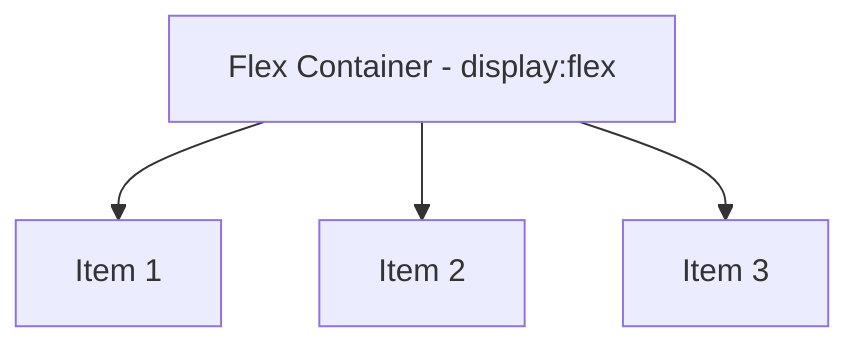
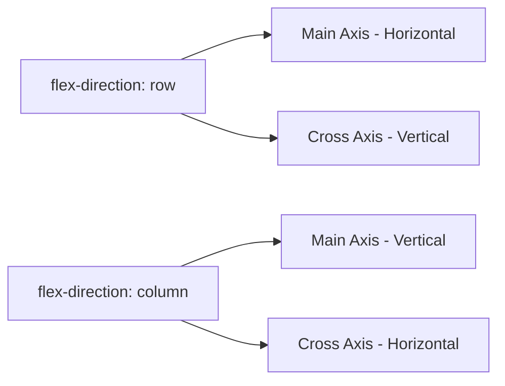
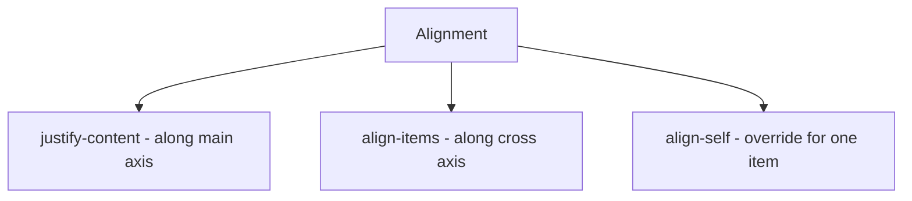
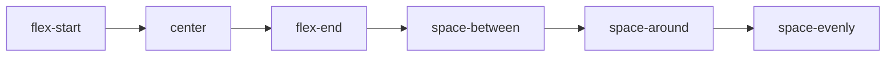

# 📘 Day 5: Flexbox (The Game Changer)

Hello students 👋

Welcome to **Day 5**! Today we learn **Flexbox** — the single most important layout tool in modern CSS.

Before Flexbox existed, building layouts in CSS was painful. Developers used tricks like `float`, `inline-block`, and margins — and still layouts would break. **Flexbox solved all of that.** 🎉

After today, you'll never struggle with centering things or aligning items again. Promise! 💪

---

## 1. Introduction

### What will we learn today?

- Why Flexbox was invented
- `display: flex`
- `flex-direction`
- `justify-content`
- `align-items`
- `gap`
- `flex-wrap`
- `align-self`
- `flex: 1` (growing items)

### Why Flexbox?

Ever tried to center a `<div>` both horizontally and vertically? In old CSS, you needed tricks. With Flexbox, it's 2 lines.

Flexbox is designed for **one-dimensional layouts** — a row OR a column of items.

---

## 2. Concept Explanation

### The Flex Model

Flexbox has **2 parts**:

1. **Flex container** (the parent) — you set `display: flex`.
2. **Flex items** (the children) — they get automatic superpowers.

Once you turn a container into a **flex container**, you can:

- Align children **horizontally** (`justify-content`).
- Align children **vertically** (`align-items`).
- Change the **direction** (row or column).
- Add **gaps** between items.
- Make items **wrap** if they overflow.

---

## 3. 💡 Visual Learning

### Flexbox Structure



### Main Axis vs Cross Axis



### Alignment Properties



### Common justify-content values



---

## 4. Syntax + Code Examples

### Basic Flex Container

```html
<div class="container">
  <div class="item">1</div>
  <div class="item">2</div>
  <div class="item">3</div>
</div>
```

```css
.container {
  display: flex;
}
```

Now all 3 items line up in a **row**.

---

### flex-direction

```css
.container { flex-direction: row; }         /* default: left to right */
.container { flex-direction: row-reverse; } /* right to left */
.container { flex-direction: column; }      /* top to bottom */
.container { flex-direction: column-reverse; }
```

---

### justify-content (along main axis)

```css
.container { justify-content: flex-start; }    /* default */
.container { justify-content: center; }         /* center horizontally */
.container { justify-content: flex-end; }       /* push to right */
.container { justify-content: space-between; }  /* equal space between items */
.container { justify-content: space-around; }   /* equal space around items */
.container { justify-content: space-evenly; }   /* equal space everywhere */
```

---

### align-items (along cross axis)

```css
.container {
  display: flex;
  height: 300px;
  align-items: center;       /* vertical centering */
  align-items: flex-start;
  align-items: flex-end;
  align-items: stretch;      /* default - items stretch to fill */
}
```

---

### 🏆 Perfect Centering

```css
.container {
  display: flex;
  justify-content: center;
  align-items: center;
  height: 100vh;
}
```

Boom! Your child is perfectly centered both ways. ✨

---

### gap (spacing between items)

```css
.container {
  display: flex;
  gap: 20px;                 /* space between items */
  gap: 20px 40px;            /* row-gap column-gap */
}
```

No need for `margin-right` hacks anymore!

---

### flex-wrap

By default, items stay on one line. `flex-wrap: wrap` lets them wrap to new lines.

```css
.container {
  display: flex;
  flex-wrap: wrap;
}
```

---

### align-self (override for one item)

```css
.item-special {
  align-self: flex-end;   /* this one item moves to the bottom */
}
```

---

### flex: 1 (grow to fill space)

```css
.item {
  flex: 1;   /* each item takes equal space */
}

.item-big {
  flex: 2;   /* this one takes 2x the space */
}
```

---

### Full Working Example (Navbar + Card Layout)

**File: `index.html`**
```html
<!DOCTYPE html>
<html>
  <head>
    <title>Day 5 - Flexbox</title>
    <link rel="stylesheet" href="style.css" />
  </head>
  <body>
    <nav class="navbar">
      <div class="logo">🚀 FlexShop</div>
      <ul class="menu">
        <li><a href="#">Home</a></li>
        <li><a href="#">Products</a></li>
        <li><a href="#">About</a></li>
        <li><a href="#">Contact</a></li>
      </ul>
    </nav>

    <section class="cards">
      <div class="card">
        <h3>Card 1</h3>
        <p>Flexbox makes everything easy.</p>
      </div>
      <div class="card">
        <h3>Card 2</h3>
        <p>Responsive. Powerful. Clean.</p>
      </div>
      <div class="card">
        <h3>Card 3</h3>
        <p>You'll love it.</p>
      </div>
    </section>
  </body>
</html>
```

**File: `style.css`**
```css
* {
  box-sizing: border-box;
  margin: 0;
  padding: 0;
}

body {
  font-family: Arial, sans-serif;
  background: #f5f5f5;
}

/* NAVBAR (Flexbox row) */
.navbar {
  display: flex;
  justify-content: space-between;
  align-items: center;
  padding: 15px 30px;
  background: #222;
  color: white;
}

.menu {
  display: flex;
  gap: 25px;
  list-style: none;
}

.menu a {
  color: white;
  text-decoration: none;
}

.menu a:hover { color: #ff9800; }

/* CARDS */
.cards {
  display: flex;
  gap: 20px;
  flex-wrap: wrap;
  justify-content: center;
  padding: 40px;
}

.card {
  flex: 1;
  min-width: 250px;
  background: white;
  padding: 20px;
  border-radius: 10px;
  box-shadow: 0 2px 8px rgba(0,0,0,0.1);
}

.card h3 {
  color: #333;
  margin-bottom: 10px;
}

.card p {
  color: #666;
  line-height: 1.5;
}
```

---

### Wrong vs Correct

❌ **Wrong (old way to center):**
```css
.container {
  text-align: center;
  line-height: 300px;
}
/* Doesn't work well, hacky */
```

✅ **Correct (Flexbox):**
```css
.container {
  display: flex;
  justify-content: center;
  align-items: center;
}
```

---

## 5. Live Output Explanation

When you open the example:

- The **navbar** has the logo on the **left** and the menu on the **right** — thanks to `justify-content: space-between`.
- The 3 **cards** are in a row, equally spaced, with a nice gap.
- If you resize the window, the cards will **wrap** to new rows (thanks to `flex-wrap`).
- Each card grows equally (`flex: 1`).

💡 **DevTools Tip:** Chrome DevTools has a **Flexbox inspector** — when you hover a flex container, you see arrows showing main/cross axis.

---

## 6. 🧪 Hands-on Practice

1. **Task 1:** Create a flex container with 4 boxes. Use `justify-content: space-between`.
2. **Task 2:** Center a single box **both horizontally and vertically** using Flexbox.
3. **Task 3:** Make 3 cards equal width using `flex: 1`.
4. **Task 4:** Create a vertical stack using `flex-direction: column`.
5. **Task 5:** Build a navbar with a logo on the left and 3 menu links on the right.

---

## 7. ⚠️ Common Mistakes

| Mistake | Fix |
|---------|-----|
| Forgetting `display: flex` on the parent | Flexbox properties only work on a flex container |
| Using `margin` instead of `gap` | `gap` is cleaner and easier |
| Confusing main axis & cross axis | Main = direction of flex-direction, Cross = perpendicular |
| `align-items` not working on vertical | Make sure the container has a `height` |
| Flex items overflow horizontally | Add `flex-wrap: wrap` |
| Forgetting `min-width` → items shrink weirdly | Set a `min-width` or `flex-basis` |

---

## 8. 📝 Mini Assignment

**Build a Navbar + Card Layout** 🛍️

Create a page with:

- A **navbar** — logo on left, menu (4 items) on right.
- A **hero** section — a single heading centered perfectly (both axes).
- A **card section** — 3 equal cards side-by-side, wrapping on small screens.

✅ Requirements:
- Use `display: flex`.
- Use `justify-content` and `align-items` appropriately.
- Use `gap` instead of margins.
- Use `flex-wrap: wrap` for responsiveness.
- Use `flex: 1` to make cards equal width.

---

## 9. 🔁 Recap

Today we learned:

- ✅ `display: flex` turns a box into a flex container.
- ✅ `flex-direction`: row or column.
- ✅ `justify-content` → **main axis** alignment.
- ✅ `align-items` → **cross axis** alignment.
- ✅ `gap` → spacing between items (cleaner than margin).
- ✅ `flex-wrap: wrap` → allow wrapping.
- ✅ `flex: 1` → grow equally.
- ✅ Perfect center: `display: flex; justify-content: center; align-items: center;`

💡 **Pro tip:** Bookmark this CSS-Tricks article: *"A Complete Guide to Flexbox"* — you'll use it all your life.

Next up: **Day 6 — CSS Grid**, Flexbox's powerful cousin for 2D layouts! 🚀

You now know 80% of what modern frontend developers use every day. Keep going! 💪
