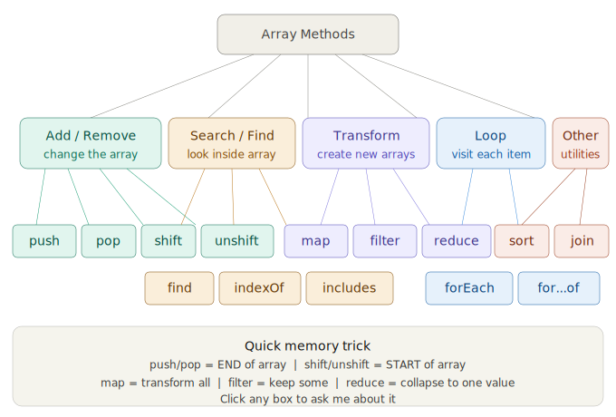

# Day 5 — Arrays in JavaScript

## **Arrays** — one of the most used things in ALL of programming. Every app you've ever used — Instagram, Swiggy, YouTube — uses arrays to store lists of data.

Let me start with the simplest possible explanation:

> **An array is just a list.**

That's it. A shopping list. A list of students. A list of products. That's an array.

### Definition

An **array** is an ordered collection of values stored in a single variable. Each value (called an **element**) has a numbered position (called an **index**). Arrays can hold any type of data — strings, numbers, booleans, objects, or even other arrays.

**Key characteristics:**
- **Ordered** — items stay in the order you put them in
- **Zero-indexed** — counting starts from `0`, not `1`
- **Dynamic** — arrays in JavaScript can grow and shrink; no fixed size
- **Heterogeneous** — one array can hold different types (`[1, "hello", true]`)

### Syntax

```js
// Using array literal (most common)
let arrayName = [element0, element1, element2];

// Using Array constructor (rarely used)
let arrayName = new Array(element0, element1, element2);
```



See that? Your shopping list is an array! The only weird thing — computers count from **0, not 1**. First item = index 0. Second item = index 1. Burn that into your brain forever.

---

## Lesson 1 — Creating Arrays & Accessing Items

### Definition

**Creating** an array means declaring a variable and assigning it a list of values inside square brackets `[]`. **Accessing** means reading a specific item using its index number inside square brackets — `arrayName[index]`.

### How It Works

| Concept | Syntax | Result |
|---|---|---|
| Create an array | `let fruits = ["mango", "apple", "banana"]` | A list with 3 items |
| Access first item | `fruits[0]` | `"mango"` |
| Access last item | `fruits[fruits.length - 1]` | `"banana"` |
| Get total count | `fruits.length` | `3` |
| Access out of range | `fruits[10]` | `undefined` |

> **Pro Tip:** `array[array.length - 1]` always gives the last item, no matter how big the array is. This is a pattern you'll use hundreds of times.

[Click link to open Simulation for break, continue, return](https://ak9347128658.github.io/MERN_Batch_April_2026/javascript/day5/array_creation_access_classroom.html)

Click every box — try typing index 10 and see what happens. The trick `students[students.length - 1]` always gives the last item no matter how big the array is.

### Example Questions with Solutions

**Q1: Create an array of 3 cities and print the second city.**

```js
let cities = ["Mumbai", "Delhi", "Chennai"];
console.log(cities[1]); // "Delhi"
// Remember: index 1 = second item (counting starts at 0)
```

**Q2: What will this print?**

```js
let colors = ["red", "green", "blue", "yellow"];
console.log(colors[4]);
```

**Solution:**
```js
// Output: undefined
// The array has indices 0, 1, 2, 3 — index 4 does NOT exist.
// JavaScript doesn't throw an error, it just returns undefined.
```

**Q3: How do you get the last element of any array without knowing its length?**

```js
let numbers = [10, 20, 30, 40, 50];
let lastItem = numbers[numbers.length - 1];
console.log(lastItem); // 50

// numbers.length = 5
// numbers.length - 1 = 4
// numbers[4] = 50 ✔
```

**Q4: What is the length of this array?**

```js
let mixed = ["hello", 42, true, null, undefined];
console.log(mixed.length);
```

**Solution:**
```js
// Output: 5
// Arrays can hold ANY type of data. Each element counts as 1 item.
```

---

## Lesson 2 — The Built-in Functions (Methods)

### Definition

**Array methods** are built-in functions that come with every array in JavaScript. You don't need to write these yourself — they are ready to use. You call them using **dot notation**: `arrayName.methodName()`.

### Categories of Array Methods

| Category | Methods | Purpose |
|---|---|---|
| **Add & Remove** | `push`, `pop`, `shift`, `unshift` | Add or remove items from either end |
| **Transform** | `map`, `filter`, `reduce` | Create new arrays/values from existing data |
| **Search** | `includes`, `indexOf`, `find` | Look up items in the array |
| **Loop** | `forEach`, `for...of` | Run code for each item |
| **Utility** | `sort`, `reverse`, `join`, `slice` | Rearrange, combine, or extract portions |

> **Important:** Some methods **modify** the original array (like `push`, `pop`, `sort`, `reverse`). Others **return a new array** without changing the original (like `map`, `filter`, `slice`). This distinction matters!



5 categories of methods. We'll cover each one now with live animations. Let's go!

### Example Questions with Solutions

**Q1: Which methods change the original array and which return a new one?**

```js
let arr = [3, 1, 2];

// MODIFIES original (mutating methods):
arr.push(4);      // arr is now [3, 1, 2, 4]
arr.pop();        // arr is now [3, 1, 2]
arr.sort();       // arr is now [1, 2, 3]
arr.reverse();    // arr is now [3, 2, 1]

// RETURNS NEW array (non-mutating methods):
let doubled = arr.map(n => n * 2);  // doubled = [6, 4, 2], arr unchanged
let big = arr.filter(n => n > 1);   // big = [3, 2], arr unchanged
let portion = arr.slice(0, 2);      // portion = [3, 2], arr unchanged
```

**Q2: What is dot notation?**

**Solution:**
```js
// Dot notation is how you call a method on an array (or any object).
// Syntax: arrayName.methodName(arguments)

let fruits = ["mango", "apple"];
fruits.push("banana");        // dot notation to call push
fruits.includes("apple");     // dot notation to call includes
console.log(fruits.length);   // dot notation to access length (property, not method)
```

---

## Lesson 3 — Add & Remove Methods (push, pop, shift, unshift)

### Definitions

| Method | What It Does | End or Start? | Returns |
|---|---|---|---|
| `push(item)` | **Adds** one or more items to the **END** | END | New length of array |
| `pop()` | **Removes** the last item from the **END** | END | The removed item |
| `unshift(item)` | **Adds** one or more items to the **START** | START | New length of array |
| `shift()` | **Removes** the first item from the **START** | START | The removed item |

### How to Think About It

- **push/pop** = Think of a **stack of plates**. You push a plate on top (end) and pop it off the top (end).
- **shift/unshift** = Think of a **queue at a shop**. The first person shifts out from the front (start). A new person unshifts into the front (start).

### Syntax

```js
array.push(element1, element2, ...);   // add to end
array.pop();                            // remove from end
array.unshift(element1, element2, ...); // add to start
array.shift();                          // remove from start
```

> **Note:** `shift` and `unshift` are **slower** than `push` and `pop` on large arrays because every other element needs to be re-indexed (shifted one position).

[Click link to open Simulation for break, continue, return](https://ak9347128658.github.io/MERN_Batch_April_2026/javascript/day5/add_remove_methods_animated.html)

Click all 4 buttons! Watch items animate in and out. Push many items then pop them one by one. Notice how `unshift` makes everything shift right to make space at the front.

### Example Questions with Solutions

**Q1: What does this code produce?**

```js
let stack = [10, 20, 30];
stack.push(40);
stack.push(50);
let removed = stack.pop();
console.log(removed);
console.log(stack);
```

**Solution:**
```js
// removed = 50  (pop removes and returns the LAST item)
// stack = [10, 20, 30, 40]  (50 was removed)
```

**Q2: Build an array step by step.**

```js
let arr = [];
arr.push("a");       // ["a"]
arr.push("b");       // ["a", "b"]
arr.unshift("z");    // ["z", "a", "b"]
arr.shift();         // ["a", "b"]       — removed "z"
arr.pop();           // ["a"]            — removed "b"
console.log(arr);    // ["a"]
```

**Q3: What does `push` return?**

```js
let items = ["pen", "book"];
let result = items.push("eraser");
console.log(result);
```

**Solution:**
```js
// Output: 3
// push() returns the NEW LENGTH of the array, not the array itself.
// items is now ["pen", "book", "eraser"] which has length 3.
```

**Q4: Remove the first and last item from this array.**

```js
let nums = [100, 200, 300, 400, 500];

let first = nums.shift();   // removes 100 from start
let last = nums.pop();      // removes 500 from end

console.log(first);  // 100
console.log(last);   // 500
console.log(nums);   // [200, 300, 400]
```

---

## Lesson 4 — The BIG 3: map, filter, reduce

These 3 methods are used in **every single React app and Node.js API**. Master these and you're a real developer.

### Definitions

#### `map()` — Transform every item

**What it does:** Takes each element, runs a function on it, and returns a **new array** of the same length with transformed values.

**Think of it as:** A machine on a conveyor belt — every item goes in, gets changed, and comes out the other side.

```js
let newArray = originalArray.map(function(element, index) {
    return transformedValue;
});

// Arrow function shorthand:
let newArray = originalArray.map(element => transformedValue);
```

**Key rule:** `map` always returns an array of the **same length**. 3 items in → 3 items out.

---

#### `filter()` — Keep only items that pass a test

**What it does:** Takes each element, tests it with a condition, and returns a **new array** containing only elements where the condition returned `true`.

**Think of it as:** A sieve — some items pass through, others get caught.

```js
let newArray = originalArray.filter(function(element, index) {
    return condition; // true = keep, false = discard
});

// Arrow function shorthand:
let newArray = originalArray.filter(element => condition);
```

**Key rule:** `filter` always returns an array of **equal or smaller** length. Never bigger.

---

#### `reduce()` — Collapse all items into one value

**What it does:** Processes each element one by one, accumulating a single result. Can produce a number, string, object — anything.

**Think of it as:** A snowball rolling downhill — it picks up each item and gets bigger.

```js
let result = originalArray.reduce(function(accumulator, currentElement) {
    return newAccumulatorValue;
}, initialValue);

// Arrow function shorthand:
let result = originalArray.reduce((acc, curr) => acc + curr, 0);
```

**Key rule:** `reduce` returns a **single value**, not an array.

---

#### Chaining — Combining map, filter, reduce

The real power comes when you **chain** these methods together. The output of one becomes the input of the next.

```js
let result = array
    .filter(...)   // Step 1: narrow down
    .map(...)      // Step 2: transform
    .reduce(...);  // Step 3: combine
```



Now let's use these on **real student data** — just like a real school app:

[Click link to open Simulation](https://ak9347128658.github.io/MERN_Batch_April_2026/javascript/day5/map_filter_reduce_student_lab.html)

Work through all 4 tabs! On **reduce** — press the button and watch it add scores one by one. On **chain** — drag the slider and see all 3 methods working together in a pipeline!

### Example Questions with Solutions

**Q1: Double every number in the array using `map`.**

```js
let numbers = [5, 10, 15, 20];
let doubled = numbers.map(n => n * 2);
console.log(doubled);  // [10, 20, 30, 40]

// Original array is UNCHANGED:
console.log(numbers);  // [5, 10, 15, 20]
```

**Q2: Filter out all even numbers.**

```js
let nums = [1, 2, 3, 4, 5, 6, 7, 8];
let oddOnly = nums.filter(n => n % 2 !== 0);
console.log(oddOnly);  // [1, 3, 5, 7]

// n % 2 !== 0 means "remainder when divided by 2 is not 0" = odd
```

**Q3: Find the total price of all products using `reduce`.**

```js
let prices = [250, 450, 120, 80, 300];
let total = prices.reduce((sum, price) => sum + price, 0);
console.log(total);  // 1200

// Step by step:
// sum=0,   price=250 → 0+250   = 250
// sum=250, price=450 → 250+450 = 700
// sum=700, price=120 → 700+120 = 820
// sum=820, price=80  → 820+80  = 900
// sum=900, price=300 → 900+300 = 1200
```

**Q4: Chain — Get names of students who scored above 60.**

```js
let students = [
    { name: "Ankit", score: 85 },
    { name: "Priya", score: 42 },
    { name: "Rahul", score: 73 },
    { name: "Sneha", score: 55 },
    { name: "Vikram", score: 91 }
];

let toppers = students
    .filter(s => s.score > 60)   // keep: Ankit(85), Rahul(73), Vikram(91)
    .map(s => s.name);           // extract names

console.log(toppers);  // ["Ankit", "Rahul", "Vikram"]
```

**Q5: Using all 3 — Find the average score of students who passed (score >= 50).**

```js
let students = [
    { name: "A", score: 80 },
    { name: "B", score: 30 },
    { name: "C", score: 60 },
    { name: "D", score: 45 },
    { name: "E", score: 90 }
];

let passed = students.filter(s => s.score >= 50);
// [{ A, 80 }, { C, 60 }, { E, 90 }]

let totalScore = passed.reduce((sum, s) => sum + s.score, 0);
// 80 + 60 + 90 = 230

let average = totalScore / passed.length;
// 230 / 3 = 76.67

console.log(average.toFixed(2));  // "76.67"
```

---

## Lesson 5 — Search Methods & Other Useful Methods

### Definitions

#### Search Methods

| Method | What It Does | Returns |
|---|---|---|
| `includes(value)` | Checks if the array **contains** the value | `true` or `false` |
| `indexOf(value)` | Finds the **position** of the value | Index number, or `-1` if not found |
| `find(callback)` | Returns the **first element** that passes a test | The element itself, or `undefined` |
| `findIndex(callback)` | Returns the **index of the first element** that passes a test | Index number, or `-1` |

#### Utility Methods

| Method | What It Does | Modifies Original? |
|---|---|---|
| `sort()` | Sorts elements in place | Yes |
| `reverse()` | Reverses the order in place | Yes |
| `join(separator)` | Combines all elements into a single string | No (returns string) |
| `slice(start, end)` | Extracts a portion of the array | No (returns new array) |
| `splice(start, deleteCount, ...items)` | Adds/removes elements at any position | Yes |

> **Warning about `sort()` with numbers:** By default, `sort()` converts elements to strings and sorts alphabetically. This means `[10, 2, 30].sort()` gives `[10, 2, 30]` (because "1" < "2" < "3" as strings). For numbers, **always** use a compare function: `.sort((a, b) => a - b)`.

> **`slice` vs `splice`:** `slice` = non-destructive, returns a copy. `splice` = destructive, modifies the original array. Think: spli**c**e = **c**hanges the array.

[Click link to open Simulation](https://ak9347128658.github.io/MERN_Batch_April_2026/javascript/day5/other_array_methods_lab.html)

Press every single button! Try `indexOf("cherry")` vs `indexOf("watermelon")`. Try all 3 sort modes — especially the number sort which needs `(a,b) => a-b`.

### Example Questions with Solutions

**Q1: Check if "pizza" exists in the array.**

```js
let foods = ["burger", "pizza", "pasta", "sushi"];

console.log(foods.includes("pizza"));   // true
console.log(foods.includes("biryani")); // false
```

**Q2: Find the position of "banana". What if it doesn't exist?**

```js
let fruits = ["mango", "apple", "banana", "grape"];

console.log(fruits.indexOf("banana"));     // 2
console.log(fruits.indexOf("watermelon")); // -1 (not found)

// Common pattern: check if item exists
if (fruits.indexOf("banana") !== -1) {
    console.log("Found banana!");
}
```

**Q3: Find the first number greater than 100.**

```js
let prices = [25, 80, 150, 200, 45];

let expensive = prices.find(p => p > 100);
console.log(expensive);  // 150 (first match, not all matches)

// If nothing matches:
let veryExpensive = prices.find(p => p > 500);
console.log(veryExpensive);  // undefined
```

**Q4: Sort numbers correctly (ascending and descending).**

```js
let nums = [40, 10, 100, 5, 25];

// WRONG way (alphabetical sort):
console.log([...nums].sort());              // [10, 100, 25, 40, 5] — WRONG!

// CORRECT ascending:
console.log([...nums].sort((a, b) => a - b)); // [5, 10, 25, 40, 100]

// CORRECT descending:
console.log([...nums].sort((a, b) => b - a)); // [100, 40, 25, 10, 5]

// Note: [...nums] creates a copy so we don't modify the original
```

**Q5: Extract a sub-array using `slice`.**

```js
let letters = ["a", "b", "c", "d", "e"];

let middle = letters.slice(1, 4);
console.log(middle);   // ["b", "c", "d"]
// slice(1, 4) = from index 1 UP TO (but NOT including) index 4

let lastTwo = letters.slice(-2);
console.log(lastTwo);  // ["d", "e"]
// Negative numbers count from the end

console.log(letters);  // ["a", "b", "c", "d", "e"] — unchanged!
```

**Q6: Join array items into a sentence.**

```js
let words = ["JavaScript", "is", "awesome"];
let sentence = words.join(" ");
console.log(sentence);  // "JavaScript is awesome"

let csv = ["name", "age", "city"].join(",");
console.log(csv);  // "name,age,city"
```

---

## Lesson 6 — Full Reference & Quick Revision Quiz

### Complete Array Methods Reference

| Method | Syntax | Returns | Mutates? |
|---|---|---|---|
| `push()` | `arr.push(item)` | New length | Yes |
| `pop()` | `arr.pop()` | Removed item | Yes |
| `unshift()` | `arr.unshift(item)` | New length | Yes |
| `shift()` | `arr.shift()` | Removed item | Yes |
| `map()` | `arr.map(fn)` | New array | No |
| `filter()` | `arr.filter(fn)` | New array | No |
| `reduce()` | `arr.reduce(fn, init)` | Single value | No |
| `forEach()` | `arr.forEach(fn)` | `undefined` | No |
| `includes()` | `arr.includes(val)` | Boolean | No |
| `indexOf()` | `arr.indexOf(val)` | Index or -1 | No |
| `find()` | `arr.find(fn)` | Element or undefined | No |
| `sort()` | `arr.sort(fn)` | Sorted array | Yes |
| `reverse()` | `arr.reverse()` | Reversed array | Yes |
| `join()` | `arr.join(sep)` | String | No |
| `slice()` | `arr.slice(start, end)` | New array | No |

[Click link to open Simulation](https://ak9347128658.github.io/MERN_Batch_April_2026/javascript/day5/array_cheatcard_and_quiz.html)

Reference card has all 15 methods in one table. Quiz has 10 questions — go through all of them and read the explanations!

### Example Questions with Solutions

**Q1: What is the output?**

```js
let arr = [1, 2, 3, 4, 5];
let result = arr.filter(n => n > 2).map(n => n * 10);
console.log(result);
```

**Solution:**
```js
// Step 1 — filter(n => n > 2): [3, 4, 5]
// Step 2 — map(n => n * 10):   [30, 40, 50]
// Output: [30, 40, 50]
```

**Q2: What is the difference between `find` and `filter`?**

```js
let nums = [5, 12, 8, 130, 44];

let found = nums.find(n => n > 10);
console.log(found);    // 12 (FIRST match only, single value)

let filtered = nums.filter(n => n > 10);
console.log(filtered); // [12, 130, 44] (ALL matches, array)
```

**Q3: Predict the output.**

```js
let animals = ["cat", "dog", "bird"];
animals.push("fish");
animals.shift();
animals.reverse();
console.log(animals);
```

**Solution:**
```js
// Start:          ["cat", "dog", "bird"]
// push("fish"):   ["cat", "dog", "bird", "fish"]
// shift():        ["dog", "bird", "fish"]       — removed "cat"
// reverse():      ["fish", "bird", "dog"]
// Output: ["fish", "bird", "dog"]
```

**Q4: Use `reduce` to find the maximum number.**

```js
let nums = [23, 56, 12, 89, 34];

let max = nums.reduce((biggest, current) => {
    return current > biggest ? current : biggest;
}, nums[0]);

console.log(max);  // 89

// Step by step:
// biggest=23, current=56 → 56 > 23 → biggest=56
// biggest=56, current=12 → 12 > 56? No → biggest=56
// biggest=56, current=89 → 89 > 56 → biggest=89
// biggest=89, current=34 → 34 > 89? No → biggest=89
```

**Q5: Create a frequency counter using `reduce`.**

```js
let fruits = ["apple", "banana", "apple", "cherry", "banana", "apple"];

let count = fruits.reduce((acc, fruit) => {
    acc[fruit] = (acc[fruit] || 0) + 1;
    return acc;
}, {});

console.log(count);
// { apple: 3, banana: 2, cherry: 1 }
```

---

## The Complete Class Notes

```js
// ════════════════════════════════════════════
//  WHAT IS AN ARRAY?
//  An ordered list of items.
//  Counting starts at 0!
// ════════════════════════════════════════════

let fruits = ["mango", "apple", "banana"];

fruits[0]               // "mango"   (first)
fruits[2]               // "banana"  (third)
fruits[fruits.length-1] // "banana"  (last — always!)
fruits.length           // 3

// ─── ADD / REMOVE ───────────────────────────

fruits.push("grape")    // add to END   → ["mango","apple","banana","grape"]
fruits.pop()            // remove from END → returns "grape"

fruits.unshift("kiwi")  // add to START  → ["kiwi","mango","apple","banana"]
fruits.shift()          // remove from START → returns "kiwi"

// ─── THE BIG 3 ──────────────────────────────

// map — transform every item, same count
[1,2,3].map(n => n * 2)          // [2, 4, 6]

// filter — keep items that pass, fewer items
[1,2,3,4,5].filter(n => n > 3)   // [4, 5]

// reduce — collapse all to one value
[10,20,30].reduce((sum,n) => sum+n, 0)  // 60

// CHAINING — the real power!
students
  .filter(s => s.score >= 50)   // 1. keep who passed
  .map(s => s.name)             // 2. get names
  .join(", ");                  // 3. join to string

// ─── SEARCH ─────────────────────────────────

fruits.includes("apple")   // true
fruits.includes("cherry")  // false

fruits.indexOf("apple")    // 1 (position)
fruits.indexOf("cherry")   // -1 (not found)

[10,25,8].find(n => n > 15)  // 25 (first match)

// ─── LOOP ───────────────────────────────────

fruits.forEach((item, index) => {
  console.log(index + ": " + item);
});

for (let fruit of fruits) {
  console.log(fruit);
}

// ─── UTILITIES ──────────────────────────────

["b","a","c"].sort()              // ["a","b","c"]
[3,1,2].sort((a,b) => a - b)     // [1, 2, 3]
[1,2,3].reverse()                 // [3, 2, 1]
["Hi","World"].join(" ")          // "Hi World"
[1,2,3,4,5].slice(1, 4)          // [2, 3, 4]
```

---

## Class Homework

```js
// Paste each one in your console (F12) and run it:

// 1. Create an array of 5 of your favourite foods
const foods = ["biryani", "dosa", "pizza", "idli", "burger"];
console.log("First:", foods[0]);
console.log("Last:", foods[foods.length - 1]);
console.log("Count:", foods.length);

// 2. Add and remove items
foods.push("pasta");    // add to end
foods.unshift("chai");  // add to start
console.log(foods);
foods.pop();            // remove last
console.log(foods);

// 3. map — add "!" to every food name
const excited = foods.map(f => f + "!");
console.log(excited);

// 4. filter — only foods with more than 4 letters
const longNames = foods.filter(f => f.length > 4);
console.log(longNames);

// 5. reduce — total length of all names
const totalChars = foods.reduce((sum, f) => sum + f.length, 0);
console.log("Total characters:", totalChars);

// 6. search
console.log(foods.includes("dosa"));   // true or false?
console.log(foods.indexOf("pizza"));   // what position?

// 7. sort and join
const sorted = [...foods].sort();
console.log("Sorted:", sorted.join(" | "));
```

---

## Memory Tricks for This Class

| Trick | What to remember |
|---|---|
| **push/pop = END** | Push a book onto a PILE (end). Pop it off the TOP (end). |
| **shift/unshift = START** | Like a queue — shift out from FRONT |
| **map = same size** | Transform but keep count |
| **filter = smaller** | Keep only some |
| **reduce = one value** | Crush everything into one |
| **indexOf = -1 means NOT found** | -1 is the "not found" signal |
| **Index starts at 0** | Always 0, never 1! |
| **sort needs compare for numbers** | `.sort((a,b) => a-b)` for correct number sort |
| **slice vs splice** | sli**c**e = **c**opy (safe), spli**c**e = **c**hange (destructive) |
| **map/filter = new array** | Original is never touched |


==============================

## **Nested Arrays** — arrays inside arrays. This sounds scary but you already use them every day in real life. Let me prove it:

> **A nested array is just a list where each item is also a list.**

Think of it like this:



See? Your classroom has rows, and each row has students. That's a nested array — **an array of arrays**. Now let's learn how to read it, write it, and work with it.

---

## Lesson 1 — Creating & Understanding Nested Arrays



**Two indexes. Always two.** First picks the row (outer array). Second picks the column (inner array). Let's see this live:

[Click link to open Simulation](https://ak9347128658.github.io/MERN_Batch_April_2026/javascript/day5/nested_array_interactive_grid.html)


Click every cell — watch the exact code to access it appear. Type your own row/col numbers. Press **Get whole row** — this shows that `classroom[1]` gives you the entire inner array!

---

## Lesson 2 — Looping Through Nested Arrays

To visit every item in a nested array, you need **a loop inside a loop** — called a **nested loop**:

[Click link to open Simulation](https://ak9347128658.github.io/MERN_Batch_April_2026/javascript/day5/nested_loop_animated.html)


Press **Play** — watch it go row by row, column by column. The orange cells show the current row, green shows the exact cell being visited. Press **Step** to go one at a time and really understand it!

---

## Lesson 3 — Real World Examples

Nested arrays are used everywhere. Let me show you 3 real scenarios:

[Click link to open Simulation](https://ak9347128658.github.io/MERN_Batch_April_2026/javascript/day5/nested_array_real_world_examples.html)

Three real uses of nested arrays! Click the timetable cells, try the marks buttons, and play a full game of Tic-Tac-Toe (which is literally just `board[row][col] = "X"` or `"O"`!). Watch the console show the exact array code running.

---

## Lesson 4 — All Operations on Nested Arrays

[Click link to open Simulation](https://ak9347128658.github.io/MERN_Batch_April_2026/javascript/day5/nested_array_all_operations.html)


Try every operation — change a value and watch the mini-grid update live. Add new rows. Press `flat()` to see how a nested array collapses into a single flat array!

---

## Complete Class Notes — Everything in One Place

```js
// ════════════════════════════════════════════
//  WHAT IS A NESTED ARRAY?
//  An array where each item is also an array.
//  Think: grid, table, classroom, board game.
// ════════════════════════════════════════════


// ─── CREATING ───────────────────────────────
const grid = [
    ["Ali",  "Sara",  "Ravi"],   // row 0
    ["John", "Priya", "Tom"],    // row 1
    ["Zara", "Raj",   "Maya"],   // row 2
];


// ─── READING ────────────────────────────────
grid[0]         // ["Ali","Sara","Ravi"]  whole row
grid[0][0]      // "Ali"     row 0, col 0
grid[1][2]      // "Tom"     row 1, col 2
grid[2][1]      // "Raj"     row 2, col 1
grid.length     // 3  (number of rows)
grid[0].length  // 3  (number of columns)


// ─── WRITING ────────────────────────────────
grid[0][0] = "Ahmed";      // change one item
grid[1] = ["X","Y","Z"];   // replace whole row


// ─── ADD / REMOVE ───────────────────────────
grid.push(["A","B","C"]);  // add new row at end
grid.pop();                // remove last row
grid[0].push("Extra");     // add to inner array


// ─── LOOPING (nested for loop) ──────────────
for (let row = 0; row < grid.length; row++) {
    for (let col = 0; col < grid[row].length; col++) {
        console.log(grid[row][col]);
    }
}

// OR with forEach:
grid.forEach((row, r) => {
    row.forEach((item, c) => {
        console.log(`[${r}][${c}] = ${item}`);
    });
});


// ─── USEFUL TRICKS ──────────────────────────
grid.flat()        // → ["Ali","Sara","Ravi","John",...] flatten
grid.flat(Infinity) // flatten deeply nested arrays


// ─── REAL WORLD USES ────────────────────────
// Exam marks:    marks[studentIndex][subjectIndex]
// Timetable:     schedule[dayIndex][periodIndex]
// Game board:    board[row][col] = "X" or "O"
// Spreadsheet:   cells[rowIndex][columnIndex]
// Image pixels:  pixels[y][x] = color
```

---

## Quick Memory Trick

| Concept | Simple way to remember |
|---|---|
| Nested array | A list of lists |
| `grid[0]` | First row (the whole inner array) |
| `grid[0][0]` | First row, first column |
| `grid[row][col]` | Always row first, column second |
| Nested loop | Outer loop = rows, inner loop = columns |
| `.flat()` | Squash nested into one flat array |

---

**Homework — paste in your console:**

```js
// 1. Create a 2x3 marks table
const marks = [
  [85, 90, 78],   // Alice
  [60, 55, 70],   // Bob
];

// 2. Access items
console.log(marks[0][1]);   // Alice's English mark?
console.log(marks[1][0]);   // Bob's Maths mark?

// 3. Loop and print all
marks.forEach((row, i) => {
  const avg = (row.reduce((s,n) => s+n, 0) / row.length).toFixed(1);
  console.log("Student " + i + " average: " + avg);
});

// 4. Add a new student
marks.push([92, 88, 95]);
console.log("Now", marks.length, "students");

// 5. Flatten it
console.log(marks.flat());  // all marks in one array
```
