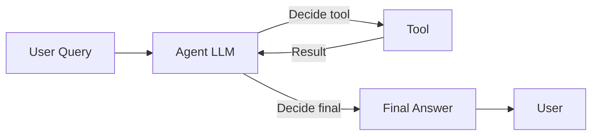
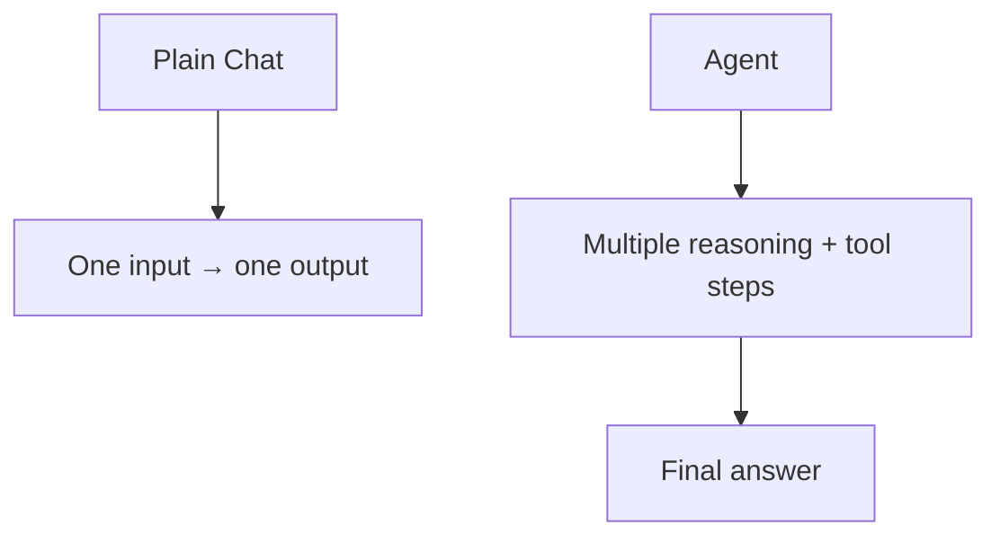
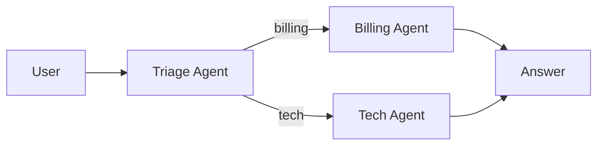

# 📅 Day 5 — OpenAI Agent SDK Basics

Hello students 👋

Welcome to **Day 5**! So far we have built a chatbot, a JSON-emitting bot, and a RAG bot. But all of them are **one-shot**: question in → answer out. Today we unlock something far more powerful — **Agents**. An agent can **think, plan, use tools, and take multiple steps** on its own. Welcome to real AI engineering! 🤖

---

## 1. Introduction

### 🎯 What we learn today?
- What is an **Agent**?
- **Agent vs RAG vs Workflow** — when to use which
- Core concepts: **Instructions**, **Tools**, **Memory**, **Handoffs**
- Install and use the **OpenAI Agents SDK for JavaScript/TypeScript** (`@openai/agents`)
- Build your **first agent**
- Create a **search agent** and a **support agent**
- 💻 Mini project: **Smart Helpdesk Assistant**

### 🌍 Why it matters
Real AI products are agentic:
- Customer support bots that **look up orders**, **issue refunds**, and **escalate**.
- Coding agents that **read files**, **edit code**, and **run tests**.
- Research agents that **search the web**, **summarize**, and **save notes**.
All of these use the agent pattern we learn today.

---

## 2. Concept Explanation

### 🤖 What is an Agent?
An **Agent** is an LLM that can:
1. **Reason** about what to do next.
2. **Call tools** (functions) to take actions.
3. **Loop** — it reads tool output, reasons again, and decides the next step.
4. **Stop** when it has a final answer.

> Think of an agent as a **new intern**: you give them instructions, tools (email, calendar, database), and they figure out what to click next.

### 🆚 Agent vs RAG vs Workflow

| | Workflow | RAG | Agent |
|---|---|---|---|
| Structure | Hard-coded steps | Fixed: retrieve → answer | LLM decides steps |
| Flexibility | Low | Medium | High |
| Tools | No | No | Yes |
| Multi-step | No | No | Yes |
| Best for | Predictable tasks | Q&A over docs | Complex, dynamic tasks |

**Rule of thumb:** Use the **simplest** thing that works. Workflow > RAG > Agent in complexity. Only go higher if needed.

### 🧰 Core concepts

- **Instructions (system prompt):** the agent's role, goals, and rules.
- **Tools:** TypeScript functions the agent can call (e.g., `getOrder(id)`).
- **Memory:** the running conversation (messages, tool calls, tool outputs).
- **Handoffs:** one agent delegating to another specialized agent.
- **Guardrails:** input/output validation, safety checks.

### 🏃 The agent loop

```
While not done:
  1. LLM reads messages + tool outputs
  2. LLM decides: final answer OR tool call
  3. If tool call → run it, feed result back
  4. Repeat
```

---

## 3. 💡 Visual Learning

### The agent loop



### Agent vs plain chat



### Multi-agent handoff (preview)



---

## 4. 🛠️ Setup

We'll use the **official OpenAI Agents SDK for JS/TS**: [`@openai/agents`](https://github.com/openai/openai-agents-js).

```bash id="day5install"
npm install @openai/agents openai zod dotenv
npm install -D typescript ts-node @types/node
```

`.env`:

```env id="day5env"
OPENAI_API_KEY=sk-your-key
```

Folder structure:

```text id="day5folder"
ai-day5/
├── src/
│   ├── helloAgent.ts
│   ├── searchAgent.ts
│   └── supportAgent.ts
└── .env
```

---

## 5. Code Examples

### ✅ Hello Agent — the simplest agent

```ts id="day5hello"
// src/helloAgent.ts
import "dotenv/config";
import { Agent, run } from "@openai/agents";

const helper = new Agent({
  name: "Helper",
  instructions: "You are a friendly helper. Keep answers short and clear.",
  model: "gpt-4o-mini"
});

async function main() {
  const result = await run(helper, "Explain what an agent is in one sentence.");
  console.log(result.finalOutput);
}

main();
```

Run:

```bash id="day5run"
npx ts-node src/helloAgent.ts
```

### ✅ Adding tools — a simple calculator

```ts id="day5tools"
// src/calcAgent.ts
import "dotenv/config";
import { Agent, run, tool } from "@openai/agents";
import { z } from "zod";

const add = tool({
  name: "add",
  description: "Add two numbers",
  parameters: z.object({ a: z.number(), b: z.number() }),
  execute: async ({ a, b }) => ({ result: a + b })
});

const multiply = tool({
  name: "multiply",
  description: "Multiply two numbers",
  parameters: z.object({ a: z.number(), b: z.number() }),
  execute: async ({ a, b }) => ({ result: a * b })
});

const mathAgent = new Agent({
  name: "Math Agent",
  instructions: "You solve math. ALWAYS use tools, never calculate yourself.",
  model: "gpt-4o-mini",
  tools: [add, multiply]
});

async function main() {
  const out = await run(mathAgent, "What is (3 + 4) * 5?");
  console.log(out.finalOutput);
}

main();
```

Watch the agent decide: it will call `add(3, 4)` → get `7` → then call `multiply(7, 5)` → get `35` → return final answer.

### ✅ Search Agent — fake web search tool

```ts id="day5search"
// src/searchAgent.ts
import "dotenv/config";
import { Agent, run, tool } from "@openai/agents";
import { z } from "zod";

const search = tool({
  name: "webSearch",
  description: "Search the web for up-to-date information",
  parameters: z.object({ query: z.string() }),
  execute: async ({ query }) => {
    return {
      query,
      results: [
        { title: "Node.js official site", snippet: "Node.js is a JS runtime...", url: "https://nodejs.org" },
        { title: "OpenAI", snippet: "AI research company", url: "https://openai.com" }
      ]
    };
  }
});

const searchAgent = new Agent({
  name: "Search Agent",
  instructions:
    "You answer questions by searching the web first. " +
    "Always cite the URL of your sources.",
  model: "gpt-4o-mini",
  tools: [search]
});

run(searchAgent, "What is Node.js?").then((r) => console.log(r.finalOutput));
```

### ✅ Support Agent — with typed JSON output

```ts id="day5support"
// src/supportAgent.ts
import "dotenv/config";
import { Agent, run, tool } from "@openai/agents";
import { z } from "zod";

const getOrderStatus = tool({
  name: "getOrderStatus",
  description: "Get the delivery status of an order",
  parameters: z.object({ orderId: z.string() }),
  execute: async ({ orderId }) => ({
    orderId,
    status: "OUT_FOR_DELIVERY",
    eta: "2026-04-20"
  })
});

const SupportOutput = z.object({
  intent: z.enum(["order_status", "refund", "general"]),
  reply: z.string(),
  resolved: z.boolean()
});

const supportAgent = new Agent({
  name: "Support Agent",
  instructions:
    "You are a polite support agent. Use tools when needed. " +
    "Return a structured JSON: intent, reply, resolved.",
  model: "gpt-4o-mini",
  tools: [getOrderStatus],
  outputType: SupportOutput
});

async function main() {
  const result = await run(supportAgent, "Where is my order #A123?");
  console.log(JSON.stringify(result.finalOutput, null, 2));
}

main();
```

---

## 6. 🧾 JSON Response Design

Always wrap the agent run in a standard envelope:

```ts id="day5wrap"
export async function askAgent(input: string) {
  const start = Date.now();
  try {
    const result = await run(supportAgent, input);
    return {
      success: true,
      data: result.finalOutput,
      error: null,
      meta: {
        latencyMs: Date.now() - start,
        steps: result.history?.length ?? 0
      }
    };
  } catch (e) {
    return {
      success: false,
      data: null,
      error: { code: "AGENT_ERROR", message: (e as Error).message },
      meta: { latencyMs: Date.now() - start, steps: 0 }
    };
  }
}
```

Expected output:

```json id="day5jsonout"
{
  "success": true,
  "data": {
    "intent": "order_status",
    "reply": "Your order #A123 is out for delivery and will arrive by 2026-04-20.",
    "resolved": true
  },
  "error": null,
  "meta": { "latencyMs": 2140, "steps": 4 }
}
```

---

## 7. 💻 Hands-on Practice

1. Add a `subtract` and `divide` tool to the math agent.
2. Make the calculator agent **refuse** non-math questions.
3. In the search agent, add a second tool `summarize(text)` so it can summarize results.
4. Add a `cancelOrder(orderId)` tool to the support agent.
5. Log every tool call to the console (use `console.log` inside each `execute`).
6. Change the model to `gpt-4o` and compare decision quality vs `gpt-4o-mini`.
7. Write an agent that always answers in **Urdu** regardless of the input language (use `instructions`).

---

## 8. ⚠️ Common Mistakes

- ❌ Vague instructions ("be helpful") → the agent invents its own plan.
- ❌ Too many tools (15+) → the agent gets confused, slower, more expensive.
- ❌ Tools without clear `description` → the agent picks wrong tools.
- ❌ Tools that return huge blobs → token bloat. Return only what's needed.
- ❌ Forgetting `outputType` → you get free-form text instead of JSON.
- ❌ No timeout/iteration limit → agent loops forever on edge cases.
- ❌ Not handling tool failures → one bad tool crashes the whole run.

---

## 9. 📝 Mini Assignment — Smart Helpdesk Assistant

Build a helpdesk agent with:

**Tools:**
- `getOrderStatus(orderId)` → fake status object
- `getRefundPolicy()` → returns a fixed text
- `escalateToHuman(reason)` → returns `{ ticketId: "TKT-123" }`

**Rules (instructions):**
- If the user asks about an order, call `getOrderStatus`.
- If they ask about refunds, call `getRefundPolicy`.
- If they are **angry or the problem is unclear**, call `escalateToHuman`.
- Return structured JSON with `{ intent, reply, escalated, ticketId? }`.

**Test inputs:**
1. "Where is my order #A99?"
2. "What is your refund policy?"
3. "This is the 5th time my delivery is late, I am furious!"

Expected for input 3:

```json id="day5escalate"
{
  "intent": "escalation",
  "reply": "I'm sorry for the trouble. I've escalated this to our team (ticket TKT-123).",
  "escalated": true,
  "ticketId": "TKT-123"
}
```

---

## 10. 🔁 Recap

- An **Agent** = LLM + instructions + tools + loop + memory.
- Use **agents** only when you need **multi-step reasoning** or **actions**. Otherwise keep it simple.
- `@openai/agents` SDK gives you `Agent`, `run`, `tool`, and `outputType`.
- Tools are **typed TypeScript functions** with Zod schemas.
- Always set a **clear role**, **strict rules**, and **structured output type**.
- Wrap runs in a **standard JSON envelope** for production.

Tomorrow on **Day 6** we go deeper into **tools and multi-step flows** — database lookups, external APIs, conditional logic. See you! 🛠️
