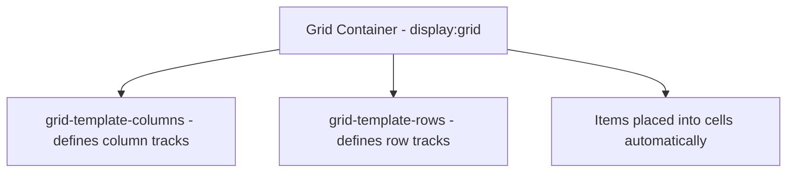
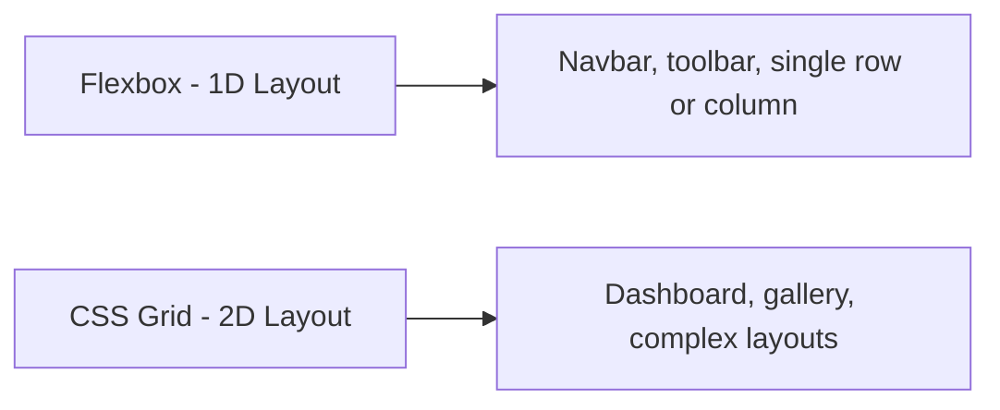
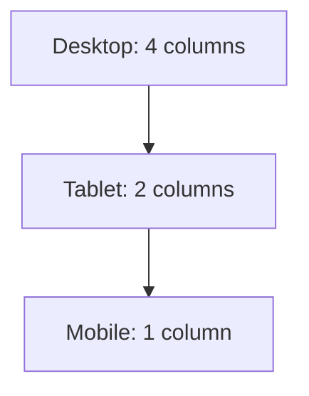

# 📘 Day 6: CSS Grid + Layout Systems

Hello students 👋

Welcome to **Day 6**! Yesterday we mastered **Flexbox**. Today we'll learn its more powerful cousin — **CSS Grid**.

While **Flexbox** is best for **one-dimensional** layouts (a row OR a column), **Grid** is designed for **two-dimensional** layouts (rows AND columns together) — like a spreadsheet, a dashboard, or a magazine layout. 📰

After today, you'll be able to build complex layouts in minutes. 💪

---

## 1. Introduction

### What will we learn today?

- Why Grid exists
- `display: grid`
- Columns and rows
- `grid-template-columns`
- `grid-template-rows`
- `gap`
- `span`
- Responsive grids (`auto-fit`, `minmax`)
- Flexbox vs Grid (when to use what)

### Why Grid?

Imagine designing a **dashboard** with:
- Header at top
- Sidebar on left
- Main content in middle
- Widgets on right
- Footer at bottom

With Flexbox, you'd need nested containers. With **Grid**, you define the layout in one line. ✨

---

## 2. Concept Explanation

### The Grid Model

CSS Grid is based on a **row + column** system, just like Excel.

1. **Grid container** (parent) → `display: grid`.
2. **Grid items** (children) → automatically placed in grid cells.
3. You define the **tracks** (columns/rows) using `grid-template-columns` and `grid-template-rows`.

---

## 3. 💡 Visual Learning

### Grid Anatomy



### Grid vs Flexbox



### Responsive Grid Flow



---

## 4. Syntax + Code Examples

### Basic Grid

```html
<div class="grid">
  <div>1</div>
  <div>2</div>
  <div>3</div>
  <div>4</div>
  <div>5</div>
  <div>6</div>
</div>
```

```css
.grid {
  display: grid;
  grid-template-columns: 1fr 1fr 1fr;  /* 3 equal columns */
  gap: 20px;
}
```

💡 `fr` = **fraction** of free space. `1fr 1fr 1fr` = 3 equal parts.

---

### Different Column Widths

```css
.grid {
  display: grid;
  grid-template-columns: 200px 1fr 1fr; /* sidebar + 2 content cols */
}
```

### Using `repeat()`

```css
.grid {
  display: grid;
  grid-template-columns: repeat(4, 1fr); /* 4 equal columns */
  gap: 15px;
}
```

---

### Grid Template Rows

```css
.grid {
  display: grid;
  grid-template-columns: 1fr 1fr;
  grid-template-rows: 100px 200px;
  gap: 10px;
}
```

### Gap

```css
.grid {
  gap: 20px;               /* both row and column gap */
  row-gap: 10px;
  column-gap: 30px;
}
```

---

### Spanning Cells

Make an item cover multiple columns or rows:

```css
.item-wide {
  grid-column: span 2;      /* spans 2 columns */
}

.item-tall {
  grid-row: span 2;         /* spans 2 rows */
}

.hero {
  grid-column: 1 / 3;       /* from column 1 to column 3 */
  grid-row: 1 / 2;
}
```

---

### Responsive Grids (Magic! ✨)

The classic responsive grid:

```css
.grid {
  display: grid;
  grid-template-columns: repeat(auto-fit, minmax(250px, 1fr));
  gap: 20px;
}
```

This means:
- Each column is **at least 250px**.
- Fill the row with as many as possible.
- Wrap automatically on smaller screens.

No media queries needed! 🎉

---

### Full Working Example (Dashboard Layout)

**File: `index.html`**
```html
<!DOCTYPE html>
<html>
  <head>
    <title>Day 6 - Dashboard</title>
    <link rel="stylesheet" href="style.css" />
  </head>
  <body>
    <div class="dashboard">
      <header class="header">📊 Admin Dashboard</header>
      <aside class="sidebar">
        <ul>
          <li>Home</li>
          <li>Users</li>
          <li>Orders</li>
          <li>Settings</li>
        </ul>
      </aside>
      <main class="main">
        <div class="card">Sales: $12,500</div>
        <div class="card">Users: 2,300</div>
        <div class="card">Orders: 145</div>
        <div class="card">Visits: 9,800</div>
      </main>
      <footer class="footer">© 2026 MySite</footer>
    </div>
  </body>
</html>
```

**File: `style.css`**
```css
* {
  box-sizing: border-box;
  margin: 0;
  padding: 0;
}

body {
  font-family: Arial, sans-serif;
  background: #f5f5f5;
}

.dashboard {
  display: grid;
  grid-template-columns: 220px 1fr;
  grid-template-rows: 70px 1fr 60px;
  grid-template-areas:
    "header header"
    "sidebar main"
    "footer footer";
  min-height: 100vh;
}

.header {
  grid-area: header;
  background: #222;
  color: white;
  padding: 20px;
  font-size: 20px;
}

.sidebar {
  grid-area: sidebar;
  background: #2c3e50;
  color: white;
  padding: 20px;
}

.sidebar ul {
  list-style: none;
}

.sidebar li {
  padding: 10px 0;
  cursor: pointer;
}

.sidebar li:hover { color: #ff9800; }

.main {
  grid-area: main;
  padding: 30px;
  display: grid;
  grid-template-columns: repeat(auto-fit, minmax(200px, 1fr));
  gap: 20px;
}

.card {
  background: white;
  padding: 30px;
  border-radius: 10px;
  box-shadow: 0 2px 8px rgba(0,0,0,0.1);
  font-weight: bold;
  text-align: center;
}

.footer {
  grid-area: footer;
  background: #222;
  color: white;
  text-align: center;
  padding: 15px;
}
```

---

### Wrong vs Correct

❌ **Wrong:**
```css
.grid {
  display: grid;
  grid-template-columns: 1fr 1fr 1fr;
  grid-gap: 20;   /* missing unit */
}
```

✅ **Correct:**
```css
.grid {
  display: grid;
  grid-template-columns: 1fr 1fr 1fr;
  gap: 20px;
}
```

---

## 5. Live Output Explanation

When you open the dashboard example:

- You see a **header** spanning the full width.
- A **sidebar** on the left with menu items.
- The **main content** on the right contains 4 stat cards.
- A **footer** at the bottom.
- The cards in the main section **auto-fit** based on screen width — resize your window and watch them adapt.

💡 **DevTools Tip:** Chrome DevTools has a **Grid inspector** — click the `grid` badge next to an element to see grid lines, row/column numbers, and areas.

---

## 6. 🧪 Hands-on Practice

1. **Task 1:** Create a 3-column grid with 6 boxes.
2. **Task 2:** Make one box span 2 columns using `grid-column: span 2`.
3. **Task 3:** Build a responsive image gallery with `repeat(auto-fit, minmax(200px, 1fr))`.
4. **Task 4:** Create a 2-column layout: sidebar (250px) + main (`1fr`).
5. **Task 5:** Use `grid-template-areas` to define a `header / sidebar / main / footer` layout.

---

## 7. ⚠️ Common Mistakes

| Mistake | Fix |
|---------|-----|
| Forgetting `display: grid` | Grid properties work only on a grid container |
| Using `px` for all columns (not responsive) | Use `fr` or `minmax()` |
| Confusing `grid-column` vs `grid-row` | column = horizontal span, row = vertical span |
| Writing `grid-gap` instead of `gap` | Modern CSS: use `gap` |
| Mismatched `grid-template-areas` | All rows must have same number of columns |
| Overusing Grid where Flexbox is simpler | Use Flexbox for 1D, Grid for 2D |

---

## 8. 📝 Mini Assignment

**Build a Dashboard Layout** 📊

Create a 4-area dashboard:

- **Header** at the top (full width).
- **Sidebar** on the left (fixed 220px).
- **Main content** with 4 stat cards in a responsive grid.
- **Footer** at the bottom (full width).

✅ Requirements:
- Use `display: grid`.
- Use `grid-template-areas` for the main layout.
- Use `repeat(auto-fit, minmax(...))` for cards.
- Use `gap` for spacing.
- Full page height with `min-height: 100vh`.

---

## 9. 🔁 Recap

Today we learned:

- ✅ `display: grid` creates a grid container.
- ✅ `grid-template-columns` / `grid-template-rows` define tracks.
- ✅ `fr` unit = fraction of free space.
- ✅ `repeat(n, 1fr)` = shortcut for repeating tracks.
- ✅ `gap` = spacing between cells.
- ✅ `span` / `grid-column` / `grid-row` = control how items span.
- ✅ `repeat(auto-fit, minmax(..., 1fr))` = responsive grid magic.
- ✅ `grid-template-areas` = visual layout shortcut.

### Flexbox vs Grid (Quick Rule)

- Use **Flexbox** for **one-dimensional** layouts (navbar, row of buttons).
- Use **Grid** for **two-dimensional** layouts (dashboard, image gallery).

💡 Bookmark CSS-Tricks' *"A Complete Guide to Grid"* — it's pure gold.

See you on **Day 7 — Responsive Design & Media Queries**, where we'll make our websites look great on **any device**. 📱💻

You're almost a CSS pro! Keep going! 🚀
