# Day 6 — Objects, JSON & Classes in JavaScript

> **Objects and JSON are the backbone of the entire internet.**

Every API response you've ever seen. Every MongoDB document. Every React component's data. All of it is Objects and JSON.

Let me start with the simplest possible explanation:

> **An Object is like an ID card — it groups related information about ONE thing.**



See that? An ID card is a perfect object. Every piece of information has a **label (key)** and a **value**. In JavaScript we call them **key-value pairs**. That's ALL an object is.

---

# Part 1 — Objects

## What is an Object?

An **Object** is a non-primitive data type in JavaScript that stores a collection of **key-value pairs**. Each key (also called a **property name**) is a string, and its value can be any data type — string, number, boolean, array, another object, or even a function.

Objects let you group related data and behavior together under a single variable name, making your code organized and meaningful.

**Syntax:**
```js
const objectName = {
  key1: value1,
  key2: value2,
  key3: value3
};
```

---

## Lesson 1 — The Anatomy of an Object



**5 things to remember:**
1. `{ }` — curly braces wrap the whole object
2. `name` — the key (the label)
3. `:` — colon separates key from value
4. `"Ali"` — the value (can be any type)
5. `,` — comma after every pair except the last

### Example Question 1

**Q: Create an object called `car` with properties `brand`, `model`, `year`, and `color`.**

**Solution:**
```js
const car = {
  brand: "Toyota",
  model: "Corolla",
  year: 2023,
  color: "White"
};

console.log(car);
// { brand: "Toyota", model: "Corolla", year: 2023, color: "White" }
```

### Example Question 2

**Q: What is wrong with the following object? Fix it.**
```js
const person = {
  name: "Sara"
  age: 25
  city: "Delhi"
}
```

**Solution:**
Missing commas after each key-value pair (except the last one):
```js
const person = {
  name: "Sara",   // comma added
  age: 25,        // comma added
  city: "Delhi"   // last one — no comma needed
};
```

---

## Lesson 2 — Creating Objects & Accessing Values

There are **two ways** to access values inside an object:

| Method | Syntax | When to use |
|---|---|---|
| **Dot notation** | `obj.key` | When you know the key name at coding time |
| **Bracket notation** | `obj["key"]` | When the key is stored in a variable, or has spaces/special characters |

```js
const student = { name: "Ali", age: 22, passed: true };

// Dot notation
student.name      // "Ali"

// Bracket notation
student["age"]    // 22

// When key is in a variable
let prop = "passed";
student[prop]     // true

// Key that doesn't exist
student.xyz       // undefined
```

[Click link to open Simulation](https://ak9347128658.github.io/MERN_Batch_April_2026/javascript/day6/object_create_access_live.html)

Click every property row. Then try typing `name`, `age`, `passed` in the dot notation box. Try `xyz` — watch what happens when a key doesn't exist!

### Example Question 3

**Q: Given the object below, access the `city` using both dot and bracket notation.**
```js
const user = { name: "Zara", age: 20, city: "Mumbai" };
```

**Solution:**
```js
// Dot notation
console.log(user.city);        // "Mumbai"

// Bracket notation
console.log(user["city"]);     // "Mumbai"

// Using a variable
let key = "city";
console.log(user[key]);        // "Mumbai"
```

### Example Question 4

**Q: What will be the output?**
```js
const book = { title: "JS Guide", pages: 300 };
console.log(book.author);
```

**Solution:**
```
undefined
```
The key `author` does not exist in the object, so JavaScript returns `undefined` (not an error).

---

## Lesson 3 — Modifying Objects (Add, Update, Delete)

Objects in JavaScript are **mutable** — you can change them after creation.

| Operation | Syntax | Description |
|---|---|---|
| **Update** | `obj.key = newValue` | Changes the value of an existing property |
| **Add** | `obj.newKey = value` | Adds a brand new property |
| **Delete** | `delete obj.key` | Removes a property entirely |

```js
const student = { name: "Ali", age: 22, city: "Hyderabad" };

// Update
student.age = 23;
console.log(student.age);   // 23

// Add
student.email = "ali@gmail.com";
console.log(student.email); // "ali@gmail.com"

// Delete
delete student.city;
console.log(student.city);  // undefined (removed)
```

[Click link to open Simulation](https://ak9347128658.github.io/MERN_Batch_April_2026/javascript/day6/object_crud_operations.html)

Try adding `email`, updating `age`, deleting `city`. Watch the object change live. Green = new, orange = updated!

### Example Question 5

**Q: Start with the object below. Add a `phone` property, update `name` to "Ahmed", and delete `country`. Print the final object.**
```js
const info = { name: "Ali", country: "India", age: 25 };
```

**Solution:**
```js
const info = { name: "Ali", country: "India", age: 25 };

info.phone = "9876543210";   // Add
info.name = "Ahmed";         // Update
delete info.country;         // Delete

console.log(info);
// { name: "Ahmed", age: 25, phone: "9876543210" }
```

---

## Lesson 4 — Object Methods (Functions Inside Objects)

### What is a Method?

A **method** is a function that is stored as a property of an object. It allows the object to "do something" — not just store data.

Inside a method, the keyword `this` refers to **the object that owns the method**.

```js
const student = {
  name: "Ali",
  age: 22,
  greet: function() {
    return "Hello, I am " + this.name;
  },
  isAdult() {                        // shorthand syntax (ES6)
    return this.age >= 18;
  }
};

student.greet()    // "Hello, I am Ali"
student.isAdult()  // true
```

[Click link to open Simulation](https://ak9347128658.github.io/MERN_Batch_April_2026/javascript/day6/object_methods_demo.html)

### Example Question 6

**Q: Create an object `calculator` with two numbers `a` and `b`, and methods `add()`, `subtract()`, and `multiply()` that return the results.**

**Solution:**
```js
const calculator = {
  a: 10,
  b: 5,
  add()      { return this.a + this.b; },
  subtract() { return this.a - this.b; },
  multiply() { return this.a * this.b; }
};

console.log(calculator.add());      // 15
console.log(calculator.subtract()); // 5
console.log(calculator.multiply()); // 50
```

### Example Question 7

**Q: What does `this` refer to inside a method?**

**Solution:**
`this` refers to the **object that called the method**. In the example below, `this` is the `person` object:
```js
const person = {
  name: "Sara",
  sayHi() {
    return "Hi, I'm " + this.name;   // this = person
  }
};
person.sayHi();  // "Hi, I'm Sara"
```

---

## Lesson 5 — Nested Objects (Objects Inside Objects)

### What is a Nested Object?

Real-world data is rarely flat. A user has an address. An address has a city. That means **objects inside objects**. You access nested values by chaining dot notation.

```js
const user = {
  name: "Ali",
  address: {
    city: "Hyderabad",
    pin: 500001,
    coordinates: {
      lat: 17.385,
      lng: 78.4867
    }
  }
};

// Accessing nested values
user.address.city                  // "Hyderabad"
user.address.pin                   // 500001
user.address.coordinates.lat       // 17.385
```



### Example Question 8

**Q: Create a `company` object with `name`, `ceo` (which is an object with `name` and `age`), and `location` (object with `city` and `country`). Access the CEO's name and the company's country.**

**Solution:**
```js
const company = {
  name: "TechCorp",
  ceo: {
    name: "Ravi Kumar",
    age: 45
  },
  location: {
    city: "Bangalore",
    country: "India"
  }
};

console.log(company.ceo.name);          // "Ravi Kumar"
console.log(company.location.country);  // "India"
```

---

## Lesson 6 — Looping Through Objects

Unlike arrays, objects don't have indexes. You need special methods to loop through them:

| Method | Returns | Example output |
|---|---|---|
| `for...in` | Keys one by one | `"name"`, `"age"`, `"city"` |
| `Object.keys(obj)` | Array of keys | `["name", "age", "city"]` |
| `Object.values(obj)` | Array of values | `["Ali", 22, "Hyderabad"]` |
| `Object.entries(obj)` | Array of [key, value] pairs | `[["name","Ali"], ["age",22]]` |

```js
const student = { name: "Ali", age: 22, city: "Hyderabad" };

// for...in loop
for (let key in student) {
  console.log(key + ": " + student[key]);
}
// name: Ali
// age: 22
// city: Hyderabad

// Object.keys
Object.keys(student);    // ["name", "age", "city"]

// Object.values
Object.values(student);  // ["Ali", 22, "Hyderabad"]

// Object.entries with forEach
Object.entries(student).forEach(([key, value]) => {
  console.log(key, "=>", value);
});
```

### Example Question 9

**Q: Given the object below, use `Object.entries()` to print each key-value pair in the format `"key = value"`.**
```js
const laptop = { brand: "Dell", ram: 16, storage: "512GB SSD" };
```

**Solution:**
```js
const laptop = { brand: "Dell", ram: 16, storage: "512GB SSD" };

Object.entries(laptop).forEach(([key, value]) => {
  console.log(key + " = " + value);
});
// brand = Dell
// ram = 16
// storage = 512GB SSD
```

---

## Lesson 7 — Spread Operator with Objects

### What is the Spread Operator?

The **spread operator (`...`)** lets you copy, merge, or update objects without modifying the original. This is used **every single day** in React and Node.js.

```js
const original = { name: "Ali", age: 22 };

// 1. Copy an object
const copy = { ...original };

// 2. Merge two objects
const extra = { city: "Hyderabad", score: 88 };
const merged = { ...original, ...extra };
// { name: "Ali", age: 22, city: "Hyderabad", score: 88 }

// 3. Update one property (creates a new object)
const updated = { ...original, age: 25 };
// { name: "Ali", age: 25 }
```

> **Important:** If both objects have the same key, the **last one wins**.

### Example Question 10

**Q: Merge these two objects. What happens to the `color` property?**
```js
const obj1 = { color: "Red", size: "M" };
const obj2 = { color: "Blue", price: 500 };
```

**Solution:**
```js
const merged = { ...obj1, ...obj2 };
console.log(merged);
// { color: "Blue", size: "M", price: 500 }
```
The `color` becomes `"Blue"` because `obj2` comes **after** `obj1` in the spread — the last value wins.

---

# Part 2 — JSON (JavaScript Object Notation)

## What is JSON?

> **JSON = JavaScript Object Notation. It's how computers send data to each other.**

When your phone app loads Instagram posts, when you call any API, when MongoDB returns data — it's ALL JSON.

**JSON is a text-based data format** used to transfer data between a server and a client (browser). It looks almost identical to a JavaScript object, but with stricter rules.



### JSON vs JavaScript Object — Key Differences

| Feature | JavaScript Object | JSON |
|---|---|---|
| Keys | Can be unquoted | **Must** be in `"double quotes"` |
| Values | Any JS type | String, number, boolean, array, object, `null` only |
| Functions | Allowed | **Not allowed** |
| `undefined` | Allowed | **Not allowed** |
| Single quotes | Allowed for strings | **Not allowed** — double quotes only |
| Trailing commas | Allowed | **Not allowed** |

**JavaScript Object:**
```js
const obj = { name: "Ali", age: 22, greet() { return "hi"; } };
```

**JSON equivalent:**
```json
{ "name": "Ali", "age": 22 }
```

Notice: no function, all keys in double quotes.

---

## JSON.stringify() and JSON.parse()

These two methods are the bridge between JavaScript objects and JSON strings:

| Method | What it does | Direction |
|---|---|---|
| `JSON.stringify(obj)` | Converts object to JSON string | Object → String (to **send**) |
| `JSON.parse(str)` | Converts JSON string to object | String → Object (to **receive**) |

```js
const student = { name: "Ali", age: 22, passed: true };

// Object → JSON string (to send to server/API)
const jsonString = JSON.stringify(student);
console.log(jsonString);
// '{"name":"Ali","age":22,"passed":true}'
console.log(typeof jsonString);  // "string"

// JSON string → Object (received from server/API)
const parsed = JSON.parse(jsonString);
console.log(parsed.name);       // "Ali"
console.log(typeof parsed);     // "object"
```

[Click link to open Simulation](https://ak9347128658.github.io/MERN_Batch_April_2026/javascript/day6/object_vs_json_live.html)

Press all 3 buttons! **Stringify** turns your object into a JSON string for sending. **Parse** turns the received string back into an object you can use. **See full cycle** shows the complete journey!

### Example Question 11

**Q: Convert the object to JSON, then parse it back. Verify the parsed result works.**
```js
const product = { name: "Phone", price: 15000, inStock: true };
```

**Solution:**
```js
const product = { name: "Phone", price: 15000, inStock: true };

// Step 1: Stringify
const json = JSON.stringify(product);
console.log(json);
// '{"name":"Phone","price":15000,"inStock":true}'

// Step 2: Parse
const back = JSON.parse(json);
console.log(back.name);     // "Phone"
console.log(back.price);    // 15000
console.log(back.inStock);  // true
```

### Example Question 12

**Q: Why does the function disappear when you stringify an object?**
```js
const obj = {
  name: "Ali",
  greet: function() { return "Hi"; }
};
const json = JSON.stringify(obj);
console.log(json);
```

**Solution:**
```
{"name":"Ali"}
```
The function `greet` disappears because **JSON does not support functions**. `JSON.stringify()` silently skips properties whose values are functions or `undefined`.

---

## The Full Mega Lab

[Click link to open Simulation](https://ak9347128658.github.io/MERN_Batch_April_2026/javascript/day6/object_json_mega_lab.html)

Go through every tab! The **Fake API** tab is especially important — drag the slider and watch real API responses appear. The **Spread & merge** tab shows patterns you'll use every single day in React and Node.js!

---

## Complete Object & JSON Notes

```js
// ════════════════════════════════════════════
//  OBJECT — a collection of key:value pairs
//  Think: ID card, user profile, product
// ════════════════════════════════════════════

// ─── CREATE ─────────────────────────────────
const student = {
  name:    "Ali Khan",     // string
  age:     22,             // number
  passed:  true,           // boolean
  score:   88,             // number
  skills:  ["JS","React"], // array inside object!
  address: {               // object inside object!
    city: "Hyderabad",
    pin:  500001
  },
  greet: function() {      // function inside object!
    return "Hello, I am " + this.name;
  }
};

// ─── ACCESS ─────────────────────────────────
student.name          // "Ali Khan"     (dot notation)
student["age"]        // 22             (bracket notation)
student.address.city  // "Hyderabad"    (nested)
student.skills[0]     // "JS"           (array in object)
student.greet()       // "Hello, I am Ali Khan" (method)

// ─── MODIFY ─────────────────────────────────
student.age = 23;           // update
student.email = "a@b.com";  // add new property
delete student.score;       // remove property

// ─── LOOP ───────────────────────────────────
for (let key in student) {
  console.log(key, student[key]);
}
Object.keys(student)     // ["name","age","passed",...]
Object.values(student)   // ["Ali Khan", 22, true, ...]
Object.entries(student)  // [["name","Ali"],["age",22],...]

// ─── SPREAD ─────────────────────────────────
const copy    = { ...student };               // copy
const merged  = { ...obj1, ...obj2 };         // merge
const updated = { ...student, age: 25 };      // update one

// ════════════════════════════════════════════
//  JSON — JavaScript Object Notation
//  How data travels over the internet
// ════════════════════════════════════════════

// Object → JSON string (to SEND data)
const jsonStr = JSON.stringify(student);
// '{"name":"Ali Khan","age":22,...}'

// JSON string → Object (when you RECEIVE data)
const obj = JSON.parse(jsonStr);
obj.name   // "Ali Khan"  — works like normal!

// ─── JSON RULES ─────────────────────────────
// ✓ Keys must be in "double quotes"
// ✓ Values: string, number, boolean, array, object, null
// ✕ No functions
// ✕ No undefined
// ✕ No single quotes
```

---

## Memory Tricks — Objects & JSON

| Concept | Simple way to remember |
|---|---|
| Object | Like an ID card — label and value for everything |
| `{ }` | Curly braces = object starts and ends |
| Key | The label (name, age, city) |
| Value | What's stored (any type) |
| Dot notation | `student.name` — use most of the time |
| Bracket notation | `student["name"]` — use when key is in a variable |
| `this` | Inside a method, `this` = the object itself |
| JSON | An object converted to plain text for sending |
| `JSON.stringify()` | Object → String (to send) |
| `JSON.parse()` | String → Object (to receive) |

---

**Homework — write all of this in your console:**

```js
// 1. Create YOUR profile as an object
const myProfile = {
  name: "Your Name",
  age: 20,
  city: "Hyderabad",
  skills: ["JavaScript", "HTML", "CSS"],
  address: { area: "Banjara Hills", pin: 500034 }
};

// 2. Access values
console.log(myProfile.name);
console.log(myProfile.skills[0]);
console.log(myProfile.address.area);

// 3. Add and update
myProfile.email = "you@gmail.com";
myProfile.age = 21;
console.log(myProfile);

// 4. Loop through it
Object.entries(myProfile).forEach(([k, v]) => {
  console.log(k + ":", v);
});

// 5. JSON round trip
const json = JSON.stringify(myProfile);
console.log("JSON:", json);
const back = JSON.parse(json);
console.log("Parsed back:", back.name);
```

---
---

# Part 3 — Classes

## What is a Class?

> **If you had to make 1000 student ID cards, would you design the template 1000 times — or design it ONCE and print 1000 copies?**

Obviously once. **That's exactly what a Class is.**

A **Class** is a blueprint or template for creating objects. It defines what properties and methods every object of that type should have. The objects created from a class are called **instances**.

> **A Class is a template/blueprint. Objects are the copies made from that template.**



One class — three different students, all with the same structure but different data.

**Key terminology:**
- **Class** — the blueprint/template
- **Instance** — a real object created from the class
- **`new`** — the keyword that creates an instance
- **`constructor`** — a special method that runs automatically when `new` is called
- **`this`** — refers to the current instance being created

---

## Lesson 1 — Anatomy of a Class



**6 things to memorise:**
1. `class` — keyword to define a blueprint
2. `Student` — class name — always Capital letter
3. `constructor` — special function that runs automatically when you use `new`
4. Parameters — data you pass in when creating
5. `this` — means "the current object being created"
6. `new` — creates an actual object from the class

```js
class Student {
  constructor(name, age, score) {  // runs automatically
    this.name  = name;             // this.name = property on the new object
    this.age   = age;
    this.score = score;
  }

  greet() {
    return `Hi! I am ${this.name}`;
  }
}

// Creating instances
const ali  = new Student("Ali", 22, 88);
const sara = new Student("Sara", 21, 95);

console.log(ali.greet());   // "Hi! I am Ali"
console.log(sara.greet());  // "Hi! I am Sara"
```

### Example Question 13

**Q: Create a class `Car` with properties `brand`, `model`, and `speed`. Add a method `accelerate()` that increases speed by 10 and returns the new speed.**

**Solution:**
```js
class Car {
  constructor(brand, model, speed) {
    this.brand = brand;
    this.model = model;
    this.speed = speed;
  }

  accelerate() {
    this.speed += 10;
    return `${this.brand} ${this.model} speed: ${this.speed} km/h`;
  }
}

const myCar = new Car("Toyota", "Corolla", 60);
console.log(myCar.accelerate());  // "Toyota Corolla speed: 70 km/h"
console.log(myCar.accelerate());  // "Toyota Corolla speed: 80 km/h"
```

### Example Question 14

**Q: What happens if you forget to use `new` when creating an instance?**

**Solution:**
```js
class Student {
  constructor(name) {
    this.name = name;
  }
}

// Without new — throws an error!
const s = Student("Ali");
// TypeError: Class constructor Student cannot be invoked without 'new'

// Correct way:
const s = new Student("Ali");  // works!
```

---

## Lesson 2 — Live Class Builder

[Click link to open Simulation](https://ak9347128658.github.io/MERN_Batch_April_2026/javascript/day6/class_live_builder.html)

Create multiple students — change the name, age, score each time. Watch new cards appear. Then click `greet()`, `study()`, `getGrade()` on different cards — every instance works independently!

---

## Lesson 3 — Why Class is Better Than Plain Objects

| Plain Object Approach | Class Approach |
|---|---|
| Copy-paste the structure every time | Define once, create many with `new` |
| Methods must be repeated in each object | Methods defined once, shared by all instances |
| No validation or consistency | Constructor enforces a consistent structure |
| Hard to maintain with 100+ objects | Change the class once, all future instances get the update |

[Click link to open Simulation](https://ak9347128658.github.io/MERN_Batch_April_2026/javascript/day6/class_vs_plain_object.html)

### Example Question 15

**Q: You need 3 user objects with `name`, `email`, and a `login()` method. Show the plain object way vs the class way.**

**Solution:**
```js
// ❌ Plain object way — repeated 3 times
const user1 = { name: "Ali", email: "ali@mail.com", login() { return this.name + " logged in"; } };
const user2 = { name: "Sara", email: "sara@mail.com", login() { return this.name + " logged in"; } };
const user3 = { name: "Ravi", email: "ravi@mail.com", login() { return this.name + " logged in"; } };

// ✅ Class way — define once, create many
class User {
  constructor(name, email) {
    this.name = name;
    this.email = email;
  }
  login() { return this.name + " logged in"; }
}

const u1 = new User("Ali", "ali@mail.com");
const u2 = new User("Sara", "sara@mail.com");
const u3 = new User("Ravi", "ravi@mail.com");
```

---

## Lesson 4 — Inheritance: One Class Extending Another

### What is Inheritance?

**Inheritance** means one class can **inherit** (receive) all properties and methods from another class, and then add its own on top.

> Think of it like this: every Teacher IS ALSO a Person. So Teacher inherits everything from Person and adds its own stuff.

**Key rules:**
- `extends` — keyword to inherit from a parent class
- `super()` — calls the parent's constructor. **Must be called first** inside the child's constructor
- The child class gets all parent methods for free


```js
// Parent class
class Person {
  constructor(name, age) {
    this.name = name;
    this.age  = age;
  }
  greet() { return `Hello! I am ${this.name}`; }
  introduce() { return `I am ${this.age} years old`; }
}

// Child class — inherits from Person
class Teacher extends Person {
  constructor(name, age, subject) {
    super(name, age);          // MUST call super() first!
    this.subject = subject;    // own property
  }
  teach() { return `${this.name} teaches ${this.subject}`; }
}

const t = new Teacher("Mr Ali", 35, "Maths");
t.greet()      // "Hello! I am Mr Ali"     — inherited from Person
t.introduce()  // "I am 35 years old"      — inherited from Person
t.teach()      // "Mr Ali teaches Maths"   — own method
```

[Click link to open Simulation](https://ak9347128658.github.io/MERN_Batch_April_2026/javascript/day6/inheritance_live_lab.html)

Click every method button on both cards. Notice that both Teacher and Student can call `greet()` and `introduce()` — they got those for FREE from Person through inheritance!

### Example Question 16

**Q: Create a `Shape` class with a `color` property and a `describe()` method. Then create a `Circle` class that extends `Shape`, adds a `radius` property, and has an `area()` method.**

**Solution:**
```js
class Shape {
  constructor(color) {
    this.color = color;
  }
  describe() { return `A ${this.color} shape`; }
}

class Circle extends Shape {
  constructor(color, radius) {
    super(color);            // call parent constructor
    this.radius = radius;
  }
  area() { return (Math.PI * this.radius ** 2).toFixed(2); }
}

const c = new Circle("red", 5);
console.log(c.describe());  // "A red shape"     — inherited
console.log(c.area());      // "78.54"           — own method
console.log(c.color);       // "red"             — inherited property
```

### Example Question 17

**Q: What happens if you forget to call `super()` in a child constructor?**

**Solution:**
```js
class Animal {
  constructor(name) { this.name = name; }
}

class Dog extends Animal {
  constructor(name, breed) {
    // super(name);  — forgot this!
    this.breed = breed;
  }
}

const d = new Dog("Bruno", "Labrador");
// ReferenceError: Must call super constructor in derived class
//                 before accessing 'this'
```
You **must** call `super()` before using `this` in a child constructor.

---

## Lesson 5 — Getters, Setters & Static Methods

### What are Getters and Setters?

- **Getter (`get`)** — access a computed value like a regular property (no parentheses needed)
- **Setter (`set`)** — validate or transform data before storing it

### What is a Static Method?

A **static method** belongs to the **class itself**, not to any instance. You call it on the class name directly.

```js
// Getter & Setter
class Circle {
  constructor(radius) { this._radius = radius; }

  get area()    { return 3.14 * this._radius ** 2; }  // computed property
  get radius()  { return this._radius; }
  set radius(r) {
    if (r <= 0) throw "Radius must be positive!";
    this._radius = r;
  }
}

const c = new Circle(5);
c.area        // 78.5   — no parentheses!
c.radius = 10;          // uses setter — validates
// c.radius = -3;       // throws "Radius must be positive!"

// Static method
class MathHelper {
  static add(a, b)  { return a + b; }
  static PI = 3.14159;
}
MathHelper.add(5, 3)   // 8   — called on CLASS
MathHelper.PI           // 3.14159

// const m = new MathHelper();
// m.add(5, 3);         // ERROR — static methods can't be called on instances
```

[Click link to open Simulation](https://ak9347128658.github.io/MERN_Batch_April_2026/javascript/day6/getters_setters_static_lab.html)

Try all 3 tabs! On **setter** — type `200` and press the button to see validation fail. On **static** — click the "see error" button to understand why static methods can't be called on instances.

### Example Question 18

**Q: Create a class `Temperature` with a private `_celsius` value. Add a getter `fahrenheit` that converts it, and a setter `celsius` that rejects values below -273.15 (absolute zero).**

**Solution:**
```js
class Temperature {
  constructor(celsius) {
    this.celsius = celsius;    // uses the setter for validation
  }

  get fahrenheit() {
    return (this._celsius * 9/5) + 32;
  }

  set celsius(value) {
    if (value < -273.15) throw "Below absolute zero!";
    this._celsius = value;
  }

  get celsius() {
    return this._celsius;
  }
}

const t = new Temperature(100);
console.log(t.fahrenheit);     // 212
t.celsius = 0;
console.log(t.fahrenheit);     // 32
// t.celsius = -300;            // throws "Below absolute zero!"
```

### Example Question 19

**Q: Create a class `Counter` with a static method `count` that tracks how many instances have been created.**

**Solution:**
```js
class Counter {
  static count = 0;

  constructor(name) {
    this.name = name;
    Counter.count++;     // increment on every new instance
  }

  static getCount() {
    return `Total instances: ${Counter.count}`;
  }
}

const a = new Counter("A");
const b = new Counter("B");
const c = new Counter("C");
console.log(Counter.getCount());  // "Total instances: 3"
```

---

## Lesson 6 — Real World Complete Example

This is how classes look in a **real Node.js backend** — the exact kind of code you'll write in this course:

```js
class BankAccount {
  constructor(owner, balance = 0) {
    this.owner   = owner;
    this.balance = balance;
    this.history = [];
  }

  deposit(amount) {
    if (amount <= 0) return "Invalid amount";
    this.balance += amount;
    this.history.push(`+${amount}`);
    return `Deposited ₹${amount}. Balance: ₹${this.balance}`;
  }

  withdraw(amount) {
    if (amount > this.balance) return "Insufficient funds!";
    this.balance -= amount;
    this.history.push(`-${amount}`);
    return `Withdrew ₹${amount}. Balance: ₹${this.balance}`;
  }

  getStatement() {
    return this.history.join(", ");
  }
}

const acc = new BankAccount("Ali", 1000);
acc.deposit(500);    // "Deposited ₹500. Balance: ₹1500"
acc.withdraw(200);   // "Withdrew ₹200. Balance: ₹1300"
acc.withdraw(5000);  // "Insufficient funds!"
acc.getStatement();  // "+500, -200"
```

[Click link to open Simulation](https://ak9347128658.github.io/MERN_Batch_April_2026/javascript/day6/real_world_bankaccount_class.html)

This is a real-world class! Deposit money, withdraw money. Try withdrawing more than the balance — see the validation error. This exact pattern is used in banking apps, e-commerce platforms, and every serious Node.js project!

### Example Question 20

**Q: Add a `transfer(amount, toAccount)` method to the `BankAccount` class that withdraws from one account and deposits into another.**

**Solution:**
```js
class BankAccount {
  constructor(owner, balance = 0) {
    this.owner = owner;
    this.balance = balance;
  }

  deposit(amount) {
    this.balance += amount;
    return `${this.owner} received ₹${amount}`;
  }

  withdraw(amount) {
    if (amount > this.balance) return "Insufficient funds!";
    this.balance -= amount;
    return `${this.owner} sent ₹${amount}`;
  }

  transfer(amount, toAccount) {
    if (amount > this.balance) return "Insufficient funds!";
    this.balance -= amount;
    toAccount.balance += amount;
    return `₹${amount} transferred from ${this.owner} to ${toAccount.owner}`;
  }
}

const ali  = new BankAccount("Ali", 5000);
const sara = new BankAccount("Sara", 2000);
console.log(ali.transfer(1500, sara));
// "₹1500 transferred from Ali to Sara"
console.log(ali.balance);   // 3500
console.log(sara.balance);  // 3500
```

---

## Complete Class Notes

```js
// ════════════════════════════════════════════
//  CLASS — a blueprint for creating objects
//  Always Capital letter. Use new to create.
// ════════════════════════════════════════════

// ─── BASIC CLASS ────────────────────────────
class Student {
  constructor(name, age, score) {   // runs when new is called
    this.name  = name;              // this = the new object
    this.age   = age;
    this.score = score;
  }
  greet()    { return `Hi! I am ${this.name}`; }
  getGrade() { return this.score >= 90 ? "A" : "B"; }
}

// Creating instances (objects from the class)
const ali  = new Student("Ali",  22, 88); // instance 1
const sara = new Student("Sara", 21, 95); // instance 2

ali.greet()    // "Hi! I am Ali"
sara.getGrade() // "A"


// ─── INHERITANCE (extends) ──────────────────
class Person {
  constructor(name, age) {
    this.name = name;
    this.age  = age;
  }
  greet() { return `Hello! I am ${this.name}`; }
}

class Teacher extends Person {
  constructor(name, age, subject) {
    super(name, age);          // MUST call super first!
    this.subject = subject;    // own property
  }
  teach() { return `${this.name} teaches ${this.subject}`; }
}

const t = new Teacher("Mr Ali", 35, "Maths");
t.greet()  // ✓ inherited from Person
t.teach()  // ✓ own method


// ─── GETTER & SETTER ────────────────────────
class Circle {
  constructor(radius) { this._radius = radius; }

  get area()     { return 3.14 * this._radius ** 2; }  // no ()
  get radius()   { return this._radius; }
  set radius(r)  {                                      // validate
    if (r <= 0) throw "Radius must be positive!";
    this._radius = r;
  }
}
const c = new Circle(5);
c.area     // 78.5   (no parentheses!)
c.radius = 10;  // uses setter — validates first


// ─── STATIC ─────────────────────────────────
class MathHelper {
  static add(a, b)  { return a + b; }
  static PI = 3.14159;
}
MathHelper.add(5, 3)  // 8  — call on CLASS, not instance
```

---

## Memory Tricks — Classes

| Concept | Simple way to remember |
|---|---|
| Class | A blueprint / template / cookie cutter |
| Instance | A real object made FROM the class |
| `new` | Creates a new instance |
| `constructor` | Runs automatically when `new` is called |
| `this` | "The current object being worked with" |
| `extends` | Child class inherits from parent class |
| `super()` | Calls the parent's constructor — always first! |
| `get` | Access computed value like a property |
| `set` | Validate before storing a value |
| `static` | Belongs to the CLASS itself, not instances |

---

**Homework — write this from scratch in your console:**

```js
// 1. Create an Animal class
class Animal {
  constructor(name, sound) {
    this.name  = name;
    this.sound = sound;
  }
  speak() { return `${this.name} says ${this.sound}!`; }
}

// 2. Create a Dog class that extends Animal
class Dog extends Animal {
  constructor(name) {
    super(name, "Woof");   // Dog always says Woof
    this.tricks = [];
  }
  learnTrick(trick) {
    this.tricks.push(trick);
    return `${this.name} learned: ${trick}`;
  }
  showTricks() { return this.tricks.join(", "); }
}

// 3. Test it!
const dog = new Dog("Bruno");
console.log(dog.speak());             // Bruno says Woof!
console.log(dog.learnTrick("sit"));   // Bruno learned: sit
console.log(dog.learnTrick("shake")); // Bruno learned: shake
console.log(dog.showTricks());        // sit, shake

// 4. instanceof check
console.log(dog instanceof Dog);    // true
console.log(dog instanceof Animal); // true — because Dog extends Animal!
```
