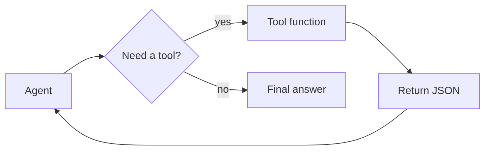
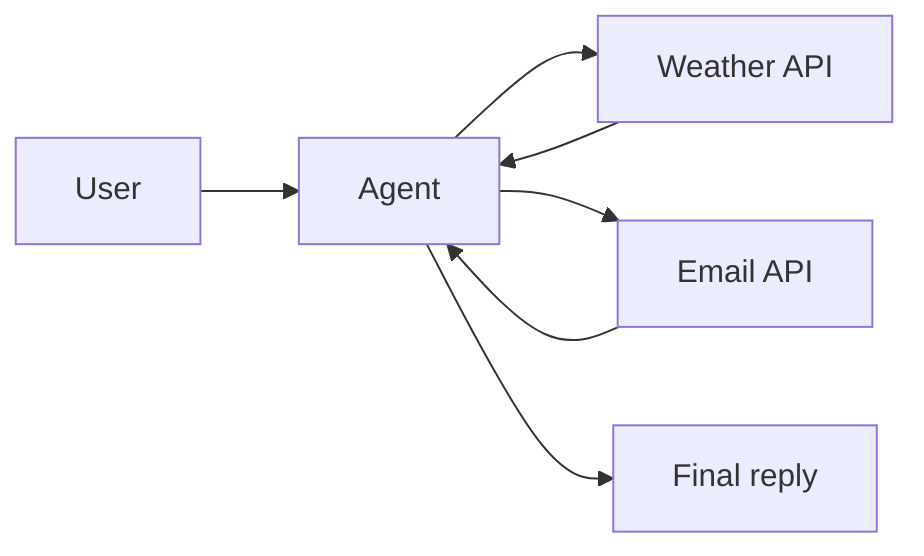
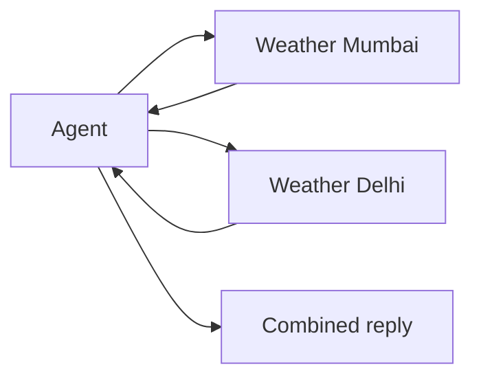

# 📅 Day 6 — Agent Tools + Multi-step Tasks

Hello students 👋

Welcome to **Day 6**! Yesterday you built your first agent. Today we turn that agent into a **real employee** — one that reads a database, calls external APIs, checks the weather, sends emails, and chains multiple steps together to solve a problem. This is where agents get **truly powerful**. ⚙️

---

## 1. Introduction

### 🎯 What we learn today?
- Deep dive into **tool calling / function calling**
- Building tools for:
  - **Database** (SQL / Mongo lookup)
  - **Web search** / HTTP APIs
  - **Weather** service
  - **Email / notifications**
- **Conditional logic** inside agents
- **Multi-step** flows (tool A → tool B → tool C)
- **Parallel** tool calls
- Error handling inside tools
- 💻 Mini project: **HR Assistant Agent**

### 🌍 Why it matters
The real world is messy: info lives in different APIs, databases, and services. Your agent must **orchestrate** across all of them. This is exactly what **Zapier AI**, **Retell**, **Lindy**, and corporate AI assistants do.

---

## 2. Concept Explanation

### 🪛 Tool calling (aka function calling)
A tool is just a **typed function** the agent is allowed to call. The SDK:
1. Sends the tool **schema** (name + Zod parameters + description) to the model.
2. The model decides when to call it and with what arguments.
3. The SDK **runs the real function** locally and feeds the result back.
4. The agent continues reasoning.

### 🧠 Tool design principles
- **Name** → verb-based: `getOrder`, `sendEmail`, `createTicket`.
- **Description** → explain *when* to use it, not just *what*.
- **Parameters** → strict Zod types with comments.
- **Return** → small, structured, predictable JSON.
- **Fail gracefully** → return `{ error: "..." }` instead of throwing.

### 🔀 Conditional logic
The **LLM itself** does conditional logic through reasoning. Your job is to give it enough instructions + well-named tools. You rarely need to hard-code if/else.

### 🔗 Multi-step chaining
Example: *"Send the weather forecast for Mumbai to ak@x.com."*
- Step 1: `getWeather("Mumbai")` → `{ temp: 32, desc: "Sunny" }`
- Step 2: `sendEmail(to, subject, body)` → `{ ok: true }`
- Step 3: Return final confirmation.

### ⚡ Parallel tool calls
When tools are **independent**, the model may call them in parallel. E.g., *"Get weather for Mumbai and Delhi"* → 2 parallel calls. Much faster.

---

## 3. 💡 Visual Learning

### Tool lifecycle



### Multi-step chain



### Parallel calls



---

## 4. 🛠️ Setup

```bash id="day6install"
npm install @openai/agents zod dotenv better-sqlite3
npm install -D typescript ts-node @types/node @types/better-sqlite3
```

`.env`:

```env id="day6env"
OPENAI_API_KEY=sk-your-key
WEATHER_API_KEY=demo
```

Folder structure:

```text id="day6folder"
ai-day6/
├── src/
│   ├── tools/
│   │   ├── dbTool.ts
│   │   ├── weatherTool.ts
│   │   ├── searchTool.ts
│   │   └── emailTool.ts
│   └── hrAgent.ts
└── .env
```

---

## 5. Code Examples

### ✅ Database tool (SQLite)

```ts id="day6dbtool"
// src/tools/dbTool.ts
import { tool } from "@openai/agents";
import { z } from "zod";
import Database from "better-sqlite3";

const db = new Database(":memory:");
db.exec(`
  create table employees (id text, name text, role text, leaves int);
  insert into employees values
    ('E001','Ayesha','Developer',12),
    ('E002','Ravi','Designer',5),
    ('E003','Kiran','Manager',20);
`);

export const getEmployee = tool({
  name: "getEmployee",
  description: "Look up an employee by employee ID.",
  parameters: z.object({ id: z.string() }),
  execute: async ({ id }) => {
    const row = db.prepare("select * from employees where id = ?").get(id);
    return row ?? { error: "Employee not found" };
  }
});

export const listEmployees = tool({
  name: "listEmployees",
  description: "List all employees (name + role).",
  parameters: z.object({}),
  execute: async () =>
    db.prepare("select id, name, role from employees").all()
});
```

### ✅ Weather tool

```ts id="day6weather"
// src/tools/weatherTool.ts
import { tool } from "@openai/agents";
import { z } from "zod";

export const getWeather = tool({
  name: "getWeather",
  description:
    "Get current weather for a city. Use this for any weather-related question.",
  parameters: z.object({ city: z.string() }),
  execute: async ({ city }) => {
    const fake: Record<string, { temp: number; desc: string }> = {
      mumbai:  { temp: 32, desc: "Humid, sunny" },
      delhi:   { temp: 28, desc: "Clear" },
      london:  { temp: 14, desc: "Rainy" }
    };
    const key = city.toLowerCase();
    return fake[key] ?? { error: `No data for ${city}` };
  }
});
```

### ✅ HTTP search tool

```ts id="day6search"
// src/tools/searchTool.ts
import { tool } from "@openai/agents";
import { z } from "zod";

export const webSearch = tool({
  name: "webSearch",
  description: "Search the public web for current information.",
  parameters: z.object({ query: z.string() }),
  execute: async ({ query }) => {
    const res = await fetch(
      `https://api.duckduckgo.com/?q=${encodeURIComponent(query)}&format=json`
    );
    const data = await res.json();
    return {
      query,
      abstract: data.AbstractText || "",
      url: data.AbstractURL || ""
    };
  }
});
```

### ✅ Email / notification tool (simulated)

```ts id="day6email"
// src/tools/emailTool.ts
import { tool } from "@openai/agents";
import { z } from "zod";

export const sendEmail = tool({
  name: "sendEmail",
  description:
    "Send an email. Only use when the user explicitly asks to email someone.",
  parameters: z.object({
    to: z.string().email(),
    subject: z.string(),
    body: z.string()
  }),
  execute: async ({ to, subject, body }) => {
    console.log("📧 [MOCK SEND]", { to, subject, bodyPreview: body.slice(0, 60) });
    return { ok: true, id: `msg_${Date.now()}` };
  }
});
```

### ✅ HR Agent combining all tools

```ts id="day6hragent"
// src/hrAgent.ts
import "dotenv/config";
import { Agent, run } from "@openai/agents";
import { z } from "zod";
import { getEmployee, listEmployees } from "./tools/dbTool";
import { getWeather } from "./tools/weatherTool";
import { webSearch } from "./tools/searchTool";
import { sendEmail } from "./tools/emailTool";

const HRResponse = z.object({
  intent: z.enum(["employee_lookup", "weather", "search", "email", "general"]),
  reply: z.string(),
  toolsUsed: z.array(z.string())
});

const hrAgent = new Agent({
  name: "HR Assistant",
  instructions: `
You are an HR assistant. Rules:
- For employee questions, use getEmployee or listEmployees.
- For weather, use getWeather.
- For current events, use webSearch.
- To send an email, use sendEmail (only when explicitly asked).
- Be concise and polite. Never expose salary info.
- Return structured JSON: intent, reply, toolsUsed.
`,
  model: "gpt-4o-mini",
  tools: [getEmployee, listEmployees, getWeather, webSearch, sendEmail],
  outputType: HRResponse
});

async function main() {
  const tests = [
    "How many leaves does employee E001 have?",
    "What's the weather in Mumbai and Delhi?",
    "Email ravi@x.com the current weather in Delhi."
  ];
  for (const q of tests) {
    const out = await run(hrAgent, q);
    console.log("Q:", q);
    console.log("A:", JSON.stringify(out.finalOutput, null, 2));
    console.log("---");
  }
}

main();
```

### ✅ Error handling inside tools

```ts id="day6errhandling"
execute: async ({ city }) => {
  try {
    const res = await fetch(`https://api.example.com/w?c=${city}`);
    if (!res.ok) return { error: `API ${res.status}` };
    return await res.json();
  } catch (e) {
    return { error: (e as Error).message };
  }
}
```

Agents handle `{ error: "..." }` gracefully — they often **retry with different arguments** or report the problem to the user.

---

## 6. 🧾 JSON Response Design

```json id="day6jsonout"
{
  "success": true,
  "data": {
    "intent": "weather",
    "reply": "Mumbai is 32°C humid sunny; Delhi is 28°C clear.",
    "toolsUsed": ["getWeather", "getWeather"]
  },
  "error": null,
  "meta": { "latencyMs": 2730, "steps": 5, "tokensUsed": 612 }
}
```

Include `toolsUsed` for **observability** — you'll want to audit what the agent did.

---

## 7. 💻 Hands-on Practice

1. Add a `createTicket(title, priority)` tool and make the agent call it when the issue is complex.
2. Add a `getLeaveBalance(employeeId)` tool that returns remaining leaves.
3. Ask the agent: *"Compare weather in Mumbai, Delhi, and London"* — check if it calls the tool in parallel.
4. Break a tool intentionally (throw an error) and see how the agent recovers.
5. Add **guardrails**: if the user asks about salary, reply "I cannot share salary info."
6. Add logging that prints every tool name + arguments + result.
7. Add a `maxTurns` limit (e.g., 8) to avoid runaway loops — see SDK docs for config.

---

## 8. ⚠️ Common Mistakes

- ❌ **Overlapping tool names** (`getUser` vs `getUserInfo`) → model gets confused.
- ❌ **Huge tool outputs** → blow up context window and cost.
- ❌ **Vague descriptions** → model picks wrong tool or invents args.
- ❌ **Throwing from tools** instead of returning structured errors → run crashes.
- ❌ **Leaking secrets in tool outputs** (API keys, PII) → security risk.
- ❌ **No iteration limit** → infinite loops if a tool keeps failing.
- ❌ **Blindly trusting tool inputs** → validate in `execute` even though Zod parses.
- ❌ **Too many tools** → keep under ~10 per agent; split into multiple agents with handoffs.

---

## 9. 📝 Mini Assignment — HR Assistant Agent

Build a complete HR agent with:

**Tools:**
- `getEmployee(id)`
- `listEmployees()`
- `getLeaveBalance(id)`
- `applyLeave(id, fromDate, toDate, reason)` (simulated)
- `sendEmail(to, subject, body)`

**Rules:**
- Greet politely.
- If user applies for leave, confirm employee exists, check balance, then call `applyLeave`.
- If leave balance is insufficient, do NOT apply — suggest alternatives.
- After success, send confirmation email.
- Return JSON: `{ intent, reply, toolsUsed, success, data? }`.

**Test cases:**
1. *"Apply 2 days leave for E001 from 22 April to 23 April. Reason: personal."*
2. *"Apply 15 days leave for E002 from 1 May."* (should refuse — only 5 left)
3. *"How many employees are Designers?"* (uses `listEmployees`)

---

## 10. 🔁 Recap

- Tools = typed TS functions with **name, description, Zod params, execute**.
- Good tools have **clear names, small outputs, graceful errors**.
- Agents can chain tools in **sequence** or **parallel** automatically.
- Use **instructions** to set conditional rules — don't hard-code if/else around the agent.
- Include **`toolsUsed`** in outputs for observability.
- Always set **iteration limits** and **structured error returns**.

Tomorrow on **Day 7** we **combine Agents + RAG** — the holy grail of AI assistants. See you! 🧠📚⚙️
